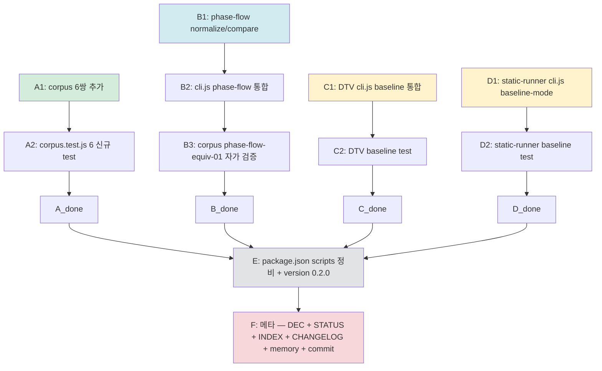

# plan-be-sprint-5-plus-carryover

> BE Sprint 5+ carry-over (환경 무관 부분만) 실행 계획
> 4원칙 1번 산출
> 일자: 2026-05-01
> Trigger: v1.4 FE 트랙 휴면 결단 → BE 본체 도구 quality 격상 마무리

---

## 0. 정직 표기

- 본 plan = 4원칙 1번. research 0 / 코드 0.
- ★ 옵션 X 채택 — Sprint 4/5 의 누적 자료 + ADR-010 + DEC-A (drift-validator quality boost) 자료 충분. 새 research 불요.
- §8.1 정합 = 본체 도구 격상 / PoC 변경 0.
- ★ 환경 의존 항목 (Semgrep/PMD/OSV 진짜 실행) = 본 plan **scope 제외** (환경 준비 시점까지 carry).
- ★ 외부 도구 통합 (vacuum/openapi-changes) = 별도 작업 (**scope 제외**).

---

## 1. 목적 + 종결 조건

### 1.1 목적

Sprint 5 carry-over 의 **환경 무관** 항목 종결:
1. **drift-validator corpus 14쌍 → 20쌍** (6쌍 추가) — `DEC-2026-04-30-A §4` carry
2. **drift-validator phase-flow 비교기 신설** — `phase-flow.json` `$comment` "v1.3+ 입력 호환" 명시 + `methodology-spec/workflow/phase-flow.{mermaid,json}` 짝 존재
3. **decision-table-validator + static-runner baseline mode 통합** — `ADR-010 §2.5` 명시 (drift-validator 는 이미 통합 ✅)
4. **package.json 정비** — drift-validator test script 에 `baseline.test.js` 추가 / 도구별 npm test 일관

### 1.2 종결 조건

```
□ corpus 6쌍 추가 + corpus.test.js 6 신규 test (총 14 → 20 self-test)
□ drift-validator phase-flow 비교기 신설 — normalize-phase-flow.js + compare-phase-flow.js + cli.js 통합 + 자가 검증 1쌍 (corpus phase-flow-equiv-01)
□ decision-table-validator cli.js — --baseline / --ratchet / --write-baseline 옵션 추가 (drift-validator/src/baseline.js import 재사용)
□ static-runner cli.js — --baseline-mode ratchet 옵션 추가 + Semgrep/PMD evidence finding 도 baseline.js 호환
□ drift-validator package.json test 스크립트 정비 — corpus + baseline 양쪽
□ drift-validator v0.1.0 → v0.2.0 (DEC-A 격상 후보)
□ 메타 (DEC-Sprint-5-carryover-종결 + STATUS + INDEX + CHANGELOG + memory)
□ commit Phase 단위 (A / B / C / D / F)
```

### 1.3 비-목표 (★ 환경 의존 / 별도 작업)

- **진짜 static tool 실행** (Semgrep / PMD / OSV-Scanner) — Java/Python 환경 부재 / 사용자 환경 준비 후 carry
- **vacuum** (OpenAPI Go linter) — Go runtime 또는 binary 통합 / 별도 작업
- **openapi-changes** (Pb33f) — OpenAPI diff 별도 영역 / 별도 작업
- **FE 트랙 Stage 4/5/7** — 사용자 휴면 결단 / 환경 준비 후

---

## 2. 의존 그래프



---

## 3. 작업 항목

### 3.1 Phase A — corpus 6쌍 추가 (drift-validator self-test 14 → 20)

**6쌍 후보** (corpus 다양성 ↑ / 실제 PoC 패턴 반영):

| # | 짝 이름 | 종류 | 검증 대상 |
|---|---|---|---|
| 1 | `state-machine-equiv-04-parallel` | equiv | parallel state (`-->[*]` + 다중 region) — XState fork |
| 2 | `state-machine-drift-04-extra-transition` | drift | mermaid 전용 transition (json 누락) — outer 전이 누락 패턴 (PoC #03 Phase 4.5+2 reverse) |
| 3 | `sequence-equiv-04-loop` | equiv | `loop` block + nested message — Article fetch retry 패턴 |
| 4 | `sequence-drift-04-message-order` | drift | message 순서 swap 검출 |
| 5 | `state-map-fe-equiv-02` | equiv | FE form_state 5진실 #4 정합 (deliverable 14 cross-link 정합) |
| 6 | `state-map-fe-drift-01` | drift | FE state-map drift 검출 (XState typestate 누락) |

→ 각 쌍 = `{name}.json` + `{name}.mermaid` 파일 2개. 총 12 파일 신규.

**corpus.test.js 갱신**:
- 기존 14 test 유지
- 신규 6 test 추가 (각 쌍 마다 1 test = `runStateMachine(name)` 또는 `runSequence(name)`)
- 헤더 주석 갱신 — "20쌍 / 20 self-test (★ Sprint 5 carry-over 종결)"

**예상 분량**: 12 파일 (corpus) + corpus.test.js 갱신 (~30 line)

### 3.2 Phase B — drift-validator phase-flow 비교기 신설 (★ 핵심)

**B1. normalize-phase-flow.js 신설**:
- `normalizePhaseFlowJson(json)` — `{phases: [...]}` → `{nodes: Map<id, {name, deps: Set, outputs: Set}>}`
- `normalizePhaseFlow(mermaid)` — `flowchart TB` + `subgraph P{N}` + `--> ` 기반 → 동일 형식
- `detectArtifactType` 확장 — `phases` 키 → `phase-flow`
- `detectDiagramType` 확장 — mermaid `flowchart` + `subgraph P\d+` 패턴 → `phase-flow`

**B2. compare-phase-flow.js 신설**:
- 비교 dimension 3종:
  - `phase.missing-in-mermaid` — JSON 측 phase id 가 mermaid subgraph 부재 (★ breaking)
  - `phase.missing-in-json` — mermaid 전용 (★ non-breaking — mermaid 가 사람 시각 보강)
  - `dependency.mismatch` — `depends_on` array vs `-->` edge 차이 (★ breaking)
- `summarize(diffs)` 재사용

**B3. cli.js 확장**:
- `if (jsonType === 'phase-flow')` 분기 추가
- normalize/compare 호출

**B4. corpus 자가 검증 1쌍**:
- `phase-flow-equiv-01.json` + `.mermaid` (★ 본체 phase-flow 축약본 — Phase 0/1/2 만 / 3 phase + 2 deps)

**예상 분량**: normalize-phase-flow.js (~150 line) + compare-phase-flow.js (~120 line) + cli.js +20 line + corpus 2 파일 + test 1건

### 3.3 Phase C — decision-table-validator baseline 통합

**현재 상태**: dmn-check.js engine 만 / cli.js 의 baseline 옵션 부재. drift-validator/src/baseline.js 가 "공용" 으로 표기됨 → import 재사용.

**C1. cli.js 갱신**:
- `--baseline <path>` / `--ratchet` / `--write-baseline <path>` 옵션 추가
- `import { readBaseline, classifyAgainstBaseline, writeBaseline, ratchetCheck } from '../../drift-validator/src/baseline.js'` (★ monorepo 상대 경로) 또는 baseline.js 를 `tools/_shared/` 로 이동
- finding 객체 fingerprint 호환성 확인 (kind / table_index / column_index 등)

**C2. baseline.test.js 신설** (또는 dmn-check.test.js 보강):
- DTV finding 의 fingerprint 결정성 검증
- baseline classify + ratchet 회귀 검증

**★ 결단 항목** (C1 시점):
- 옵션 1: 상대 경로 import (간단, monorepo 결합도 ↑)
- 옵션 2: `tools/_shared/baseline.js` 신설 (★ 권고 — 재사용 패턴 깔끔, ADR-010 §2.5 정합)

→ Phase C 진행 시 옵션 2 우선. 기존 drift-validator 측은 re-export 처리.

**예상 분량**: cli.js +40 line + baseline.test.js (~80 line) + (옵션 2 채택 시) `tools/_shared/baseline.js` 이동 + drift-validator/src/baseline.js → re-export shim

### 3.4 Phase D — static-runner baseline-mode 통합

**현재 상태**: cli.js 의 baseline 옵션 부재. ADR-010 §2.5 명시. Semgrep/PMD finding 도 baseline + ratchet 적용 가능 시 사내 도입 시 즉시 활용.

**D1. cli.js 갱신**:
- `--baseline-mode ratchet` 옵션 추가
- evidence finding 을 baseline.js fingerprint 호환 형식으로 변환 (★ Semgrep `check_id` / PMD `rule_id` / file path / line → baseline finding)
- Plugin output → finding 변환 어댑터

**D2. baseline-mode test**:
- 가짜 evidence (fixture) 로 fingerprint 결정성 검증
- ratchet check 회귀 검증

**★ 환경 의존 부분** (★ 본 Phase scope 외 carry):
- 진짜 Semgrep/PMD 실행 후 baseline 등재 시연 → Sprint 5+ 환경 의존 carry 유지

**예상 분량**: cli.js +50 line + baseline-mode.test.js (~80 line) + Semgrep/PMD plugin output → finding 어댑터 (~50 line)

### 3.5 Phase E — package.json + version 정비

| 도구 | 현재 | 갱신 |
|---|---|---|
| drift-validator | v0.1.0 / scripts.test = corpus.test.js 만 | ★ v0.2.0 / scripts.test = `node --test test/` (corpus + baseline + phase-flow) |
| decision-table-validator | (★ 확인 후 갱신) | scripts.test 에 baseline.test.js 추가 |
| static-runner | (★ 확인 후 갱신) | scripts.test 에 baseline-mode.test.js 추가 |

### 3.6 Phase F — 메타

| F# | 항목 |
|---|---|
| F1 | `decisions/DEC-2026-05-01-Sprint-5-carryover-종결.md` |
| F2 | `decisions/STATUS.md` (Sprint 5 carry-over 종결 행 + drift-validator v0.2.0 + corpus 20쌍 / 20 test) |
| F3 | `decisions/INDEX.md` |
| F4 | `CHANGELOG.md` (★ v1.4.0-dev sub-track / BE 도구 격상 항목) |
| F5 | memory `project_v140_fe_track.md` 또는 신규 `project_be_tools_v02.md` 갱신 |
| F6 | commit |

---

## 4. Sprint 일정

**1 세션 진행 추정** — 4 Phase + E + F = ~3-4시간.

**병렬 가능**: A (corpus) / B (phase-flow) / C (DTV) / D (static-runner) 모두 독립 — Phase 단위 commit 가능.

**Phase 우선순위** (실패 시 carry-over):
- **★ 우선** A + E (corpus 추가 + version 정비) — 작업 작음 / 빠른 종결
- **★ 우선** B (phase-flow 비교기) — 가치 ★★★ / 본체 quality 직결
- C / D — baseline 통합 / 가치 ★★ (사내 도입 시점 활용)

---

## 5. 신뢰도 + 정책

- **no-simulation 정책 정합** — 모든 결정적 알고리즘 / AI 추론 0%
- **단위 test 100% 회귀 의무** — Phase 단위 commit 시 npm test 통과 의무
- **신뢰도 metric**: 본 carry-over = 본체 도구 quality 격상 / PoC 변경 0 / 신뢰도 metric 부적용

---

## 6. 위험 + 완화

| # | 위험 | 영향 | 완화 |
|---|---|---|---|
| R1 | phase-flow 비교기 신설 시 normalize 복잡도 (subgraph 중첩) | 중 | 본체 phase-flow.mermaid 의 단순 패턴 (`subgraph P{N}` 평면) 한정 — 중첩 subgraph 미지원 명시 |
| R2 | baseline.js 공용 이동 (Phase C 옵션 2) 시 drift-validator 회귀 | 중 | re-export shim 으로 import path 유지 / unit test 회귀 검증 |
| R3 | corpus 6쌍 추가 시 mermaid parser edge case (parallel / loop) | 중 | mermaid AST 직접 비교 ❌ / 본 도구의 normalize 형식만 사용. 신규 패턴 시 기존 normalize 한계 일치 (기존 한계 == 신규 한계) |
| R4 | static-runner baseline 통합 시 finding 형식 가변성 (Semgrep JSON vs PMD XML) | 중 | runner.js plugin output 어댑터로 표준 finding 객체 변환 후 baseline.js 적용 |
| R5 | Phase B (phase-flow) 가 1 세션 초과 위험 | 중 | A + E 우선 / B/C/D Phase 단위 분할 / 마지막 Phase 미완료 시 그 Phase 만 carry |

---

## 7. 사용자 7 요구사항 진척도

| 요구 | 도달 | Sprint 5 carry-over 종결 |
|---|---|---|
| 모두 (1~7) | ★ 100% | ★ 100% 유지 + ★ 도구 quality 격상 (drift-validator v0.2.0 / corpus 20쌍 / phase-flow 비교기 / baseline-ratchet 통합) |

→ Sprint 5 carry-over 는 사용자 7 요구사항 직접 영향 0 / 본체 도구 quality 격상 영역.

---

## 8. 종결 진술

> 본 plan = BE Sprint 5+ carry-over (환경 무관 부분) 4원칙 1번 산출.
> Phase A → B → C → D → E → F = 1 세션 추정.
> Sprint 5 carry-over 환경 무관 부분 종결 = drift-validator v0.2.0 + corpus 20쌍 + phase-flow 비교기 + baseline-ratchet 3 도구 통합.
> 환경 의존 부분 (Semgrep/PMD 진짜 실행) + 외부 도구 통합 (vacuum/openapi-changes) = 별도 carry-over 유지.
> 다음 trigger = 사용자 일괄 승인 → Phase A 즉시 진입.

**End of plan-be-sprint-5-plus-carryover.**
