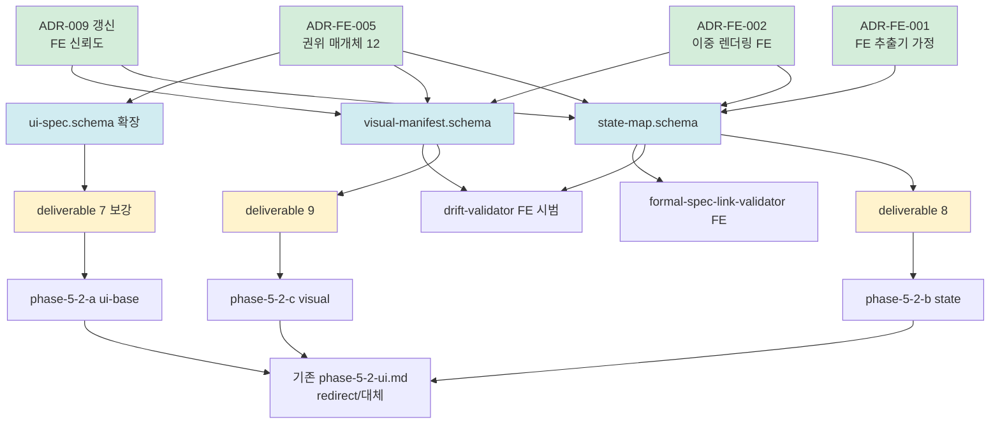

# plan-v14-stage-3-1

> v1.4.0-dev Stage 3-1 (본체 격상 1차) 실행 계획
> 4원칙 1번 산출 — 사용자 승인 게이트 입력 자료
> 일자: 2026-05-01
> Trigger: DEC-2026-05-01-v1.4-Stage-2-Gate-결단 §5

---

## 0. 정직 표기 (선행)

- 본 plan = 4원칙 1번 (깊은 숙지 → plan.md). research/코드 0.
- 의존 그래프는 본 세션에서 최초 수립 — 사용자 승인 후 실 작업 진입.
- §8.1 정합 = 본 작업은 본체 격상. PoC #04 mini-PoC 진입은 Stage 4 (별도 게이트). 본 plan 범위 밖.
- Auto Mode 호환 = 큰 뭉텅이 (16+ 항목) 일괄 승인 패턴.

---

## 1. 목적 + 종결 조건

### 1.1 목적

v1.4 FE 트랙 본체 격상 1차 — Stage 2 Gate 결단 (Senior 권고 12 채택) 의 **사상·schema·deliverable·workflow** 본체 코드화.

### 1.2 종결 조건 (★ 모두 충족 시 Stage 3-1 종결)

```
□ ADR 4건 (FE-001/002/005 신설 + ADR-009 갱신) merged
□ schema 3건 (state-map / visual-manifest 신설 + ui-spec 확장) JSON Schema valid
□ deliverable 3건 (8 / 9 신설 + 7-ui-ux 보강) doc 완료
□ workflow 분할 3건 (phase-5-2-a/b/c) — 기존 phase-5-2-ui.md redirect/대체
□ 도구 시범 2건 (drift-validator FE / formal-spec-link-validator FE 검토)
□ 메타 5건 (DEC / STATUS / INDEX / CHANGELOG / memory) 갱신
□ commit 1~3건 (단계별 또는 일괄 — 의존 그래프 순서)
□ 사용자 7 요구사항 4건 도달 (요구 1/2/3/4 100%)
```

### 1.3 비-목표 (★ Stage 3-1 범위 밖)

- 비기능 (a11y/i18n/정적보안 deliverable) → Stage 3-2
- legacy 산출물 3종 (legacy-spectrum / bootstrap-data-flow / strangler) → Stage 3-2
- ADR-FE-003 (legacy spectrum 정책) → Stage 3-2
- ADR-FE-004 (BE/FE 분리) → Stage 6
- ADR-001 §명시적 제외 갱신 → Stage 3-2 (Gate 2 결단과 묶음)
- migration-cautions-fe.md → Stage 3-2
- mini-PoC 진입 (Stage 4) → 별도 사용자 승인 게이트
- rules.schema.json br_type FE enum 확장 → Stage 3-2

---

## 2. 의존 그래프 (★ 재작업 최소화 2순위 적용)



**핵심 의존 규칙**:

1. **ADR 먼저** (Phase A) — 사상 결정 없이 schema 설계 시 재작업 위험 최대.
2. **schema → deliverable doc 순** (Phase B → C) — schema 가 진실. deliverable doc 은 schema 의 사람용 렌더링 (ADR-008 이중 렌더링 사상 정합).
3. **deliverable → workflow 순** (Phase C → D) — workflow 는 deliverable 산출 절차.
4. **도구 시범 (Phase F)** — schema 가 안정화된 후 적용 (B 의존). C/D 와 병행 가능.

---

## 3. 작업 항목 상세 (Phase A → F)

### 3.1 Phase A — ADR 4건 (사상 확정)

#### A1. `docs/adr/ADR-FE-001-FE-추출기-가정.md` (신설)

**핵심**:
- spectrum cover Tier 1~4 (Modern SPA / jQuery legacy / Vanilla / JSP). Native v1.5 이연.
- "FE 코드 → 형식 명세 + 위험 기록" 한 방향 추출기 (CLAUDE.md ★★★ 가치 명세 정합).
- 추출 가능 영역 / 미추출 영역 / fallback 전략 (Tier 별).
- BE Phase 0~6 ↔ FE Phase 0~6 매핑.

**참조**: ADR-001 (사상 스택 §FSD+Atomic) / `methodology-spec/deliverables/7-ui-ux.md` / Stage 1 research 9Q-1/2/3.

#### A2. `docs/adr/ADR-FE-002-이중-렌더링-FE-적용.md` (신설)

**핵심**:
- ADR-008 (이중 렌더링 사상) 의 FE 영역 적용.
- AI 눈 = JSON (ui-spec / state-map / visual-manifest)
- 사람 눈 = Mermaid (component-tree / state-map / user-flow) + Storybook static + manifest 텍스트
- ★ visual 예외 케이스 — 시각 결과는 binary (이미지) 기 때문에 "이중 렌더링" 패턴 불완전 적용. Playwright snapshot hash 비교가 진실.
- drift 자동 검증 적용 가능성 명시 (state-map 가능 / visual 불가능 → snapshot diff).

**참조**: ADR-008 / ADR-009 / Stage 1 research 9Q-2.

#### A3. `docs/adr/ADR-FE-005-권위-매개체-12-채택.md` (신설)

**핵심**: 12 권위 매개체 정식 채택 결단.

| # | 매개체 | 영역 | 근거 |
|---|---|---|---|
| # | 매개체 | 영역 | 근거 | spec URL (★ 1차 사료 cross-checked) |
|---|---|---|---|---|
| 1 | Custom Elements Manifest (CEM) **schema 2.1.0** (2024-05-06) | 컴포넌트 명세 | Web Components 표준 | https://github.com/webcomponents/custom-elements-manifest |
| 2 | W3C SCXML 1.0 (REC 2015-09-01) + XState 호환 | 상태 머신 | W3C REC | https://www.w3.org/TR/scxml/ |
| 3 | DTCG **Design Tokens Format Module 2025.10** (Final CG Report, 2025-10-28) | 디자인 토큰 | ★ Community Group Report (W3C Standard 아님 — ADR 인용 시 명시 의무) | https://www.designtokens.org/TR/2025.10/format/ |
| 4 | MSW + OpenAPI 3.1 (`msw-auto-mock` 0.32.1) | API 모킹 | OAS 정합 / ★ 3.1 specific 호환은 README 추가 검증 carry-over | https://www.npmjs.com/package/msw-auto-mock |
| 5 | axe-core JSON (`id`/`impact`/`nodes[]`/`target`) | a11y 검증 | de facto | https://github.com/dequelabs/axe-core/blob/develop/doc/API.md |
| 6 | TypeScript .d.ts | 타입 명세 | 산업 표준 (변경 ❌ — cross-check skip) | (산업 표준) |
| 7 | Storybook CSF v3 (`play` 함수 = interaction test) | interaction test | 산업 표준 | https://storybook.js.org/docs/api/csf/index |
| 8 | Playwright (`toMatchSnapshot` / `toHaveScreenshot` / `toMatchAriaSnapshot`) | E2E + visual snapshot | 산업 표준 / ★ JSON manifest 자체 출력 기능 ❌ — 스냅샷 파일 자체가 진실 | https://playwright.dev/docs/test-snapshots |
| 9 | **WCAG 2.1 AA** baseline + ★ **WCAG 2.2 AA ratchet path** (2.2 = REC 2023-10-05 / ISO 40500:2025 / W3C 사용 권고 중) | a11y 기준 | W3C | https://www.w3.org/TR/WCAG22/ |
| 10 | WAI-ARIA 1.2 (REC 2023-06-06) | 시맨틱 | W3C REC | https://www.w3.org/TR/wai-aria-1.2/ |
| 11 | ICU MessageFormat (MF1 stable / **MF2 spec stable / runtime Technical Preview**) | i18n | Unicode CLDR LDML 47 / ★ runtime preview 단계 — MF1 폴백 병기 의무 | https://unicode-org.github.io/icu/userguide/format_parse/messages/mf2.html |
| 12 | Pact spec v4 (`pactSpecification.version="4.0"` / `interactions[].type` 필수) | contract test | 산업 표준 | https://github.com/pact-foundation/pact-specification/tree/version-4 |

**참조**: Stage 1 research-senior §3 / DEC-2026-05-01-v1.4-Stage-1-research-종결 §1.3-5 / ★ 본 plan 작성 시 sub-agent cross-check 1회 (옵션 Y) — 권고 3건 반영 (#3 DTCG 정확한 인용 / #9 WCAG 2.2 ratchet path / #11 ICU MF2 단계 명시).

#### A3.1 ★ Cross-check 권고 3건 반영 사항 (ADR-FE-005 본문 의무 명시 항목)

1. **DTCG 인용 시** — 정확한 spec 명칭 = "Design Tokens Format Module 2025.10 (Final Community Group Report)". W3C Standard ❌ / Community Group Report. spec URL 고정 = `https://www.designtokens.org/TR/2025.10/format/`. (★ ADR 본문 §status 명시 의무)
2. **WCAG 2.1 AA + 2.2 AA ratchet path** — baseline = 2.1 AA / ratchet 격상 = 2.2 AA. axe-core config `wcag_level` enum 에 `"2.1-AA"`, `"2.2-AA"` 양쪽 채택. (★ ADR-010 baseline+ratchet 패턴 정합)
3. **ICU MF2 채택 단계 명시** — spec stable (CLDR LDML 47) / runtime ICU4J/ICU4C **Technical Preview**. production 채택 위험도 carry-over 명시. 단기 폴백 = ICU MF1 ko-KR 병기 의무.

#### A4. `docs/adr/ADR-009-다이어그램-신뢰-모델.md` (갱신)

**갱신 범위**:
- §2.1 신뢰도 정량 모델 — FE 영역 별 단계 1~5 적용 행 추가 (component-tree / state-map / user-flow / visual-manifest).
- §2.2 도구 종류 enum — FE 도구 enum 추가 (`axe_core_real` / `playwright_real` / `storybook_csf_real` / `msw_handler_check`).
- §2.3 사용 가이드 — FE 다이어그램 용도별 가이드.
- ★ visual-manifest 의 신뢰도 모델 = snapshot hash + viewport matrix 진실 모델 (mermaid 와 다른 trust path).

**참조**: ADR-009 (현재 상태) / Stage 1 research-senior §6.

---

### 3.2 Phase B — schema 3건 (형식 진실)

#### B1. `schemas/state-map.schema.json` (신설)

**핵심 필드**:
```yaml
$schema: draft/2020-12
title: 상태 맵 (분산 상태 5 진실 — server/client/URL/form/DOM)
required: [meta, state_sources, machines]

state_sources:
  enum: [server_cache, client_state, url_state, form_state, dom_state]
  description: 5 진실 분류

machines:
  array of:
    id: ^FSM-FE-[A-Z0-9_-]+-\d+$
    scxml_compliant: boolean      # W3C SCXML 1.0 호환
    xstate_compatible: boolean
    states: [...]                 # SCXML state element
    transitions: [...]
    initial: string
    final: array
    parallel_regions: array       # SCXML <parallel>
    history: array                # shallow / deep
    confidence: number
    source_files: array
    related_components: array
    related_pages: array
    related_apis: array          # operationId

cross_links:                     # ★ Phase 4.5 패턴
  - to_artifact: ui-spec | api | rules
    link_type: implements | derives_from | validates
```

**참조**: 기존 `schemas/formal-spec.schema.json` state-machine 영역 / SCXML 1.0 spec.

#### B2. `schemas/visual-manifest.schema.json` (신설)

**핵심 필드**:
```yaml
$schema: draft/2020-12
title: 시각 manifest (binary 자산 + meta)
required: [meta, snapshots]

snapshots:
  array of:
    id: ^VIS-[A-Z0-9_-]+-\d+$
    page_id: string                # PAGE-XXX
    component_id: string           # CMP-XXX (선택)
    viewport: {width, height, dpr, label}
    snapshot_path: string          # 상대 경로 (Playwright PNG)
    snapshot_hash: string          # SHA-256
    baseline_hash: string          # 비교 baseline
    diff_status: enum [match, drift, baseline_new]
    captured_at: ISO8601
    captured_by:
      enum: [playwright_real, percy_real, chromatic_real, simulation]
      description: ★ no-simulation 정책 — simulation 시 -5%p 패널티
    a11y_violations:               # axe-core JSON 결과 inline
      array

manifest:
  total_snapshots: integer
  baseline_count: integer
  drift_count: integer
  matrix:                          # viewport × page
    array
```

**참조**: Stage 1 research-senior §3 (axe-core / Playwright) / ADR-009 §2.2 도구 enum.

#### B3. `schemas/ui-spec.schema.json` (확장)

**확장 항목** (★ 기존 호환 유지 — 모두 optional 추가):

| 영역 | 신규 필드 | 근거 |
|---|---|---|
| `pages[].event_handlers` | array of `{event, handler_signature, target_state, target_api}` | 이벤트 → 상태/API 매핑 |
| `pages[].api_calls` | array of `{operationId, trigger, http_method, request_schema_ref}` | OpenAPI cross-link 명세화 |
| `components[].suspense_boundary` | boolean + `{fallback_component, error_boundary}` | React Suspense 산업 패턴 |
| `components[].framework` enum | + `solid`, `qwik`, `astro`, `vanilla_js`, `jquery_legacy`, `jsp_template` | spectrum Tier 1~4 |
| `components[].level` enum | + `legacy_template`, `legacy_widget` | Tier 3-4 |
| `scenarios[].human_review_status` enum | + `confirmed_with_caveat`, `rejected_planner_note` | 기획자 검토 상세화 |
| `framework` (top-level) enum | + `solid`, `qwik`, `astro`, `vanilla_js`, `jquery_legacy`, `jsp_template` | spectrum |

**참조**: 현 `schemas/ui-spec.schema.json` / Stage 1 research-industry §4.

---

### 3.3 Phase C — deliverable doc 3건 (사람용 렌더링)

#### C1. `methodology-spec/deliverables/8-state-map.md` (신설)

**구조** (기존 deliverables 패턴 정합 — 1~13 섹션):
1. 목적 (분산 상태 5 진실 명세)
2. 형식 (state-map.json + state-map.mermaid)
3. 추출 범위 (5 진실 분류 + SCXML state element)
4. 분산 상태 5 진실 분류 (server/client/URL/form/DOM)
5. SCXML 호환 + XState 호환 표기
6. 다이어그램 형식 (state-map.mermaid)
7. cross-link (Phase 4.5 패턴) — ui-spec / api / rules
8. 추출 흐름 (mermaid)
9. 신뢰도 (단계 1~5)
10. 검증 체크리스트
11. 산출물 간 참조
12. 흔한 함정 (race condition / stale cache / split brain)
13. 다음 (Phase 5-2-c visual 진입)

#### C2. `methodology-spec/deliverables/9-visual-manifest.md` (신설)

**구조**:
1. 목적 (사용자 요구 3 — UI visible 차원 정면 해소)
2. 형식 (visual-manifest.json + snapshot 폴더 + matrix)
3. 추출 범위 (Playwright snapshot + axe-core a11y inline)
4. viewport matrix 정책 (desktop / tablet / mobile / 다국어)
5. snapshot hash 진실 모델 (binary 진실)
6. ★ no-simulation 정책 강제 — Playwright/Percy/Chromatic 진짜 실행 의무
7. baseline / drift / new 상태 머신
8. cross-link (Phase 4.5 패턴) — ui-spec / state-map
9. 신뢰도 (단계 별 — snapshot hash 대비)
10. 검증 체크리스트
11. 산출물 간 참조
12. 흔한 함정 (flaky test / dynamic content / font drift)
13. 다음

#### C3. `methodology-spec/deliverables/7-ui-ux.md` (보강)

**보강 항목**:
- §6 Atomic vs FSD → §6.4 추가 — **legacy fallback Tier 1~4** (jQuery widget / Vanilla module / JSP fragment).
- §7 디자인 토큰 → DTCG v2025.10 `$type`/`$value` 명시 + W3C 표준 정합 명시.
- §3.1 추출 대상 표 → framework column "감지 enum" 6종 확장 명시.
- §1 목적 → state-map / visual-manifest 와의 분담 명시 (7-ui-ux = pages/components/tokens/scenarios/flows / 8 = state / 9 = visual).
- §10 신뢰도 표 → ADR-009 단계 1~5 매핑 명시.

---

### 3.4 Phase D — workflow 분할 3건

#### D1. `methodology-spec/workflow/phase-5-2-a-ui-base.md` (신설)

5-2 base = pages / components / design-tokens / user-flows / scenarios (deliverable 7 영역).

#### D2. `methodology-spec/workflow/phase-5-2-b-state.md` (신설)

5-2-b = state-map (deliverable 8 영역). ★ Phase 4.5 의 state-machine 형식 명세 와 cross-link.

#### D3. `methodology-spec/workflow/phase-5-2-c-visual.md` (신설)

5-2-c = visual-manifest (deliverable 9 영역). ★ Playwright + axe-core 진짜 실행 절차 + no-simulation 정책 강제.

#### D4. 기존 `phase-5-2-ui.md` 처분

**옵션**:
- (a) 삭제 + 3 분할로 대체
- (b) redirect stub 유지 (★ 본 plan 권고 — 기존 참조 깨지지 않게)

→ stub 으로 변환 + 3 분할 링크 + deprecated 표기.

---

### 3.5 Phase E — 도구 시범 2건

#### E1. drift-validator FE 시범

**목적**: state-map.json ↔ state-map.mermaid 의 의미 동일성 자동 검증 (BE 4.5 와 동일 패턴).

**작업**:
- corpus 신규 1쌍 (FE state-map sample) 추가 — 기존 14쌍 corpus 에 1쌍 더.
- transitionFuzzyMatch 정책 FE 적용 검증.
- ★ visual-manifest 는 적용 불가 (binary 진실) — 명시 의무.

**산출**: corpus update + self-test pass + 시범 보고 (Stage 3-1 종결 DEC §시범 결과).

#### E2. formal-spec-link-validator FE cross-link 검토

**목적**: state-map ↔ ui-spec ↔ openapi 의 cross-link 일관성 검증 (BE 4.5 와 동일 패턴).

**작업**:
- 도구 코드 read-only 검토 (FE 적용 가능성 진단만).
- 미흡 시 Stage 3-1 종결 시 carry-over 로 분류 (Stage 3-2 또는 Sprint 5+).

**산출**: 진단 메모 (Stage 3-1 종결 DEC §시범 결과).

---

### 3.6 Phase F — 메타 (Stage 3-1 종결)

| F# | 항목 | 위치 |
|---|---|---|
| F1 | `decisions/DEC-2026-05-01-v1.4-Stage-3-1-종결.md` 신설 | decisions/ |
| F2 | `decisions/STATUS.md` 갱신 (Stage 3-1 종결 행 추가) | decisions/ |
| F3 | `decisions/INDEX.md` 갱신 (DEC 추가) | decisions/ |
| F4 | `CHANGELOG.md` 갱신 (v1.4.0-dev Stage 3-1 항목) | repo root |
| F5 | memory 갱신 — `project_v140_fe_track.md` Stage 3-1 종결 반영 | ~/.claude/projects/.../memory/ |
| F6 | commit 1~3건 (Phase A / B / C+D / E+F 단위 또는 일괄) | git |

---

## 4. Sprint 일정 (추정)

| 세션 | 범위 | 산출 |
|---|---|---|
| Session 1 | Phase A (ADR 4건) + Phase B (schema 3건) | ADR 4 + schema 3 + commit 1 |
| Session 2 | Phase C (deliverable 3건) + Phase D (workflow 분할 3건) | deliverable 3 + workflow 3 + commit 1 |
| Session 3 | Phase E (도구 시범 2건) + Phase F (메타) | 시범 2 + DEC + STATUS + INDEX + CHANGELOG + memory + commit |

**Total**: 3 세션 추정 (Stage 2 Gate 결단 §5 의 "2~4 세션" 중간값).

**병행 가능 부분**:
- Phase B 중 B1/B2/B3 병렬 (의존 없음).
- Phase C 중 C1/C2/C3 병렬 (의존 없음, schema 별 독립).
- Phase D 중 D1/D2/D3 병렬 (deliverable 별 독립).
- Phase E1/E2 병렬.

---

## 5. 신뢰도 / 검증 / 정책

### 5.1 신뢰도 목표 (Stage 3-1 종결 시점)

| 영역 | 목표 | 근거 |
|---|---|---|
| ADR 4건 | N/A (사상 결정 — 신뢰도 metric 부적용) | ADR-003 §정의 |
| schema 3건 | JSON Schema valid + meta-confidence 0.85+ | Stage 2 G3-3 (단계 3 자동 검증 통과) |
| deliverable 3건 | 본체 doc — N/A | |
| 도구 시범 | drift-validator self-test 14/14 + 신규 1쌍 = 15/15 | 기존 corpus 패턴 |

★ Stage 5 종결 시 0.80 / 단계 4 도달 시 0.85+ — Stage 4 mini-PoC 에서 진짜 도구 (Playwright/axe-core) 1회 실행 후 도달.

### 5.2 no-simulation 정책 강제

본 Stage 3-1 작업 자체는 **본체 격상 (코드 0)** 이므로 도구 실행 0. 단:
- B2 (visual-manifest.schema) `captured_by` enum 에 `simulation` 명시 + -5%p 패널티 명시.
- C2 (deliverable 9-visual-manifest) §6 에 정책 명시.
- D3 (phase-5-2-c-visual.md) 절차 단계에 진짜 도구 실행 의무 명시.

### 5.3 §8.1 단일 PoC 과적합 회피 강제

본 Stage 3-1 = 본체 격상. PoC 0개 사용. ★ Stage 4 mini-PoC 진입은 별도 게이트.

본체 격상 근거 = Stage 1 research × 3 (3 에이전트 합의 8 항목) + Stage 2 Gate (12 결정).

---

## 6. 사용자 7 요구사항 진척도 (Stage 3-1 종결 시점)

| 요구 | Stage 2 | Stage 3-1 종결 | 격상 |
|---|---|---|---|
| 1. 산출물 → 마이그+테스트 기반 | ✅ Gate (매개체 12 채택) | ✅ ADR-FE-005 (코드화) | 100% |
| 2. AI + 사람 동시 이해 | ✅ Gate (schema 분리) | ✅ schema 3 + deliverable 3 + ADR-FE-002 | 100% |
| 3. UI visible 차원 | ✅ Gate (visual-manifest 신설) | ✅ schema B2 + deliverable C2 + workflow D3 | 100% |
| 4. 비즈니스 로직 동일 | ✅ Gate (state-map 신설) | ✅ schema B1 + deliverable C1 + workflow D2 | 100% |
| 5. BE/FE 분리 운영 | ✅ Gate (분리 default) | ⏳ Stage 6 (ADR-FE-004) | (Stage 6 도달) |
| 6. 큰 뭉텅이 승인제 | ✅ 8 Stage 분할 | ✅ 본 plan 일괄 승인 | 100% (작동 중) |
| 7. 모든 단계 기록 | ✅ commit + DEC | ✅ Phase F 메타 | 100% |

→ **요구 1/2/3/4/6/7 = 100% 도달**. 요구 5 = Stage 6.

---

## 7. 위험 + 완화

| # | 위험 | 영향 | 완화 |
|---|---|---|---|
| R1 | ADR-FE-001 spectrum 정의가 너무 광범 → 작업 폭발 | 중 | Tier 1~4 명확 한정 + Tier 4 Stage 6 ADR 예외 명시 (Gate 2 결단 정합) |
| R2 | state-map.schema 가 SCXML/XState 양쪽 호환 시도 → schema 비대 | 중 | 핵심 enum + optional reference 만. 변환 도구 미구현 (Stage 5+) |
| R3 | visual-manifest 정의가 binary 진실 의존 → 본체에서 검증 불가 | 중 | snapshot hash 명세 + ★ Stage 4 mini-PoC 첫 검증 명시 |
| R4 | ui-spec 확장이 기존 호환 깨짐 | 고 | 모든 신규 필드 optional / framework enum 추가만 (제거 0) / 기존 PoC #03 ui-spec.json 재검증 (Phase B3 후) |
| R5 | workflow 분할 후 기존 phase-5-2-ui.md 참조 깨짐 | 저 | redirect stub 유지 (D4 결정) |
| R6 | drift-validator FE corpus 추가가 기존 14/14 깨뜨림 | 저 | 추가 전 self-test → 추가 후 재검증 |
| R7 | 16+ 항목 일괄 작업 → 4원칙 4번 (Revert) 발동 시 비용 | 고 | Phase 단위 commit (A / B / C+D / E+F) → Phase 단위 revert 가능 |

---

## 8. Lessons Learned (Stage 1/2 에서)

- ★ research × 3 합의 자료 = Stage 2 결단 시간 단축 (3 시간 → 1 시간). Stage 3-1 ADR 작성 시 research 직접 인용 의무.
- ★ Auto Mode 큰 뭉텅이 승인제 = 12 결정 일괄 승인 1회로 종결. 본 Stage 3-1 도 동일 패턴 (16+ 항목 일괄).
- ★ §8.1 단일 PoC 과적합 회피 = 본체 격상 우선 / PoC 후순위 — Stage 3-1 본체 작업 후에야 mini-PoC 진입 (Gate 결단 G3-1 정합).
- ★ Stage 2 Gate 결단 §5 = Stage 3-1 작업 항목 사전 확정. 본 plan 은 §5 의 의존 그래프 + 위험 + 일정 보강.

---

## 9. 후속 (Stage 3-1 종결 후)

```
Stage 3-1 종결 → 사용자 승인 게이트 → Stage 3-2 + Stage 4 mini-PoC (병행)
                                     ↓
                                     ├─ Stage 3-2: 비기능 + legacy 격상 (research 재활용)
                                     │  - a11y / i18n / 정적보안 deliverable
                                     │  - legacy 산출물 3종
                                     │  - ADR-FE-003 + ADR-001 §명시적 제외 갱신
                                     │  - migration-cautions-fe.md
                                     │
                                     └─ Stage 4: mini-PoC RealWorld React fork
                                        - 1주 fail-fast
                                        - Playwright + axe-core 진짜 실행 1회
                                        - 신뢰도 0.75+ 도달 검증
                                        - 사상 위반 0 검증
                                        - 종결 시 Stage 5 진입
```

---

## 10. 종결 진술 + 사용자 승인 항목

### 10.1 본 plan 의 결단 항목 (사용자 승인 필요)

| ID | 결단 | 권고 (본 plan) |
|---|---|---|
| P1 | 의존 그래프 순서 (Phase A → B → C → D, E/F 병행) | ★ 채택 권고 (재작업 최소화 강) |
| P2 | Sprint 분할 (3 세션 추정) | 채택 권고 (Stage 2 §5 "2~4 세션" 정합) |
| P3 | commit 단위 = Phase 단위 (A / B / C+D / E+F) | 채택 권고 (Phase 단위 revert 가능) |
| P4 | 기존 phase-5-2-ui.md 처분 = redirect stub | 채택 권고 (R5 완화) |
| P5 | drift-validator FE 시범 corpus 1쌍 추가 | 채택 권고 (E1) |
| P6 | formal-spec-link-validator FE 시범 = 진단만 | 채택 권고 (Stage 3-2 carry-over 가능성) |

### 10.2 종결 진술

> 본 plan = v1.4.0-dev Stage 3-1 (본체 격상 1차) 의 4원칙 1번 산출.
> 의존 그래프 16+ 항목 + Phase A→F 단계 + 3 세션 추정.
> Stage 2 Gate 결단 §5 의 작업 항목을 의존 + 위험 + 일정 으로 보강.
> 다음 trigger = 사용자 일괄 승인 → Phase A 진입 (research 0 — Stage 1 자료 직접 인용 의무).

**End of plan-v14-stage-3-1.**
