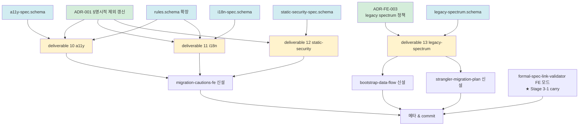

# plan-v14-stage-3-2

> v1.4.0-dev Stage 3-2 (본체 격상 2차 — 비기능 + legacy + ADR 갱신) 실행 계획
> 4원칙 1번 산출 — 사용자 승인 게이트 입력 자료
> 일자: 2026-05-01
> Trigger: DEC-2026-05-01-v1.4-Stage-3-1-종결 §9 + DEC-2026-05-01-v1.4-Stage-2-Gate-결단 (G2-1 / G2-2 / G2-4) + DEC-2026-05-01-v1.4-Stage-1-research-종결 §3.2

---

## 0. 정직 표기 (선행)

- 본 plan = 4원칙 1번 (깊은 숙지 → plan.md). research/코드 0.
- ★ Stage 1 research × 3 자료 (research-official / research-industry / research-senior + summary) 가 i18n / a11y / 정적보안 / legacy 영역 충분 → **옵션 X (research 생략)** 권고.
- ★ Stage 3-1 cross-check (옵션 Y) 권고 3건 모두 ADR-FE-005 / schema 에 반영 완료 → 추가 cross-check 불필요.
- §8.1 정합 = 본 작업은 본체 격상. PoC 변경 0. Stage 4 mini-PoC 진입은 별도 게이트.
- Auto Mode 호환 = 큰 뭉텅이 (12+ 항목) 일괄 승인 패턴.

---

## 1. 목적 + 종결 조건

### 1.1 목적

v1.4 FE 트랙 본체 격상 2차 — Stage 2 Gate 결단의 G2 영역 (보강 범위) 완수:
- G2-1: 비기능 (a11y / i18n / 정적보안) v1.4 포함
- G2-2: legacy Tier 1~4 산출물 3종 신설
- G2-4: ADR-001 §명시적 제외 갱신 ("비기능 측정" → "운영 NFR 측정")
- 추가 — Stage 3-1 carry: formal-spec-link-validator FE 도구 확장

### 1.2 종결 조건

```
□ deliverable 3종 신설 (10-a11y / 11-i18n / 12-static-security)
□ legacy 산출물 3종 신설 (legacy-spectrum / bootstrap-data-flow / strangler-migration-plan)
□ schema 신설 (a11y-spec / i18n-spec / static-security-spec / legacy-spectrum)
□ ADR 신설 (ADR-FE-003 legacy spectrum 정책)
□ ADR 갱신 (ADR-001 §명시적 제외 — 운영 NFR 좁힘)
□ rules.schema.json 확장 (br_type / category enum 4종 추가 — fe_validation / fe_authorization / fe_a11y / fe_i18n)
□ migration-cautions-fe.md 신설 (Phase 6 FE 의무 산출물)
□ formal-spec-link-validator FE 모드 확장 (cross_links[] 인식)
□ 메타 (DEC-Stage-3-2-종결 + STATUS / INDEX / CHANGELOG / memory)
□ commit 단계별 (Phase A~F)
□ 사용자 7 요구사항 7/7 = 100% 도달 (Stage 6 ADR-FE-004 만 carry)
```

### 1.3 비-목표 (★ Stage 3-2 범위 밖)

- mini-PoC 진입 (Stage 4) → 별도 사용자 승인 게이트
- ADR-FE-004 (BE/FE 분리 운영) → Stage 6
- 운영 NFR (LCP / CLS / TTI) deliverable → v1.5 (G2-1 결단 정합)
- BE Sprint 5 carry-over (Semgrep / PMD / OSV) → 별도 sub-track
- 본격 PoC #04 → Stage 5

---

## 2. 의존 그래프



**핵심 의존 규칙** (Stage 3-1 패턴 정합):
1. **ADR 먼저** (Phase A) — ADR-FE-003 / ADR-001 갱신.
2. **schema → deliverable doc 순** (Phase B → C) — 진실은 schema.
3. **deliverable → migration-cautions / legacy artifacts 순** (Phase C → D).
4. **도구 확장** (Phase F) — schema 안정화 후 적용 (Stage 3-1 carry — formal-spec-link-validator FE).

---

## 3. 작업 항목 상세

### 3.1 Phase A — ADR 2건

#### A1. `docs/adr/ADR-FE-003-legacy-spectrum-정책.md` (신설)

**핵심**:
- ADR-FE-001 §3.1 매트릭스의 Tier 2/3/4 (jQuery / Vanilla / JSP) 의 정책 상세
- legacy 산출물 3종 (legacy-spectrum / bootstrap-data-flow / strangler-migration-plan) 신설 사상 근거
- ★ strangler fig pattern (Martin Fowler) 인용 — 점진적 마이그레이션
- Tier 4 (JSP) ★ Stage 6 ADR-FE-004 BE/FE 분리 예외 명시 (ADR-FE-001 §6 정합)

**참조**: ADR-FE-001 / Stage 1 research-senior (legacy 챕터) / DEC-Stage-2-Gate G2-2.

#### A2. `docs/adr/ADR-001-사상적-기반.md` (갱신)

**갱신 범위** (G2-4 결단 정합):
- §명시적 제외 표 — "비기능 요구사항 측정" → "운영 NFR (LCP / CLS / TTI) 측정 / v1.5 검토" 으로 좁힘
- 정적 분석 가능 NFR (a11y / i18n / 정적보안) 은 v1.4 포함 명시
- 갱신 일자 + ★ DEC-Stage-2-Gate-결단 G2-4 인용

**참조**: ADR-001 (현 §명시적 제외) / DEC-Stage-2-Gate G2-1 + G2-4.

---

### 3.2 Phase B — schema 5건

#### B1. `schemas/a11y-spec.schema.json` (신설)

**핵심 필드**:
```yaml
$id: a11y-spec.schema.json
title: A11y Spec (axe-core JSON 호환 + WCAG 2.1+2.2 ratchet)

required: [meta, scope, violations, summary]

x-spec-source:
  axe_core: https://github.com/dequelabs/axe-core/blob/develop/doc/API.md
  wcag_2_1: https://www.w3.org/TR/WCAG21/
  wcag_2_2: https://www.w3.org/TR/WCAG22/
  wai_aria: https://www.w3.org/TR/wai-aria-1.2/

scope:
  pages: [PAGE-XXX]
  components: [CMP-XXX]
  baseline_wcag: enum [2.1-AA]
  ratchet_wcag: enum [2.2-AA]    # ★ ADR-010 baseline+ratchet 정합

violations:
  - id: <axe-core rule id>
    impact: enum [minor, moderate, serious, critical]
    wcag_criterion: SC 1.1.1 / SC 1.4.3 / ...
    wcag_level: enum [2.1-A, 2.1-AA, 2.1-AAA, 2.2-A, 2.2-AA, 2.2-AAA]
    nodes: [{target, html, failure_summary}]
    help_url: <axe-core help URL>
    page_id / component_id / source_file

summary:
  baseline_pass: boolean    # 2.1-AA baseline 통과 여부
  ratchet_pass: boolean     # 2.2-AA ratchet 통과 여부
  total_violations: integer
  per_impact: {minor, moderate, serious, critical}
  axe_core_version_executed: string  # 진짜 실행 시 보존
  no_simulation_evidence:    # ADR-009 §2.2.1 정합
    captured_by: enum [axe_core_real, simulation]
    simulation_reason: string  # if simulation
    5종_물증: ...

cross_links:
  - to_artifact: ui-spec / state-map / visual-manifest
    link_type: validates / inline_in
```

**참조**: visual-manifest.schema.json `a11y_violations` (현재 inline) — 별도 deliverable 분리 시 cross-link.

#### B2. `schemas/i18n-spec.schema.json` (신설)

**핵심 필드**:
```yaml
$id: i18n-spec.schema.json
title: I18n Spec (ICU MF1 + MF2 정합)

x-spec-source:
  icu_mf1: https://unicode-org.github.io/icu/userguide/format_parse/messages/
  icu_mf2: https://unicode-org.github.io/icu/userguide/format_parse/messages/mf2.html
  cldr: https://cldr.unicode.org/

  ★ mf2_status: "spec stable / runtime Technical Preview"  # ADR-FE-005 §2.2.3
  ★ mf1_fallback_required: true   # 단기 폴백 의무

required: [meta, locales, resources, summary]

locales: [BCP 47 tags]
default_locale: ko-KR
supported_locales: [ko-KR, en-US, ...]

resources:
  - key: <translation key>
    namespace: <feature>
    sources: [{locale, message, format: enum [icu_mf1, icu_mf2, plain], plural_rule_used: bool, gender_select_used: bool}]
    cross_links: [{to_artifact: ui-spec, to_id: PAGE-XXX, link_type: shown_on}]

summary:
  total_keys: integer
  missing_per_locale: {locale: count}
  ★ runtime_used: enum [icu4j, icu4c, formatjs, react-intl, i18next, vue-i18n, others]
  ★ mf2_used: boolean
  ★ mf1_fallback_present: boolean   # MF2 사용 시 MF1 병기 의무

cross_links: ...
```

#### B3. `schemas/static-security-spec.schema.json` (신설)

**핵심 필드** (정적 분석 가능 보안만 — 운영 NFR ❌):
```yaml
$id: static-security-spec.schema.json
title: Static Security Spec (XSS / CSRF / CSP / SRI / 정적 분석 가능 보안)

x-spec-source:
  owasp_top10: https://owasp.org/Top10/
  csp_level3: https://www.w3.org/TR/CSP3/
  sri: https://www.w3.org/TR/SRI/
  trusted_types: https://w3c.github.io/trusted-types/

required: [meta, scope, findings, summary]

categories: enum [
  xss_dom_based,
  xss_reflected,
  xss_stored,
  csrf,
  csp_missing,
  csp_unsafe_inline,
  sri_missing,
  trusted_types_missing,
  innerHTML_dangerous_use,
  dangerouslySetInnerHTML_react,
  v_html_vue,
  bypassSecurityTrustHtml_angular,
  cookie_missing_httponly,
  cookie_missing_secure,
  cors_wildcard
]

findings:
  - id: F-FE-SEC-XXX
    category: <enum>
    severity: enum [critical, high, medium, low]
    source_file / line / source_snippet
    fix_suggestion / cwe_id
    cross_links: ...

summary:
  total_findings / per_severity / per_category
  ★ runtime_check_required: boolean   # 정적 분석만으로 미흡 → 사용자 confirm 의무 표기
  ★ static_tool_evidence:
    captured_by: enum [semgrep_real, eslint_security_real, simulation]
    simulation_reason: string  # if simulation
```

#### B4. `schemas/legacy-spectrum.schema.json` (신설)

**핵심 필드**:
```yaml
$id: legacy-spectrum.schema.json
title: Legacy Spectrum (Tier 1~4 detection + bootstrap data flow + strangler plan)

required: [meta, tier_detection, summary]

tier_detection:
  primary_tier: enum [1_modern_spa, 2_jquery_legacy, 3_vanilla_js, 4_server_side_template, mixed]
  signals:
    - tier: <enum>
      signal_type: [package_json, file_extension, dom_pattern, build_config]
      detected: boolean
      evidence_files: [path]
      confidence: number

  mixed_breakdown:        # primary_tier=mixed 시 의무
    tier_1_pct: number
    tier_2_pct: number
    tier_3_pct: number
    tier_4_pct: number

bootstrap_flow:           # bootstrap-data-flow 자료 inline
  entry_html: <path>
  data_injection_method: enum [server_render_initial_state, ajax_fetch, websocket, jsp_request_attribute, none]
  initial_data_keys: [string]

strangler_plan:           # strangler-migration-plan 자료 inline
  migration_target_tier: enum [1_modern_spa, ...]
  approach: enum [page_by_page, feature_by_feature, side_by_side_iframe, edge_proxy]
  estimated_phases: integer

summary:
  recommended_extraction_path: <Tier 별 7대 산출물 매트릭스>
  ★ adopters: ["사내 legacy" 또는 "RealWorld"]
```

#### B5. `schemas/rules.schema.json` (확장 — 기존 호환 유지)

**확장 항목** (G2-1 정합):
- `category` enum 추가: `fe_validation` / `fe_authorization` / `fe_a11y` / `fe_i18n`
- `br_type` enum 추가 (있을 경우 동일 4종)
- ★ FE-validation / FE-authorization 의 cross-link 의무 (state-map.json `validates` 정합)

→ 모든 신규 enum optional 추가 (BE 호환 깸 0).

---

### 3.3 Phase C — deliverable 4건

#### C1. `methodology-spec/deliverables/10-a11y-spec.md` (신설)

**구조** (deliverable doc 일관 스타일 정합):
1. 사상 (ADR-FE-005 §2.2.2 ratchet path + WCAG 2.1+2.2)
2. 형식 (a11y-spec.json + report.md)
3. 추출 범위 (axe-core 진짜 실행 + ★ no-simulation 정책 강제)
4. WCAG ratchet 정책 (baseline 2.1-AA + ratchet 2.2-AA)
5. cross-link (visual-manifest.a11y_violations 와의 분담)
6. 신뢰도 (ADR-009 §2.4 정합)
7. 검증 체크리스트
8. 흔한 함정 (color-contrast 자동 검출 한계 / aria-label 빈약 / focus 순서)

#### C2. `methodology-spec/deliverables/11-i18n-spec.md` (신설)

**구조**:
1. 사상 (ADR-FE-005 §2.2.3 ICU MF1 + MF2 단계 + MF1 폴백 의무)
2. 형식 (i18n-spec.json + missing-keys.md)
3. 추출 범위 (ICU MF1 / MF2 / formatjs / react-intl / i18next / vue-i18n)
4. ★ MF1 폴백 의무 (MF2 사용 시)
5. cross-link (ui-spec.scenarios / pages.locale)
6. 흔한 함정 (plural rule 누락 / gender select 영문만 / 시간/날짜 locale 무시 / RTL 미지원)

#### C3. `methodology-spec/deliverables/12-static-security-spec.md` (신설)

**구조**:
1. 사상 (ADR-001 갱신 — 정적 분석 가능 보안만 / 운영 NFR ❌)
2. 형식 (static-security-spec.json + findings.md)
3. 추출 범위 (XSS / CSRF / CSP / SRI / Trusted Types / cookie / CORS)
4. ★ runtime_check_required 명시 의무 (정적 분석 한계)
5. cross-link (antipatterns.json — AP-FE-SEC-XXX 자동 등록)
6. 흔한 함정 (dangerouslySetInnerHTML / v-html / bypassSecurityTrustHtml / target="_blank" + noopener 부재)

#### C4. `methodology-spec/deliverables/13-legacy-spectrum.md` (신설)

**구조**:
1. 사상 (ADR-FE-001 spectrum + ADR-FE-003 legacy 정책 + Strangler fig pattern)
2. 형식 (legacy-spectrum.json + bootstrap-data-flow.md + strangler-migration-plan.md)
3. Tier detection 절차
4. bootstrap 데이터 흐름 (server-rendered initial state / window.__INITIAL_STATE__ / data attribute / JSP request attribute)
5. strangler migration plan (page-by-page / feature-by-feature / side-by-side iframe / edge proxy)
6. ★ Tier 4 (JSP) Stage 6 ADR-FE-004 예외 명시
7. 흔한 함정 (mixed tier 누락 / bootstrap data 진실 source 분산 / strangler 중도 break)

---

### 3.4 Phase D — 보강 1건 + 신설 1건

#### D1. `methodology-spec/migration-cautions-fe.md` (신설)

BE 의 `migration-cautions.md` 와 짝. Phase 6 FE 의무 산출물.

**구조**:
- FE 특이 함정 (state 5 진실 분산 / visual baseline drift / a11y / i18n / 정적보안 / legacy 4 Tier)
- 학습 효과 (PoC #03 NestJS 정합 패턴 — 사용자 적용 시 즉시 회피)
- ★ migration-cautions BE 와의 cross-link 표

#### D2. `phase-6-quality.md` 보강 (작은 patch)

- FE 산출물 추가 — a11y / i18n / static-security / legacy-spectrum AP 등록 의무 명시
- migration-cautions-fe.md 의무 산출물 추가

---

### 3.5 Phase E — 도구 확장 1건 (Stage 3-1 carry)

#### E1. `tools/formal-spec-link-validator/` FE cross_links 모드 확장

Stage 3-1 Phase E2 진단 결과 carry. 작업:
1. `src/check-links.js` — `cross_links[]` 형식 (from_machine / to_artifact / to_id / link_type) 인식 모드 추가
2. `src/cli.js` `findTargets` — FE 산출물 (`state-map.json` / `visual-manifest.json` / `a11y-spec.json` / `i18n-spec.json` / `static-security-spec.json` / `legacy-spectrum.json` / `ui-spec.json`) 자동 발견
3. test corpus 추가 (FE cross_links sample)
4. README.md 갱신

→ 도구 self-test pass 의무 (기존 17/17 → +N pass).

---

### 3.6 Phase F — 메타 (Stage 3-2 종결)

| F# | 항목 | 위치 |
|---|---|---|
| F1 | `decisions/DEC-2026-05-01-v1.4-Stage-3-2-종결.md` 신설 | decisions/ |
| F2 | `decisions/STATUS.md` 갱신 | decisions/ |
| F3 | `decisions/INDEX.md` 갱신 | decisions/ |
| F4 | `CHANGELOG.md` 갱신 (v1.4.0-dev Stage 3-2 항목) | repo root |
| F5 | memory `project_v140_fe_track.md` 갱신 (Stage 3-2 종결 반영) | ~/.claude/projects/.../memory/ |
| F6 | commit (Phase 단위 또는 일괄) | git |

---

## 4. Sprint 일정 (추정)

| 세션 | 범위 | 산출 |
|---|---|---|
| Session 1 | Phase A (ADR 2) + Phase B (schema 5) | ADR 2 + schema 5 + commit 2 |
| Session 2 | Phase C (deliverable 4) + Phase D (migration-cautions-fe + phase-6 보강) | deliverable 4 + 보강 2 + commit 2 |
| Session 3 | Phase E (도구 확장) + Phase F (메타) | 도구 확장 + DEC + STATUS + INDEX + CHANGELOG + memory + commit |

**Total**: 3 세션 추정 (Stage 3-1 동급).

**병행 가능 부분**:
- Phase B 중 B1/B2/B3/B4 병렬 (의존 없음).
- Phase B5 = 기존 schema 확장 — 다른 B 와 독립.
- Phase C 중 C1/C2/C3/C4 병렬 (schema 별 독립).

---

## 5. 신뢰도 / 검증 / 정책

### 5.1 신뢰도 목표

- 본 Stage 3-2 = 본체 격상 / 산출물 0개 → 신뢰도 metric 부적용 (Stage 3-1 패턴 정합).
- ★ Stage 4 mini-PoC 종결 시 0.75+ (단계 5 도달) — Playwright + axe-core + i18n runtime 진짜 실행 후.
- Stage 5 본격 PoC #04 종결 시 0.80 (단계 3 자동 검증 통과 — drift-validator FE + formal-spec-link-validator FE 양쪽 통과).

### 5.2 no-simulation 정책 강화 (Stage 3-1 패턴 정합)

| 영역 | enum simulation 패널티 | 진짜 도구 |
|---|---|---|
| a11y-spec | -5%p / simulation_reason | axe-core 진짜 실행 |
| i18n-spec | -5%p | ICU MF runtime 진짜 실행 (formatjs / react-intl 등) |
| static-security-spec | -5%p | Semgrep / ESLint security plugin 진짜 실행 |
| legacy-spectrum | -5%p (Tier detection 시뮬 ❌) | 실제 코드 read 의무 |

→ Stage 4 mini-PoC = ★ 4 영역 진짜 도구 1회 실행 의무 (no-simulation 첫 FE 실현 본격화).

### 5.3 §8.1 단일 PoC 과적합 회피

본 Stage 3-2 = 본체 격상. PoC 0개 사용. 격상 근거 = Stage 1 research × 3 (3 에이전트 합의 8 항목) + Stage 2 Gate G2 (4 결정).

---

## 6. 사용자 7 요구사항 진척도 (Stage 3-2 종결 시점)

| 요구 | Stage 3-1 | Stage 3-2 종결 | 격상 |
|---|---|---|---|
| 1. 산출물 → 마이그+테스트 기반 | ✅ 100% | ✅ 100% (a11y + i18n 추가 매개체 산출) | ★ 100% |
| 2. AI + 사람 동시 이해 | ✅ 100% | ✅ 100% (schema 5 + deliverable 4) | ★ 100% |
| 3. UI visible 차원 | ✅ 100% | ✅ 100% | ★ 100% |
| 4. 비즈니스 로직 동일 | ✅ 100% | ✅ 100% (rules.schema fe_validation 확장) | ★ 100% |
| 5. BE/FE 분리 운영 | ⏳ Stage 6 | ⏳ Stage 6 | (Stage 6 도달) |
| 6. 큰 뭉텅이 승인제 | ✅ 100% | ✅ 100% (Stage 3-2 일괄 승인) | ★ 100% |
| 7. 모든 단계 기록 | ✅ 100% | ✅ 100% | ★ 100% |

→ ★ **요구 1/2/3/4/6/7 = 100% 도달 유지** + ADR-001 갱신 으로 비기능 사상 정합 100% / 요구 5 = Stage 6 carry.

---

## 7. 위험 + 완화

| # | 위험 | 영향 | 완화 |
|---|---|---|---|
| R1 | static-security 의 정적 분석 한계 (runtime check 의무) | 중 | summary.runtime_check_required + 사용자 confirm 의무 명시 / Stage 4 mini-PoC = Semgrep/ESLint 진짜 실행 |
| R2 | i18n MF2 runtime preview = production 위험 carry | 중 | ADR-FE-005 §2.2.3 + i18n-spec.schema mf1_fallback_required 의무 |
| R3 | legacy 4 Tier mixed 케이스 detection 신뢰도 ↓ | 중 | mixed_breakdown 의무 + finding 등록 (분산 위험) |
| R4 | rules.schema 확장이 BE 호환 깸 | 고 | 모든 신규 enum optional / 기존 BR 100% 호환 검증 (PoC #02/#03 rules.json 재검증) |
| R5 | ADR-001 §명시적 제외 갱신이 기존 ADR 영향 | 중 | 갱신 일자 + DEC 인용 + 기존 BE 영역 영향 0 (정적 분석 가능 NFR 한정) |
| R6 | formal-spec-link-validator FE 모드 확장 시 BE 회귀 | 고 | 기존 17/17 self-test 보존 + FE corpus 추가만 / `--mode=fe` 옵션 격리 검토 |
| R7 | 12+ 항목 일괄 작업 → 4원칙 4번 (Revert) 발동 시 비용 | 고 | Phase 단위 commit (A / B / C+D / E / F) — Phase 단위 revert 가능 |

---

## 8. Lessons Learned (Stage 3-1 에서)

- ★ Phase 단위 commit = revert 비용 최소화 (Stage 3-1 6 commit 누적 → 본 Stage 동일 패턴).
- ★ deliverable doc 일관 스타일 (commit `8cf8a4d` / `474d36c` / `412d117` / `9b1c45c`) = 본 Stage 3-2 신설 doc 모두 적용 의무 (memory `feedback_deliverable_doc_style.md`).
- ★ schema if/then 강제 패턴 (visual-manifest.schema captured_by) = 본 Stage 3-2 의 a11y / i18n / static-security 모두 적용.
- ★ Stage 1 research × 3 자료 직접 인용 = Stage 3-2 의 i18n / a11y / 정적보안 / legacy 영역 충분 → 추가 cross-check 불필요 (옵션 X).
- ★ no-simulation 정책 schema 강제 = Stage 3-1 의 visual-manifest captured_by 패턴을 Stage 3-2 4 영역 모두 적용.

---

## 9. 후속 (Stage 3-2 종결 후)

```
Stage 3-2 종결 → 사용자 승인 게이트
   ↓
   ├─ Stage 4: mini-PoC (RealWorld React fork / 1주 fail-fast)
   │  - Playwright + axe-core + ICU + Semgrep/ESLint security 진짜 실행 (★ 4 영역)
   │  - 신뢰도 0.75+ 도달 검증 (단계 5)
   │  - drift-validator FE + formal-spec-link-validator FE 본격 적용
   │  - 사상 위반 0 검증
   │
   └─ Stage 5: 본격 PoC #04 (RealWorld FE)
      - Stage 4 검증 후 진입
      - 7대 산출물 + a11y + i18n + static-security + legacy-spectrum
      - 신뢰도 0.80+ 도달 (단계 3 자동 검증 통과)

Stage 6 (횡단 / 별도 진행 가능):
   - ADR-FE-004 (BE/FE 분리 + JSP 예외)
   - methodology-spec/be-fe-separation.md
   - ★ 사용자 요구 5번 정식 반영 (요구 7/7 = 100% 도달)

Stage 7: v1.4.0 MINOR release 결단
```

---

## 10. 종결 진술 + 사용자 승인 항목

### 10.1 본 plan 의 결단 항목 (사용자 승인 필요)

| ID | 결단 | 권고 (본 plan) |
|---|---|---|
| P1 | 의존 그래프 순서 (Phase A → B → C → D, E → F) | ★ 채택 권고 (재작업 최소화 강) |
| P2 | Sprint 분할 (3 세션 추정) | 채택 권고 (Stage 3-1 동급) |
| P3 | commit 단위 = Phase 단위 (A / B / C+D / E / F) | 채택 권고 (Phase 단위 revert 가능) |
| P4 | research = 옵션 X (Stage 1 자료 직접 인용) | ★ 채택 권고 (Stage 3-1 cross-check 권고 3건 이미 반영) |
| P5 | rules.schema.json 확장 = optional 추가만 (BE 호환 보존) | 채택 권고 (R4 완화) |
| P6 | formal-spec-link-validator FE 모드 = `--mode=fe` 옵션 격리 검토 | 채택 권고 (R6 완화 / BE 회귀 0) |

### 10.2 종결 진술

> 본 plan = v1.4.0-dev Stage 3-2 (본체 격상 2차 — 비기능 + legacy + ADR 갱신) 의 4원칙 1번 산출.
> 의존 그래프 12+ 항목 + Phase A~F 단계 + 3 세션 추정.
> Stage 1 research × 3 + Stage 2 Gate G2 결단 + Stage 3-1 carry (formal-spec-link-validator FE) 통합.
> 다음 trigger = 사용자 일괄 승인 → Phase A 진입 (research 0 — 옵션 X).

**End of plan-v14-stage-3-2.**
