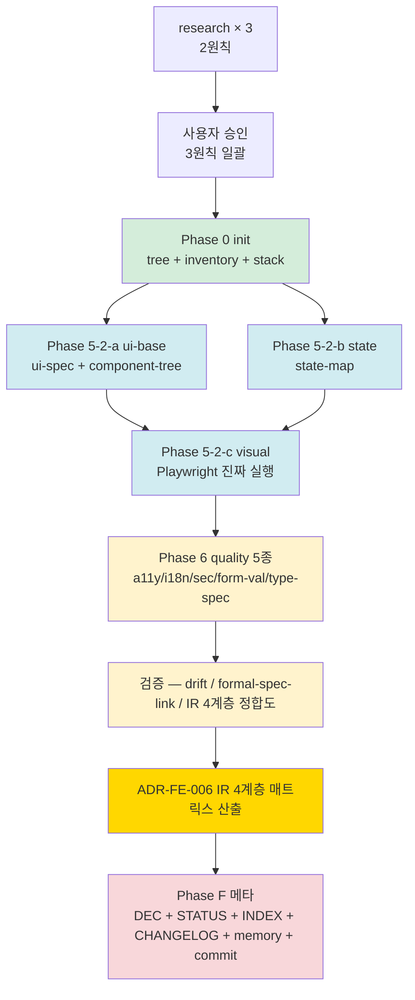

# plan-v14-stage-4-mini-poc

> v1.4.0-dev Stage 4 (mini-PoC — RealWorld React fork 1주 fail-fast) 실행 계획
> 4원칙 1번 산출
> 일자: 2026-05-01
> Trigger: DEC-Stage-7-pre-종결 §1.3 (mini-PoC = Stage 4 별도 게이트) + DEC-Stage-2-Gate-결단 §6 (mini-PoC 사전 준비)

---

## 0. 정직 표기

- 본 plan = 4원칙 1번. research/코드 0.
- ★ Stage 7-pre 까지의 본체 격상 (FE ADR 6 + schema 12 + deliverable 15) 검증 시점.
- Stage 4 = **fail-fast 1주** — 사상 위반 발견 시 Stage 3 revert 의무.
- §8.1 정합 = mini-PoC 발견 = 패턴 단위 임시 / 본체 즉시 격상 ❌ → Stage 5 본격 PoC #04 합산 후 격상.
- ★ no-simulation 정책 정합 — ts-morph / Playwright / axe-core / Semgrep / ICU 진짜 실행 의무.

---

## 1. 목적 + 종결 조건

### 1.1 목적

**Stage 3-1/3-2/6/7-pre 까지 격상된 v1.4 본체** (FE ADR 6 + schema 12 + deliverable 15) 의 **fail-fast 검증**:

- ✅ 산출 가능성 입증 — 9 deliverable (7~15) 실제 추출 가능한가
- ✅ 진짜 도구 실행 가능성 — ts-morph / Playwright / axe-core / Semgrep 환경 구축 + 1회 실행
- ✅ ADR-FE-006 IR 4계층 정합도 — React 관용구 (useState / useEffect / props) 잔존 0 검증
- ✅ 신뢰도 0.75+ 도달 (Stage 5 진입 자격)
- ✅ 사상 위반 0 (위반 발견 시 ★ Stage 3 revert)

### 1.2 종결 조건 (fail-fast)

```
[성공 → Stage 5 진입]
  □ 9 deliverable 중 mini scope (7/8/9/10/11/12/14/15 = 8종 / 13 legacy 만 N/A) 산출 1회
  □ 이중 렌더링 정합 검증 — drift-validator FE / formal-spec-link-validator FE
  □ 진짜 도구 실행 ≥ 3종 (Playwright + axe-core + ts-morph 의무 / Semgrep + ICU 권장)
  □ 신뢰도 0.75+ 도달
  □ ADR-FE-006 IR 4계층 정합도 매트릭스 산출 (L1~L4 정합 % + framework_neutrality_score)
  □ finding ≤ 10건 (★ mini scope 임)
  □ 사상 위반 0
  □ commit + DEC-Stage-4-종결 + STATUS / INDEX / CHANGELOG / memory

[실패 → Stage 3 revert]
  ✗ 사상 위반 발견 (framework-coupling IR / ADR-FE-006 명제 1/2/3 위반)
  ✗ 진짜 도구 ≥ 3종 실행 불가 (환경 의존 시 사용자 보고 + carry)
  ✗ 9 deliverable 중 5+ 종 산출 불가 (방법론 본체 결함 의심)
  ✗ Lessons Learned 작성 + 1원칙 재시작
```

### 1.3 비-목표

- 본격 PoC #04 (Stage 5) — Stage 4 종결 후 별도 게이트
- v1.4.0 MINOR release (Stage 7) — Stage 5 검증 후
- 사내 적용 (adoption 트랙) — v1.4.0 release 후 별도 트랙
- ★ Stage 4 finding → 본체 격상 ❌ (§8.1 단일 PoC 과적합 회피 / Stage 5 합산 후 격상)
- 7대 산출물 외 (component-tree finite scope) ★ 보조 산출물 우선 — `mini` 표시

---

## 2. 분석 대상 + 환경

### 2.1 분석 대상 (RealWorld React fork)

**1차 후보** (Stage 2 §6 G3-2 결단):

| # | 후보 | Stack | 평가 | 비고 |
|---|---|---|---|---|
| **A1** | `gothinkster/react-redux-realworld-example-app` | CRA + React 16 + Redux | ❌ React 16 (Stage 2 결단 = React 18+) / CRA = legacy | 보류 |
| **A2** | `Erikvdv/realworldreactaddtypescript` | Vite + React 18 + TS + Redux Toolkit | ★ Vite + React 18 + TS / Redux Toolkit | **1순위** |
| **A3** | `khaledosman/react-redux-realworld-example-app` | Vite + React 18+ + Redux Toolkit | Vite + React 18 / fork 인기 | 2순위 |
| **A4** | `mutoe/vue3-realworld-example-app` | Vue 3 + TS | ❌ Vue (FE 추출기 첫 검증 = React 우선) | 향후 |

**2순위 결단 자료** (research 단계 cross-validation 의무):
- ★ A2/A3 후보 선정은 Stage 4 plan 단계에서 1차안 / **research 단계 (2원칙) 에서 최종 결단**.
- 후보 결단 기준 — Vite + React 18+ + TS + (Redux Toolkit 또는 Zustand) + (선택) Zod / RHF.

### 2.2 검증 환경 (진짜 도구 — no-simulation 정책)

| 도구 | 용도 | 환경 | mini scope 적용 |
|---|---|---|---|
| **ts-morph** | TypeScript .d.ts 추출 (deliverable 15) | Node 18+ / npm | ★ 의무 |
| **Playwright** | visual snapshot + interaction (deliverable 9) | Chromium / Node 18+ | ★ 의무 |
| **axe-core** | a11y 진짜 검증 (deliverable 10) | @axe-core/playwright | ★ 의무 |
| **Semgrep** | static security (deliverable 12) | semgrep CLI / OWASP rules | ★ 권장 (환경 부재 시 carry + 사용자 보고) |
| **ICU MessageFormat** | i18n 검증 (deliverable 11) | @formatjs/icu-messageformat-parser | ★ 권장 |
| **Storybook CSF v3** | interaction baseline | npm + Storybook 8+ | mini scope 제외 (Stage 5 carry) |
| **MSW** | OpenAPI handler 검증 | npm + MSW 2+ | mini scope 제외 (Stage 5 carry) |
| **drift-validator** | mermaid ↔ JSON 정합 | Node CLI (본체 도구) | ★ 의무 |
| **formal-spec-link-validator** | Phase 4.5 cross-link | Node CLI (본체 도구) | ★ 의무 |
| **decision-table-validator** | dmn 검증 | Node CLI (본체 도구) | mini scope 제외 (BE 영역) |

### 2.3 워크스페이스

```
ai-native-methodology/examples/poc-04-mini-realworld-react/
├── INPUT/
│   └── (RealWorld fork clone — git submodule 또는 README 링크 only / 코드 commit 0)
├── analysis/
│   ├── 0-init/                       # tree.md / inventory.json / stack-detection.md
│   ├── 5-2-a-ui-base/                # ui-spec.json + component-tree.mermaid
│   ├── 5-2-b-state/                  # state-map.json + state-map.mermaid
│   ├── 5-2-c-visual/                 # visual-manifest.json + snapshot/*.png
│   ├── 6-quality/                    # a11y / i18n / static-security / form-validation / type-spec
│   └── _manifest.yml
├── findings/
│   └── F-FE-XXX.md                    # mini scope finding (≤10건)
├── ir-4layer-matrix.md                # ★ ADR-FE-006 정합도 매트릭스
├── confidence-meta.yaml               # 신뢰도 0.75+ 산출
└── README.md                          # 종결 진술
```

---

## 3. 의존 그래프



---

## 4. 작업 항목

### 4.1 Phase 0 — init

| 산출 | 도구 | 진짜 실행 |
|---|---|---|
| `INPUT/` clone (또는 README 링크) | git | ✅ 1회 |
| `analysis/0-init/tree.md` | tree CLI / Node | ✅ |
| `analysis/0-init/inventory.json` | Node 스크립트 (package.json 분석) | ✅ |
| `analysis/0-init/stack-detection.md` | 수동 + ts-morph 보조 | ✅ ts-morph 1회 |

**종결 조건**: stack 명시 (Vite + React 18 + TS + ...) + 의존 그래프 1차 산출.

### 4.2 Phase 5-2-a — ui-base

| 산출 | 도구 | 메모 |
|---|---|---|
| `ui-spec.json` (확장 schema 적용) | ts-morph + 수동 | ★ Stage 3-1 schema 확장 검증 (event_handlers / api_calls / suspense_boundary 4 필드) |
| `component-tree.mermaid` | 수동 | ADR-FE-006 §2.3 — ★ 보조 산출물 / framework-coupling 위험 인지 |
| `pages.md` (PAGE-XXX) | 수동 | Screen 단위 |
| `scenarios.md` (SCN-XXX) | 수동 | Journey 단위 (★ 우선) |

**종결 조건**: 1 page + 1 component family + 2 scenario (login + article) 산출.

### 4.3 Phase 5-2-b — state

| 산출 | 도구 | 메모 |
|---|---|---|
| `state-map.json` (SCXML+XState 호환) | 수동 | 5 진실 #1~#4 (server cache + client global + URL + form) |
| `state-map.mermaid` | 수동 | drift-validator 적용 |
| `form-validation-spec.json` (deliverable 14) | ts-morph (Zod/Yup/RHF detect) | ★ 진짜 실행 / 사용 라이브러리에 따라 산출 가능성 가변 |
| `br-auto-extracted.md` | form-validation-spec → rules.json fe_validation 자동 등록 | ★ 신규 절차 1회 입증 |

**종결 조건**: 1 컴포넌트 (Login form 또는 Article form) — 2 진실 동시 (server cache + form state).

### 4.4 Phase 5-2-c — visual

| 산출 | 도구 | 메모 |
|---|---|---|
| `visual-manifest.json` | Playwright 진짜 실행 | ★ baseline 생성 1회 |
| `snapshot/*.png` (≥ 2 viewport) | Playwright | desktop + mobile |
| `visual-manifest.schema.json` 검증 | Node CLI | ★ Stage 3-1 schema 검증 |

**종결 조건**: 1 page × 2 viewport = 2 snapshot 생성 + manifest hash 일치.

### 4.5 Phase 6 — quality 5종 (★ Stage 3-2 + 7-pre 핵심)

| 산출 | 도구 | 메모 |
|---|---|---|
| `a11y-spec.json` (deliverable 10) | @axe-core/playwright 진짜 실행 | ★ 의무 / WCAG 2.2 AA |
| `i18n-spec.json` (deliverable 11) | @formatjs ICU 검증 | ICU MF1 + (선택) MF2 |
| `static-security-spec.json` (deliverable 12) | Semgrep 진짜 실행 (또는 carry) | ★ no-simulation 정합 / OWASP rules |
| `form-validation-spec.json` (deliverable 14) | Phase 5-2-b 산출 | ★ Zod/Yup/RHF detect |
| `type-spec.json` (deliverable 15) | ts-morph 진짜 실행 | ★ framework_neutrality_score 산출 |

**종결 조건**: 5종 산출 + Phase 4.5 cross-link 입증 + ★ rules.json fe_validation 자동 등록 ≥ 1 BR.

### 4.6 검증 (V1 + V2)

#### V1. 도구 검증

| 도구 | 검증 대상 | 종결 조건 |
|---|---|---|
| drift-validator | state-map.json ↔ state-map.mermaid + ui-spec.json ↔ component-tree.mermaid | breaking 0 (또는 도구 한계 finding 등록) |
| formal-spec-link-validator | a11y / i18n / sec / form-val / type-spec ↔ rules.json cross-link | pass 8+ 영역 |
| ★ schema validator | Phase 6 5종 if/then 강제 통과 | 5/5 통과 |

#### V2. ADR-FE-006 IR 4계층 정합도 매트릭스

```yaml
# ir-4layer-matrix.md 산출 형식
L1_Domain:
  artifacts: [domain.json (선택), rules.json, a11y-spec, i18n-spec, static-security-spec, form-validation-spec, type-spec]
  framework_neutrality: 95%        # ★ ts-morph type-spec 산출의 framework_neutrality_score
  react_idiom_count: 0             # useState/useEffect/props 잔존 0 의무

L2_Interaction:
  artifacts: [ui-spec.scenarios, state-map.json]
  framework_neutrality: 100%       # SCXML+XState
  react_idiom_count: 0

L3_Contract:
  artifacts: [openapi.yaml (백엔드 기존 활용), ui-spec.pages.route, api_calls]
  framework_neutrality: 100%

L4_Presentation:
  artifacts: [ui-spec.components, design-tokens.json (선택), visual-manifest.json]
  framework_neutrality: 95%        # component-tree 보조 / DTCG + Playwright snapshot 중립
  react_idiom_count: 0
  component_tree_caveat: "★ 신규 스택 결정 후 재분해 의무"
```

**종결 조건**: 4계층 모두 framework_neutrality ≥ 90% / react_idiom_count = 0.

### 4.7 Phase F — 메타

| F# | 항목 |
|---|---|
| F1 | `decisions/DEC-2026-05-01-v1.4-Stage-4-종결.md` |
| F2 | `decisions/STATUS.md` |
| F3 | `decisions/INDEX.md` |
| F4 | `CHANGELOG.md` |
| F5 | memory 갱신 (`project_v140_fe_track.md`) |
| F6 | commit Phase 단위 (0 / 5-2-a / 5-2-b / 5-2-c / 6 / V / F) |

---

## 5. Sprint 일정 (1주 fail-fast)

| Day | 작업 | 비고 |
|---|---|---|
| **D1** | research × 3 (2원칙) + 사용자 승인 (3원칙) + Phase 0 | 후보 A2/A3 결단 |
| **D2** | Phase 5-2-a + 5-2-b 일부 | ui-spec + state-map 1차 |
| **D3** | Phase 5-2-c (Playwright 진짜 실행) | visual baseline |
| **D4** | Phase 6 (a11y / i18n / sec / form-val / type-spec) | 진짜 도구 5종 |
| **D5** | V1 (검증) + V2 (IR 4계층 매트릭스) | 사상 위반 점검 |
| **D6** | Phase F 메타 + commit | 종결 |
| **D7** | 예비일 (도구 환경 issue 흡수) | fail-fast 시 revert |

**병렬 가능**: Phase 5-2-a / 5-2-b. Phase 6 의 5종.

---

## 6. 신뢰도 + 정책

### 6.1 신뢰도 (Stage 4 시점)

```yaml
target: 0.75 (★ Stage 5 진입 자격 / Gate 결단 G3-3)
expected: 0.70 ~ 0.78
penalty:
  - 진짜 도구 ≥ 3종 미실행: -10%p
  - IR 4계층 정합도 90% 미달: -5%p
  - drift-validator breaking ≠ 0: -5%p
```

### 6.2 정책

- ★ no-simulation 정책 strict — Playwright / axe-core / ts-morph 시뮬 금지 / 환경 부재 시 사용자 보고 + carry.
- ★ §8.1 정합 — Stage 4 finding → 본체 격상 ❌ / Stage 5 합산 후 격상.
- 4원칙 4번 — 사상 위반 발견 시 Lessons Learned + Stage 3 revert (Stage 3-1/3-2 본체 격상 보존 / mini-PoC 산출만 폐기).

---

## 7. 사용자 7 요구사항 진척도

| 요구 | Stage 7-pre | Stage 4 (mini-PoC) |
|---|---|---|
| 1. 산출물 → 마이그+테스트 | ★ 100% | ★ 입증 (form-validation + type-spec 자동 추출 1회) |
| 2. AI + 사람 동시 이해 | ★ 100% | ★ 입증 (이중 렌더링 정합 검증 — drift-validator FE 첫 외부 적용) |
| 3. UI visible 차원 | ★ 100% | ★ 입증 (visual-manifest Playwright 진짜 실행) |
| 4. 비즈니스 로직 동일 | ★ 100% | ★ 입증 (state-map + form-validation BR 자동 등록 1회) |
| 5. BE/FE 분리 운영 | ★ 100% | ★ 입증 (Scenario A 분리 default 적용) |
| 6. 큰 뭉텅이 승인제 | ★ 100% | ★ 입증 (mini-PoC 후 일괄 승인 → Stage 5) |
| 7. 모든 단계 기록 | ★ 100% | ★ 입증 (Phase 단위 commit) |

→ ★ 7/7 = 100% 사상 정합 mini-PoC 검증.

---

## 8. 위험 + 완화

| # | 위험 | 영향 | 완화 |
|---|---|---|---|
| **R1** | RealWorld React fork 후보가 Zod / RHF 미사용 → form-validation-spec 산출 불가 | 중 | research 단계 fork 후보 ≥ 2 평가 → Zod/RHF 사용 fork 우선 / 미사용 시 finding 등록 + carry |
| **R2** | Semgrep / Playwright 환경 부재 (Windows) | 중 | npm 기반 (@axe-core/playwright) 우선 / Semgrep CLI 환경 부재 시 사용자 보고 + carry |
| **R3** | 진짜 도구 1주 환경 구축 부담 | 중 | ★ Day 1 환경 구축 우선 / 실패 시 도구 ≥ 3종 의무만 충족 후 carry 명시 |
| **R4** | mini scope finding ≤ 10 초과 (방법론 결함 의심) | 중 | ★ §8.1 정합 — finding 임계 (5~15 건강 / 20+ 결함 의심) Stage 4 적용 |
| **R5** | IR 4계층 react_idiom_count > 0 (사상 위반) | 고 | ★ 4원칙 4번 발동 — Stage 3 revert + Lessons Learned |
| **R6** | drift-validator FE corpus 부족 → false positive | 중 | F-154 transitionFuzzyMatch 패턴 (Sprint 5 carry) 인지 / 도구 한계 finding 등록으로 회피 |
| **R7** | mini-PoC 1주 cap 초과 (5+ 일 추가) | 고 | D7 예비일 흡수 / 초과 시 사용자 보고 + Stage 5 일정 재합의 |
| **R8** | 신뢰도 0.75 미달 | 중 | research 단계 후보 결단 시 R1 회피 / 도구 진짜 실행 의무 / 미달 시 Lessons Learned + carry |

---

## 9. Lessons Learned 영역 (4원칙 4번 — 실패 시 기록)

> 본 영역은 Stage 4 실패 시 (사상 위반 / 도구 환경 / 신뢰도 미달) plan 갱신 의무.

```
(현재 비어있음 — Stage 4 진행 후 갱신)
```

---

## 10. 종결 진술

> 본 plan = v1.4.0-dev Stage 4 (mini-PoC — RealWorld React fork 1주 fail-fast) 4원칙 1번 산출.
> Phase 0 → 5-2-a/b/c → 6 → V → F = 1주 (D1~D6 / D7 예비) 추정.
> ★ 종결 = Stage 5 진입 자격 (신뢰도 0.75+ / 사상 위반 0 / IR 4계층 정합도 90%+ / 진짜 도구 ≥ 3종 실행).
> ★ 실패 = Stage 3 revert + Lessons Learned (4원칙 4번).
> 다음 trigger = research × 3 (2원칙) → 사용자 일괄 승인 (3원칙) → Phase 0 즉시 진입.

**End of plan-v14-stage-4-mini-poc.**
