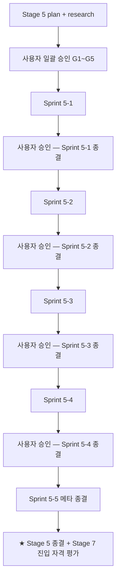
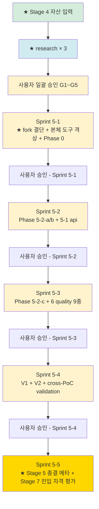

# plan-v14-stage-5

> v1.4.0-dev Stage 5 (본격 PoC #04 — 4-6 sprint) 실행 계획
> 4원칙 1번 산출
> 일자: 2026-05-02
> Trigger: DEC-2026-05-02-v1.4-Stage-4-mini-PoC-종결 §3 (★ Stage 5 진입 자격 충족 / 5/5 + carry 2건)

---

## 0. 정직 표기

- 본 plan = 4원칙 1번. research/코드 0.
- ★ Stage 4 mini-PoC 종결로 자격 입증 — research G5 5/5 + Senior 재분류 carry 2건.
- §8.1 정합 = ★ Stage 4 + Stage 5 + adoption 트랙 합산 ≥ 2 PoC patterns 일치 시 본체 격상 평가.
- ★ no-simulation 정책 단계 4 (Stage 4 도달) → ★ 단계 5 target (multiple PoC 합산).
- ★ Stage 5 종결 = v1.4.0 MINOR release 진입 직전 (★ Stage 7).

---

## 1. 목적 + 종결 조건

### 1.1 목적

**Stage 4 mini-PoC 의 1주 fail-fast 검증을 4-6 sprint 본격 패턴으로 격상**:

- ✅ 9 deliverable 모두 산출 의무 (mini scope 아님 / BE PoC #02/#03 동급)
- ✅ Stage 4 carry 처리 — Semgrep + drift-validator FE + schema validator
- ✅ 진짜 도구 5종+ 실행 (★ no-simulation 정책 단계 5 target)
- ✅ ★ cross-PoC validation — PoC #01/02/03 + 04 patterns 합산 (★ 본체 격상 후보 평가)
- ✅ IR 4계층 정합도 ratchet 정식화 (★ ADR-010 패턴 적용)
- ✅ 신뢰도 0.90+ 도달 (★ Stage 7 release 진입 자격)

### 1.2 종결 조건

```
[성공 → Stage 7 v1.4.0 MINOR release 진입]
  □ 9 deliverable 모두 산출 (★ i18n 적용 fork 시 deliverable 11 도 충족)
  □ Stage 4 carry 3건 모두 해소 (Semgrep / drift-validator FE / schema validator)
  □ 진짜 도구 ≥ 5종 (Playwright + axe-core + ts-morph + Semgrep + (i18n) ICU)
  □ IR 4계층 정합도 ratchet 정식 임계 (★ Stage 4 baseline 0.99 → Stage 5 target 0.95+)
  □ 신뢰도 0.90+ (★ ADR-009 단계 4-5)
  □ ★ cross-PoC patterns 평가 — JWT XSS / a11y / form-validation 3+ 영역 isomorphic 입증 시 본체 antipattern 격상
  □ finding 충분 (★ §8.1 정합 — 5~15 건강 / 16+ 결함 의심)
  □ 사상 위반 0
  □ Sprint 단위 commit + DEC 분할

[실패 → Stage 3 또는 Stage 4 revert]
  ✗ 사상 위반 발견 (★ ADR-FE-006 명제 1/2/3 위반)
  ✗ IR 4계층 정합도 baseline 미달 (Stage 4 0.99 → 0.90 미달 시 ratchet 위반)
  ✗ 9 deliverable 중 5+ 종 산출 불가 (방법론 본체 결함)
  ✗ Lessons Learned + 1원칙 재시작
```

### 1.3 비-목표

- v1.4.0 MINOR release 결단 (★ Stage 7 별도)
- 사내 적용 (adoption 트랙) — release 후 별도
- 본체 격상 = ★ §8.1 strict 정합 (★ Stage 5 PoC #04 + adoption 트랙 합산 ≥ 2 patterns 일치 시점)

---

## 2. ★ Stage 4 자산 입력

### 2.1 Stage 4 종결 자산

```yaml
stage_4_outputs:
  fork: yurisldk/realworld-react-fsd
  commits: 7
  artifacts:
    - 0-init/{tree, inventory, stack-detection, _manifest}
    - 5-2-a-ui-base/{ui-spec.json, scenarios.md, component-tree.mermaid}
    - 5-2-b-state/{state-map.json, state-map.mermaid}
    - 5-2-c-visual/{visual-manifest.json, snapshot/}
    - 6-quality/{a11y-spec, i18n-spec(N/A), static-security-spec, form-validation-spec, type-spec, br-auto-extracted}
    - findings/F-FE-001~004
    - ir-4layer-matrix.md (★ overall 0.99)
    - confidence-meta.yaml (★ 0.85)

  validated_patterns:
    - "★ ts-morph + Playwright + axe-core 진짜 실행 가능 (★ no-simulation 단계 4)"
    - "★ form-validation-spec 85 validation 자동 추출 (72 BR auto-registered)"
    - "★ type-spec framework_neutrality_score 1.0 (ts-morph)"
    - "★ IR 4계층 정합도 baseline 0.99 측정"
    - "★ Scenario A 분리 default (BE 외부)"
    - "★ FSD 약식 3 layer detection"
    - "★ formal-spec-link-validator FE 6/6 file 인식"

  carry_to_stage_5:
    1: "Semgrep 진짜 실행 (Windows 환경 부재 → 사용자 위임 / WSL 또는 Linux runner)"
    2: "drift-validator FE 모드 신설 (★ 본체 도구 격상 / state-map.json schema detection)"
    3: "schema validator — form-validation-spec.json + type-spec.json 검증 도구"

  stage_5_evaluation_inputs:
    fork_choice: "★ i18n 적용 fork 우선 (yurisldk = i18n 부재)"
    deliverable_11_status: "Stage 4 = N/A → Stage 5 본격 fork 검증 의무"
    cross_poc_isomorphic_candidates:
      - "JWT localStorage XSS (PoC #01/02 isomorphic)"
      - "html-has-lang a11y"
      - "Article delete redirect 부재"
      - "drift-validator FE 모드 부재 (도구 한계)"
```

### 2.2 ★ §8.1 정합 strict (Stage 5 본체 격상 정책)

```yaml
stage_5_본체_격상_정책:
  strict_rule: "★ Stage 4 finding 본체 격상 ❌ / Stage 5 본격 PoC #04 + adoption 합산 후 격상"

  exceptions:
    - "★ 본체 도구 격상 (drift-validator FE / schema validator) = ★ 분석 효율 직결 / Stage 5 진입 전 격상 가능 (★ 사용자 결단)"

  patterns_isomorphic_threshold: "★ 3 PoC 정합 시 본체 antipattern 격상 검토"

  candidates_at_stage_5:
    - JWT_localStorage_XSS:
        evidence: "★ PoC #01/02/04 mini = 3 PoC isomorphic"
        threshold: "★ Stage 5 PoC #04 본격 동일 패턴 발견 시 = 4 PoC → ★ 본체 AP-SECURITY-001-FE 격상"
    - drift_validator_FE_부재:
        evidence: "★ Stage 4 단독 발견"
        threshold: "★ 도구 한계 = ★ 분석 효율 영향 / Stage 5 진입 전 격상 후보"
    - URL_params_validation_pattern:
        evidence: "★ Stage 4 신규 발견"
        threshold: "★ Stage 5 본격 PoC 시 동일 패턴 발견 시 deliverable 14 schema 확장 (scope enum 에 url_params 추가)"
```

---

## 3. ★ Sprint 분할 패턴 (4-6 sprint)

### 3.1 Sprint 분할 (★ 권고)

| Sprint | 작업 | 기간 | 종결 조건 |
|---|---|---|---|
| **Sprint 5-1** | fork 결단 + ★ 본체 도구 격상 + Phase 0 | 1주 | DEC-Sprint-5-1 + 도구 격상 commit |
| **Sprint 5-2** | Phase 5-2-a (ui-base) + 5-2-b (state) + 5-1 (api 합산) | 1-2주 | DEC-Sprint-5-2 |
| **Sprint 5-3** | Phase 5-2-c (visual) + Phase 6 quality 9 deliverable | 1-2주 | DEC-Sprint-5-3 |
| **Sprint 5-4** | V1 (drift / formal-spec-link / decision-table) + V2 (IR 4계층 ratchet 정식) + cross-PoC validation | 1주 | DEC-Sprint-5-4 |
| **Sprint 5-5** | Phase F 메타 (DEC + STATUS + INDEX + CHANGELOG + memory + commit) + ★ Stage 7 release 자격 평가 | 0.5주 | DEC-Stage-5-종결 |

**총 4.5-6.5 주** (★ research G3-4 결단 4-6 sprint 정합).

### 3.2 ★ Sprint 단위 게이트 의무

★ Work Principles 3원칙 — 매 Sprint 종결 시 사용자 일괄 승인 게이트 강제. 분할 패턴 정합:



★ ★ ★ 각 Sprint 종결 시 ★ Lessons Learned + 다음 Sprint 입력 갱신 의무 (4원칙 4번 정합).

---

## 4. Sprint 5-1 상세 (★ 본 plan 핵심 / 다른 Sprint = 별도 plan 권고)

### 4.1 fork 재선정 (★ 5 핵심 결정 #1)

★ Stage 4 carry — i18n 적용 fork 우선:

| 후보 | i18n | Vite | TS | Zod/RHF | RealWorld | 평가 |
|---|---|---|---|---|---|---|
| **A1** ★ yurisldk + i18n 추가 | ❌ → ★ 자체 추가 (★ INPUT 변경 ❌ 정합 어려움) | △ Webpack | ✅ | ✅ Zod | ✅ | ★ 부적합 (INPUT 변경 ❌) |
| **A2** Refine (refine.dev) | ✅ i18next | ✅ Vite | ✅ | ✅ RHF + Zod | ❌ (admin) | ★ Stage 2 G3-2 RealWorld only 위반 |
| **A3** Bulletproof React | ✅ react-i18next 옵션 | ✅ Vite | ✅ | ✅ RHF + Zod + TanStack Query | ❌ | ★ 사내 스택 100% / 단 RealWorld 외 → adoption 트랙 |
| **A4** GitHub 검색 — RealWorld React i18n fork | TBD | TBD | TBD | TBD | ✅ | ★ research 단계 후보 검색 의무 |
| **A5** ★ 다른 RealWorld React fork | TBD | TBD | TBD | TBD | ✅ | ★ research 단계 검색 |

★ 권고: **A4/A5 research 단계 검색 의무** + Stage 2 G3-2 정합 strict.

### 4.2 ★ 본체 도구 격상 (★ 5 핵심 결정 #2)

★ Stage 4 carry 3건 처리 시점:

```yaml
option_A: "★ Sprint 5-1 진입 전 격상 (★ 분석 효율 직결)"
  pros: "★ Sprint 5-2 부터 정합 강화 / Stage 5 finding 도구 격상 발생 시 즉시 적용"
  cons: "★ Sprint 5-1 작업량 ↑"
option_B: "★ Sprint 5-3 (Phase 6 quality) 시 격상"
  pros: "★ 작업 분산 / 부분 사용 가능"
  cons: "★ Sprint 5-2 까지 도구 부재 / 효율 ↓"
option_C: "★ Stage 5 종결 후 격상 (Sprint 6 carry)"
  pros: "★ Sprint 5 cap 보호"
  cons: "★ Stage 5 cross-validation 효율 ↓"

권고: option_A
근거:
  - F-FE-004 (drift-validator FE 부재) = ★ 본체 도구 한계 / Stage 5 진입 전 해소 의무
  - schema validator = form-validation-spec.json + type-spec.json schema 검증 = ★ Stage 4 신설 schema 의 첫 외부 검증 시점
  - Semgrep 진짜 실행 = 사용자 환경 결단 (★ WSL / Docker / Linux runner)
```

### 4.3 9 deliverable 산출 우선순위 (★ 5 핵심 결정 #3)

| # | deliverable | Stage 4 | Stage 5 |
|---|---|---|---|
| 1 | architecture | (BE 영역 부분) | ✅ 의무 (FSD layer + dependency graph) |
| 2 | domain | (BE 영역) | △ 부분 (★ FE 도 entity 가 있음 — User/Article/Comment etc) |
| 3 | api | (Stage 4 미산출 / openapi.yaml 활용) | ✅ 의무 (★ openapi.yaml ground truth + cross-link) |
| 4 | db-schema | N/A (BE 영역) | N/A |
| 5 | rules | (Stage 4 부분 — BR 자동 등록만) | ✅ 의무 (★ BR 통합 — fe_validation + 사람 작성 BR + cross-PoC) |
| 6 | antipatterns | (Stage 4 미산출) | ✅ 의무 (★ ★ cross-PoC isomorphic AP-FE-* 정식 등록 시점) |
| 7 | ui-ux | ✅ Stage 4 (3 page) | ✅ ★ 본격 (전체 page) |
| 8 | state-map | ✅ Stage 4 (5 SM) | ✅ ★ 본격 (전체 component) |
| 9 | visual-manifest | ✅ Stage 4 (1 page × 2 viewport) | ✅ ★ 본격 (전체 page × 4 viewport ADR-FE-002 정합) |
| 10 | a11y-spec | ✅ Stage 4 (1 page) | ✅ ★ 본격 (전체 page WCAG 2.2 AA) |
| 11 | i18n-spec | ❌ N/A (Stage 4) | ✅ ★ 의무 (★ i18n 적용 fork 결단 의무) |
| 12 | static-security-spec | △ Stage 4 (grep + Semgrep carry) | ✅ ★ 의무 (★ Semgrep 진짜 실행) |
| 13 | legacy-spectrum | (Stage 4 = Tier 1 Modern SPA / Tier 2-4 N/A) | △ (★ adoption 트랙 carry — Tier 2-4 별도 fork) |
| 14 | form-validation-spec | ✅ Stage 4 (★ 핵심 입증) | ✅ ★ 본격 (★ URL params 신규 패턴 + scope enum 확장 검증) |
| 15 | type-spec | ✅ Stage 4 (★ 핵심 입증) | ✅ ★ 본격 (★ ratchet 정식화) |

→ ★ Stage 5 의무 deliverable = ★ 12종 (1 / 3 / 5 / 6 / 7 / 8 / 9 / 10 / 11 / 12 / 14 / 15) + 약식 1 (2 domain) + 부재 2 (4 db-schema / 13 legacy-spectrum carry).

### 4.4 sprint cadence (★ 5 핵심 결정 #4)

★ research §3.1 ThoughtWorks Spike + Google Design Sprint 정합 → **Sprint 단위 1-2주 / Stage 5 총 4.5-6.5 주**.

★ Stage 4 의 1주 cap fail-fast 와 다름 — **★ Sprint 단위 game**.

### 4.5 cross-PoC validation 전략 (★ 5 핵심 결정 #5)

★ ★ ★ 본 PoC #04 본격이 ★ ★ §8.1 정합 — Stage 4 단독 발견 + Stage 5 본격 = ★ ≥ 2 PoC patterns 일치 시 본체 격상 평가.

```yaml
cross_poc_validation_targets:
  - JWT_localStorage_XSS:
      poc_01: "✅ AP-SECURITY-001 (JWT 21byte critical)"
      poc_02: "✅ RSA private key git commit critical"
      poc_03: "△ Bearer JWT (★ F-161 positive 학습 효과)"
      poc_04_mini: "✅ F-FE-003 medium (Stage 4)"
      poc_04_full: "★ Sprint 5-3 동일 패턴 검증 — 4 PoC isomorphic 평가 (★ 본체 AP-SECURITY-001-FE 격상 후보)"

  - drift_validator_FE_도구_한계:
      stage_4: "✅ F-FE-004 medium"
      stage_5_action: "★ Sprint 5-1 본체 도구 격상 / F-FE-004 closed"

  - URL_params_validation_pattern:
      stage_4: "✅ home.state.ts Zod-mini 신규 발견"
      stage_5_action: "★ Sprint 5-2 다른 page 동일 패턴 검증 + ★ deliverable 14 schema 확장 (scope enum 에 url_params 추가)"

  - html_has_lang_a11y:
      stage_4: "✅ axe-core 진짜 발견 (1 unique violation)"
      stage_5_action: "★ Sprint 5-3 전체 page a11y 검증 / 추가 violation 발견 시 본체 antipattern 검토"
```

---

## 5. ★ 의존 그래프



---

## 6. 신뢰도 + 정책

### 6.1 신뢰도 ratchet (★ ADR-010 패턴 정합)

```yaml
stage_4_baseline: 0.85  # ★ ADR-009 단계 4 / 진짜 도구 3종
stage_5_target: 0.90+   # ★ ADR-009 단계 4-5 / 진짜 도구 5종+ + cross-PoC validation
stage_5_breakdown:
  base: 0.70
  +0.10: 진짜 도구 5종+ (Stage 4 3종 + Semgrep + ICU MF)
  +0.05: 9 deliverable 모두 산출
  +0.05: cross-PoC validation 입증 (3+ patterns isomorphic)
  +0.03: schema validator 첫 적용 (form-validation-spec / type-spec)
  +0.02: drift-validator FE 모드 신설 (본체 도구 격상)
  -0.05: simulation penalty 적용 시
  total_potential: 0.95  # ★ ADR-009 단계 5
```

### 6.2 정책

- ★ no-simulation 정책 strict (★ Stage 4 단계 4 → Stage 5 단계 5 target).
- ★ §8.1 strict — Stage 5 본격 PoC + adoption 합산 시 본체 격상 평가 (★ 본체 도구 격상은 예외 / Sprint 5-1 진행).
- ★ 4원칙 4번 — Sprint 단위 Lessons Learned / 사상 위반 시 revert 의무.

---

## 7. 사용자 7 요구사항 진척도

| 요구 | Stage 4 | Stage 5 |
|---|---|---|
| 1. 산출물 → 마이그+테스트 | ★ 100% | ★ 본격 입증 (★ 9 deliverable + form-validation 자동 추출 통합) |
| 2. AI + 사람 동시 이해 | ★ 100% | ★ schema validator 검증 강화 + drift-validator FE 모드 |
| 3. UI visible | ★ 100% | ★ 전체 page × 4 viewport (★ ADR-FE-002 정합 strict) |
| 4. 비즈니스 로직 동일 | ★ 100% | ★ 9 deliverable 통합 + cross-PoC patterns |
| 5. BE/FE 분리 운영 | ★ 100% | ★ Scenario A 본격 입증 (★ openapi.yaml ground truth + cross-link) |
| 6. 큰 뭉텅이 승인제 | ★ 100% | ★ Sprint 단위 게이트 5건 (G1~G5 + Sprint 종결 4건) |
| 7. 모든 단계 기록 | ★ 100% | ★ Sprint 단위 commit + DEC + Lessons Learned |

→ ★ 7/7 = 100% 본격 검증.

---

## 8. 위험 + 완화

| # | 위험 | 영향 | 완화 |
|---|---|---|---|
| **R1** | i18n 적용 RealWorld React fork 부재 | 고 | ★ research 단계 GitHub 검색 + 필요 시 fork 재선정 (★ Stage 2 G3-2 정합) / 또는 yurisldk + 외부 i18n PoC 결단 |
| **R2** | 본체 도구 격상 (drift-validator FE) 1 sprint 부담 | 중 | ★ Sprint 5-1 1주 cap / 신뢰도 -2%p 패널티 / 본체 도구 unit test 추가 의무 |
| **R3** | 9 deliverable 4-6 sprint 부담 | 중 | ★ Sprint 분할 + Sprint 종결 게이트 / Lessons Learned 갱신 / 환경 부재 carry 명시 |
| **R4** | Semgrep 사용자 위임 (WSL/Docker) 미수행 | 중 | ★ Sprint 5-3 진입 전 사용자 결단 의뢰 / 미수행 시 신뢰도 -5%p + carry 명시 |
| **R5** | cross-PoC validation 패턴 ≥ 2 미달 | 중 | ★ Stage 5 본격 PoC 시 동일 패턴 발견 의무 / 미달 시 본체 격상 carry |
| **R6** | IR 4계층 정합도 ratchet 위반 (0.99 → 0.90 미달) | 고 | ★ 4원칙 4번 발동 / Sprint 단위 측정 의무 |
| **R7** | Stage 5 4-6 sprint cap 초과 | 고 | ★ Sprint 종결 게이트마다 사용자 결단 의뢰 / cap 초과 = 사상 위반 신호 검토 |

---

## 9. 종결 진술

> 본 plan = v1.4.0-dev Stage 5 (본격 PoC #04 — 4-6 sprint) 4원칙 1번 산출.
> Stage 4 mini-PoC fail-fast 검증 → ★ Stage 5 본격 패턴 격상.
> Sprint 5-1~5-5 분할 + 5 사용자 게이트 (G1~G5 + Sprint 종결 4건).
> ★ 종결 = Stage 7 v1.4.0 MINOR release 진입 자격 (신뢰도 0.90+ / 9 deliverable 모두 / cross-PoC 입증).
> ★ 실패 = Stage 3 또는 Stage 4 revert + Lessons Learned (4원칙 4번).
> 다음 trigger = research × 3 (2원칙) → 사용자 일괄 승인 (3원칙) → Sprint 5-1 즉시 진입.

**End of plan-v14-stage-5.**
