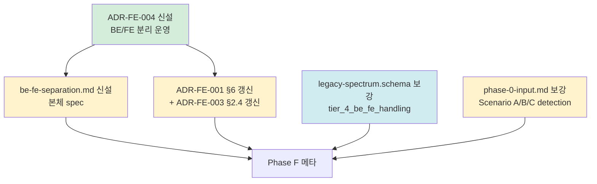

# plan-v14-stage-6

> v1.4.0-dev Stage 6 (BE/FE 분리 운영 정책 정식 — 횡단 정책) 실행 계획
> 4원칙 1번 산출 — 사용자 승인 게이트 입력 자료
> 일자: 2026-05-01
> Trigger: DEC-Stage-3-2-종결 §9 + DEC-Stage-2-Gate-결단 G2-3 (BE/FE 분리 default + JS풀스택+JSP ADR 예외)

---

## 0. 정직 표기 (선행)

- 본 plan = 4원칙 1번. research/코드 0.
- ★ 옵션 X 채택 — Stage 1 research × 3 (G2-3 영역 합의 — Modern split 기본 + JS 풀스택 / JSP 예외) + Stage 2 Gate G2-3 결단 + Stage 3-1/3-2 ADR 누적 (FE-001 §6 / FE-003 §2.4) 충분.
- §8.1 정합 = 본체 격상 / PoC 변경 0.
- 사용자 7 요구사항 5번 = 본 Stage 종결 시 ★ 100% 도달 (7/7 달성).

---

## 1. 목적 + 종결 조건

### 1.1 목적

v1.4 FE 트랙의 횡단 정책 — **BE/FE 분리 운영** 정식 격상:
- ★ Scenario A (분리 default) 정식 명세화
- ★ Scenario B (JS 풀스택 — Next.js / Nuxt / Remix / Astro) ADR 예외 명시
- ★ Scenario C (JSP / Thymeleaf / ERB — Tier 4) ADR 예외 명시
- ★ Tier 4 BE/FE 통합 산출 절차 정식 (Stage 3-1 / 3-2 carry 종결)
- ★ 사용자 요구 5 = 100% 도달 (7/7)

### 1.2 종결 조건

```
□ ADR-FE-004 (BE/FE 분리 운영 정책) 신설
□ ★ ADR-FE-006 (프레임워크 중립 IR 사상) 신설 — ★ 외부 LLM 검증 빈틈 #3/#4/#5 통합 해소
□ methodology-spec/be-fe-separation.md 신설 (본체 spec)
□ ADR-FE-001 §6 갱신 (Tier 4 JSP 예외 carry → resolved)
□ ADR-FE-003 §2.4 갱신 (Tier 4 ADR-FE-004 예외 정합 명시)
□ ★ deliverable 7 §6 보강 (component 분해 framework-coupling 위험 + Screen+Journey 우선 명시)
□ legacy-spectrum.schema.json 보강 (tier_4_be_fe_split_carry → tier_4_be_fe_handling resolved)
□ phase-0-input.md 보강 (Scenario A/B/C detection)
□ 메타 (DEC-Stage-6-종결 + STATUS + INDEX + CHANGELOG + memory)
□ commit Phase 단위 (A / B / F)
□ 사용자 7 요구사항 7/7 = 100% 도달 ★★★
□ ★ 외부 LLM 검증 빈틈 #3/#4/#5 해소 (#1/#2 = Stage 7-pre carry)
```

### 1.3 비-목표

- mini-PoC (Stage 4) — 별도 게이트
- 본격 PoC #04 (Stage 5)
- v1.4.0 MINOR release (Stage 7) — Stage 4/5 검증 후
- Tier 4 (JSP) 본격 PoC — 사내 legacy 도입 시 (Stage 5+ 또는 release 후 adoption)

---

## 2. 의존 그래프 (★ 단순 — 1 의존 chain)



**의존 규칙**: ADR (사상) → spec doc / schema 보강 → 메타. Stage 3-1 / 3-2 패턴 정합.

---

## 3. 작업 항목

### 3.1 Phase A — ADR-FE-004 신설

#### A1. `docs/adr/ADR-FE-004-BE-FE-분리-운영-정책.md` (신설)

**핵심 명제**:

```yaml
명제 1 (Scenario A 분리 default):
  ✅ Modern SPA + 별도 BE 서버 (Spring/NestJS/FastAPI 등)
  ✅ FE = ui-spec + state-map + visual-manifest + a11y + i18n + 정적보안 (deliverable 7~12)
  ✅ BE = inventory / db / arch / domain / rules / api / antipatterns (deliverable 1~6)
  ✅ 양쪽 독립 추출 가능 / 두 팀 운영 가능

명제 2 (Scenario B JS 풀스택 예외):
  ✅ Next.js / Nuxt / Remix / Astro / SvelteKit
  ✅ ★ FE + BE 가 동일 코드베이스 — 분리 ❌
  ✅ deliverable 1~13 통합 산출 (한 팀 / 한 명령)
  ✅ API route handler = BE 산출 (deliverable 3 api) + FE state-map.cross_links 양쪽 인식

명제 3 (Scenario C JSP / Thymeleaf / ERB 예외 — Tier 4):
  ✅ ★ FE 와 BE 가 server-side template 으로 통합
  ✅ 라우팅 = BE Spring MVC (BE 산출)
  ✅ 렌더링 = JSP (FE 산출 — legacy-spectrum.tier=4)
  ✅ 데이터 = BE controller model attribute (BE 산출)
  ✅ 본 방법론 = "BE 분석 시 FE 산출도 함께" 통합 명령
```

**구조**:
1. 컨텍스트 (사용자 요구 5 / Stage 1 research / Stage 2 Gate G2-3)
2. 결정 (3 Scenario)
3. Scenario detection (자동 감지)
4. Scenario 별 산출물 매트릭스
5. 산출 명령 차이 (분리 / 통합)
6. ★ Tier 4 BE/FE 통합 산출 절차 정식 (Stage 3-1/3-2 carry 종결)
7. 결과 (좋은 점 / 나쁜 점 / 무시한 옵션)
8. 적용 (Implementation)
9. 참조

**참조**: ADR-FE-001 / ADR-FE-003 / Stage 1 research-senior §BE-FE 챕터 / DEC-Stage-2-Gate G2-3.

---

### 3.2 Phase B — spec doc + schema 보강

#### B1. `methodology-spec/be-fe-separation.md` (신설)

**구조** (일관 스타일 정합):

1. 사상 (ADR-FE-004 인용)
2. 3 Scenario 매트릭스 (A 분리 / B JS 풀스택 / C JSP)
3. Scenario detection 자동 절차
4. Scenario A — 분리 default
   - 산출 명령 (BE / FE 독립 호출)
   - cross-link 매트릭스 (api ↔ ui-spec ↔ state-map)
   - 두 팀 운영 권고
5. Scenario B — JS 풀스택
   - 통합 명령
   - API route handler 양쪽 인식 (BE deliverable 3 api + FE state-map.cross_links)
   - 한 팀 운영
6. Scenario C — JSP / Thymeleaf / ERB (Tier 4)
   - ★ BE/FE 통합 산출 절차
   - JSP 분석 시 BE controller model attribute 함께 read
   - Tier 4 specific 함정 (HTTP redirect / form action / XSS escape)
7. 사내 도입 가이드 (3 Scenario 별 quality gate 차이)

#### B2. `docs/adr/ADR-FE-001-FE-추출기-가정.md` 갱신

**갱신**:
- §6 (Tier 4 예외) — "Stage 6 ADR-FE-004 carry" → "★ ADR-FE-004 신설 완료 / Tier 4 BE/FE 통합 산출 정식 절차 정합"
- 갱신 일자 추가 (2026-05-01 Stage 6)

#### B3. `docs/adr/ADR-FE-003-legacy-spectrum-정책.md` 갱신

**갱신**:
- §2.4 (Tier 4 — Stage 6 ADR-FE-004 예외) — carry-over → resolved (ADR-FE-004 정식 인용)
- §6.3 carry-over → resolved (Stage 6 종결 명시)
- 갱신 일자 추가

#### B4. `schemas/legacy-spectrum.schema.json` 보강

**보강**:
- `summary.tier_4_be_fe_split_carry` (boolean) → ★ `summary.tier_4_be_fe_handling` (enum) 으로 격상
  - enum: `not_applicable` / `scenario_c_integrated` / `legacy_carry_over_resolved_v14`
- 기존 필드 유지 (BE 호환 깸 0) — `tier_4_be_fe_split_carry` 도 optional 유지 (deprecated 표기)

#### B5. `methodology-spec/workflow/phase-0-input.md` 보강

**보강**:
- §3 Scenario detection 추가 — Scenario A/B/C 자동 감지 절차
- §4 입력 매트릭스 — Scenario 별 입력 차이

---

### 3.3 Phase F — 메타

| F# | 항목 |
|---|---|
| F1 | `decisions/DEC-2026-05-01-v1.4-Stage-6-종결.md` 신설 |
| F2 | `decisions/STATUS.md` 갱신 |
| F3 | `decisions/INDEX.md` 갱신 |
| F4 | `CHANGELOG.md` 갱신 (Stage 6 종결 항목 + ★ 사용자 요구 7/7 = 100% 도달 명시) |
| F5 | memory `project_v140_fe_track.md` 갱신 |
| F6 | commit |

---

## 4. Sprint 일정 (추정)

| 세션 | 범위 | 산출 |
|---|---|---|
| Session 1 (★ 본 plan 권고) | Phase A + Phase B + Phase F | ADR 1 + spec 1 + ADR 갱신 2 + schema 보강 + workflow 보강 + 메타 = 단일 세션 종결 |

**Total**: 1 세션 (Stage 6 = 작은 범위 / 1~2 세션 추정 중 1 세션 권고).

**병행 가능**:
- Phase B 의 B1/B2/B3/B4/B5 는 ADR-FE-004 (A1) 종결 후 모두 병렬 가능.

---

## 5. 신뢰도 / 검증 / 정책

### 5.1 신뢰도 목표

- 본 Stage = 본체 격상 / 산출물 0개 → 신뢰도 metric 부적용 (Stage 3-1 / 3-2 패턴 정합).
- ★ Stage 6 종결 = 본체 v1.4 quality 격상 종결. Stage 4 / 5 검증 후 Stage 7 (v1.4.0 MINOR release) 진입 가능.

### 5.2 §8.1 단일 PoC 과적합 회피

본 Stage = 본체 격상. PoC 0개 사용. 격상 근거 = Stage 1 research × 3 + Stage 2 Gate G2-3 결단 + Stage 3-1/3-2 누적 ADR.

---

## 6. 사용자 7 요구사항 진척도 (Stage 6 종결 시점)

| 요구 | Stage 3-2 | Stage 6 종결 | 격상 도달 |
|---|---|---|---|
| 1. 산출물 → 마이그+테스트 기반 | ★ 100% | ★ 100% | 유지 |
| 2. AI + 사람 동시 이해 | ★ 100% | ★ 100% | 유지 |
| 3. UI visible 차원 | ★ 100% | ★ 100% | 유지 |
| 4. 비즈니스 로직 동일 | ★ 100% | ★ 100% | 유지 |
| **5. BE/FE 분리 운영** | ⏳ Stage 6 | ★ **100% 도달** | **★★★ NEW** |
| 6. 큰 뭉텅이 승인제 | ★ 100% | ★ 100% | 유지 |
| 7. 모든 단계 기록 | ★ 100% | ★ 100% | 유지 |

→ ★★★ **요구 7/7 = 100% 도달 — v1.4 본체 quality 격상 완성**.

---

## 7. 위험 + 완화

| # | 위험 | 영향 | 완화 |
|---|---|---|---|
| R1 | Tier 4 (JSP) 통합 산출 절차가 모호 | 중 | be-fe-separation.md §6 절차 명시 + Stage 5+ 사내 legacy 첫 검증 |
| R2 | Scenario B (Next.js) 통합 명령 = 기존 BE/FE 분리 명령 패턴 깸 | 중 | 기존 명령 (BE / FE 독립) 유지 + 통합 명령 옵션 추가 (`--scenario=jsfullstack`) |
| R3 | legacy-spectrum.schema 변경이 기존 호환 깸 | 저 | tier_4_be_fe_split_carry 유지 (deprecated 표기) + tier_4_be_fe_handling 추가 (optional) |
| R4 | ADR-FE-004 가 BE/FE 분리 default 사상과 충돌 | 저 | Scenario A 가 default 임을 명확 명시 (B/C 는 예외 ADR 패턴) |

---

## 8. Lessons Learned (Stage 3-1/3-2 에서)

- ★ Phase 단위 commit = revert 비용 최소화 (10 commit 누적 / Stage 6 도 동일).
- ★ 옵션 X 채택 (research 생략) = Stage 1 자료 + Stage 2 Gate 결단 충분 시 가능.
- ★ schema 확장 시 BE 호환 보존 = optional 추가 / 기존 필드 deprecated 표기 (Stage 3-2 rules.schema 패턴).
- ★ ADR carry → resolved 명시 의무 (Stage 3-1/3-2 carry 사항 종결 시 — Stage 6 ADR-FE-001 §6 / ADR-FE-003 §2.4).

---

## 9. 후속 (Stage 6 종결 후)

```
Stage 6 종결 (★ 본 결단)
   ↓ (★ v1.4 본체 quality 격상 완성)
   ├─ Stage 4 mini-PoC (별도 게이트 — 사용자 환경 의존)
   │  - RealWorld React fork / 1주 fail-fast
   │  - Playwright + axe-core + ICU + Semgrep 진짜 실행
   │  - 신뢰도 0.75+ 도달
   │
   ├─ Stage 5 본격 PoC #04 (Stage 4 검증 후)
   │  - 7대 산출물 + a11y + i18n + static-security + legacy-spectrum
   │  - 신뢰도 0.80+ 도달
   │
   └─ Stage 7 v1.4.0 MINOR release 결단 (Stage 5 종결 후)

병행 가능:
   - BE Sprint 5 carry (Semgrep / PMD / OSV — 별개 sub-track)
   - 사내 적용 워크스페이스 (dist/internal-v1.4 빌드)
```

---

## 10. 종결 진술 + 사용자 승인 항목

### 10.1 본 plan 결단 항목 (사용자 승인)

| ID | 결단 | 권고 |
|---|---|---|
| P1 | 의존 그래프 (Phase A → B → F) | ★ 채택 |
| P2 | 1 세션 진행 (작은 범위) | ★ 채택 |
| P3 | 옵션 X (research 생략) | ★ 채택 |
| P4 | legacy-spectrum.schema = tier_4_be_fe_split_carry 유지 (deprecated) + tier_4_be_fe_handling 추가 (BE 호환) | ★ 채택 (R3 완화) |

### 10.2 종결 진술

> 본 plan = v1.4.0-dev Stage 6 (BE/FE 분리 운영 정책 정식 — 횡단) 의 4원칙 1번 산출.
> Stage 1 research × 3 + Stage 2 Gate G2-3 결단 + Stage 3-1/3-2 누적 ADR 자료 충분 → 옵션 X.
> Stage 6 종결 = ★ 사용자 7 요구사항 7/7 = 100% 도달 = v1.4 본체 quality 격상 완성.
> 다음 trigger = 사용자 일괄 승인 → Phase A 즉시 진입.

**End of plan-v14-stage-6.**
