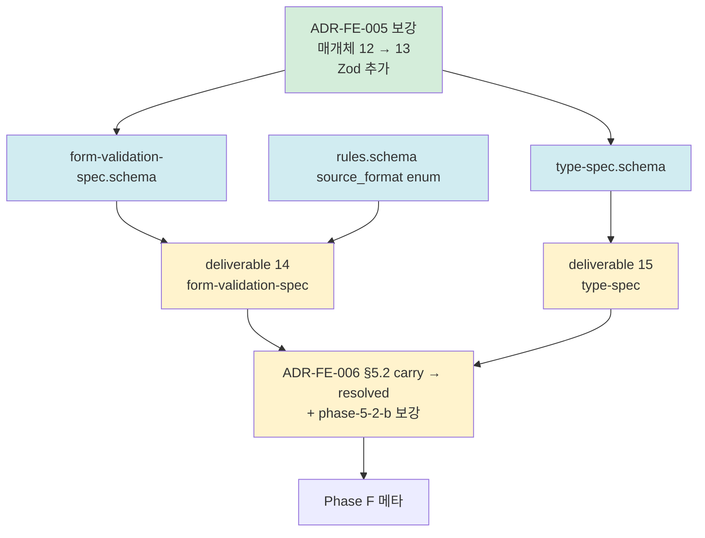

# plan-v14-stage-7-pre

> v1.4.0-dev Stage 7-pre (외부 LLM 검증 빈틈 #1 #2 해소 — release 전 마지막 quality 격상) 실행 계획
> 4원칙 1번 산출
> 일자: 2026-05-01
> Trigger: DEC-Stage-6-종결 §3 (외부 LLM 검증 빈틈 #1 Zod / #2 .d.ts = Stage 7-pre carry)

---

## 0. 정직 표기

- 본 plan = 4원칙 1번. research/코드 0.
- ★ 옵션 X 채택 — Stage 1 research × 3 + 외부 LLM 검증 권고 자료 충분.
- §8.1 정합 = 본체 격상 / PoC 변경 0.
- ★ Stage 7-pre 종결 = v1.4.0 release 직전 quality 격상 종결.

---

## 1. 목적 + 종결 조건

### 1.1 목적

외부 LLM 검증 (DEC-Stage-6 §3.1) 빈틈 #1/#2 해소:
- **#1**: Zod / Yup / React Hook Form rules → BR `fe_validation` 자동 추출 절차
- **#2**: TypeScript `.d.ts` 산출 절차

### 1.2 종결 조건

```
□ deliverable 14 (form-validation-spec) 신설 — Zod / Yup / RHF + (선택) class-validator
□ deliverable 15 (type-spec) 신설 — TypeScript .d.ts 추출 절차
□ schema 신설 — form-validation-spec.schema.json + type-spec.schema.json
□ ADR-FE-005 보강 — 권위 매개체 12 → ★ Zod 13번째 추가 (산업 표준 격상)
□ ADR-FE-006 §5.2 carry → resolved (#1/#2 종결 명시)
□ rules.schema 추가 확장 — source_format enum (zod / yup / react_hook_form / class_validator / manual)
□ phase-5-2-b-state.md 보강 (form_state 진실 추출 시 form-validation-spec cross-link)
□ 메타 (DEC-Stage-7-pre-종결 + STATUS + INDEX + CHANGELOG + memory)
□ commit Phase 단위 (A / B / F)
```

### 1.3 비-목표

- mini-PoC (Stage 4) — 별도 게이트
- 본격 PoC #04 (Stage 5) — Stage 4 검증 후
- v1.4.0 MINOR release 결단 (Stage 7) — Stage 5 검증 후

---

## 2. 의존 그래프



---

## 3. 작업 항목

### 3.1 Phase A — ADR 보강 1건

#### A1. `docs/adr/ADR-FE-005-권위-매개체-12-채택.md` (보강)

- §2.1 매개체 12 → ★ **13** (Zod 추가)
- 추가 매개체: **Zod (Schema-First validation 의 de facto)**
- 채택 근거: 외부 LLM 권고 + L1 Domain 정합 + Stage 1 research 누락 보강
- spec URL: https://zod.dev/

### 3.2 Phase B — schema 3건 (신설 2 + 확장 1)

#### B1. `schemas/form-validation-spec.schema.json` (신설)

```yaml
$id: form-validation-spec.schema.json
title: Form Validation Spec (Zod / Yup / RHF / class-validator → fe_validation BR 자동 추출)

required: [meta, source_libraries, validations, summary]

source_libraries:
  - library: enum [zod, yup, joi, react_hook_form, class_validator, ajv, vest, manual]
  - library_version: string
  - detected: boolean

validations:
  - id: F-VAL-XXX
    field_name: string                  # form field
    validation_type: enum [required, min_length, max_length, pattern, email, url, custom, nullable, optional, refine, transform]
    rule_value: any                     # min=8, regex, etc
    error_message: string
    cross_link_to_br: BR-XXX            # rules.json fe_validation cross-link
    source_file / source_snippet
    source_format: enum [zod, yup, ...]

summary:
  total_validations: integer
  per_library: { zod: count, ... }
  br_auto_extraction_count: integer    # ★ rules.json 자동 등록 개수
```

#### B2. `schemas/type-spec.schema.json` (신설)

```yaml
$id: type-spec.schema.json
title: Type Spec (TypeScript .d.ts 추출 — framework-neutral L1)

required: [meta, types, summary]

types:
  - id: T-XXX
    name: string                        # 타입명
    kind: enum [interface, type, enum, class, union, intersection]
    declaration: string                 # .d.ts 형식 declaration
    properties: array of {name, type, optional, readonly}
    extends: array
    references: array                   # 참조 타입
    domain_entity_id: E-XXX            # domain.json E-XXX cross-link
    source_file: string

summary:
  total_types / per_kind / domain_linked_count
  framework_neutrality_score: number   # ★ 0~1 (React import 없는 타입 비율)
```

#### B3. `schemas/rules.schema.json` (확장)

- `properties.source_format` enum 추가 (선택 필드):
  - `zod` / `yup` / `joi` / `react_hook_form` / `class_validator` / `ajv` / `vest` / `manual`
- form-validation-spec → rules.json fe_validation BR 자동 변환 정합

### 3.3 Phase C — deliverable 신설 2건

#### C1. `methodology-spec/deliverables/14-form-validation-spec.md` (신설)

**구조**:
1. 사상 (ADR-FE-006 빈틈 #1 해소 + Zod 매개체 격상)
2. 형식 (form-validation-spec.json + br-auto-extracted.md)
3. 추출 범위 (Zod / Yup / Joi / RHF / class-validator / Ajv / Vest)
4. ★ rules.json fe_validation BR 자동 등록 절차
5. cross-link (state-map.form_state / ui-spec / rules)
6. 흔한 함정 (Zod refine framework-coupling / RHF rules client-only / class-validator decorator BE+FE 혼합)

#### C2. `methodology-spec/deliverables/15-type-spec.md` (신설)

**구조**:
1. 사상 (ADR-FE-006 빈틈 #2 해소 + framework-neutral L1)
2. 형식 (type-spec.json + types.d.ts 통합 추출)
3. 추출 범위 (TS interface / type / enum / class)
4. ★ framework-neutrality_score 정량 (React import 없는 타입 = 100%)
5. cross-link (domain.json E-XXX / state-map / ui-spec)
6. 흔한 함정 (React.FC props 의존 / @types/react 직접 import / generic over-use)

### 3.4 Phase D — 보강 2건

#### D1. `docs/adr/ADR-FE-006-프레임워크-중립-IR-사상.md` 갱신

- §5.2 (carry-over) — #1 Zod / #2 .d.ts → ★ **resolved (Stage 7-pre 종결)**
- 갱신 일자 추가

#### D2. `methodology-spec/workflow/phase-5-2-b-state.md` 보강

- form_state (5 진실 #4) 추출 시 → ★ form-validation-spec cross-link 의무
- rules.json `category=fe_validation` 자동 등록 절차 명시

### 3.5 Phase F — 메타

| F# | 항목 |
|---|---|
| F1 | `decisions/DEC-2026-05-01-v1.4-Stage-7-pre-종결.md` |
| F2 | `decisions/STATUS.md` |
| F3 | `decisions/INDEX.md` |
| F4 | `CHANGELOG.md` |
| F5 | memory 갱신 |
| F6 | commit |

---

## 4. Sprint 일정

**1 세션 진행** (Stage 6 동급 작은 범위).

병렬 가능: B1/B2/B3 / C1/C2 / D1/D2.

---

## 5. 신뢰도 + 정책

- Stage 7-pre = 본체 격상 / 산출물 0개 → 신뢰도 metric 부적용.
- ★ Stage 7-pre 종결 = v1.4.0 release 진입 quality 보강 종결.
- no-simulation 정책 — form-validation-spec / type-spec 도 captured_by enum 추가 (real / simulation).

---

## 6. 사용자 7 요구사항 진척도

| 요구 | Stage 6 | Stage 7-pre 종결 |
|---|---|---|
| 모두 (1~7) | ★ 100% | ★ 100% 유지 + L1 Domain 산출 강화 |

→ ★ 7/7 = 100% 유지 + 외부 LLM 검증 빈틈 5/5 = 100% 해소 (#1/#2 본 Stage 종결 + #3/#4/#5 Stage 6 종결).

---

## 7. 위험 + 완화

| # | 위험 | 영향 | 완화 |
|---|---|---|---|
| R1 | rules.schema source_format enum 확장이 BE 호환 깸 | 중 | optional 추가만 / 기존 BR 100% 호환 |
| R2 | type-spec 산출이 너무 광범 (모든 TS 타입 포함 시 비대) | 중 | scope 한정 (export 된 type / domain entity 관련 type 만) |
| R3 | form-validation-spec 의 BR 자동 등록 시 중복 | 중 | rules.json 자동 등록 시 ID 충돌 검사 의무 |
| R4 | Zod 13번째 매개체 추가 = ADR-FE-005 cross-check 권고 표 깸 | 저 | §2.1 표 갱신 + 갱신 일자 + 매개체 13 명시 |

---

## 8. 종결 진술

> 본 plan = v1.4.0-dev Stage 7-pre (외부 LLM 검증 빈틈 #1/#2 해소 — release 전 마지막 quality 격상) 4원칙 1번 산출.
> Phase A → B → C → D → F = 1 세션 추정.
> Stage 7-pre 종결 = ★ 외부 LLM 검증 빈틈 5/5 = 100% 해소 + v1.4.0 release 진입 quality 보강 완료.
> 다음 trigger = 사용자 일괄 승인 → Phase A 즉시 진입.

**End of plan-v14-stage-7-pre.**
