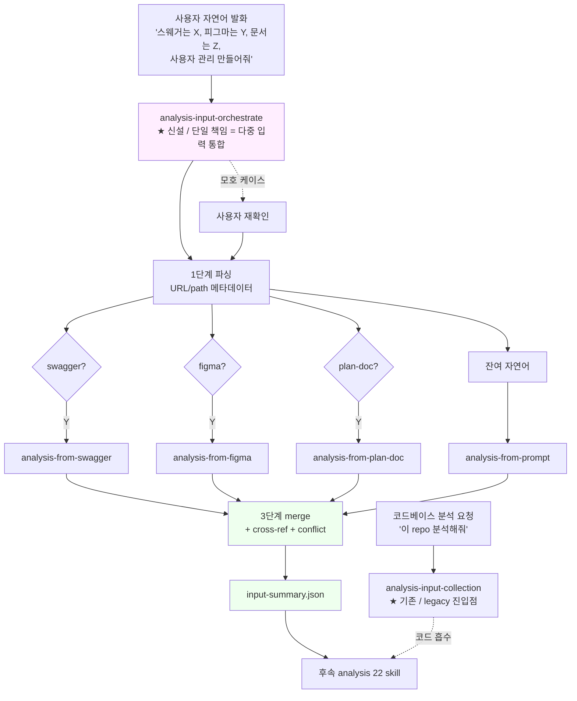

# plan — G2 analysis-from-quad (BCDE 4 skill + analysis-input-orchestrate)

- **작성**: 2026-05-15 / 윤주스 (v1 초안 → v2 orchestrator 채택 → v3 orchestrator 별도 skill 분리)
- **scope**: charter §3 G2 (R8 입력 5종 중 BCDE 미지원) 해소.
  - `analysis-from-{figma,swagger,plan-doc,prompt}` 4 skill 신설
  - `analysis-input-orchestrate` 신설 (자연어 파싱 + BCDE dispatch + merge / cross-ref / conflict)
  - `analysis-input-collection` 은 기존 5 책임 무손 (legacy 코드 진입점 + 메타 시그널)
  - input.md "사용자 수동 원칙" → "수동 + skill 호출 옵션 + orchestrator 자동 dispatch" 3중 갱신
  - charter §2 R8 ⚠️→✅ 격상
- **결정 배경 (3 메타 지적)**:
  - 2026-05-15 #1: charter §2 의 (a)(d)(e) ✅ 가 "형식 명시" 수준 / 자산 차원 ✅ 아님 / Figma+Swagger 만 skill 신설은 비대칭.
  - 2026-05-15 #2: 복합 입력 (figma+swagger+자연어) 시 skill 발동 흐름 미명세 노출.
  - 2026-05-15 #3: orchestrator 를 `analysis-input-collection` 안에 두면 단일 책임 위반 (9 책임 누적) — **별도 skill 로 분리**.
- **paradigm 결단**: **B' = orchestrator 별도 skill** (`analysis-input-orchestrate`).
  - 각 skill 단일 책임 유지 / v2.6.0 의미 ID paradigm 정합
  - `analysis-input-collection` 갱신 폭 ↓ (description trigger 한 줄만 + "다중 입력은 analysis-input-orchestrate 위임" 안내)
- **사상 근거 4종**: 품질 1순위 + chain harness 사상 일관 (입력 게이트) + industry-first cross-validator 자연 확장 + Adzic SBE 함정 회피 강화.
- **전제**: 사내 배포 전 단계 / 윤주스 1인 dogfooding ([[project_pre_deployment_stage]]) / 호환성 걱정 약함.
- **의존 산출물**: `methodology-spec/workflow/input.md` / `methodology-spec/skills-axis.md` / `methodology-spec/plugin-charter.md` / `flows/analysis.phase-flow.json` / `skills/analysis-input-collection/`.

---

## 1. As-Is (현 BCDE 입력 처리 실태 / 2026-05-15)

| R8 입력 | charter §2 | 실 자산 | 공백 |
|---|---|---|---|
| (a) 기존 코드 | ✅ | `analysis-input-collection` + `analysis-source-inventory` + 22 skill 의 1차 입력 | 없음 |
| (b) Figma | ❌ | input.md 표 "디자인 명세 Figma JSON" 만 / 흡수 skill 부재 | **전용 흡수 skill** |
| (c) Swagger | ❌ | `analysis-openapi` = openapi.yaml **생성** skill / 흡수 ❌ | **전용 흡수 skill** |
| (d) 기획 문서 경로 | ✅ (약함) | inputs/planning-docs/ 폴더 가이드만 | **전용 흡수 skill** |
| (e) 자연어 prompt | ✅ (약함) | `planning-identify-business-intent` 안 interleaved | **전용 흡수 skill** |
| **(복합 입력 흐름)** | 부재 | 사용자가 BCDE 섞어 주면 skill 각자 호출 의무 / merge / cross-ref / conflict 모두 후속 단계 떠넘김 | **orchestrator skill** |

---

## 2. To-Be (G2 종결 후)



**진입점 둘 (책임 분리)**:
- **legacy 코드 진입** → `analysis-input-collection` (기존 5 책임 무손)
- **다중 입력 (BCDE) 진입** → `analysis-input-orchestrate` (신규 4 책임 / 단일 skill)

두 skill 은 **상호 호출 가능** — `analysis-input-orchestrate` 가 코드 분석도 필요하면 `analysis-input-collection` 위임 / 반대도 가능.

---

## 3. skill 명세

### 3-O. analysis-input-orchestrate (★ 신설 / 단일 책임 = 다중 입력 통합)

| 항목 | 내용 |
|---|---|
| description trigger | "Use when user provides multi-source analysis input via natural language (with optional swagger URL / figma URL / plan-doc path). Parses input, auto-dispatches BCDE sub-skills, merges into input-summary.json with cross-references and conflicts." |
| 단일 책임 | 자연어 파싱 + BCDE dispatch + merge / cross-ref / conflict + 모호 케이스 재확인 |
| 1단계 (파싱) | URL/path 패턴 + 한국어/영어 키워드 매칭 (휴리스틱 §3-O-1) |
| 2단계 (dispatch) | 감지된 입력별로 BCDE skill 자동 호출 (병렬 또는 순차) |
| 3단계 (merge) | 4 extract.json 통합 → `input-summary.json` (cross-ref + conflict 3-tier) |
| 산출 | `.aimd/<scope>/planning/input-summary.json` + `input-summary.md` (이중 렌더링 / ADR-008 v2 정합) |
| allowed-tools | Read, Glob, Grep, Bash, Task (sub-skill 호출용) |
| 모호 케이스 | URL 키워드 부재 / 다중 swagger / 의도만 있고 입력 부재 → **재확인 prompt** |
| 단일 책임 유지 | 메타 시그널 수집 (트랙 분기 / baseline) 은 `analysis-input-collection` 위임 |

#### 3-O-1. 자연어 파싱 휴리스틱

| 신호 | 패턴 | 분기 |
|---|---|---|
| swagger | `openapi.yaml` / `swagger.json` / `swagger` / `openapi` 키워드 + URL/path | → 3-C |
| figma | `figma.com` 도메인 / `피그마` / `figma` 키워드 + URL | → 3-B |
| plan-doc | `.md` / `.pdf` 확장자 / `기획` / `문서` / `spec` 키워드 + path | → 3-D |
| residual | 위 3종 캡처 후 남은 자연어 전체 | → 3-E (prompt) |
| 인라인 마커 (정식 채택 / §7 #6 결단) | `@swagger: <URL>` / `@figma: <URL>` / `@plan-doc: <path>` | 휴리스틱 override (우선순위 ↑) |

#### 3-O-2. cross-ref / conflict 3-tier severity + 정량 기준

| severity | 의미 | 정량 기준 | 처리 |
|---|---|---|---|
| low | 표기 차이 (snake_case vs camelCase) | Levenshtein 거리 ≤ 2 + 대소문자/underscore 정규화 후 ≥ 90% 일치 | log only / 후속 skill 정규화 |
| medium | 명명 충돌 (figma.email vs swagger.userEmail) | 정규화 후 50~90% 일치 + 같은 도메인 entity 추정 | conflict 등재 / 후속 skill 결단 |
| high | 의미 충돌 (figma 화면 != swagger endpoint 도메인) | 정규화 후 < 50% 일치 또는 entity 도메인 불일치 (LLM 양심 ❌ / 정규화 score + 단어 stem set intersection) | **사용자 결단 의무** / state.blocked |

**LLM 양심 의존 회피** (no-simulation 정합): score = `(1 - normalized_levenshtein) + (intersection_stems / union_stems)` 같은 산식 명시 / orchestrate 가 산식 결과 + 입력 양쪽 인용을 같이 등재. LLM 이 "내가 보기에 비슷함" 같은 정성 판정 ❌.

#### 3-O-2b. BCDE sub-skill 호출 방식 = Hybrid (2-B 기본 + 2-A escalate)

(Senior critique 2026-05-15 / `feedback_chain_driver_deterministic_axis` 정합)

| 조건 | 호출 방식 | 근거 |
|---|---|---|
| 총 입력 (figma + swagger + plan-doc + prompt 추정 크기 합) ≤ 50K token | **2-B 직접 skill chain** | token 비용 최소 / 한 turn 안 trace / 사용자 BCDE 직접 호출 흐름과 일관 |
| 총 입력 > 50K token 또는 단일 sub-skill 실패가 다른 3개 오염 risk 큰 케이스 | **2-A Task tool sub-agent** | main context window 보호 / 격리 / 실패 분리 |
| ❌ **2-C chain-driver CLI dispatch** = STRONG-STOP | (절대 ❌) | chain-driver = 결정론적 gate/sync/scope axis / LLM 판단 inject 시 axis 오염 |

#### 3-O-2c. BCDE sub-skill 입출력 schema contract (drift-validator 추적용)

각 BCDE skill 산출 = `schemas/{figma,swagger,plan-doc,prompt}-extract.schema.json` (신설 4종 / strict additionalProperties:false) — orchestrate merge 시 schema validate 의무. drift-validator 가 본 schema 정합 검증.

#### 3-O-3. input-summary.json 골조

```json
{
  "scope": "<scope-slug>",
  "raw_prompt": "사용자 원문 보존",
  "parsed": {
    "swagger_url": "...",
    "figma_url": "...",
    "plan_doc_path": "...",
    "residual_intent": "..."
  },
  "inputs": {
    "swagger": { "extract_ref": "swagger-extract.json", "endpoints_count": N },
    "figma":   { "extract_ref": "figma-extract.json",   "screens_count": N },
    "plan_doc":{ "extract_ref": "plan-doc-extract.json","sections_count": N },
    "prompt":  { "extract_ref": "prompt-extract.json",  "intent_summary": "..." }
  },
  "cross_refs": [
    { "uc_candidate": "UC-USER-LIST", "from": ["figma:UserList", "swagger:GET /users", "plan-doc:§3", "prompt:'사용자 관리'"] }
  ],
  "conflicts": [
    { "id": "CONFLICT-001", "severity": "medium", "between": ["figma:email", "swagger:userEmail"], "description": "..." }
  ],
  "user_decisions_pending": []
}
```

### 3-IC. analysis-input-collection (기존 / 갱신 폭 최소)

| 항목 | 내용 |
|---|---|
| description trigger 갱신 | "Use when starting analysis of a legacy codebase. Entry point for SDLC analysis stage. Establishes input scope, target modules, language/framework signals. **For multi-source input (Figma/Swagger/plan-doc/prompt), use analysis-input-orchestrate.**" (마지막 문장 추가만) |
| 책임 | **변경 없음** — 분석 target / 언어 시그널 / 트랙 분기 / 가치 명시 / 메타 기록 (5 책임 그대로) |
| 단일 책임 유지 | 자연어 파싱 / dispatch / merge ❌ — 모두 `analysis-input-orchestrate` 위임 |

### 3-B. analysis-from-figma

| 항목 | 내용 |
|---|---|
| description | "Use when user provides Figma reference as analysis input. Requires Figma desktop app with target frame selected (file URL alone insufficient). Extracts screens, components, design tokens via MCP figma-desktop. Track = FE. Auto-dispatched by analysis-input-orchestrate." |
| 입력 | Figma desktop selection (frame 선택 상태) + 선택적 URL 메타 |
| **사전조건** (★ research 결과) | Figma desktop 앱 실행 + 분석 대상 frame 선택 상태. selection 없으면 도구 실패 → state.blocked + 사용자 안내 |
| 의존 | `mcp__figma-desktop__get_design_context` + `get_metadata` + `get_variable_defs` + `get_screenshot` |
| 호출 순서 (공식 workflow) | `get_design_context` 먼저 → response 크면 `get_metadata` 로 node map → `get_screenshot` 으로 visual ref |
| **scope-out** (★ research) | interaction (prototype) / animation / autolayout 세부 constraint / multi-frame variant 자동 traversal / plugin data — Figma MCP 표면에 없음 |
| 산출 | `.aimd/<scope>/planning/figma-extract.json` (schema = `schemas/figma-extract.schema.json` 신설) → FE skill seed |
| allowed-tools | Read, Bash, mcp__figma-desktop__* |
| 트랙 | FE 강제 |

### 3-C. analysis-from-swagger

| 항목 | 내용 |
|---|---|
| description | "Use when user provides openapi.yaml / swagger.json as analysis input. Parses spec via @readme/openapi-parser, extracts endpoints, schemas, seeds domain.json / rules.json. Track = BE. Auto-dispatched by analysis-input-orchestrate." |
| 입력 | `openapi.yaml` / `swagger.json` 파일 경로 또는 URL |
| 의존 (★ research) | **`@readme/openapi-parser`** (OpenAPI 3.1 + 3.0 + Swagger 2.0 / `$ref` resolve) + `schemas/openapi-extension.schema.json` + `schemas/swagger-extract.schema.json` (신설) |
| 산출 | `.aimd/<scope>/planning/swagger-extract.json` → 정규화 `openapi.yaml` + `domain.json` seed + `rules.json` seed |
| 검증 정책 (★ research / no-simulation 정합) | spectral 검증은 **본 skill scope 외** / orchestrate 또는 사용자가 명시 호출 (`npx spectral lint`) — auto-invoke ❌ ([[feedback_no_static_tool_simulation]] / Senior critique anti-pattern) |
| allowed-tools | Read, Glob, Grep, Bash |
| 트랙 | BE / 산출이 `analysis-openapi` 의 입력 보강으로도 작동 |

### 3-D. analysis-from-plan-doc

| 항목 | 내용 |
|---|---|
| description | "Use when user points to planning documents (Markdown / PDF / Notion export) as analysis input. Extracts business intent, use case candidates, glossary. Track = both. Auto-dispatched by analysis-input-orchestrate." |
| 입력 | `.md`, `.pdf`, Notion export `.zip` 또는 디렉토리 |
| 의존 (★ research) | Read 도구 (PDF 20 page cap) + markdown parser (`remark` / `unified` 후보) + zip 풀기 (`adm-zip`) + csv (`csv-parse`) + `schemas/plan-doc-extract.schema.json` (신설) |
| Notion export 1차 지원 (★ research) | md (본문) + csv (database) 동시 / assets/ 이미지는 path 참조만 (binary 흡수 ❌) / subpage filename UUID hash strip 의무 |
| 산출 | `.aimd/<scope>/planning/plan-doc-extract.json` (intent + UC 후보 + 용어집) |
| allowed-tools | Read, Glob, Grep, Bash (zip 풀기 한정) |
| 트랙 | BE + FE 공통 |

### 3-E. analysis-from-prompt

| 항목 | 내용 |
|---|---|
| description | "Use when user provides natural-language prompt as analysis input (residual after orchestrator parsing). Extracts intent, scope, constraints. Track = both. Auto-dispatched by analysis-input-orchestrate." |
| 입력 | 자연어 잔여 의도 (`analysis-input-orchestrate` §3-O-1 휴리스틱 적용 후 남은 텍스트) |
| 의존 | 없음 (Claude 의미 추출만) |
| 산출 | `.aimd/<scope>/planning/prompt-extract.json` (intent / scope / constraints / 가정) |
| allowed-tools | Read |
| 트랙 | BE + FE 공통 / 가장 가벼움 |

---

## 4. 부수 갱신

| 자산 | 갱신 영역 |
|---|---|
| `skills/analysis-input-orchestrate/SKILL.md` | **신설** — §3-O 명세 본격 구현 + 휴리스틱 표 + 3-tier severity + dispatch 로직 |
| `skills/analysis-input-collection/SKILL.md` | description trigger 마지막 한 줄만 추가 ("For multi-source input, use analysis-input-orchestrate.") |
| `skills/analysis-from-figma/SKILL.md` | 신설 |
| `skills/analysis-from-swagger/SKILL.md` | 신설 |
| `skills/analysis-from-plan-doc/SKILL.md` | 신설 |
| `skills/analysis-from-prompt/SKILL.md` | 신설 |
| `methodology-spec/workflow/input.md` | "사용자 수동 원칙" → "수동 + skill 호출 옵션 + orchestrator 자동 dispatch" 3중 / `analysis-input-orchestrate` + BCDE 4 skill 등재 |
| `methodology-spec/plugin-charter.md` §2 R8 | ⚠️ → ✅ + 자산 표 갱신 (BCDE 각각 흡수 skill + orchestrator 자동 분기) |
| `methodology-spec/plugin-charter.md` §3 G2 | 종결 표기 (`~~G2~~` + DEC 링크) / 잔여 우선순위 G4 > G5 > G1 |
| `methodology-spec/skills-axis.md` | analysis stage skill 22 → 27 (+5) / 표 항목 추가 |
| `flows/analysis.phase-flow.json` | phase 0 (input) skill mapping — `analysis-input-collection` + `analysis-input-orchestrate` 진입점 분리 / BCDE 4종 sub-skill |
| `schemas/input-summary.schema.json` | 신설 (cross_refs / conflicts / severity 3-tier 정의) |
| `decisions/DEC-2026-05-15-g2-orchestrate-skill-분리-채택.md` | G2 종결 + B' paradigm 결단 (orchestrator 별도 skill 분리 근거 명문화) |
| `decisions/STATUS.md` | session N차 entry / G2 종결 명시 |
| `CHANGELOG.md` | v3.3.0 MINOR entry (skill 5 신설 + R8 자산 대칭 + 입력 cross-validator paradigm 확장) |
| `package.json` (plugin manifest) | version bump 3.2.x → 3.3.0 |

---

## 5. 시행 순서 (4원칙 cycle)

### 5.1 신설 우선순위 (orchestrator 골조 1순위)

| 순위 | 자산 | 근거 |
|------|------|------|
| 1 | **analysis-input-orchestrate 골조** | 별도 skill 신설 / 1단계 파싱 휴리스틱 + 빈 dispatch + 빈 merge 골조 + `input-summary.schema.json` 신설 / `analysis-input-collection` 은 description trigger 한 줄만 갱신 |
| 2 | **analysis-from-prompt** | 의존 0 / 가장 가벼움 / orchestrator 의 잔여 자연어 처리 1차 검증 |
| 3 | **analysis-from-swagger** | 외부 MCP 불요 / yaml parser 표준 / 산출이 `analysis-openapi` 와 정합 회귀 가능 |
| 4 | **analysis-from-plan-doc** | Read 도구로 PDF/MD 흡수 / Notion export 케이스 carry |
| 5 | **analysis-from-figma** | MCP figma-desktop 의존 / 외부 도구 실제 호출 검증 의무 / FE 트랙 한정 |
| 6 | **orchestrate merge / cross-ref / conflict 본격** | 4 skill 산출 통합 + 3-tier severity + state.blocked 흐름 |

### 5.2 4원칙 cycle

- [x] **1원칙** 깊은 숙지 + plan 작성 (본 문서 v3)
- [ ] **2원칙** research — 가벼운 sub-agent 1회 ([[feedback_lightweight_sub_agent]]):
  - 공식: OpenAPI parser library / Figma MCP capability matrix / Notion export format
  - 사내: 기존 `analysis-openapi` spectral-runner 통합 패턴 재사용
  - Senior: orchestrator 와 BCDE skill 경계 명세 평가 (Task tool dispatch 패턴 vs sub-agent 호출 vs chain-driver 위임)
- [ ] **3원칙** 사용자 승인 (§7 결단 묶음)
- [ ] **4원칙** §5.1 순차 신설 / 각 step RED → GREEN cycle (chain harness 정합)

### 5.3 test 의무

- 각 skill fixture 1건 + 산출 json schema validation
- orchestrate 통합 test = 복합 입력 시나리오 (Figma+Swagger+plan-doc+prompt 한 발화) 1건 minimum
- 외부 도구 (MCP figma / PDF parse) = 진짜 실행 의무 ([[feedback_no_static_tool_simulation]])
- 환경 부재 시 (figma MCP 미연결) `state.blocked` + 사용자 안내

---

## 6. blocker / 미해명 사항

| # | blocker | 영향 | 해소 경로 |
|---|---|---|---|
| B1 | Figma MCP capability — `get_design_context` 가 디자인토큰까지 추출 가능한지 미확인 | 3-B 산출 schema 확정 불가 | dry-run 1건 (Figma 파일 1건) 또는 MCP doc fetch |
| B2 | PDF 파싱 한계 — Read 도구 20 page cap | 3-D 산출 완전성 | plan-doc 크기 임계 + 분할 컨벤션 |
| B3 | Notion export 포맷 — zip vs 폴더 / md+csv+image 혼재 | 3-D 입력 정규화 | 1차 = MD 만 + Notion export 디렉토리 (이미지·csv carry) |
| B4 | prompt 길이 한계 — context 압박 | 3-E 산출 안정성 | `--prompt-file <path>` + inline 200 line cap |
| B5 | orchestrate merge 의 conflict 정의 — 단순 표기 차이 vs 의미 충돌 경계 | 3-O-2 severity 3-tier 정합 | 본 plan §3-O-2 채택 / 사례 누적 후 갱신 |
| B6 | 자연어 파싱 휴리스틱 모호 케이스 — URL 키워드 부재 / 다중 swagger | 자동 dispatch 오분류 | orchestrate 재확인 prompt + 인라인 마커 옵션 (§7 #6) |
| B7 | URL 도메인 사내 폐쇄망 fetch 불가 | swagger/figma URL 흡수 차단 | 로컬 파일 경로 입력 fallback + state.blocked 안내 |
| ~~B8~~ | ~~orchestrator 단일 책임 위반~~ | **해소** (v3 갱신 / B' = 별도 skill 분리) | `analysis-input-orchestrate` 신설 = 단일 책임 보존 |
| ~~B9~~ | ~~orchestrate 의 BCDE skill 호출 방식~~ | **해소** (2원칙 Senior critique 결과 / Hybrid 2-B + 2-A escalate) | §3-O-2b 정량 rule 명문화 (50K token 임계) / 2-C STRONG-STOP |

---

## 7. 사용자 결단 (2026-05-15 본 session)

1. **orchestrator paradigm** = B' 채택 ✅
2. **신설 우선순위 §5.1** = OK ✅
3. **2원칙 research** = 가벼운 sub-agent 진행 ✅ (skip ❌)
4. **version 라벨** = v3.3.0 MINOR bump ✅
5. **plan-itsm-jira-chain-integration.md** = **삭제 시행** ✅ (G1 후순위 격하 → 본 plan G2 와 무관 / `rm` 실행 완료)
6. **인라인 마커** = 도입 ✅ (`@swagger:`, `@figma:`, `@plan-doc:` / 휴리스틱 + 마커 양립 / §3-O-1 격상)
7. **orchestrate 의 sub-skill 호출 방식** = **Hybrid 2-B + 2-A escalate** ✅ (2원칙 Senior critique 결과 / §3-O-2b 정량 rule / 2-C STRONG-STOP 회피)
8. **(research 후속)** swagger parser = `@readme/openapi-parser` / Figma = desktop selection 사전조건 / Notion = adm-zip + remark + csv-parse / spectral 검증 = 명시 호출 (auto-invoke ❌)

---

## 8. Lessons Learned (paradigm 진화 기록)

본 plan 자체 LL 후보 (작성 + 메타 검토 과정):
- **LL-G2-01**: charter §2 ✅ 판정의 "형식 명시" vs "자산 차원" 구분 누락 risk — 사용자 메타 지적 #1 로 노출. charter §2 ✅ 부여 시 자산 차원 검증 의무 추가 결단 후보.
- **LL-G2-02**: 복합 입력 흐름이 단일 skill 분리 plan 의 사각지대 — orchestrator paradigm 으로 정합. mermaid "선택" 점선이 흐름 명세 누락 신호. (메타 지적 #2)
- **LL-G2-03**: orchestrator 를 기존 skill 안 확장은 단일 책임 위반 risk → 별도 skill 분리 (B') 가 v2.6.0 의미 ID paradigm 정합. 메타 지적 #3 로 노출 / paradigm 결단 시 책임 합산 의무 (현 N 책임 + 추가 M 책임 = 결과 N+M 이 단일 의미 유지하는지).
- **LL-G2-04**: chain-driver 결정론 axis 오염 회피 (Senior STRONG-STOP) — sub-skill dispatch 같은 LLM 판단을 CLI 도구에 넣으면 결정론 자산 훼손. Hybrid paradigm (2-B 기본 + 2-A escalate / 정량 임계 명문화) 가 token + 격리 + axis 분리 3 요건 동시 만족.
- **LL-G2-05**: LLM 양심 의존 정성 판정 회피 — conflict severity 정량 산식 (Levenshtein + stem set intersection) 명시 의무. "내가 보기에 비슷함" 같은 정성 판정 = no-simulation 정책 인접 위반 (Senior REVISE).
- **LL-G2-06**: auto-invoke 정책 정합 — `analysis-from-swagger` spectral 검증 자동 호출 ❌ / 사용자/orchestrate 명시 호출. 사내 spectral-runner README 의 "호출자: auto" 도 carry 표기로 정정 의무 (사내 자산 anti-pattern 검출).

(skill 신설 후 본격 LL 채움 / 현 시점 paradigm LL 만 사전 등재)

---

## 9. 참고

- [[project_methodology_scope]] — chain harness paradigm + v2.6.0 의미 ID
- [[project_industry_first_cross_validator]] — orchestrate merge 의 cross-ref + conflict 검출 = paradigm 입력 단계 자연 확장
- [[feedback_adzic_sbe_10yr_pitfall]] — 분리 산출물 drift 누적 함정 = orchestrate 가 입력 단계 차단
- [[feedback_no_static_tool_simulation]] — Figma MCP / pdf parse 진짜 실행 의무
- [[feedback_quality_priority]] — 품질 1순위 / orchestrate 가 재작업 최소화 정합
- [[feedback_sub_axis_evolution_paradigm]] — 5종 입력 axis 의 sub-axis 진화 (BCDE + orchestrate)
- [[feedback_lightweight_sub_agent]] — 2원칙 research 시 가벼운 sub-agent 패턴
- `methodology-spec/plugin-charter.md` §1 R8 + §2 + §3 G2
- `methodology-spec/workflow/input.md` (갱신 대상)
- `methodology-spec/skills-axis.md` (갱신 대상)
- `decisions/DEC-2026-05-15-plugin-charter-17-requirements-채택.md`
- `decisions/DEC-2026-05-15-g3-scope-folder-종결.md` (G3 종결 패턴 참고)
