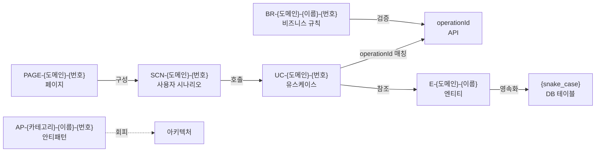

# ID 표준 (산출물 간 추적성)

> 7대 산출물 ID 명명 규칙. ID 를 통해 산출물 간 교차 참조 가능.

---

## ID 체계



---

## ID 형식 표

| 산출물 | ID 형식 | 예시 |
|---|---|---|
| 엔티티 | `E-{도메인}-{이름}` | `E-ORDER-Order`, `E-USER-User` |
| 유스케이스 | `UC-{도메인}-{번호}` | `UC-ORDER-001`, `UC-USER-003` |
| 비즈니스 규칙 | `BR-{도메인}-{이름}-{번호}` | `BR-ORDER-CANCEL-001` |
| 안티패턴 | `AP-{카테고리}-{이름}-{번호}` | `AP-DB-N-PLUS-ONE-001` |
| 페이지 | `PAGE-{도메인}-{번호}` | `PAGE-ORDER-001` |
| 사용자 시나리오 | `SCN-{도메인}-{번호}` | `SCN-ORDER-001` |
| Bounded Context | `BC-{도메인}` | `BC-ORDER`, `BC-USER` |
| 정합성 불일치 | `DRIFT-{번호}` | `DRIFT-001` |
| PoC Finding | `F-{번호}` | `F-003` |
| API operationId | `{camelCase 동사+명사}` | `createOrder`, `getUsers` |
| DB 테이블 | `{snake_case}` | `orders`, `order_items` |

---

## 규칙

1. **도메인**: 대문자 (ORDER, USER, PRODUCT 등)
2. **번호**: 3자리 (001, 002, ...)
3. **카테고리** (안티패턴): DB, ARCH, DOMAIN, API, FE, VALIDATION, CONFIG
4. **이름**: 대문자 + 하이픈 (CANCEL, N-PLUS-ONE 등)
5. **고유성**: 같은 유형 내에서 ID 중복 금지

---

## 교차 참조 예시

```yaml
# 비즈니스 규칙에서 다른 산출물 참조
- id: BR-ORDER-CANCEL-001
  related_use_cases: [UC-ORDER-002]
  related_entities: [E-ORDER-Order]
  related_apis: [cancelOrder]

# API 에서 비즈니스 규칙 참조
paths:
  /orders/{id}/cancel:
    post:
      operationId: cancelOrder
      x-related-rules: [BR-ORDER-CANCEL-001]
      x-related-use-cases: [UC-ORDER-002]
```
