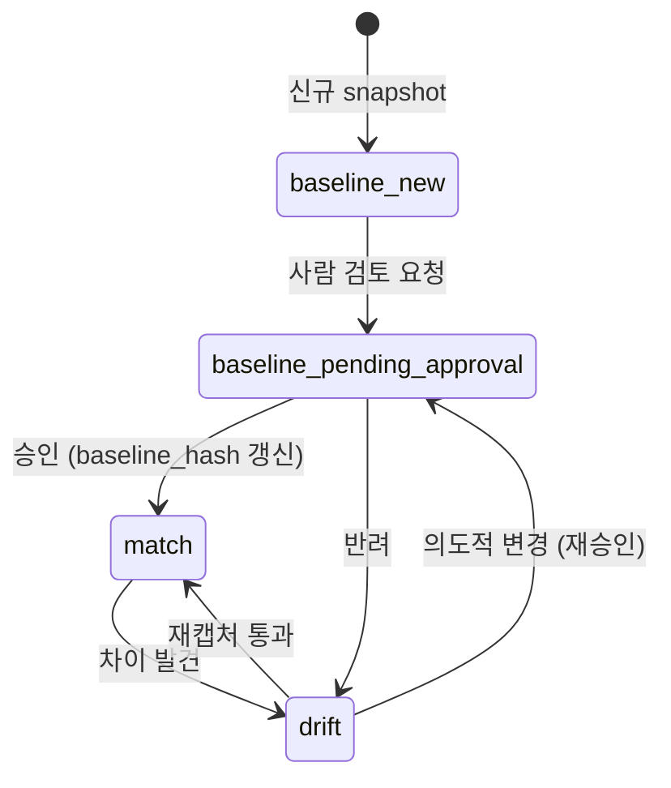

# Phase 5-2-c: visual (시각 산출 명세 추출)

> **명령어**: `/analyze-visual` · **deliverable**: #9 visual-manifest (`visual-manifest.schema.json`)
> **짝**: `phase-5-2-a-ui-base.md` (UI 기본) / `phase-5-2-b-state.md` (분산 상태)
> **사상**: binary 진실 모델 (ADR-FE-002 §2.3 — JSON / mermaid 모두 진실 아님, snapshot PNG 가 진실) + Playwright + axe-core 진짜 실행 (ADR-FE-005)

---

## 1. 목적

FE 코드의 **시각 산출** (snapshot PNG + a11y 검증 결과) 추출.

⚠️ 본 Phase 는 **binary 진실 모델**:
- 다른 6 산출물 = JSON 진실 + drift-validator 적용 ✅
- 본 phase = **snapshot PNG (binary) 진실 + drift-validator ❌ / Playwright snapshot diff ✅**

---

## 2. 입력

| 입력 | 비고 |
|---|---|
| FE 빌드 (production-like) | dev server 또는 static build |
| Phase 5-2-a 결과 | ui-spec.json (PAGE-XXX cross-link) |
| Phase 5-2-b 결과 | state-map.json (FSM-XXX cross-link / state setup) |
| 디자인 baseline (있을 시) | git-lfs 또는 별도 baseline branch |
| Playwright config | viewport matrix |
| axe-core config | WCAG level (2.1-AA / 2.2-AA) |

---

## 3. 처리 흐름

| 단계 | 작업 | 도구 |
|---|---|---|
| S1 | snapshot 캡처 (viewport matrix × pages) | Playwright `toHaveScreenshot()` |
| S2 | a11y 검증 | axe-core `axe.run()` per page |
| S3 | SHA-256 hash 계산 | (계산 — 결정적) |
| S4 | baseline 비교 (있을 시) | pixel diff + threshold |
| S5 | visual-manifest.json 통합 | — |
| S6 | drift-validator ❌ (semantic 비교 불가) / 사람 검토 (baseline 승인) | — |

### 3.1 viewport matrix 정의 (의무)

```yaml
viewport_matrix:
  - {label: desktop,         width: 1440, height: 900,  dpr: 1.0}
  - {label: tablet,          width: 768,  height: 1024, dpr: 2.0}
  - {label: mobile-portrait, width: 375,  height: 667,  dpr: 2.0}
  - {label: mobile-landscape, width: 667, height: 375,  dpr: 2.0}
```

### 3.2 no-simulation 정책 강제 (★★★)

본 Phase 는 **진짜 도구 실행 의무**:

```yaml
captured_by enum:
  ✅ playwright_real    # 권장
  ✅ percy_real
  ✅ chromatic_real
  ✅ puppeteer_real
  ✅ cypress_real
  ❌ simulation         # ★ -5%p 패널티 + simulation_reason 의무

5종_물증_의무 (real 도구 시):
  - captured_by_version    # 도구 버전
  - stdout_path            # stdout 로그 경로
  - duration_ms            # 캡처 소요 ms
  - reproduction_command   # 재현 명령
  - result_hash            # 결과 종합 hash
```

→ schema 의 `if/then` 강제 (visual-manifest.schema.json `allOf`).

### 3.3 a11y 검증 (axe-core 진짜 실행)

```javascript
// 권장 절차 (Playwright + axe-core 통합)
const { AxeBuilder } = require('@axe-core/playwright');

await page.goto(pageUrl);
const results = await new AxeBuilder({ page })
    .withTags(['wcag21aa', 'wcag22aa'])  // ADR-FE-005 §2.2.2 ratchet path
    .analyze();
```

→ `a11y_violations[]` inline 저장. `wcag_level` enum (`2.1-AA` / `2.2-AA`) 명시.

### 3.4 baseline 관리



---

## 4. 출력

```
.ai-analysis/output/visual/
├── visual-manifest.json
├── snapshots/
│   ├── desktop/
│   │   ├── PAGE-HOME-001.png         # ★ binary 진실
│   │   └── ...
│   ├── tablet/
│   ├── mobile-portrait/
│   └── mobile-landscape/
├── baselines/                  # 사람 승인 baseline (git-lfs 또는 별도 branch)
└── _manifest.yml               # trust_level + 5종 물증
```

---

## 5. 승인 게이트

```
□ visual-manifest.json schema 검증 통과
□ viewport_matrix 정의 (≥ 1 항목)
□ 모든 snapshot 에 ID, page_id, viewport_label, snapshot_path, snapshot_hash 명시
□ snapshot_path 파일 실제 존재
□ snapshot_hash = SHA-256 64 hex chars
□ ★ captured_by ∈ [playwright_real, percy_real, chromatic_real, puppeteer_real, cypress_real]
□ ★ captured_by=simulation 시 simulation_reason 의무 + -5%p 패널티 표기
□ ★ real 도구 시 5종 물증 의무 (version / stdout / duration / reproduction / result_hash)
□ baseline_hash 비교 결과 diff_status 명시
□ a11y_violations inline (있으면) — wcag_level 명시
□ cross_links 의무 (ui-spec 또는 state-map 중 1개 이상)
□ baseline_management.update_authority 명시
```

---

## 6. 신뢰도 (ADR-009 §2.4.2 binary trust path)

| 단계 | 조건 | 신뢰도 |
|---|---|---|
| 1-2-3 | mermaid 검증 ❌ | ❌ N/A |
| 5 | Playwright/Percy/Chromatic 진짜 실행 | 85-92% |
| 6 | snapshot baseline + diff 0건 도달 | 90-95% |
| 7 | 사람 디자이너 리뷰 통과 | 95%+ |

simulation 시 -5%p 패널티.

---

## 7. 흔한 함정

deliverable 9 §10 정합:
- flaky test (애니메이션 / 폰트 race)
- dynamic content (timestamp / random)
- font drift (폰트 로딩 안 됨)
- viewport 변경 누락
- simulation 누락

→ 각 함정 = AP-FE-VISUAL-XXX 안티패턴 등록 (Phase 6).

---

## 8. 다음

- Phase 6 (`/analyze-quality`) AP-FE-VISUAL-* 안티패턴 등록
- (Stage 4+) mini-PoC = 진짜 도구 실행 검증 / 단계 5 도달
