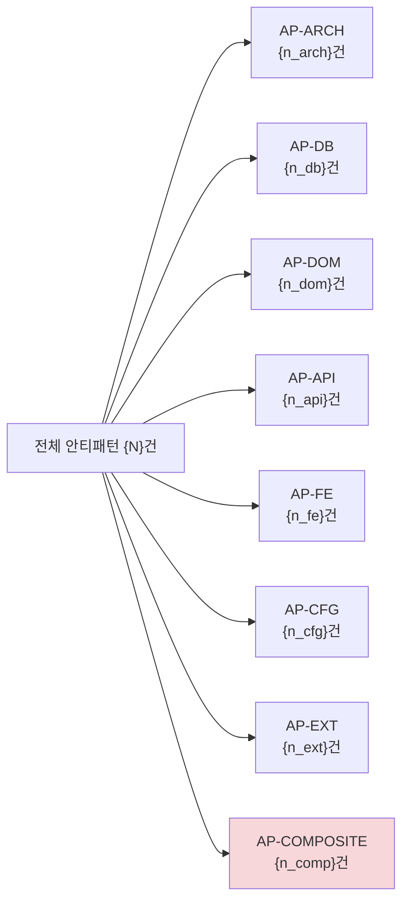
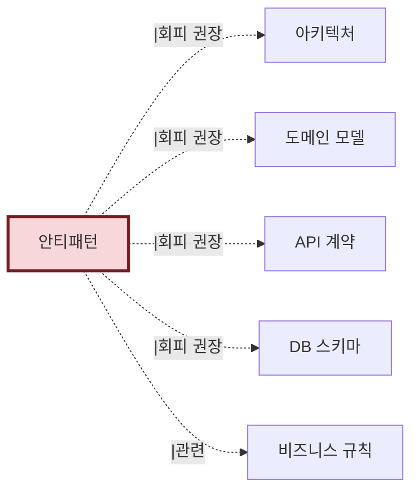

# 재구현 시 회피 후보 체크리스트 — {시스템명}

> 본 문서는 `antipatterns.json`의 사람용 체크리스트다.
> **톤 정책**: 비난이 아닌 **결정 입력** (ADR-002, plan §12 R4)
> 자동 생성: AI-Native 분석 도구 v1.1
> 신뢰도: {meta.confidence}

---

## 메타 정보

| 항목        | 값                                         |
| ----------- | ------------------------------------------ |
| 생성일시    | {meta.generated_at}                        |
| 사용된 입력 | Phase 1~5 모든 결과                        |
| 평균 신뢰도 | {meta.confidence}                          |
| 총 항목 수  | {antipatterns.length}                      |
| 카테고리    | 8개 (ARCH/DB/DOM/API/FE/CFG/EXT/COMPOSITE) |

### severity 분포

| severity | 건수         | 의미                                                     |
| -------- | ------------ | -------------------------------------------------------- |
| critical | {n_critical} | 즉시 수정 의무 (production blocker / OWASP A01-A10)      |
| high     | {n_high}     | 재구현 시 우선 처리 (보안/데이터 손실 위험)              |
| medium   | {n_medium}   | 재구현 시 함께 정상화 권장                               |
| low      | {n_low}      | 시간 여유 시 정상화                                      |
| positive | {n_positive} | 모범 사례 등재 ( v1.2.3 신설 — cross-PoC 학습 효과 입증) |

---

## High (재구현 시 우선 처리)

### AP-DB-DRIFT-001: ERD/코드와 운영 DB 컬럼 불일치

```yaml
id: AP-DB-DRIFT-001
category: db
severity: high
detection_method: cross_source_comparison
confidence: 1.0

description: |
  Phase 2 정합성 검증에서 발견된 drift. 
  운영 DB의 orders.admin_memo 컬럼이 ERD/ORM에 없음.

evidence:
  - drift_finding: DRIFT-001
  - file: db-meta/information_schema.sql
    table: orders
    column: admin_memo
  - missing_in: [erd, orm]

why_avoid:
  - '재구현 시 컬럼 누락 → 데이터 손실'
  - '의도가 불명 (수동 추가? 임시?) → 정책 추적 불가'
  - '운영자 메모인지, 시스템 메모인지 모호'

recommended_alternative: |
  결정 필요 (도메인 전문가 + DBA):
  1순위: 운영 DB 컬럼을 ERD/ORM에 정식 추가 (사용 의도 명확화)
  2순위: 사용 흔적 없으면 운영 DB에서 제거
  3순위: order_admin_memos 별도 테이블로 분리 (Aggregate 외부)

related:
  business_rules: []
  use_cases: []
  affected_modules: [MOD-ORDER]
```

- [ ] 결정 완료
- [ ] 재구현 시 처리 계획 수립

---

### AP-FE-VALIDATION-MISSING-BE: FE에만 validation 존재

```yaml
id: AP-FE-VALIDATION-MISSING-BE
category: fe
severity: high
detection_method: fe_be_consistency_check
confidence: 0.95

description: |
  Phase 4 5.B에서 추출한 FE validation이 BE에 동일하지 않음.
  → 보안 우회 가능 (직접 API 호출 시 검증 부재)

evidence:
  - rule: BR-USER-AGE
    fe_check: src/web/UserForm.tsx#23 (age >= 19)
    be_check: 없음
  - rule: BR-USER-EMAIL-DISPOSABLE
    fe_check: src/web/UserForm.tsx#34 (notDisposable)
    be_check: 없음

why_avoid:
  - '보안 위험: API 직접 호출로 우회 가능'
  - 'FE/BE 검증 일관성 위배'
  - 'API 사용자(외부 통합)에게 정책 부재로 보임'

recommended_alternative: |
  BE에 동일 validation 추가:
  - BR-USER-AGE: User 엔티티 또는 UserService에서 검증
  - BR-USER-EMAIL-DISPOSABLE: 회원가입 API에서 검증
  - validation 로직을 도메인 메서드로 캡슐화 권장

related:
  business_rules: [BR-USER-AGE, BR-USER-EMAIL-DISPOSABLE]
  affected_modules: [MOD-USER]
```

- [ ] 결정 완료
- [ ] 재구현 시 처리 계획 수립

---

### AP-COMPOSITE-001: Anemic Domain + SQL에 비즈니스 로직 (복합)

```yaml
id: AP-COMPOSITE-001
category: composite
severity: high
detection_method: phase_6_composite_analysis
confidence: 0.85

description: |
  Phase 4 도메인 분석에서 Order 엔티티가 데이터 holder만 됨 (Anemic).
  동시에 Phase 4 5.A에서 SQL CASE에 가격 정책 박힌 것 발견.
  → 비즈니스 로직이 도메인 레이어를 우회하고 SQL에 박힌 패턴.

evidence:
  - phase: 4 (도메인)
    finding: 'Order 엔티티에 행동 메서드 부재'
    files: [Order.java]
  - phase: 4 (5.A DB)
    finding: 'SQL CASE에 할인 정책'
    file: OrderMapper.xml#findActiveOrders

why_avoid:
  - '정책 변경 시 SQL 수정 필요 (배포 위험↑)'
  - '테스트 작성 어려움 (DB 의존)'
  - '도메인 모델의 의도 불명'

recommended_alternative: |
  단계적 접근:
  1. Order 엔티티에 calculateDiscountedPrice() 메서드 추가
  2. SQL은 단순 조회만, 가격 계산은 도메인 메서드
  3. BR-ORDER-PRICE-001/002를 도메인 서비스로 이동

related:
  business_rules: [BR-ORDER-PRICE-001, BR-ORDER-PRICE-002]
  affected_modules: [MOD-ORDER]

# v1.2.3 신설 — Phase 4.5 cross-link (composite AP 권장)
formal_spec_links:
  decision_tables:
    - '../formal-spec/decision-tables/BR-ORDER-PRICE-001.md'
    - '../formal-spec/decision-tables/BR-ORDER-PRICE-002.md'
  state_machines:
    - '../formal-spec/state-machines/Order.json'
  invariants:
    - '../formal-spec/invariants/Order.ts'
```

- [ ] 결정 완료
- [ ] 재구현 시 처리 계획 수립

---

(이하 high severity 항목 반복...)

---

## Medium (재구현 시 함께 정상화 권장)

### AP-ARCH-002: 레이어 위반 — Repository → Controller

(동일 형식으로 medium 항목들...)

---

## Low (시간 여유 시 정상화)

### AP-DB-NAMING-001: 테이블 명명 규칙 비일관

(동일 형식으로 low 항목들...)

---

## 카테고리별 분포



| 카테고리            | 건수     | 평균 severity |
| ------------------- | -------- | ------------- |
| AP-ARCH (아키텍처)  | {n_arch} | medium        |
| AP-DB (DB)          | {n_db}   | medium        |
| AP-DOM (도메인)     | {n_dom}  | medium        |
| AP-API (API)        | {n_api}  | low           |
| AP-FE (FE)          | {n_fe}   | medium        |
| AP-CFG (설정)       | {n_cfg}  | medium        |
| AP-EXT (외부)       | {n_ext}  | medium        |
| AP-COMPOSITE (복합) | {n_comp} | high          |

---

## 산출물 간 참조



---

## 검토 가이드 (시니어 BE/아키텍트용)

다음 순서로 처리:

1. **High 항목 17건**: 재구현 우선순위 결정
   - 보안 위험 (FE-only validation, ACL 부재)
   - 데이터 손실 위험 (drift, FK 누락)
   - 복합 안티패턴
2. **Medium 항목**: 재구현 범위에 포함할지 결정
3. **Low 항목**: 시간 여유에 따라

각 항목의 `recommended_alternative`를 반드시 검토. 자동 생성된 권장이라 실무 컨텍스트와 다를 수 있음.

검토 완료 시 체크박스 ✓ 표시 + commit.

---

## 톤 점검 자체 보고

자동 톤 점검 결과 (Phase 6에서):

- 비난 표현 검출: 0건
- "회피 후보" 톤 준수: 100%

만약 비난 표현이 발견되면 자동 변환됨 (6-antipatterns.md §2 참조).
