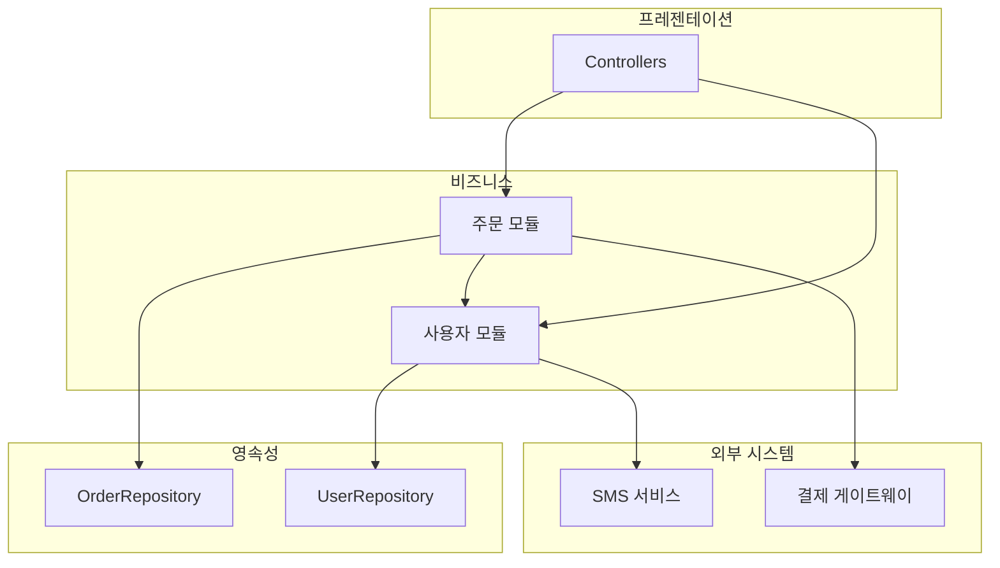
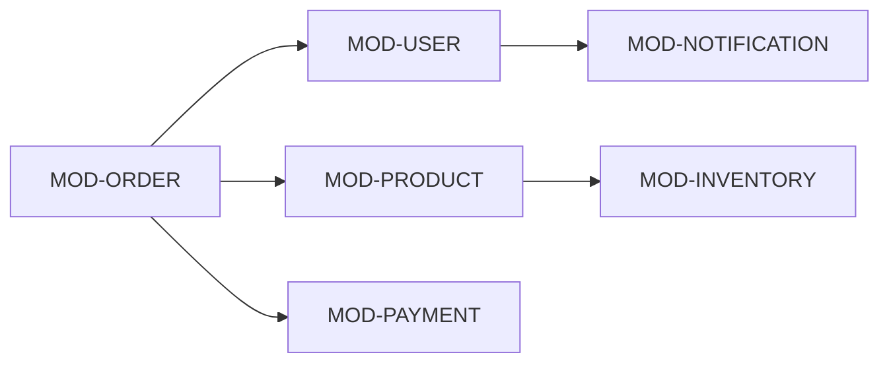
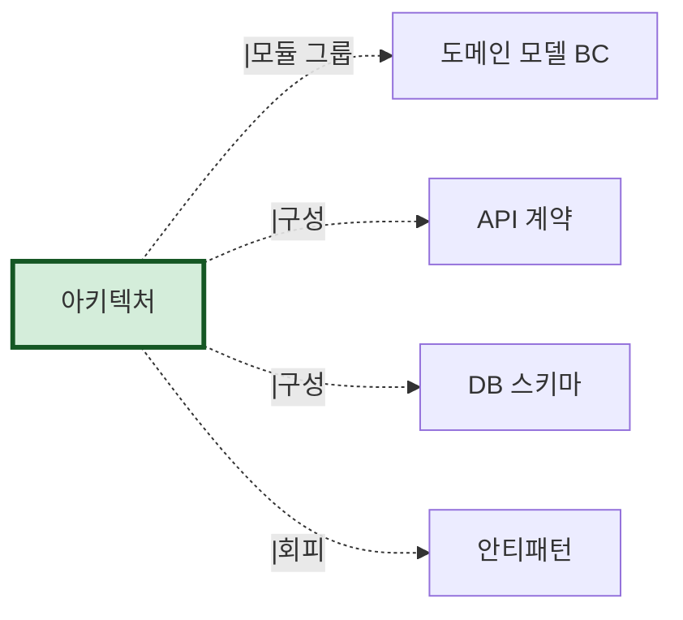

# 아키텍처 — {시스템명}

> 본 문서는 `architecture.json`의 사람용 버전이다.
> 사상: Schema-First (ADR-001 참조)
> 자동 생성: AI-Native 분석 도구 v1.1
> 신뢰도: {meta.confidence} | 검토 필수: {meta.human_review_required.length}건

---

## 메타 정보

| 항목 | 값 |
|---|---|
| 생성일시 | {meta.generated_at} |
| 소스 commit | {meta.source_commit_sha} |
| 사용된 입력 | {meta.inputs_used} |
| 평균 신뢰도 | {meta.confidence} |
| LLM 호출 수 | {meta.llm_calls} |

### 신뢰도 영역별

| 영역 | 점수 | 근거 |
|---|---|---|
| 모듈 식별 | {confidence_breakdown.module_identification} | 디렉토리/패키지 직접 추출 |
| 의존성 그래프 | {confidence_breakdown.dependency_graph} | import 결정적 분석 |
| 아키텍처 스타일 식별 | {confidence_breakdown.style} | LLM 추론 |
| 모듈 책임 기술 | {confidence_breakdown.responsibility} | LLM 추론 |

### 사람 검토 필수 항목

```
{meta.human_review_required 목록}
```

---

## 시스템 개요

| 항목 | 값 |
|---|---|
| 시스템명 | {system_name} |
| 아키텍처 스타일 | {architecture_style.primary} |
| 주 언어 | {Phase 1 inventory에서} |
| 모듈 수 | {modules.length} |
| 의존성 수 | {dependencies.length} |
| 순환 의존성 | {circular_dependencies.length}건 |
| 외부 의존성 | {external_dependencies.length}건 |

---

## 아키텍처 다이어그램



> 이 다이어그램은 자동 생성된 1차 그림이다. 시니어 BE 검토 후 수정 가능.

---

## 모듈 인벤토리

| ID | 이름 | 책임 | 레이어 | 관련 테이블 | 신뢰도 |
|---|---|---|---|---|---|
| MOD-ORDER | 주문 | 주문 생성/취소/조회 | business | orders, order_items | 0.9 |
| MOD-USER | 사용자 | 회원/인증/프로필 | business | users, user_profiles | 0.9 |
| MOD-PAYMENT | 결제 | 결제 처리/환불 | business | payments | 0.85 |
| ... | ... | ... | ... | ... | ... |

### 모듈별 상세

#### MOD-ORDER 주문

```yaml
id: MOD-ORDER
name: 주문
path: src/main/java/com/example/order
layer: business
loc: 12000
files: 87
responsibility: |
  주문의 전체 생애주기 관리. 생성, 결제 연동, 취소, 조회.
  배송 모듈과의 이벤트 통신 담당.
related_tables: [orders, order_items, order_status_history]
related_bounded_context: BC-ORDER
external_calls:
  - EXT-PAYMENT-TOSS (3 sites)
  - EXT-MQ-OUT-ORDER-EVENTS
internal_dependencies:
  - MOD-USER (12 imports)
  - MOD-PRODUCT (8 imports)
confidence: 0.9
```

(다른 모듈도 동일 구조)

---

## 의존성 그래프



### 의존성 통계

| from | to | import 수 |
|---|---|---|
| MOD-ORDER | MOD-USER | 12 |
| MOD-ORDER | MOD-PRODUCT | 8 |
| MOD-ORDER | MOD-PAYMENT | 5 |
| ... | ... | ... |

---

## 순환 의존성

> {circular_dependencies.length}건 발견 / 0건 = 정상

(있는 경우 형식)

| Cycle ID | 참여 모듈 | 심각도 | 안티패턴 등록 |
|---|---|---|---|
| CYC-001 | MOD-ORDER ↔ MOD-USER | high | AP-ARCH-001 |

(0건이면) 순환 의존성 없음 ✅

---

## 외부 의존성

> Phase 4 5.D에서 더 자세한 분석. 본 섹션은 1차 식별 결과.

| ID | 타입 | 대상 | 사용 모듈 | 신뢰도 |
|---|---|---|---|---|
| EXT-PAYMENT-TOSS | http | api.toss.im | MOD-ORDER | 0.95 |
| EXT-SMS-AWS | http | AWS SNS | MOD-USER | 0.95 |
| EXT-MQ-KAFKA | kafka | order-events | MOD-ORDER | 0.95 |

---

## 아키텍처 스타일 분석

### 후보: {architecture_style.primary} (신뢰도 {architecture_style.confidence})

근거:
- {architecture_style.evidence 목록}

### 레이어 위반 후보

> Phase 6 안티패턴으로 라우팅됨. 본 섹션은 1차 식별.

| 위반 | 위치 | 심각도 | 안티패턴 ID |
|---|---|---|---|
| Repository → Controller | OrderRepository.java:45 | medium | AP-ARCH-002 |

---

## 산출물 간 참조



- **도메인 모델** (`domain.json`): 모듈 ↔ Bounded Context 매핑
- **DB 스키마** (`schema.sql`): 모듈 ↔ 테이블 그룹 매핑
- **외부 의존성**: Phase 4 5.D 산출과 일치
- **안티패턴** (`antipatterns.json`): 순환/레이어 위반 라우팅

---

## 검토 가이드 (사람 검토자용)

다음을 우선적으로 확인하라:

1. **모듈 책임 기술**: 이름과 실제 책임이 일치하는가?
2. **모듈 ↔ 테이블 매핑**: 의도된 영역인가, 의도치 않은 결합인가?
3. **아키텍처 스타일**: 1차 추론이 실제와 맞는가?
4. **순환 의존성**: 의도된 우회인가, 정상화 대상인가?
5. **신뢰도 < 0.7 항목**: 본 문서 §메타 §사람 검토 필수 목록 모두 처리

검토 후 `meta.human_review_status`를 `approved`로 변경하고 commit.
