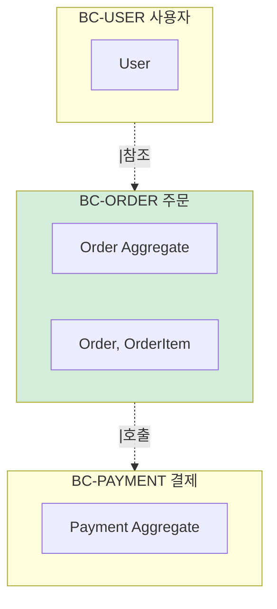
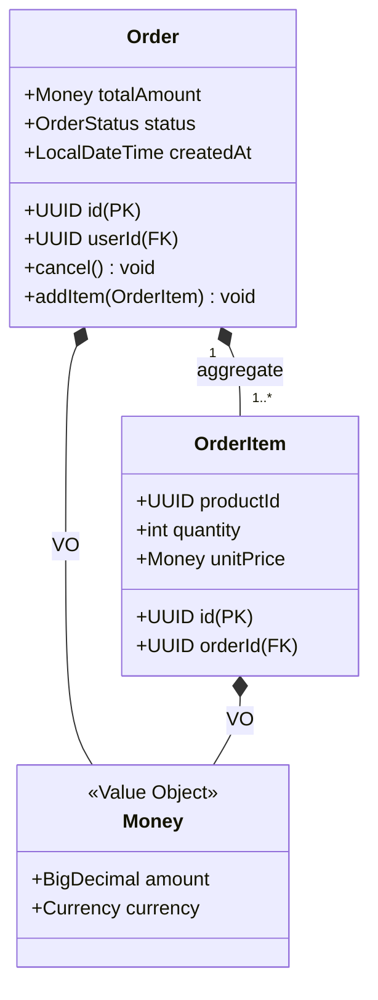
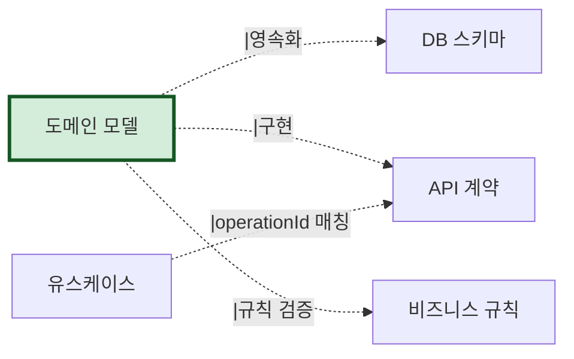

# 도메인 모델 — {시스템명}

> 본 문서는 `domain.json`의 사람용 버전이다.
> 사상: DDD-Lite B 강도 (전술 패턴까지, ADR-004 참조)
> 자동 생성: AI-Native 분석 도구 v1.1
> 신뢰도: {meta.confidence} | 검토 필수: {meta.human_review_required.length}건

---

## 메타 정보

| 항목 | 값 |
|---|---|
| 생성일시 | {meta.generated_at} |
| 소스 commit | {meta.source_commit_sha} |
| 사용된 입력 | {meta.inputs_used} |
| 평균 신뢰도 | {meta.confidence} |
| LLM 호출 수 | {meta.llm_calls} |

### 신뢰도 영역별

| 영역 | 점수 | 근거 |
|---|---|---|
| 엔티티 식별 | {confidence_breakdown.entity_identification} | {basis} |
| Aggregate 경계 | {confidence_breakdown.aggregate_boundary} | {basis} |
| 비즈니스 규칙 추출 | {confidence_breakdown.rules_extraction} | {basis} |

### 사람 검토 필수 항목

```
{meta.human_review_required 목록}
```

---

## 보편 언어 (Ubiquitous Language)

> 도메인 전문가와 개발자가 같은 단어를 같은 뜻으로 사용해야 한다.
> 본 용어집은 코드/ERD/기획문서에서 추출한 1차 후보. 도메인 전문가 검토 필수.

| 용어 | 영문 | 정의 | 동의어 (혼동) | 이것이 아닌 것 |
|---|---|---|---|---|
| 주문 | Order | 사용자가 상품 구매를 위해 생성한 거래 단위 | order_request, purchase | 장바구니 (Cart) |
| 주문 항목 | OrderItem | 주문 안의 개별 상품 라인 | line_item | 상품 (Product) |
| ... | ... | ... | ... | ... |

---

## 도메인 경계 (Bounded Context) 개요

> 도메인을 책임 단위로 분리한 경계. **C 강도 (Context Map)는 v1.2로 보류**.



| 도메인 경계 ID | 이름 | 책임 | 연관 모듈 |
|---|---|---|---|
| BC-USER | 사용자 | 회원 가입, 인증, 프로필 | MOD-AUTH, MOD-USER |
| BC-ORDER | 주문 | 주문 생성, 취소, 조회 | MOD-ORDER |
| BC-PAYMENT | 결제 | 결제 처리, 환불 | MOD-PAYMENT |

---

## BC-ORDER 주문 도메인 (예시)

### 책임
이 도메인 경계가 다루는 비즈니스 영역.

### Aggregate

#### Order Aggregate



| 항목 | 값 |
|---|---|
| Aggregate Root | E-ORDER-Order |
| 멤버 | E-ORDER-OrderItem |
| 트랜잭션 경계 | 예 (cascade=ALL, orphanRemoval=true) |
| 추출 출처 | ORM `@OneToMany` 어노테이션 |
| 신뢰도 | 0.95 |

##### Invariants (불변식)

> 항상 성립해야 하는 규칙. 깨지면 도메인 무결성 손상.

- `Order.items.size() >= 1` — 항목 없는 주문 불가
- `Order.totalAmount == sum(items.unitPrice * quantity)` — 총액 일치
- `Order.cancel()` 호출 시 status는 PENDING 또는 PAID여야 함
- 주문 생성 30분 후 취소 불가 (BR-ORDER-005 참조)

##### 도메인 메서드 (Domain Methods)

| 메서드 | 입력 | 출력 | 규칙 |
|---|---|---|---|
| cancel() | - | void | BR-ORDER-005 (30분 제한) |
| addItem(OrderItem) | OrderItem | void | BR-ORDER-008 (재고 확인) |

### 엔티티 (Entities)

#### E-ORDER-Order

```yaml
id: E-ORDER-Order
name: 주문
description: 사용자의 구매 요청 단위
identifier: id (UUID)
attributes:
  - id: id, type: UUID, required: true
  - id: userId, type: UUID, required: true, references: E-USER-User
  - id: totalAmount, type: VO-COMMON-Money, required: true
  - id: status, type: OrderStatus enum, required: true
  - id: createdAt, type: LocalDateTime, required: true
  - id: cancelledAt, type: LocalDateTime, required: false
related_table: orders
extracted_from:
  - "src/main/java/com/example/order/Order.java"
  - "ERD/orders 테이블"
confidence: 0.95
```

#### E-ORDER-OrderItem

(동일 구조)

### 값 객체 (Value Objects)

| ID | 이름 | 속성 | 불변 | 추출 출처 |
|---|---|---|---|---|
| VO-COMMON-Money | Money | amount, currency | ✅ | `@Embeddable` |
| VO-COMMON-Address | 주소 | street, city, zip | ✅ | `@Embeddable` |

### 리포지토리 (Repositories)

| ID | 이름 | 관리 Aggregate | 추출 출처 |
|---|---|---|---|
| R-ORDER-OrderRepository | OrderRepository | E-ORDER-Order | Spring Data JPA Repository |

### 도메인 서비스 (Domain Services)

| ID | 이름 | 책임 | 비고 |
|---|---|---|---|
| DS-ORDER-OrderPricingPolicy | 주문 가격 정책 | 할인/배송비 계산 | BR-PRICE-001~003 참조 |

---

## 유스케이스 (Use Cases)

| ID | 이름 | 액터 | 관련 API | 관련 비즈니스 규칙 |
|---|---|---|---|---|
| UC-ORDER-001 | 주문 생성 | 사용자 | createOrder | BR-ORDER-001, BR-ORDER-007 |
| UC-ORDER-002 | 주문 취소 | 사용자 | cancelOrder | BR-ORDER-005 |
| UC-ORDER-003 | 주문 조회 | 사용자/관리자 | getOrder | BR-USER-PERM-001 |

---

## 산출물 간 참조



- **DB 스키마** (`db/schema.sql`): 엔티티 → 테이블 매핑
- **API 계약** (`api/openapi.yaml`): 유스케이스 → operationId 매핑
- **비즈니스 규칙** (`rules/rules.json`): Invariants/도메인 메서드와 연결

---

## v1.2 보류 사항

다음은 본 도메인 모델의 **v1.2 확장 후보**다 (ADR-004 참조):

- **Context Map**: 도메인 경계 간 관계 패턴 (customer-supplier, OHS, ACL 등)
- **Subdomain 분류**: Core / Supporting / Generic
- **Domain Event**: 도메인 이벤트 발행/구독
- **Saga 패턴**: 분산 트랜잭션

`v12_reserved` 필드가 schema에 예비되어 있다.

---

## 검토 가이드 (사람 검토자용)

다음을 우선적으로 확인하라:

1. **보편 언어**: 도메인 전문가 어휘와 일치하는가?
2. **Aggregate 경계**: ORM cascade 추출이 의도와 맞는가?
3. **Invariants**: 비즈니스에서 진짜 항상 성립하는가? 예외 케이스는?
4. **신뢰도 < 0.7 항목**: 본 문서 §메타 §사람 검토 필수 목록 모두 처리

검토 후 `meta.human_review_status`를 `approved`로 변경하고 commit.
