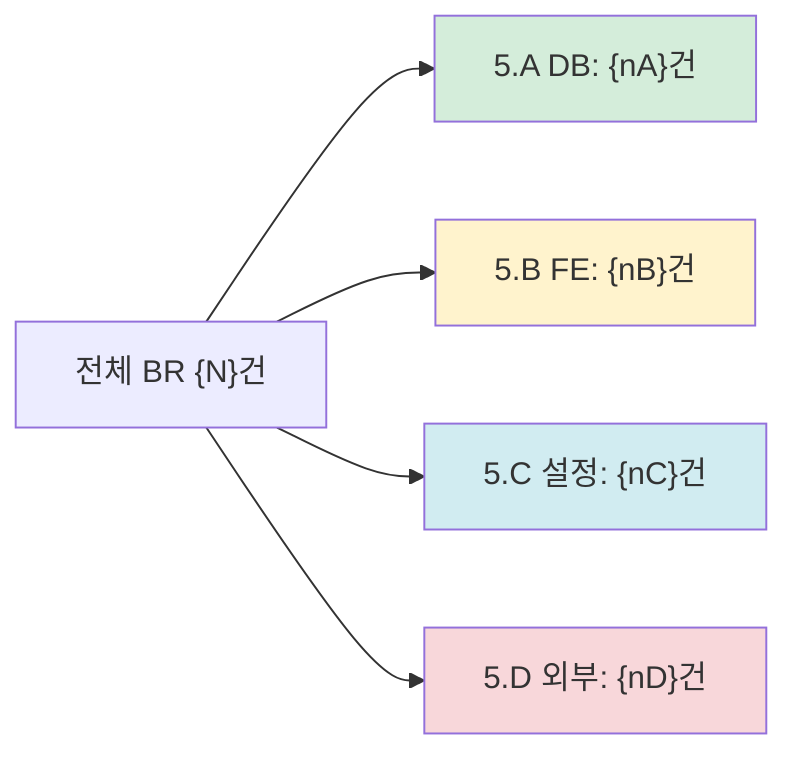
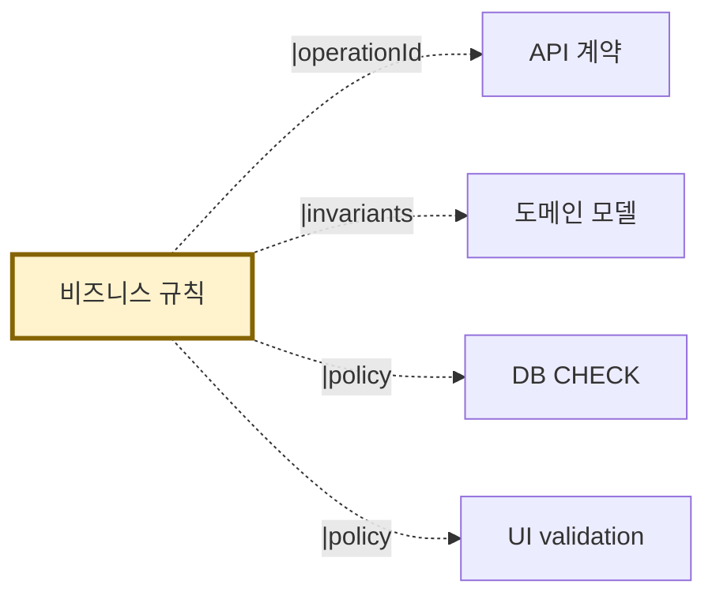

# 비즈니스 규칙 — {시스템명}

> 본 문서는 `rules.json`의 사람용 카탈로그다.
> 자동 생성: AI-Native 분석 도구 v1.1
> 신뢰도: {meta.confidence} (R7 — 비즈니스 규칙은 100%가 안 됨, plan §12 참조)
> 검토 필수: {meta.human_review_required.length}건
> ⚠️ 도메인 전문가 인터뷰 권장 — `interview-questions.md` 참조

---

## 메타 정보

| 항목 | 값 |
|---|---|
| 생성일시 | {meta.generated_at} |
| 사용된 입력 | {meta.inputs_used} |
| 평균 신뢰도 | {meta.confidence} |
| 추출 영역 | 5.A DB, 5.B FE, 5.C 설정, 5.D 외부 |
| 총 규칙 수 | {rules.length} |
| 충돌 발견 | {rule_conflicts.length}건 |

### 신뢰도 영역별

| 영역 | 평균 신뢰도 | 근거 |
|---|---|---|
| 5.A DB CHECK 제약 | 0.85 | DB 메타 직접 추출 |
| 5.A SQL CASE 정책 | 0.65 | LLM 의도 추론 |
| 5.A ORM 메서드 가드 | 0.80 | 코드 패턴 매칭 |
| 5.B FE validation | 0.85 | 스키마 직접 추출 |
| 5.B 권한 분기 | 0.70 | LLM 추론 |
| 5.C 매직 넘버 | 0.80 | 설정 파일 추출 |
| 5.D 외부 정책 | 0.50 | LLM 추론 |

### 사람 검토 필수

```
{meta.human_review_required 목록 — 전체 BR 중 review_required=pending 항목}
```

---

## 규칙 카탈로그 (도메인별)

### BC-ORDER 주문

#### BR-ORDER-CANCEL-001: 주문 상태별 취소 가능 여부

```yaml
id: BR-ORDER-CANCEL-001
name: "주문 상태별 취소 가능 여부"
given:
  - "주문이 존재함"
when:
  - "Order.cancel() 호출 시"
  - "POST /orders/{id}/cancel 요청 시 (UC-ORDER-002)"
then:
  - "status가 PENDING 또는 PAID여야 함"
  - "그 외 상태면 IllegalStateException"

rationale: "이미 발송된 주문은 취소할 수 없음 (배송 처리 후 별도 환불 절차)"
extracted_area: "5.A DB"
extraction_method: orm_method_guard

related:
  use_cases: [UC-ORDER-002]
  api_operations: [cancelOrder]
  entities: [E-ORDER-Order]
  db_tables: [orders]

source_evidence:
  - file: src/main/java/com/example/order/Order.java
    lines: [67, 70]
    snippet: |
      if (status != PENDING && status != PAID) {
        throw new IllegalStateException(...);
      }

confidence: 0.85
human_review_status: pending
notes: |
  코드에서 직접 추출됨. 비즈니스 의미 검증 필요:
  - SHIPPED 상태에서 강제 취소 케이스가 있는가?
  - PARTIALLY_DELIVERED 같은 중간 상태가 있는가?
```

#### BR-ORDER-CANCEL-002: 주문 30분 후 취소 불가

```yaml
id: BR-ORDER-CANCEL-002
name: "주문 30분 후 취소 불가"
given:
  - "주문이 존재함"
  - "주문 상태가 PENDING 또는 PAID"
when:
  - "Order.cancel() 호출 시"
then:
  - "주문 생성 후 30분 이내여야 취소 가능"
  - "30분 초과 시 IllegalStateException"

rationale: "도메인 전문가 확인 필요 (30분의 근거?)"
extracted_area: "5.A DB + 5.C 설정"
extraction_method: composite

related:
  use_cases: [UC-ORDER-002]
  api_operations: [cancelOrder]
  entities: [E-ORDER-Order]

source_evidence:
  - file: src/main/java/com/example/order/Order.java
    lines: [73, 78]
    type: orm_method_guard
  - file: application-prod.yml
    line: business.order.cancel-window-minutes
    value: 30
    type: config_magic_number

confidence: 0.90  # 코드 + 설정 모두 일치
human_review_status: pending
notes: |
  ⚠️ application-dev.yml은 60분, application-prod.yml은 30분.
  AP-CFG-001로 환경별 차이 등록됨. 어느 게 진짜 정책?
```

#### BR-ORDER-007: 성인 인증 후 주류 주문

```yaml
id: BR-ORDER-007
name: "성인 인증 후 주류 주문"
given:
  - "주문 항목 중 category=ALCOHOL 포함"
  - "user.birth_date 존재"
when:
  - "POST /orders 호출 시 (UC-ORDER-001)"
then:
  - "user 만 19세 미만이면 AGE_RESTRICTED 에러로 거부"
  - "만 19세 이상이면 주문 생성 진행"

rationale: "청소년보호법 제28조 (도메인 전문가 확인 필요)"
extracted_area: "5.A DB + 5.B FE"
extraction_method: composite

related:
  use_cases: [UC-ORDER-001]
  api_operations: [createOrder]
  entities: [E-ORDER-Order, E-USER-User]
  db_tables: [orders, users]

source_evidence:
  - file: src/main/java/com/example/order/OrderService.java
    lines: [45, 67]
    type: code_inference
  - file: src/web/order/createOrderForm.tsx
    line: 23
    type: fe_validation
  - file: db/migration/V003__age_check.sql
    type: db_constraint

confidence: 0.60
human_review_status: pending
notes: |
  코드에서 19세 체크 발견. 단:
  - 청소년보호법 기준인지 회사 정책인지 코드만으로 불명확
  - 외국 사용자 (출생연도 기준 다른 국가) 케이스 미처리
  - FE/BE 모두 검증 — 정합성 OK
```

(나머지 BR도 동일 형식)

---

## 영역별 규칙 분포



| 영역 | 건수 | 평균 신뢰도 |
|---|---|---|
| 5.A DB | {nA} | 0.78 |
| 5.B FE | {nB} | 0.80 |
| 5.C 설정 | {nC} | 0.80 |
| 5.D 외부 | {nD} | 0.55 |

---

## 신뢰도 분포

| 신뢰도 구간 | 건수 | 처리 |
|---|---|---|
| ≥ 0.8 | {n_high} | 자동 발행 OK (review_status=pending 표시) |
| 0.5 ~ 0.8 | {n_mid} | review_required, 사람 검토 후 발행 |
| < 0.5 | {n_low} | 자동 발행 금지, 사람 검토 필수 |

---

## 규칙 충돌

> {rule_conflicts.length}건 발견 / 0건 = 정상

(있는 경우)

| Conflict ID | 충돌 규칙 | 영역 | 해결 상태 |
|---|---|---|---|
| CONFLICT-001 | BR-ORDER-FE-005 ↔ BR-ORDER-DB-012 | 5.B vs 5.A | pending |

#### CONFLICT-001 상세

```yaml
rules: [BR-ORDER-FE-005, BR-ORDER-DB-012]
description: |
  FE: "5만원 이상 무료배송" (free-shipping-threshold: 50000)
  DB CHECK: "shipping_fee > 0"
  → 두 규칙이 동시에 성립 불가능
detected_at: 2026-04-26
recommendation: "도메인 전문가 결정 필요"
status: pending
```

(0건이면) 충돌 없음 ✅

---

## 산출물 간 참조



---

## 도메인 전문가 검토 가이드

다음 질문을 도메인 전문가에게 우선 확인하라:

1. BR-ORDER-007 "19세 미만 거부": 청소년보호법 기준인가요, 자체 정책인가요?
2. BR-ORDER-CANCEL-002 "30분 후 취소 불가": 30분의 근거는 무엇인가요?
3. BR-ORDER-FREE-SHIPPING "5만원 이상 무료배송": 현재도 유효한 정책인가요?
4. (이하 자동 생성된 검토 질문들)

전체 질문 목록: `interview-questions.md` 참조.

---

## 검토 가이드 (사람 검토자용)

다음 순서로 처리:

1. **신뢰도 < 0.5 항목**: 발행 차단, 도메인 전문가 인터뷰 결과 반영
2. **충돌 (CONFLICT-XXX)**: 도메인 전문가 결정
3. **신뢰도 0.5~0.8 항목**: 인터뷰 또는 직접 검토 후 review_status 변경
4. **신뢰도 ≥ 0.8 항목**: 발행은 OK, 단 review_status=pending 표시 유지

검토 완료 후 `meta.human_review_status`를 갱신.
