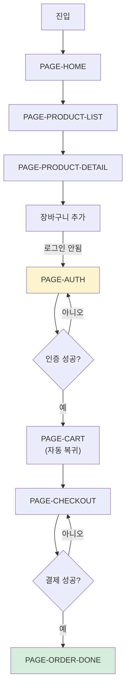
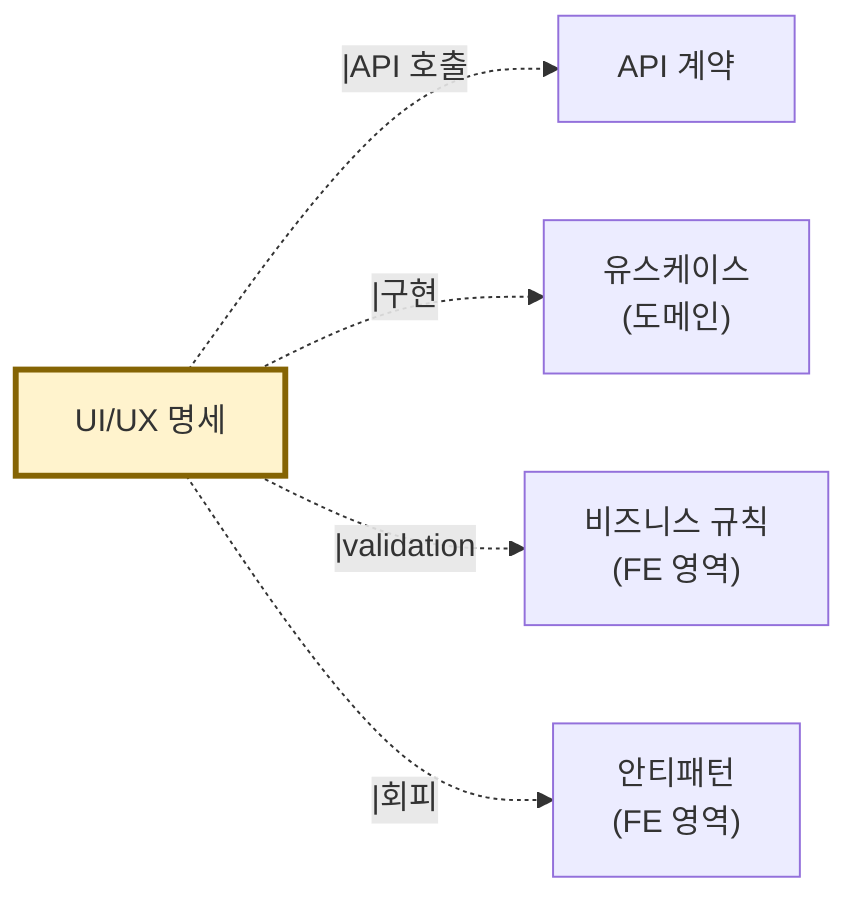

# UI/UX 명세 — {시스템명}

> 본 문서는 `ui-spec.json`의 사람용 버전이다.
> 사상: FSD + Atomic Design (ADR-001 §FE)
> 자동 생성: AI-Native 분석 도구 v1.1
> 신뢰도: {meta.confidence} (R8 — UI 추출 신뢰도 영역별 진폭 큼, plan §12)

---

## 메타 정보

| 항목 | 값 |
|---|---|
| 생성일시 | {meta.generated_at} |
| 사용된 입력 | FE 소스 {+디자인 명세} |
| FE 프레임워크 | {framework} |
| 컴포넌트 분류 방식 | {design_system_approach} |
| 평균 신뢰도 | {meta.confidence} |
| 페이지 수 | {pages.length} |
| 컴포넌트 수 | {components.length} |
| 사용자 시나리오 | {scenarios.length} |

### 신뢰도 영역별

| 영역 | 신뢰도 | 비고 |
|---|---|---|
| 페이지 인벤토리 | 0.95 | 라우팅 직접 추출 |
| 컴포넌트 트리 | 0.90 | import 그래프 |
| 사용자 흐름 (단순) | 0.85 | navigate 호출 추적 |
| 사용자 흐름 (조건부) | 0.65 | LLM 추론 |
| 디자인 토큰 | {0.30~0.90} | FE 코드 품질에 의존 |
| 사용자 시나리오 | 0.60 | LLM — 기획자 검토 필수 |

---

## 1. 페이지 인벤토리

### 1.1 페이지 통계

| 항목 | 수 |
|---|---|
| 전체 페이지 | {pages.length} |
| 비로그인 접근 가능 | {n_public} |
| 로그인 필수 | {n_auth} |
| 관리자 전용 | {n_admin} |

### 1.2 페이지 목록

| ID | 이름 | 라우트 | 권한 | 레이아웃 | 관련 API | 신뢰도 |
|---|---|---|---|---|---|---|
| PAGE-HOME-001 | 홈 | / | public | MainLayout | listProducts | 0.95 |
| PAGE-PRODUCT-LIST | 상품 목록 | /products | public | MainLayout | listProducts | 0.95 |
| PAGE-PRODUCT-DETAIL | 상품 상세 | /products/:id | public | MainLayout | getProduct | 0.95 |
| PAGE-CART | 장바구니 | /cart | auth | MainLayout | getCart | 0.95 |
| PAGE-CHECKOUT | 결제 | /checkout | auth | CheckoutLayout | createOrder | 0.90 |
| PAGE-ORDER-LIST | 주문 목록 | /orders | auth | MainLayout | listOrders | 0.95 |
| PAGE-ADMIN-DASH | 관리자 대시보드 | /admin | admin | AdminLayout | adminGetStats | 0.95 |

### 1.3 페이지 상세

#### PAGE-CHECKOUT 결제

```yaml
id: PAGE-CHECKOUT
name: "결제"
route: /checkout
layout: CheckoutLayout
auth_required: true
roles: [USER]

related_apis: [createOrder, getCart, getUserAddresses]
related_use_cases: [UC-ORDER-001]
related_components: [CheckoutPage, AddressSelector, PaymentMethodSelector, OrderSummary]
related_business_rules: 
  - BR-ORDER-007  # 19세 이상 (주류 포함 시)
  - BR-ORDER-FREE-SHIPPING

source: src/pages/checkout/index.tsx
confidence: 0.90

notes: |
  Cart에서 자동 진입. URL 직접 접근 시 빈 카트면 /cart로 리다이렉트.
```

(다른 페이지도 동일 구조)

---

## 2. 사용자 흐름

### 2.1 주요 흐름: 비로그인 사용자 첫 주문



### 2.2 흐름 ID 매핑

| 흐름 | ID | 페이지 | 신뢰도 |
|---|---|---|---|
| 첫 주문 | FLOW-ORDER-001 | HOME → ... → ORDER-DONE | 0.85 |
| 주문 취소 | FLOW-ORDER-002 | ORDER-LIST → ORDER-DETAIL → CANCEL | 0.85 |
| 회원가입 | FLOW-USER-001 | AUTH → SIGNUP → VERIFY | 0.90 |

---

## 3. 컴포넌트 트리

### 3.1 컴포넌트 분류 방식: {Atomic Design / FSD}

자동 감지 결과: **{design_system_approach}**

#### 3.1.A Atomic Design인 경우

```
Atoms      Button, Input, Icon, Label, Badge
Molecules  SearchBar, FormField, Card, ProductCard
Organisms  Header, Footer, ProductList, CheckoutForm, OrderSummary
Templates  MainTemplate, AuthTemplate, AdminTemplate
Pages      HomePage, ProductListPage, CheckoutPage
```

#### 3.1.B FSD인 경우

```
app/        앱 진입점, 글로벌 설정
processes/  복잡한 비즈니스 흐름 (CheckoutProcess)
pages/      라우팅 단위 (HomePage, ProductPage)
widgets/    재사용 큰 단위 (Header, Footer, ProductCarousel)
features/   기능 단위 (AddToCart, ApplyPromoCode)
entities/   비즈니스 엔티티 단위 UI (ProductCard, OrderItem)
shared/     공유 (UI Kit, Lib, API)
```

### 3.2 컴포넌트 통계

| 분류 | 수 | 평균 재사용 |
|---|---|---|
| Atoms / shared/ui | {n_atoms} | 매우 높음 |
| Molecules / entities | {n_mol} | 높음 |
| Organisms / widgets | {n_org} | 중간 |
| Pages | {n_pages} | 1회 |

### 3.3 분류 안티패턴 검출

(있는 경우)
- AP-FE-CLASSIFICATION: 평면 components/ 디렉토리에 200개 컴포넌트 — 분류 부재

---

## 4. 디자인 토큰

### 4.1 추출 출처

| 출처 | 발견 여부 | 신뢰도 |
|---|---|---|
| Tailwind config | ✅ tailwind.config.ts | 0.95 |
| CSS variables | ✅ globals.css | 0.85 |
| theme.ts (Styled-components/MUI) | ❌ | - |
| Storybook | ❌ | - |
| design-tokens.json (공식) | ❌ | - |

### 4.2 색상 토큰

```yaml
colors:
  primary:
    50: "#eff6ff"
    500: "#3b82f6"   # 주요 브랜드 색
    900: "#1e3a8a"
  danger:
    500: "#ef4444"
    900: "#7f1d1d"
  success:
    500: "#22c55e"
  neutral:
    50: "#fafafa"
    900: "#171717"
```

### 4.3 간격 토큰

```yaml
spacing:
  0: 0
  1: 4px
  2: 8px
  4: 16px
  8: 32px
  16: 64px
```

### 4.4 타이포그래피

```yaml
typography:
  heading-1:
    fontSize: 32px
    fontWeight: 700
    lineHeight: 1.2
  heading-2:
    fontSize: 24px
    fontWeight: 600
  body:
    fontSize: 16px
    fontWeight: 400
```

### 4.5 토큰 부재 영역

(나쁜 케이스에서)
- 인라인 스타일 발견 빈도: {N}개 컴포넌트
- 매직 색상 값 (hex 직접 작성): {N}회
- → AP-FE-INLINE-STYLE 등록

---

## 5. 사용자 시나리오

### SCN-ORDER-001: 신규 사용자 첫 주문

```yaml
id: SCN-ORDER-001
name: "신규 사용자 첫 주문"
actor: "비로그인 사용자"
priority: high

steps:
  - step: 1
    action: "상품 목록 진입"
    page: PAGE-PRODUCT-LIST
    api: listProducts
  - step: 2
    action: "상품 상세 클릭"
    page: PAGE-PRODUCT-DETAIL
    api: getProduct
  - step: 3
    action: "장바구니 추가"
    feature: AddToCart
    note: "토스트 안내"
  - step: 4
    action: "장바구니 진입"
    page: PAGE-CART
    note: "비로그인 → 로그인 유도 모달"
  - step: 5
    action: "회원가입"
    page: PAGE-AUTH
    api: createUser
  - step: 6
    action: "장바구니 자동 복귀"
    page: PAGE-CART
  - step: 7
    action: "결제 진행"
    page: PAGE-CHECKOUT
    api: [getCart, createOrder]

related_use_cases: [UC-ORDER-001, UC-USER-SIGNUP]
related_pages: [PAGE-PRODUCT-LIST, PAGE-PRODUCT-DETAIL, PAGE-CART, PAGE-AUTH, PAGE-CHECKOUT]
related_apis: [listProducts, getProduct, createUser, login, addToCart, getCart, createOrder]
related_business_rules: [BR-USER-AGE, BR-ORDER-007]

confidence: 0.65
human_review_status: pending
notes: |
  ⚠️ LLM이 페이지 흐름과 API 호출 패턴을 종합하여 추론.
  기획자 검토 필수. 특히:
  - 회원가입 후 자동 장바구니 복귀가 실제 구현되어있는지
  - 비로그인 장바구니 데이터 보존 메커니즘 (localStorage?)
```

(다른 시나리오도 동일)

---

## 6. 산출물 간 참조



- **API 계약**: 각 페이지의 `related_apis`가 OpenAPI operationId와 일치
- **도메인 모델**: 각 페이지의 `related_use_cases`가 UC-XXX와 일치
- **비즈니스 규칙**: FE validation은 5.B에서 추출된 BR과 정합
- **안티패턴**: FE 분류 부재, 인라인 스타일 등은 AP-FE-XXX

---

## 7. 검토 가이드 (기획자/디자이너용)

다음을 우선적으로 확인하라:

1. **사용자 시나리오** (가장 신뢰도 낮음 — 0.6)
   - 페이지 흐름이 의도된 UX와 맞는가?
   - 누락된 시나리오는?
2. **페이지 인벤토리**
   - 권한 매트릭스 (auth/admin)가 의도와 맞는가?
   - 누락된 페이지는?
3. **디자인 토큰**
   - 의도된 디자인 시스템과 일치하는가?
   - 토큰 부재 영역의 정상화 우선순위
4. **신뢰도 < 0.7 항목**: review_status 변경 후 발행

검토 완료 후 `meta.human_review_status`를 갱신.
