# Plan: AI-Native 개발 방법론 v1.1 — 분석 단계 중심

> 작성일: 2026-04-26 (v1.0 → v1.1 갱신)
> 작성자: 윤주스 (Frontend Lead, AI-Native Legacy Migration TF)
> 적용 원칙: Work Principles 4원칙
>
> **v1.1 갱신 내역** (사용자 피드백 반영):
> 1. §0 신설 — 사상적 기반 명시 (DDD-Lite + Schema-First)
> 2. 6대 → 7대 산출물 확장 (UI/UX 명세 신설)
> 3. 다중 입력 프레임워크 (ERD/ORM/운영DB/문서)
> 4. 출처 간 정합성 검증 (구 "Schema Drift Detection")
> 5. 비즈니스 로직 추출을 4개 영역으로 분리 (DB/FE/설정/외부)
> 6. 한국어 용어 정비 (불필요한 영어 약어 제거)
> 7. 보강 항목과 Phase 워크플로우의 명확한 구분

---

## §0. 사상적 기반 (NEW) — 이 방법론은 무엇에 뿌리를 두는가

### 0.1 사상 스택

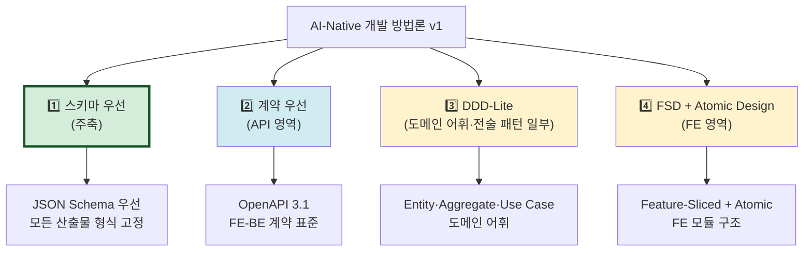

### 0.2 명시적 제외 (의도적으로 안 하는 것)

| 제외 | 이유 |
|---|---|
| Event Sourcing | 특정 시스템에만 적합. 레거시는 거의 미적용 |
| CQRS | 명령/조회 분리는 v1.2 이후 검토 |
| 풀 DDD (Saga, ACL 등) | 학습 곡선↑, 시니어 저항↑ |
| 비기능 요구사항 측정 | 운영 환경 측정 영역 (코드 분석 밖) |
| 테스트 코드 자동 분석 | v1.2 이후 |

### 0.3 사상 채택 근거

- **Schema-First**: AI와 사람 모두에게 명확한 인터페이스 제공. 산업계 표준 (Microsoft TypeSpec, Technijian 등 검증)
- **DDD-Lite**: 도메인 어휘는 시니어 BE에게 익숙. 단, 풀 DDD는 채택 저항 발생 우려
- **FSD**: FE 진영의 사실상 표준. Atomic Design과 자연 호환
- **명시적 제외 항목**: v1 PoC 검증 후 v1.2~ 단계적 검토

---

## §1. 목적과 위치

### 1.1 큰 그림

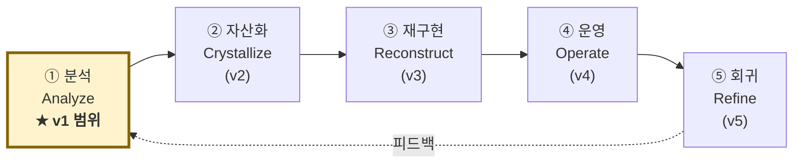

### 1.2 v1의 목적

- 레거시 프로젝트(FE+BE+DB+기획+디자인)를 **AI와 사람이 함께 읽을 수 있는 7대 산출물**로 변환
- 이 변환 과정을 **사내 표준 방법론**으로 정착
- **기존 프로젝트 1개를 PoC**로 적용하면서 방법론을 점진 정제 (4원칙 Lessons Learned)

---

## §2. 산출물 정의 — 7대 산출물 (확장됨)

### 2.1 7대 산출물 표

| # | 산출물 | AI용 | 사람용 | 추출 신뢰도 |
|---|---|---|---|---|
| 1 | **아키텍처/의존성** | `architecture.json` | `architecture.mermaid` + .md | 100% |
| 2 | **도메인 모델** | `domain.json` (JSON Schema) | `domain.md` + classDiagram | 80% (+ORM 95%) |
| 3 | **API 계약** | `openapi.yaml` (3.1) | Swagger UI + 요약 | 90% |
| 4 | **DB 스키마** | `schema.sql` + `schema.json` | `erd.mermaid` + 명세 | 70% (+ERD 95%, +DB 100%) |
| 5 | **비즈니스 규칙** | `rules.json` (Given/When/Then) | `rules.md` 카탈로그 | 50% (+여러 출처 75%) |
| 6 | **안티패턴** | `antipatterns.json` | `avoid-list.md` 체크리스트 | 100% |
| 7 | **UI/UX 명세** ⭐ NEW | `ui-spec.json` | `pages.md` + flowchart | 75% |

### 2.2 7번 — UI/UX 명세 상세

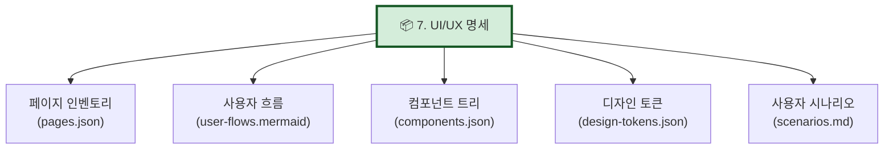

각 항목 정의:
- **페이지 인벤토리**: 라우트, 권한, 레이아웃, 관련 API/유스케이스
- **사용자 흐름**: 화면 간 전이 (Mermaid flowchart)
- **컴포넌트 트리**: Atomic Design 5계층 또는 FSD 구조
- **디자인 토큰**: 색상/간격/타이포그래피 (Tailwind config, CSS variables 등에서 추출)
- **사용자 시나리오**: 비로그인 진입~완료까지 end-to-end 흐름

### 2.3 산출물 간 책임 분담 (구 "API vs Rules vs Domain")

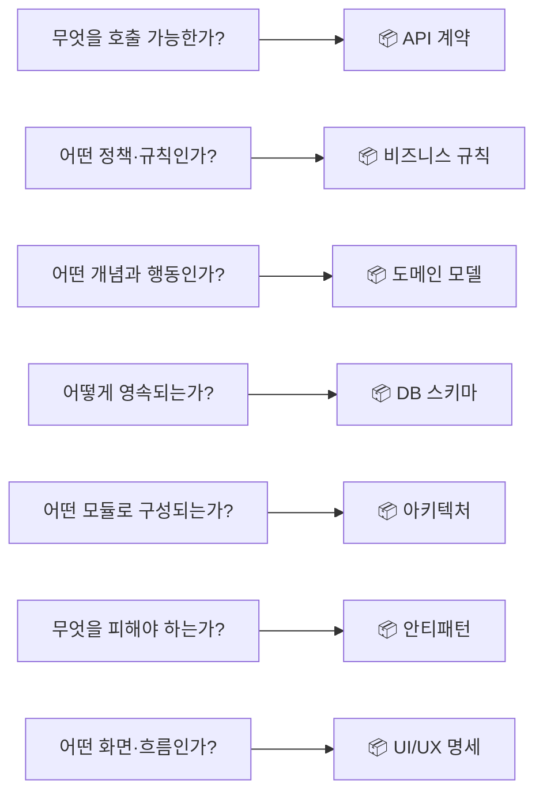

**원칙**:
- 같은 사실이라도 **"던지는 질문"** 이 다르면 다른 산출물에 들어간다
- API에 비즈니스 정책 description으로 박지 않는다 (Rules에)
- ORM 메서드 안 정책은 도메인 메서드로 (Domain에)
- 화면 정보는 아키텍처/API에 섞지 않는다 (UI에)

### 2.4 ID 표준 (산출물 간 추적성)

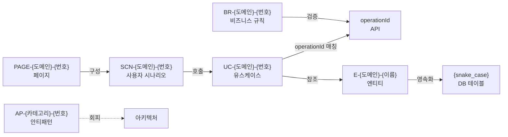

---

## §3. 다중 입력 프레임워크 (Multi-Source Input)

### 3.1 입력 가변성 처리

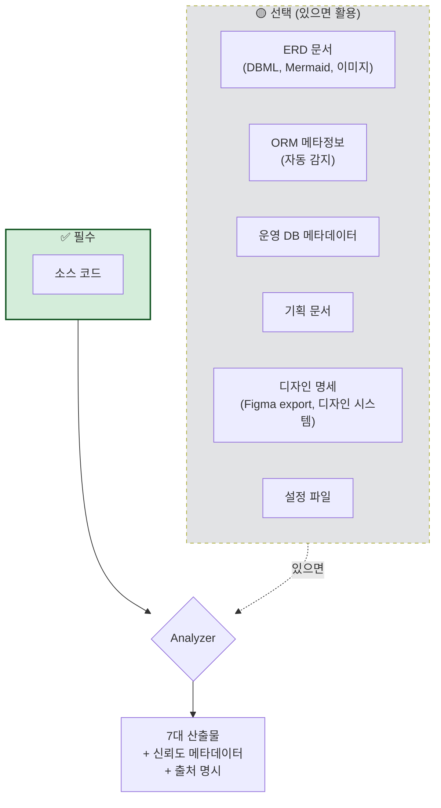

### 3.2 입력 조합별 신뢰도

| 입력 조합 | 평균 신뢰도 | 분석 전략 |
|---|---|---|
| 소스만 | 75% | 코드 추론 위주 |
| 소스 + ERD | 85% | ERD = 1차 골격 |
| 소스 + ORM (자동 감지) | 88% | ORM = 1차 골격 |
| 소스 + ORM + ERD | 92% | ORM↔ERD 교차 검증 |
| 소스 + ORM + ERD + 운영 DB | 96% | 3자 정합성 검증 |
| 소스 + 전체 (+ 기획·디자인) | 98% | 모든 출처 통합 |

### 3.3 입력 형식 표준

| 출처 | 1차 표준 | 폴백 |
|---|---|---|
| ERD | DBML, Mermaid `erDiagram` | 이미지 (Vision LLM, 신뢰도↓) |
| ORM | JPA/Hibernate, Prisma, TypeORM, Sequelize | 정규식 기반 추출 |
| 운영 DB | INFORMATION_SCHEMA 추출 SQL | 수동 dump |
| 기획 문서 | 마크다운, Notion export | PDF/이미지 (Vision LLM) |
| 디자인 | Figma JSON, Storybook, design-tokens.json | CSS 추출 |

### 3.4 신뢰도 메타데이터 표준 (모든 산출물 필수)

```yaml
meta:
  generated_at: 2026-04-26T10:00:00Z
  source_commit_sha: abc1234
  inputs_used:
    - source_code        # 항상
    - erd                # 있으면
    - orm                # 있으면
    - operational_db     # 있으면
    - planning_docs      # 있으면
    - design_specs       # 있으면
  confidence: 0.85       # 0.0~1.0
  human_review_required:
    - "BR-ORDER-007: 19세 기준의 의도 확인 필요"
  llm_calls: 142
  llm_cost_usd: 1.23
```

---

## §4. 출처 간 정합성 검증 (구 "Schema Drift Detection")

### 4.1 정합성 검증 vs 비즈니스 로직 추출 — 명확한 경계

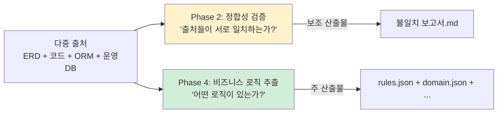

### 4.2 두 단계의 책임 분담

| 측면 | Phase 2: 정합성 검증 | Phase 4: 비즈니스 로직 추출 |
|---|---|---|
| 던지는 질문 | "출처들이 일치하는가?" | "어떤 비즈니스 로직이 있는가?" |
| 시야 | 출처 **간** | 출처 **내** |
| 결과의 성격 | 메타정보 (보조) | 실제 산출물 (주) |
| 사람 액션 | "출처를 갱신해라" | "추출 결과를 검토해라" |
| 입력 부족 시 | 단일 출처면 무의미 | 출처가 하나여도 동작 |
| LLM 사용 | 거의 없음 (결정적 비교) | 많음 (의도 추론) |

### 4.3 정합성 검증 산출물 예시

```yaml
# 불일치-보고서.md (Phase 2 산출물 — 보조)
title: "출처 간 정합성 검증 보고서"
sources:
  erd: docs/erd-2025.dbml
  orm: src/domain/**/*.java
  db: production_metadata.sql

findings:
  - severity: high
    type: column_only_in_db
    table: orders
    column: admin_memo
    description: "운영 DB에만 존재. ERD/ORM에 없음"
    risk: "재구현 시 컬럼 누락 → 데이터 손실"
    recommendation: "ERD/ORM에 추가 또는 운영 DB에서 제거 결정 필요"
    
  - severity: medium
    type: type_mismatch
    table: orders
    column: total_amount
    erd_type: DECIMAL(10,2)
    orm_type: BigDecimal precision=12 scale=2
    db_type: NUMERIC(12,2)
    description: "ERD가 옛날 정보. ORM과 DB는 일치"
    recommendation: "ERD를 (12,2)로 갱신"
```

### 4.4 협력 흐름 — Phase 2 → Phase 4

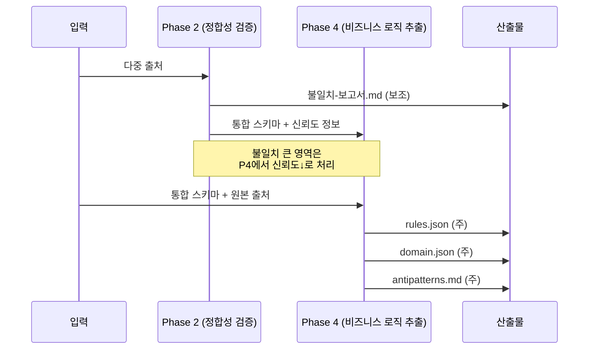

---

## §5. 비즈니스 로직 추출 4개 영역 (구 "Cross-Cutting" 폐기)

### 5.1 비즈니스 로직은 한 곳에 있지 않다 — 4개 영역 분산

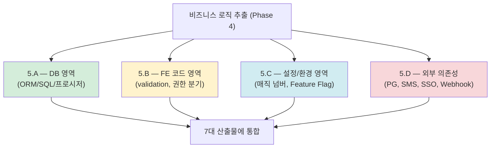

### 5.2 영역별 상세

#### 5.A — DB 영역 비즈니스 로직 추출

**추출 대상**:
- ORM 엔티티 메서드 안의 비즈니스 메서드 (`Order.cancel()` 등)
- ORM 어노테이션의 제약 (`@Column(nullable=false)`)
- MyBatis XML 쿼리의 CASE/WHERE 정책
- JPA @Query, JPQL, Native Query
- Stored Procedure 본문
- DB CHECK/UNIQUE/Trigger

**도구**: Tree-sitter, MyBatis 파서, JPA 어노테이션 추출, 운영 DB 메타데이터 쿼리

**산출 흐름**:
- ORM 메서드 → 도메인 모델 (#2)
- SQL CASE/WHERE → 비즈니스 규칙 (#5)
- N+1, SQL에 정책 박힘 → 안티패턴 (#6)

#### 5.B — FE 코드 영역 비즈니스 로직 추출

**추출 대상**:
- 폼 validation (yup, zod, react-hook-form)
- 권한별 UI 분기 (`role === 'ADMIN'`)
- 라우팅 가드 (인증/권한 체크)
- BFF 응답 변환 로직
- 클라이언트 캐시 정책 (SWR, TanStack Query)

**산출 흐름**:
- validation 스키마 → 비즈니스 규칙 (#5)
- 권한 분기 → 비즈니스 규칙 (#5)
- FE-BE 검증 중복/누락 → 안티패턴 (#6)

#### 5.C — 설정/환경 정책 추출

**추출 대상**:
- application.yml/properties의 매직 넘버
- 환경별 정책 차이 (dev/staging/prod)
- Feature Flag 시스템
- 환경 변수의 비즈니스 의미

**산출 흐름**:
- 매직 넘버 → 비즈니스 규칙 (#5)
- 환경별 정책 차이 → 안티패턴 (#6) (정책 분산 경고)

#### 5.D — 외부 의존성 매핑

**추출 대상**:
- HTTP 클라이언트 호출 지점
- Webhook 수신 엔드포인트
- 메시지 브로커 발행/구독 (Kafka, RabbitMQ)
- SSO/OAuth 통합 지점
- 결제/SMS/이메일 외부 서비스

**산출 흐름**:
- 외부 인터페이스 명세 → API 계약 (#3) 보강
- 통합 지점 위치 → 아키텍처 (#1)
- 외부 의존성 위험 (단일 장애점 등) → 안티패턴 (#6)

---

## §6. 분석 워크플로우 — Phase 0~6 (실제 실행 순서)

### 6.1 보강 항목과 Phase의 관계

**중요한 구분**:
- §0~§5는 **plan.md 챕터** (병렬 개념, 모두 같이 들어감)
- §6의 Phase는 **사용자 실행 순서** (직렬 진행)

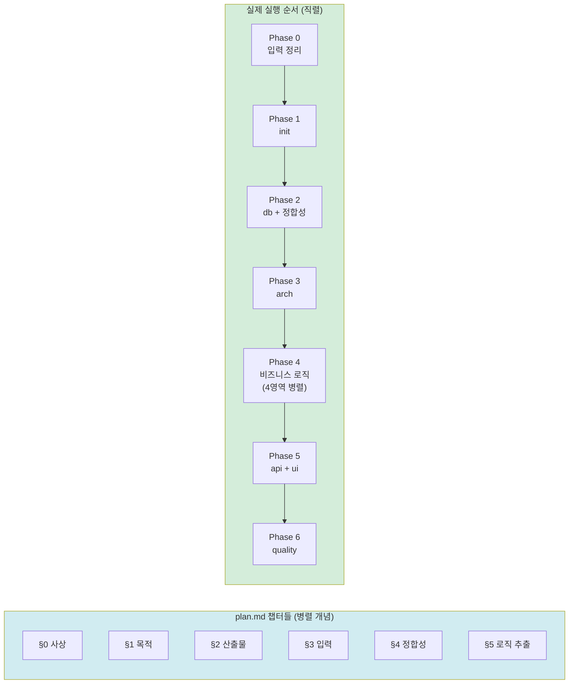

### 6.2 Phase별 입력/처리/출력 + 승인 게이트

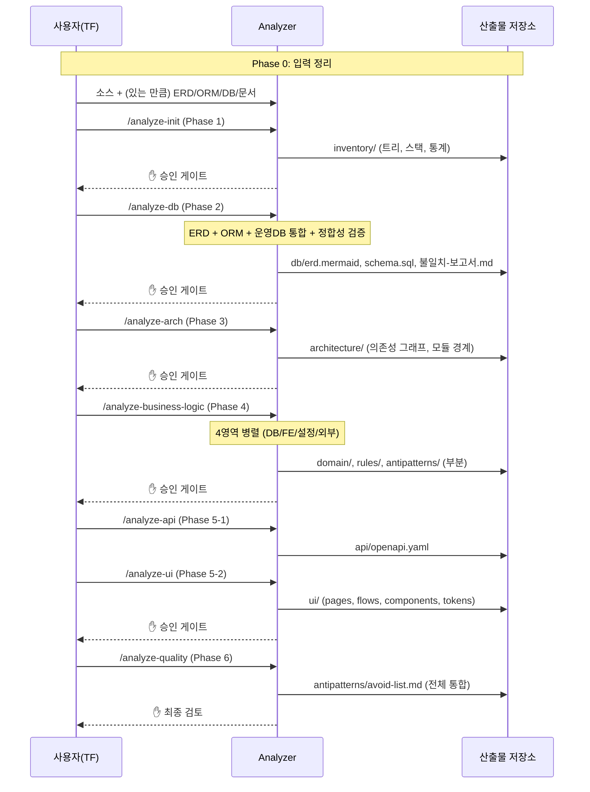

### 6.3 Phase별 상세 표

| Phase | 명령어 | 입력 | 핵심 처리 | 주 산출물 |
|---|---|---|---|---|
| 0 | (수동) | 소스 + 부가 자료 | 입력 정리 | - |
| 1 | `/analyze-init` | 레포 경로 | 트리, 매니페스트 | inventory/ |
| 2 | `/analyze-db` | ORM/migration/(ERD)/(운영DB) | 스키마 추출 + 정합성 검증 | db/, 불일치-보고서.md |
| 3 | `/analyze-arch` | inventory + 소스 | AST 의존성 그래프 | architecture/ |
| 4 | `/analyze-business-logic` | 1~3 결과 + 소스 | **4영역 병렬 추출** | domain/, rules/ (부분) |
| 5-1 | `/analyze-api` | 1~4 결과 + 소스 | OpenAPI 추출 + 도메인 ID 매칭 | api/openapi.yaml |
| 5-2 | `/analyze-ui` | 1~4 결과 + FE 소스 + 디자인 | UI/UX 명세 추출 | ui/ |
| 6 | `/analyze-quality` | 전체 결과 | 안티패턴 통합 + 검증 | antipatterns/ (전체) |

---

## §7. 자산화 구조 (3중 병행)

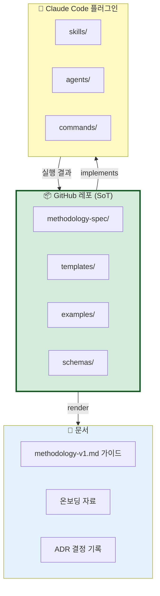

**역할**:
- **레포**: Single Source of Truth — 명세, 템플릿, 스키마
- **문서**: 레포의 docs/ 폴더 (별도 위키 안 씀, 위키는 인덱스만)
- **플러그인**: 레포 명세를 그대로 구현

---

## §8. 작업 범위

### 8.1 In Scope (v1.1)

- [ ] §0 사상적 기반 명시 (DDD-Lite + Schema-First + FSD)
- [ ] 7대 산출물 JSON Schema 정의
- [ ] 7대 산출물 마크다운 + Mermaid 템플릿
- [ ] 신뢰도 메타데이터 표준
- [ ] 다중 입력 프레임워크 (소스 + ERD + ORM + 운영DB + 문서)
- [ ] 출처 간 정합성 검증 (Phase 2)
- [ ] 비즈니스 로직 4영역 추출 (Phase 4)
- [ ] UI/UX 명세 추출 (Phase 5-2)
- [ ] 7개 phase 워크플로우 정의
- [ ] 단계별 승인 게이트 가이드
- [ ] Claude Code 플러그인 스켈레톤
- [ ] PoC용 예시 1개
- [ ] README + 온보딩 가이드

### 8.2 Out of Scope (v1.2 이후)

- ❌ Event Sourcing, CQRS, 풀 DDD
- ❌ 비기능 요구사항(NFR) 측정
- ❌ 테스트 코드 자동 분석
- ❌ 모든 언어 어댑터 (1차는 TS/JS, Java, Kotlin)
- ❌ 자동 재구현 (v3에서)
- ❌ CI 통합
- ❌ 멀티 레포 동시 분석

---

## §9. 다이어그램 표준

| 산출물 | 다이어그램 | 도구 |
|---|---|---|
| 아키텍처 | Component diagram (C4 Level 3) | Mermaid `flowchart` |
| 도메인 모델 | Class diagram | Mermaid `classDiagram` |
| 도메인 — 흐름 | Sequence diagram | Mermaid `sequenceDiagram` |
| API 계약 | Swagger UI 렌더 | swagger-ui |
| DB 스키마 | ERD | Mermaid `erDiagram` |
| 비즈니스 규칙 — 상태 | State diagram | Mermaid `stateDiagram-v2` |
| 안티패턴 | (다이어그램 없이 표 + 코드) | - |
| UI/UX — 사용자 흐름 | Flow diagram | Mermaid `flowchart` |
| UI/UX — 컴포넌트 트리 | Hierarchy diagram | Mermaid `flowchart` |

**원칙**: Mermaid는 텍스트 기반 → git diff 가능 → AI 생성 가능. PlantUML/draw.io는 의도적 배제.

### 9.1 작성 규칙 (Lessons Learned 반영)

다음은 v1.1 PoC 직전 발견된 실수에서 도출된 규칙이다:

| 규칙 | 잘못된 예 | 올바른 예 |
|---|---|---|
| **노드 ID는 영문** | `좋음["✅ 좋음"]` | `Good["✅ 좋음"]` |
| **한글은 라벨에만** | `정적 --> 통합` | `Static --> Merge` |
| **style 참조도 영문** | `style 변환 fill:#fff` | `style Transform fill:#fff` |

**근거**:
- 한글 노드 ID는 일부 환경(GitHub 옛 렌더러, 외부 도구)에서 깨짐
- AI 자동 생성 시 영문 ID 패턴이 더 안전
- grep/검색/리팩토링 시 영문 ID가 명확

**예외**: 아이콘/이모지는 라벨에서 OK (`A["✅ Good"]`).

---

## §10. 디렉토리 구조 (확정)

```
ai-native-methodology/                          (★ GitHub 레포)
├── docs/                                       📘 문서 자산
│   ├── methodology-v1.md
│   ├── onboarding.md
│   └── adr/
│       ├── ADR-001-사상적-기반.md
│       ├── ADR-002-7대-산출물.md
│       ├── ADR-003-신뢰도-메타데이터.md
│       ├── ADR-004-DDD-Lite-채택.md
│       └── ADR-005-한국어-용어-정책.md
│
├── methodology-spec/                           📦 명세 (SoT)
│   ├── deliverables/                           7대 산출물 명세
│   │   ├── 01-아키텍처.md
│   │   ├── 02-도메인-모델.md
│   │   ├── 03-API-계약.md
│   │   ├── 04-DB-스키마.md
│   │   ├── 05-비즈니스-규칙.md
│   │   ├── 06-안티패턴.md
│   │   └── 07-UI-UX-명세.md
│   ├── workflow/                               7단계 워크플로우 명세
│   │   ├── phase-0-입력정리.md
│   │   ├── phase-1-init.md
│   │   ├── phase-2-db.md
│   │   ├── phase-3-arch.md
│   │   ├── phase-4-비즈니스로직.md
│   │   │   ├── 5.A-DB영역.md
│   │   │   ├── 5.B-FE영역.md
│   │   │   ├── 5.C-설정영역.md
│   │   │   └── 5.D-외부의존성.md
│   │   ├── phase-5-1-api.md
│   │   ├── phase-5-2-ui.md
│   │   └── phase-6-quality.md
│   ├── id-conventions.md                       ID 표준
│   └── 한국어-용어집.md                          ⭐ NEW (영어 용어 한국어 매핑)
│
├── schemas/                                    📦 JSON Schema
│   ├── architecture.schema.json
│   ├── domain.schema.json
│   ├── openapi-extension.schema.json
│   ├── db-schema.schema.json
│   ├── rules.schema.json
│   ├── antipatterns.schema.json
│   ├── ui-spec.schema.json                     ⭐ NEW
│   └── meta-confidence.schema.json             신뢰도 메타데이터
│
├── templates/                                  📦 양식
│   ├── architecture.template.{md,mermaid}
│   ├── domain.template.{md,mermaid}
│   ├── erd.template.mermaid
│   ├── api.template.yaml
│   ├── rules.template.md
│   ├── antipatterns.template.md
│   └── ui-spec.template.{md,mermaid}           ⭐ NEW
│
├── plugin/                                     🔌 Claude Code 플러그인
│   └── .claude/
│       ├── skills/
│       │   ├── repo-inventory/
│       │   ├── multi-source-loader/            ⭐ NEW
│       │   ├── consistency-checker/            ⭐ NEW (정합성 검증)
│       │   ├── hierarchical-summarizer/
│       │   ├── dependency-extractor/
│       │   ├── db-schema-extractor/
│       │   ├── domain-extractor/
│       │   ├── 5a-db-logic-extractor/          ⭐ NEW (4영역)
│       │   ├── 5b-fe-logic-extractor/          ⭐ NEW
│       │   ├── 5c-config-policy-extractor/     ⭐ NEW
│       │   ├── 5d-external-dep-mapper/         ⭐ NEW
│       │   ├── api-contract-extractor/
│       │   ├── ui-spec-extractor/              ⭐ NEW
│       │   └── antipattern-detector/
│       ├── agents/
│       │   ├── code-reader.md
│       │   ├── architect-reviewer.md
│       │   ├── domain-analyst.md
│       │   ├── db-analyst.md
│       │   ├── consistency-analyst.md          ⭐ NEW
│       │   ├── fe-analyst.md                   ⭐ NEW
│       │   ├── ui-ux-analyst.md                ⭐ NEW
│       │   └── contract-writer.md
│       └── commands/
│           ├── analyze-init.md
│           ├── analyze-db.md
│           ├── analyze-arch.md
│           ├── analyze-business-logic.md       ⭐ NEW
│           ├── analyze-api.md
│           ├── analyze-ui.md                   ⭐ NEW
│           ├── analyze-quality.md
│           └── analyze-full.md
│
├── examples/                                   📦 PoC 결과
│   └── poc-01-{이름}/
│       └── output/                             7대 산출물 실물
│
├── .claude-plugin/
│   └── marketplace.json                        사내 plugin 배포
└── README.md
```

---

## §11. 한국어 용어 정책 (NEW)

### 11.1 원칙
- 사내 표준 방법론은 **한국어를 1차 언어**로 한다
- 산업 표준 용어(OpenAPI, JSON Schema 등)는 **그대로 사용**
- DDD 어휘(Entity, Aggregate 등)는 **영문 + 한국어 병기**
- 영어 약어(Drift, Cross-Cutting 등)는 **한국어로 번역 또는 폐기**

### 11.2 용어 매핑 표

| 영어 | 한국어 | 비고 |
|---|---|---|
| ~~Schema Drift Detection~~ | 출처 간 정합성 검증 | drift = 불일치 |
| ~~Cross-Cutting Business Logic~~ | (폐기) | 4영역으로 분리 |
| Schema-First | 스키마 우선 | |
| Contract-First | 계약 우선 | |
| Confidence Metadata | 신뢰도 메타데이터 | |
| Bounded Context | 도메인 경계 (Bounded Context) | DDD 원어 병기 |
| Aggregate | 집합체 (Aggregate) | DDD 원어 병기 |
| Entity | 엔티티 (Entity) | DDD 원어 병기 |
| Use Case | 유스케이스 (Use Case) | |
| Ubiquitous Language | 보편 언어 | |
| Cardinality | 관계 수 (cardinality) | ERD 용어 |
| OpenAPI | OpenAPI | 산업 표준, 그대로 |
| JSON Schema | JSON Schema | 산업 표준, 그대로 |

---

## §12. 리스크와 대응

### R1. 컨텍스트 윈도우 한계
**대응**: AST 분해 + bottom-up 4계층 요약 (학계 검증 패턴)

### R2. 입력 가변성
**대응**: 신뢰도 메타데이터 + graceful degradation

### R3. 산출물 노화
**대응**: `generated_at` + `source_commit_sha` 메타. 변경 감지 시 재분석 표시

### R4. 시니어 BE 저항
**대응**:
- 모든 산출물 = git diff 가능
- 안티패턴 톤 = "회피 후보"
- 단계별 승인 게이트
- DDD-Lite (풀 DDD 강요 X)
- 한국어 용어

### R5. 방법론과 도구 불일치
**대응**: 레포가 SoT, 변경은 레포 PR로만

### R6. PoC 1개로 일반화 가능성
**대응**: PoC 후 두 번째 프로젝트 적용. Lessons Learned로 v1.2 개정

### R7. ⭐ NEW — 비즈니스 규칙 추출의 근본적 한계
**대응**:
- 비즈니스 규칙 신뢰도는 절대 100%가 안 됨을 명시
- "코드는 What만 있고 Why는 없음"
- 사람 검토 게이트를 비즈니스 규칙 산출물에 강제
- 도메인 전문가 인터뷰 권장 (산출물에 명시)

### R8. ⭐ NEW — UI/UX 명세 자동 추출의 한계
**대응**:
- 라우팅·컴포넌트 트리는 결정적 추출 가능 (90%)
- 디자인 시스템 토큰은 코드 품질에 의존 (좋은 케이스 90%, 나쁜 케이스 30%)
- 사용자 시나리오는 LLM 추론 (60%) → 기획자 검토 필수
- 추출 신뢰도 영역별 명시

---

## §13. 마일스톤

| 단계 | 산출물 | 검증 |
|---|---|---|
| M0 | plan.md v1.1 + research.md | 본 문서 + Open Questions 해결 |
| M1 | 7대 산출물 JSON Schema + 템플릿 | Schema lint, 샘플 검증 |
| M2 | 7단계 워크플로우 정의서 | 각 phase 입력/출력 명세 |
| M3 | 플러그인 스켈레톤 + 샘플 skill 2개 | Claude Code 호출 동작 확인 |
| M4 | PoC 적용 (오픈소스 또는 사내 소규모) | 7대 산출물 모두 생성 + 검토 통과 |
| M5 | 방법론 v1 문서화 (README + 온보딩) | TF 멤버 1명이 가이드만 보고 재현 가능 |

---

## §14. Open Questions (3원칙 승인 전 확인 필요)

1. **PoC 시드**: 오픈소스(Spring PetClinic 등) vs 사내 소규모. 어느 쪽?
2. **버전 관리**: SemVer (v1.1.0) vs CalVer (2026.04). 사내 운영 관점?
3. **harness-engineering-study와의 관계**: 본 레포가 라이프사이클 전체 상위, harness가 ③ Reconstruct 챕터로 흡수? 아니면 sister-repo?
4. **기획·디자인 입력 형식**: 사내에서 표준이 있나? 없다면 어디까지 우리가 정의?
5. **DDD-Lite 강도**: 옵션 A(어휘만) / B(전술 패턴) / C(전략 설계 가볍게). v1.1은 B 권장 — 동의?

---

## §15. Lessons Learned

### v1.0 → v1.1 갱신 시 학습 내용
- **영어 약어 함정**: "Cross-Cutting", "Drift" 같은 영어 용어가 사내 채택 저항을 만든다. 한국어 1차 정책 채택.
- **FE 영역 누락**: 6대 산출물에 UI/UX가 빠졌다. 분석 대상에 FE가 포함되면 7대로 확장 필요.
- **비즈니스 로직의 분산성**: 한 영역(Domain)에 갇혀있지 않다. DB/FE/설정/외부 4영역 분산이 현실.
- **사상적 기반 명시 누락**: "DDD인가?" 같은 질문이 나오는 건 사상이 §0에 명시 안 됐다는 신호.
- **보강 항목 vs Phase 혼동**: 챕터 목차(병렬)와 실행 순서(직렬)는 다른 차원. 명확히 구분.

### v1.1 스켈레톤 작성 후 발견 (M1 → A-1)
- **Mermaid 노드 ID 표준 사전 채택**: 한국어 1차 정책을 그대로 다이어그램에 적용하면 노드 ID에 한글을 쓰게 된다. 일부 렌더러에서 깨지고 AI 자동 생성 시 불안정. 작성 시점에 **노드 ID는 영문, 라벨은 한글** 표준을 §9.1에 명시하여 사전 적용. 사용자 검토 시 "Mermaid 에러 없나?" 질문에서 추가 검증 진행.
- **검증 도구의 환경 의존성**: Mermaid CLI가 Chrome 의존이라 환경에서 동작 X (Chrome 미설치). 우회로 자체 정규식 syntax 검증 시도 → **두 차례 false positive 발생** (정규식이 점선 화살표 라벨 `-.|...|.->` 처리 부정확). 23개 블록 모두 사실 §9.1 표준 준수 상태였음. **교훈**: 자동 검증 도구 자체의 신뢰도 검증이 우선. PoC에서 외부 도구(linter, schema validator) 도입 시 도구 자체 검증부터.
- **검증의 정직성 원칙**: false positive를 알아챘을 때 사용자에게 즉시 보고. 잘못된 검증 결과로 멀쩡한 산출물을 수정하면 회귀 위험. **3원칙(승인) + 4원칙(실패 revert)을 도구 검증에도 적용**.

(다음 실패 시 본 섹션에 추가)
