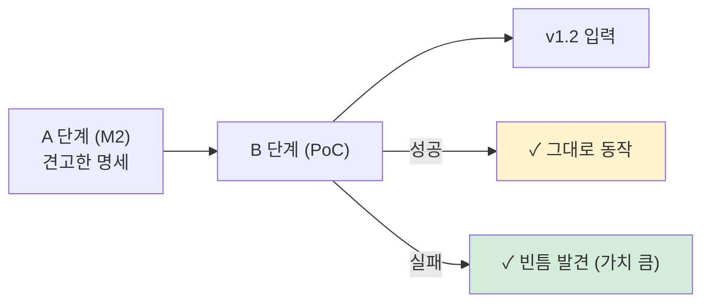
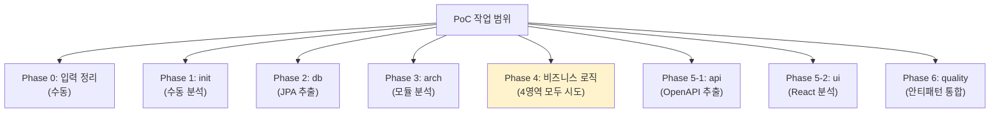

# Plan: PoC — RealWorld example app에 v1.1 방법론 수동 적용

> 작성일: 2026-04-26
> 작성자: 윤주스 (TF Lead)
> 적용 원칙: Work Principles 4원칙
> 상위 plan: plan-methodology-v1.1.md
> 시드 결정: ADR + 윤주스 결정 (RealWorld 풀스택)

---

## §1. 목적

v1.1 방법론(M2 완료)을 **종이에서 실전으로** 옮긴다.

**진짜 목적**: 명세를 검증하는 게 아니라 **명세의 빈틈을 발견**하는 것. PoC 성공이 아니라 **잘 실패하기**가 가치.



**기준**: "명세 빈틈을 N개 발견했는가?" → N이 0이면 PoC 자체가 의심스러움 (정직한 검증 안 함). N이 5~15개면 건강한 검증.

---

## §2. 시드 — RealWorld example app

### 2.1 무엇

[RealWorld](https://github.com/gothinkster/realworld) — Medium 클론 (Conduit). 풀스택 (FE + BE + DB).

### 2.2 왜 적합

| 기준 | RealWorld 충족도 |
|---|---|
| 풀스택 | ✅ FE + BE + DB |
| 적당한 규모 | ✅ 모놀리스, 5도메인 정도 |
| 다양한 구현 (Java/Kotlin/Node 등) | ✅ 수십 개 구현체 존재 |
| 외부 의존성 부재 | ✅ 깔끔 (PG/SMS 없음) |
| ORM 사용 | ✅ 대부분 ORM (JPA/Sequelize/Prisma) |
| 인증 시스템 | ✅ JWT 기반 |
| 도메인 명확 | ✅ Articles, Users, Comments, Tags, Follow |

### 2.3 한계 (의식)

| 한계 | 영향 | 대응 |
|---|---|---|
| 모놀리스 | Bounded Context 분리 가치 적음 | DDD-Lite B만 적용 (이미 채택) |
| 외부 의존성 적음 | 5.D 추출 가치 적음 | 5.D는 빈약 결과를 그대로 인정 |
| ERD 문서 없음 | 다중 입력 검증 불가 | 신뢰도 메타에 명시, 검증 한 번 더 못 함 |
| 비즈니스 규칙 적음 | 5.A/5.B/5.C에서 크게 발견 안 됨 | 발견된 만큼만 정직히 |
| 한국 엔터프라이즈와 다름 | 사내 적용 시 예측치 다를 수 있음 | Lessons Learned에 명시 |

### 2.4 구현체 선택 (확정 — 2026-04-26)

#### 2.4.1 BE 시드: `raeperd/realworld-springboot-java`

**확정 결정**: [raeperd/realworld-springboot-java](https://github.com/raeperd/realworld-springboot-java)

선택 근거:
- ✅ **Java 11 + Spring Boot** — 사내 환경(Spring Boot)과 호환
- ✅ **Spring Data JPA** — ORM 자동 감지 시나리오 적합
- ✅ **Spring Security + JWT** — 인증/권한 추출 케이스
- ✅ **우아한형제들 기술블로그 영향** — 한국 엔터프라이즈 패턴
- ✅ **Article을 `@Embedded` 클래스로 구성** — Aggregate 추출 검증 좋은 케이스
- ✅ **POJO 도메인 + Spring 어노테이션 분리** — Clean Architecture 영향, 도메인 추출 명확
- ✅ **Postman collection + API test 포함** — Phase 5-1 검증 ground truth
- ✅ **JaCoCo 커버리지 100% 추구** — 코드 품질↑, 분석 정확도↑
- ✅ **draw.io 아키텍처 다이어그램 (User/Article/JWT)** — Phase 3 검증의 ground truth

타 후보 비교:
| 후보 | Java | ORM | 채택 안 한 이유 |
|---|---|---|---|
| 1chz/realworld-java21-springboot3 | 21 | JPA | Java 21이 사내보다 너무 최신 |
| **raeperd/realworld-springboot-java** | **11** | **JPA** | ⭐ **사내 환경과 가장 일치 + 다이어그램/테스트 풍부** |
| gothinkster 공식 | 11 | MyBatis + GraphQL | REST 명세 검증과 다름 (GraphQL) |

#### 2.4.2 FE: 본 PoC 미포함

**확정 결정**: BE만 진행. FE는 다음 PoC 또는 별도 세션.

이유:
- 4시간 시간 제약 (BE+FE는 8시간)
- 첫 PoC는 작은 단위로 시작
- FE 구현체 후보 (yurisldk/realworld-react-fsd 등)는 다음 세션을 위해 기록만

---

## §3. 작업 범위

### 3.1 In Scope



각 Phase는 **수동으로** 명세를 보고 산출물 생성. 자동화 X (= 플러그인 X).

### 3.2 Out of Scope

- ❌ 플러그인 구현 (다음 단계)
- ❌ ORM 메서드 가드 100% 추출 (충분히 발견되면 OK)
- ❌ 모든 컴포넌트 분류 (Atomic Design 1차만)
- ❌ 디자인 토큰 완벽 추출
- ❌ 사용자 시나리오 5개 초과
- ❌ 운영 DB 메타 분석 (RealWorld는 운영 환경 없음)

---

## §4. 어떻게 진행하나 — 8단계 체크리스트

### Phase 0: 입력 정리

```
□ RealWorld 레포 git clone (BE)
□ RealWorld 레포 git clone (FE)
□ .ai-analysis/ 디렉토리 구조 생성
□ domain-context.md 작성 (Medium 클론, 5도메인 등 명시)
□ 추가 입력은 없음 명시 (ERD 없음, 운영DB 없음)
```

### Phase 1: init

```
□ 디렉토리 트리
□ 파일 통계 (LOC)
□ 스택 식별 (Spring Boot, JPA, React 등)
□ ORM 자동 감지 (JPA 발견)
□ 산출물: inventory/inventory.json, tree.md, stack-detection.md
```

### Phase 2: db

```
□ JPA @Entity에서 테이블 추출
□ schema.sql 생성
□ erd.mermaid 생성
□ 정합성 검증 — 단일 출처라 N/A 명시
□ 산출물: db/schema.{sql,json}, erd.mermaid
```

### Phase 3: arch

```
□ 모듈 식별 (article, user, comment, tag 등)
□ 의존성 그래프
□ 순환 의존성 검사
□ 모듈 ↔ 테이블 매핑
□ 외부 의존성 확인 (거의 없을 것)
□ 산출물: architecture/architecture.{json,md,mermaid}
```

### Phase 4: 비즈니스 로직 (4영역)

```
□ 5.A DB 영역
   □ JPA 엔티티 메서드 가드 추출
   □ Repository 추출
   □ Aggregate 식별 (cascade 분석)
□ 5.B FE 영역
   □ React form validation 추출
   □ 권한 분기 추출
   □ 라우팅 가드
□ 5.C 설정 영역
   □ application.yml 매직 넘버
□ 5.D 외부 의존성
   □ 외부 API 호출 (거의 없을 것 → 빈약 결과 인정)
□ 통합
   □ domain.json 완성 (DDD-Lite B)
   □ rules.json 완성
   □ 충돌 검사
   □ 도메인 전문가 인터뷰 질문 자동 생성
```

### Phase 5: api + ui (병렬)

```
□ Phase 5-1 api
   □ Controller 어노테이션 추출
   □ OpenAPI 3.1 작성
   □ x-related-rules 매핑
□ Phase 5-2 ui
   □ React 라우트 추출
   □ 컴포넌트 트리 (Atomic / FSD 자동 감지)
   □ 디자인 토큰 (Tailwind 또는 CSS)
   □ 사용자 시나리오 (3개 정도)
```

### Phase 6: quality

```
□ 안티패턴 통합
□ 톤 점검
□ 산출물 발행
```

---

## §5. 명세 빈틈 발견 — 기록 방식

### 5.1 발견 시 즉시 기록

PoC 진행 중 **명세에 없는 결정**을 해야 할 때마다 즉시:

```yaml
# .claude/poc-findings.md
- finding_id: F-001
  phase: 4 (5.A)
  description: "ORM @ManyToOne 의 Aggregate 처리 명세 부재"
  context: "Article ↔ User는 cascade 없음. Article을 따로 Aggregate Root로 봐야 하나?"
  decision_made: "별도 Aggregate Root로 처리"
  decision_basis: "DDD-Lite B 권장: cascade 없으면 별도 Aggregate"
  spec_gap: "02-도메인-모델.md §3.1에 'cascade 없는 ManyToOne' 규칙 부재"
  proposed_fix: "ADR-004 또는 02-도메인-모델 명세에 명시 추가"
```

### 5.2 PoC 종료 시 통합

`.claude/poc-findings.md`의 모든 항목을 plan §15 Lessons Learned로 옮김.

---

## §6. 시간 예측

| Phase | 예상 시간 | 비고 |
|---|---|---|
| 0 + 1 | 30분 | 입력 정리 + 인벤토리 |
| 2 | 30분 | DB 추출 |
| 3 | 30분 | 아키텍처 |
| 4 (4영역) | 1.5시간 | 가장 큰 단계 |
| 5-1 + 5-2 | 1시간 | API + UI |
| 6 | 30분 | 통합 + 정리 |
| **합계** | **약 4시간** | 한 세션 분량 |

⚠️ 한 세션에 다 못 끝나면 **Phase 단위로 끊고 재개**.

---

## §7. 산출 디렉토리

```
ai-native-methodology/
└── examples/
    └── poc-01-realworld-spring/        ⭐ NEW
        ├── README.md                    (PoC 개요)
        ├── source-info.md               (분석 대상 레포 정보)
        ├── inputs/                      (Phase 0)
        │   └── domain-context.md
        ├── output/                      (Phase 1~6 산출물)
        │   ├── inventory/
        │   ├── db/
        │   ├── architecture/
        │   ├── domain/
        │   ├── rules/
        │   ├── api/
        │   ├── ui/
        │   └── antipatterns/
        └── findings/                    ⭐ 핵심
            └── poc-findings.md          (명세 빈틈)
```

---

## §8. 성공 기준

### 8.1 정량 기준

```
□ 7대 산출물 모두 생성 (빈약해도 OK)
□ 신뢰도 메타데이터 모두 명시
□ poc-findings.md에 5건 이상의 빈틈 발견
   (0건이면 정직한 검증 X 의심)
   (20건 이상이면 명세 자체가 부실)
```

### 8.2 정성 기준

```
□ 4원칙 사이클 한 번 완성 (plan → research → 적용 → Lessons Learned)
□ 다음 PoC(사내 진짜 레포)에 적용 가능한 형태
□ TF 멤버에게 "이렇게 한다"고 시연 가능
```

---

## §9. 리스크

### R-PoC-1. RealWorld가 너무 단순해서 빈틈 발견 부족

**증상**: 모놀리스 + 외부 의존성 부재 → 5.D, 복합 안티패턴 발견 부족

**대응**:
- RealWorld의 한계를 §2.3에 미리 명시
- 빈약 발견은 정직히 인정
- 사내 진짜 레포로 다음 PoC 권장

### R-PoC-2. 4시간 안에 못 끝남

**증상**: Phase 4가 의도보다 큼

**대응**:
- Phase 단위로 세션 분리
- 명세 발견 우선, 산출물 완성도 후순위

### R-PoC-3. 윤주스님이 직접 분석 vs Claude가 분석

**증상**: 누가 실제로 PoC를 수행하는가?

**대응 옵션**:
- A: 윤주스님이 명세 보고 직접 (최고 품질의 빈틈 발견, 시간 큼)
- B: 윤주스님이 시키고 Claude가 분석 (빠름, 빈틈 발견 약함)
- C: 합동 (Claude가 1차 → 윤주스님 검토 → 빈틈 기록)
- ⭐ 권장: **C 합동**

→ §10 Open Question에서 결정

---

## §10. Open Questions (3원칙 승인 전)

1. **누가 분석 수행?** A(윤주스 직접) / B(Claude) / C(합동) 중. 권장: C
2. **PoC 적용 깊이**: 풀스택 (BE+FE) vs BE만 vs FE만. 권장: BE만 시작 → FE 추가
3. **세션 분리**: 한 번에 다 vs Phase 단위로 끊기. 권장: Phase 단위
4. **외부 레포 접근**: web_fetch로 RealWorld 코드 직접 분석 vs 가상 시나리오. 권장: web_fetch

---

## §11. Lessons Learned (PoC 완료 후 채워질 영역)

(현재 비어있음 — PoC 진행 중 채워짐)

이 섹션은 PoC 종료 시 다음으로 채워짐:
- 명세 빈틈 N개의 요약
- v1.2로 옮길 항목 목록
- 다음 PoC 권장 사항
