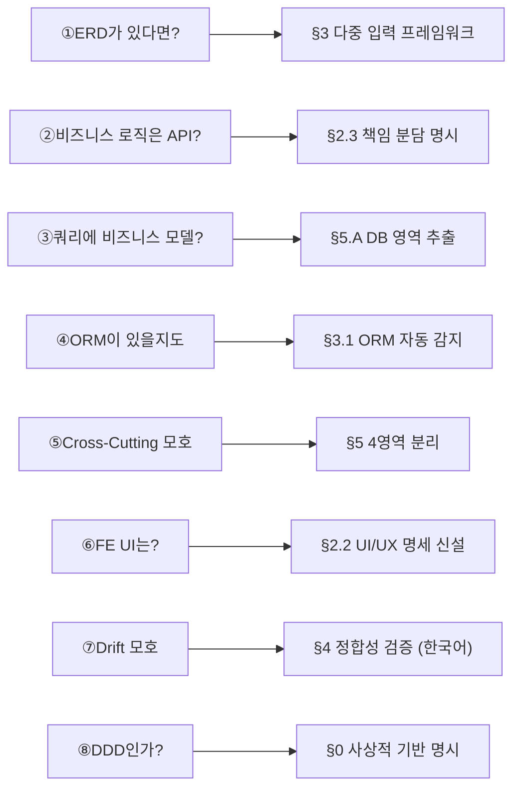
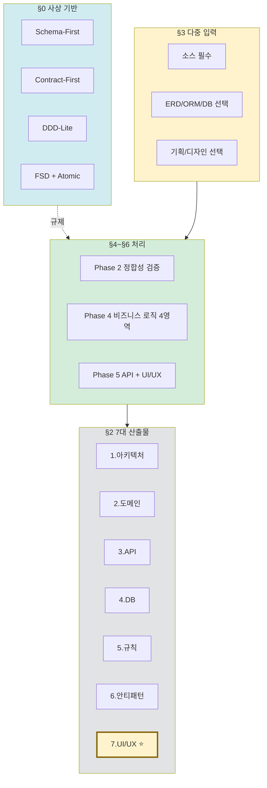
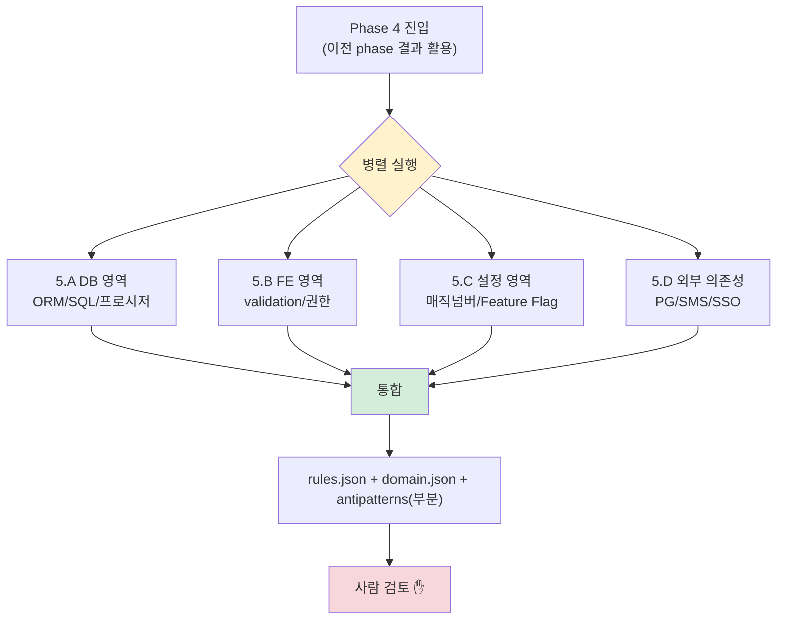
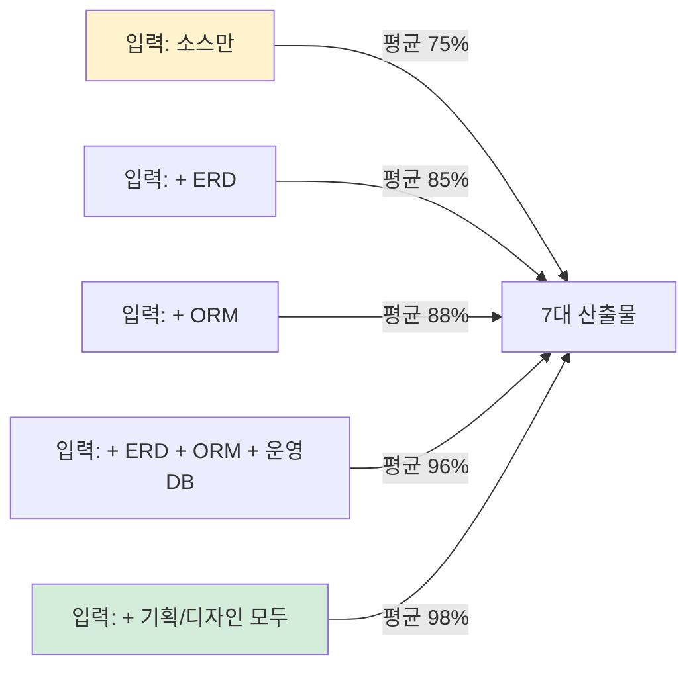

# Research: AI-Native 개발 방법론 v1.1 — 3-Agent Discussion (갱신)

> 본 문서는 v1.0 토론 결과에 사용자 피드백 6가지를 반영한 갱신본이다.
> 사전 자료: Hierarchical Code Summarization (TCS Research ICSE 2025, HCGS arXiv:2504.08975), Schema-First/Contract-First 산업 사례, DDD (Eric Evans), FSD (Feature-Sliced Design), 한국 엔터프라이즈 레거시 패턴.

---

## v1.0 → v1.1 변경 요약

사용자 윤주스님이 6번의 추가 질문으로 다음 보강을 요청:

8개 질문, 8개 보강 (일부 합쳐져 6개 항목으로 정리).

---

## Round 7 (NEW): 사상적 기반 — DDD-Lite 채택

**📘 공식문서 리서처**: 사용자가 "DDD인가?"를 물었다는 건 사상이 명시 안 됐다는 신호. 명시화 필요.

**🏢 사례 리서처**: Eric Evans의 DDD 원전, Vaughn Vernon의 Implementing DDD를 보면 풀 DDD는 학습 곡선이 매우 가파르다. 산업계 채택률이 낮은 이유. 반면 DDD 어휘만 차용하는 "DDD-Lite" 패턴은 광범위하게 사용됨. Spring 진영, 닷넷 진영 모두.

**🎯 Senior Engineer**: 한국 엔터프라이즈 레거시 99%는 Anemic Domain Model + Layered Architecture다. 풀 DDD를 들이대면 분석 자체가 불가능해진다 — 추출할 Aggregate가 없으니까. 우리 방법론은 **DDD를 강제하지 않고 차용**하는 게 맞다.

**합의 ✅** — 4단 사상 스택:
1. **Schema-First** (주축, 협상 불가)
2. **Contract-First** (API 영역)
3. **DDD-Lite** (도메인 어휘 + 일부 전술 패턴)
4. **FSD + Atomic Design** (FE 영역)

명시적 제외:
- Event Sourcing, CQRS, Saga, ACL — v1에서 안 함
- 풀 DDD — 학습 곡선/저항 우려

---

## Round 8 (NEW): 7대 산출물로 확장 — UI/UX 명세 신설

**🎯 Senior Engineer**: 6대 산출물에 화면·UX 영역이 빠진 건 큰 구멍. 분석 대상이 FE+BE+DB+기획+디자인인데 산출물은 BE-편향됨.

**📘 공식문서 리서처**: FSD (Feature-Sliced Design), Atomic Design은 FE 진영의 사실상 표준. UI 명세를 다이어그램화할 표준 형식 존재 (Mermaid flowchart, Storybook).

**🏢 사례 리서처**: Figma의 dev mode, Storybook, 디자인 토큰(W3C Design Tokens Community Group 표준) 등 추출 가능한 출처가 다양해짐.

**합의 ✅** — UI/UX 명세를 7번째 산출물로 신설. 5개 하위 항목:
- 페이지 인벤토리
- 사용자 흐름 (User Flow)
- 컴포넌트 트리 (Atomic Design 또는 FSD)
- 디자인 토큰
- 사용자 시나리오

---

## Round 9 (NEW): 비즈니스 로직 4영역 분리

**🎯 Senior Engineer**: "Cross-Cutting Business Logic"이라는 영어 묶음은 너무 추상적. 사용자가 "이게 뭐야?"를 묻는 게 신호. 영역별로 분리하면 각자 다른 도구·다른 검토자·다른 산출물 라우팅이 명확해진다.

**📘 공식문서 리서처**: 4영역 각자 추출 도구가 다르다.
- DB 영역: Tree-sitter, MyBatis 파서, JPA 어노테이션
- FE 영역: yup/zod 파서, JSX AST, Tailwind 추출
- 설정 영역: YAML/properties 파서, Feature Flag SDK
- 외부 의존성: HTTP 클라이언트 호출 추적

**🏢 사례 리서처**: 실무 레거시에서 비즈니스 로직 분산 비율이 검증된다. 예시:
- 한 주문 정책이 5곳에 흩어진 케이스 (Service + SQL CASE + 설정 매직넘버 + FE validation + PG 호출)
- 추출이 4영역 동시에 안 되면 누락 발생

**합의 ✅** — Phase 4를 4영역 병렬 처리로 설계:
- 5.A: DB 영역 (ORM/SQL/프로시저)
- 5.B: FE 코드 영역 (validation/권한 분기)
- 5.C: 설정/환경 정책
- 5.D: 외부 의존성 매핑

각 영역이 7대 산출물에 다른 비율로 흘러 들어감. **단 산출물은 통합**.

---

## Round 10 (NEW): 한국어 용어 정책

**🎯 Senior Engineer**: 사용자가 "Cross-Cutting", "Drift" 같은 영어 약어를 두 번 이상 되물었다. 사내 표준 자산이라면 한국어 1차로 가야 한다. 영어 약어는 컨퍼런스 발표에는 어울려도 사내 위키엔 안 어울린다.

**📘 공식문서 리서처**: OpenAPI, JSON Schema 같은 산업 표준 용어는 한국어 변환 시 오히려 가독성 떨어짐. **선택적 한국어화** 정책이 맞다.

**🏢 사례 리서처**: 토스, 카카오, 네이버 기술 블로그의 사내 문서 패턴을 보면:
- 산업 표준 용어 → 그대로 (OpenAPI, REST, JSON Schema)
- 학계/방법론 용어 → 영문+한글 병기 (Aggregate, Bounded Context)
- 자체 만든 약어 → 한국어 우선 (drift → 불일치)

**합의 ✅** — 3단 정책:
1. 산업 표준: 그대로 (OpenAPI, JSON Schema)
2. 학계/방법론: 영문+한글 병기 (Aggregate, Entity)
3. 자체 약어: 한국어 우선 (Schema Drift → 출처 간 정합성 검증)

§11 한국어 용어 정책 신설.

---

## Round 11 (NEW): 보강 항목 vs Phase 워크플로우 명확화

**🎯 Senior Engineer**: 사용자가 "1번부터 순서대로 진행되는 건가?"를 물었다는 건 plan.md 챕터(병렬 개념)와 실행 워크플로우(직렬 개념)가 같은 번호 체계로 표현돼 헷갈렸다는 뜻.

**📘 공식문서 리서처**: 두 차원을 명확히 분리:
- plan.md 챕터 = §0~§15 (문서 구성)
- 실행 phase = Phase 0~6 (사용자 명령 순서)

**합의 ✅** — §6.1에 명시적 그림 추가. 두 차원이 직교적임을 분명히.

---

## Round 12 (NEW): ERD 처리 — Phase 순서 변경

**🏢 사례 리서처**: ERD가 있을 때 분석 효율이 크게 달라진다. ERD가 도메인 골격이 되면 후속 분석이 모두 빨라진다.

**🎯 Senior Engineer**: 기존 v1.0의 phase 순서 `init → arch → db → domain → api → quality`는 ERD가 있을 때 비효율적. **ERD/DB가 도메인보다 먼저** 처리되어야 한다.

**합의 ✅** — Phase 순서 조정:
- v1.0: init → arch → db → domain → api → quality
- v1.1: init → **db** → **arch** → 비즈니스 로직 → api+ui → quality

이유:
- ERD는 모듈 경계의 강력한 힌트 (테이블 그룹 ≈ Bounded Context)
- 아키텍처 분석 시 "이 모듈이 어떤 테이블 영역을 다루는가" 매핑 용이
- 코드 클래스명과 테이블명이 다른 경우 매핑 표 일찍 확보

---

## Round 13 (NEW): 비즈니스 규칙 추출의 근본 한계 (R7)

**🎯 Senior Engineer**: 이건 plan.md에 강하게 박아야 한다. **비즈니스 규칙 신뢰도는 절대 100%가 안 된다**. 코드는 "무엇(What)"만 보여주지 "왜(Why)"를 안 보여준다.

예: `if (user.age >= 19)` 코드만 보고:
- 청소년보호법 준수인지
- 회사 정책인지
- 옛 정책 잔재인지
- 알 수 없음

**📘 공식문서 리서처**: 학계도 같은 한계를 인정. TCS Research도 "domain context grounding"으로 보강하지만 100%는 아님.

**합의 ✅** — R7로 신설:
- 비즈니스 규칙 산출물에 사람 검토 게이트 강제
- 도메인 전문가 인터뷰 권장 (산출물에 명시)
- 신뢰도가 0.7 이상이어도 "검토 필수" 표시

---

## 최종 합의 — v1.1 방법론 7원칙 (헌법 갱신)

v1.0의 7원칙에 사상 + UI 추가:

1. **사상 명시**: Schema-First + Contract-First + DDD-Lite + FSD ⭐ NEW
2. **Bottom-up Always**: Function → File → Module → System
3. **Deterministic First, LLM Second**: AST/의존성/스키마는 결정적
4. **File System as Memory**: 단계 간 통신은 파일
5. **Confidence as First-Class**: 신뢰도 + 출처 + 검토 영역 명시
6. **Human-in-the-loop**: 단계마다 승인 게이트
7. **Single Source of Truth = Repo**: 문서/플러그인은 레포 파생
8. **한국어 1차** ⭐ NEW: 영어 약어 최소화, 산업 표준은 예외

---

## 종합 다이어그램

### A. v1.1 전체 구조

### B. Phase 4 — 비즈니스 로직 4영역 병렬

### C. 산출물 신뢰도 매트릭스

---

## v1.1 Open Questions (사용자 확인 필요)

1. **PoC 시드**: 오픈소스(Spring PetClinic 등) vs 사내 소규모. 어느 쪽?
2. **버전 관리**: SemVer vs CalVer
3. **harness-engineering-study와의 관계**: 흡수 vs sister-repo
4. **기획·디자인 입력 형식**: 사내 표준 유무
5. **DDD-Lite 강도**: A(어휘만) / B(전술 패턴) / C(전략 설계 가볍게). v1.1 권장 = B
