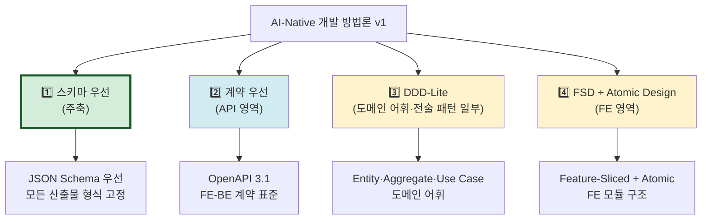

# ADR-001: 사상적 기반 — Schema-First + Contract-First + DDD-Lite + FSD

- 상태: 승인됨 (Accepted)
- 일자: 2026-04-26
- 결정자: 윤주스 (TF Lead)
- 관련: ADR-002, ADR-003, ADR-004, ADR-005

## 컨텍스트

AI-Native 개발 방법론의 **사상적 기반이 명시되지 않았다**. "DDD인가?", "Schema-First인가?" 같은 질문이 반복되는 건 §0에 사상이 명시 안 됐다는 신호이다.

방법론이 어떤 기술 사상에 뿌리를 두는지 선택해야 한다.

## 결정

**4가지 사상을 계층적으로 채택**한다.

### 사상 스택

### 채택 근거

| 사상 | 채택 | 출처 |
|---|---|---|
| Schema-First | 주축 | Microsoft TypeSpec, OpenAPI 산업 표준 |
| Contract-First | API 영역 | Hazelcast, Technijian 등 산업 사례 |
| DDD-Lite (B 강도) | 도메인 영역 | Eric Evans DDD, 풀 DDD 의도적 제외 |
| FSD + Atomic Design | FE 영역 | Feature-Sliced Design, Brad Frost Atomic Design |

### Schema-First를 주축으로 채택한 이유

- AI와 사람 모두에게 명확한 인터페이스 제공
- 산업계 표준으로 검증됨 (Microsoft TypeSpec, Technijian 등)
- 모든 산출물의 형식을 JSON Schema로 고정 → 기계 검증 가능

### DDD-Lite를 채택한 이유

- 도메인 어휘는 시니어 BE에게 익숙
- 단, 풀 DDD는 채택 저항 발생 우려
- 강도는 ADR-004에서 B(전술 패턴까지)로 결정

### FSD를 채택한 이유

- FE 진영의 사실상 표준
- Atomic Design과 자연 호환
- 컴포넌트 계층 구조 분석에 적합

## 명시적 제외

| 제외 | 이유 |
|---|---|
| Event Sourcing | 특정 시스템에만 적합. 레거시는 거의 미적용 |
| CQRS | 명령/조회 분리는 v1.2 이후 검토 |
| 풀 DDD (Saga, ACL 등) | 학습 곡선↑, 시니어 저항↑ |
| 비기능 요구사항 측정 | 운영 환경 측정 영역 (코드 분석 밖) |
| 테스트 코드 자동 분석 | v1.2 이후 |

## 결과

### 긍정적 영향
- 모든 산출물이 JSON Schema로 형식 고정 → 기계 검증 가능
- API 영역은 OpenAPI 3.1 산업 표준 → 외부 도구 호환
- 도메인 어휘가 통일 → 팀 내 커뮤니케이션 개선
- FE 영역도 분석 범위에 포함 → 7대 산출물 중 UI/UX 명세(#7) 가능

### 부정적 영향 / 위험
- 4개 사상의 경계가 모호할 수 있음 → 산출물별 책임 분담(ADR-002)으로 해결
- 풀 DDD 미채택 → 마이크로서비스 분리 가이드 부족 (v1.2 ADR-004 확장으로 대응)

## 참고

- v1.1 plan §0 (사상적 기반) — 1차 사료, git history 참조 (commit `c72d29c` 이전 `methodology-v1.1/.claude/`)
- v1.1 research (3-에이전트 토론) — 1차 사료, git history 참조
- Microsoft TypeSpec: https://typespec.io
- Feature-Sliced Design: https://feature-sliced.design
