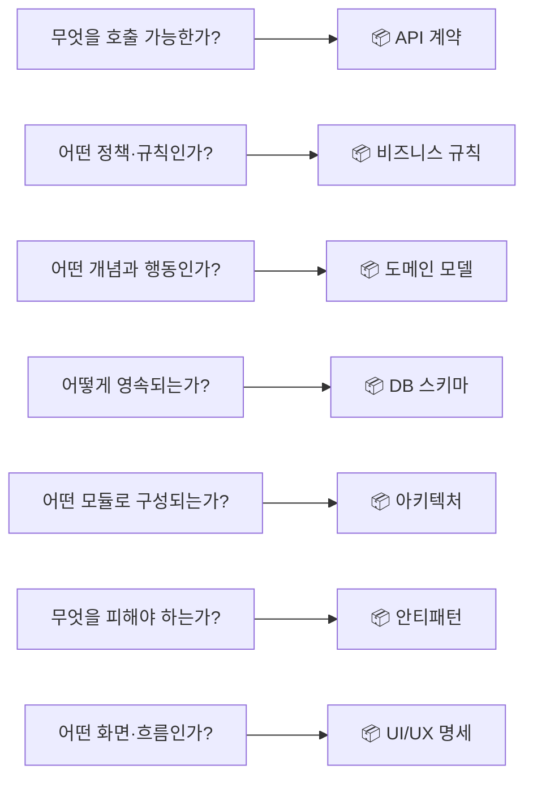
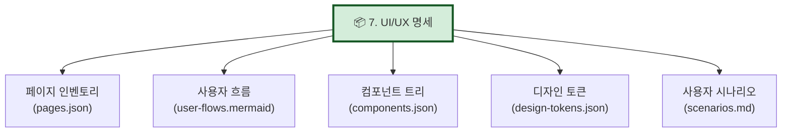
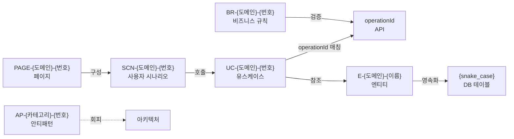

# ADR-002: 7대 산출물 정의 (UI/UX 명세 신설)

- 상태: 승인됨 (Accepted)
- 일자: 2026-04-26
- 결정자: 윤주스 (TF Lead)
- 관련: ADR-001, ADR-003, schemas/*.schema.json

## 컨텍스트

v1.0은 **6대 산출물**이었으나, 분석 대상에 FE가 포함되면 UI/UX 정보가 누락된다. FE 영역을 포함하려면 산출물을 확장해야 한다.

## 결정

**6대 → 7대 산출물로 확장**한다. UI/UX 명세를 7번째 산출물로 신설.

### 7대 산출물 표

| # | 산출물 | AI용 | 사람용 | 추출 신뢰도 |
|---|---|---|---|---|
| 1 | **아키텍처/의존성** | `architecture.json` | `architecture.mermaid` + .md | 100% |
| 2 | **도메인 모델** | `domain.json` (JSON Schema) | `domain.md` + classDiagram | 80% (+ORM 95%) |
| 3 | **API 계약** | `openapi.yaml` (3.1) | Swagger UI + 요약 | 90% |
| 4 | **DB 스키마** | `schema.sql` + `schema.json` | `erd.mermaid` + 명세 | 70% (+ERD 95%, +DB 100%) |
| 5 | **비즈니스 규칙** | `rules.json` (Given/When/Then) | `rules.md` 카탈로그 | 50% (+여러 출처 75%) |
| 6 | **안티패턴** | `antipatterns.json` | `avoid-list.md` 체크리스트 | 100% |
| 7 | **UI/UX 명세** ⭐ NEW | `ui-spec.json` | `pages.md` + flowchart | 75% |

### 산출물 간 책임 분담

**원칙**:
- 같은 사실이라도 **"던지는 질문"** 이 다르면 다른 산출물에 들어간다
- API에 비즈니스 정책 description으로 박지 않는다 (Rules에)
- ORM 메서드 안 정책은 도메인 메서드로 (Domain에)
- 화면 정보는 아키텍처/API에 섞지 않는다 (UI에)

### 7번 — UI/UX 명세 상세

각 항목 정의:
- **페이지 인벤토리**: 라우트, 권한, 레이아웃, 관련 API/유스케이스
- **사용자 흐름**: 화면 간 전이 (Mermaid flowchart)
- **컴포넌트 트리**: Atomic Design 5계층 또는 FSD 구조
- **디자인 토큰**: 색상/간격/타이포그래피 (Tailwind config, CSS variables 등에서 추출)
- **사용자 시나리오**: 비로그인 진입~완료까지 end-to-end 흐름

### ID 표준 (산출물 간 추적성)

## 결정 근거

### UI/UX 명세를 신설한 이유

1. **FE 영역 누락 해결**: 6대 산출물에서는 FE 분석 결과를 담을 곳이 없었음
2. **분석 대상의 현실**: 사내 시스템 대부분이 FE+BE 혼합
3. **FSD + Atomic Design 적용**: ADR-001의 FSD 채택과 연동
4. **재구현 시 필수**: UI/UX 명세 없이 재구현하면 화면 설계를 처음부터 해야 함

### 추출 신뢰도 차이

- 라우팅·컴포넌트 트리: 결정적 추출 가능 (90%)
- 디자인 시스템 토큰: 코드 품질에 의존 (좋은 케이스 90%, 나쁜 케이스 30%)
- 사용자 시나리오: LLM 추론 (60%) → 기획자 검토 필수

## 결과

### 긍정적 영향
- FE 분석 결과를 표준화된 형식으로 산출 가능
- 7대 산출물이 FE~BE~DB 전 계층을 커버
- ID 표준으로 산출물 간 추적성 보장 (UC → API → Entity → Table)

### 부정적 영향 / 위험
- 산출물이 7개로 늘어나 분석 시간 증가
- UI/UX 추출 신뢰도가 상대적으로 낮음 (75%)

## 영향 범위

- `schemas/ui-spec.schema.json` 신설
- `templates/ui-spec.template.{md,mermaid}` 신설
- `methodology-spec/deliverables/07-UI-UX-명세.md` 신설
- `methodology-spec/workflow/phase-5-2-ui.md` 신설

## 참고

- plan-methodology-v1.1.md §2 (산출물 정의)
- ADR-001 (FSD 채택 근거)
- Feature-Sliced Design: https://feature-sliced.design
- Brad Frost, "Atomic Design"
