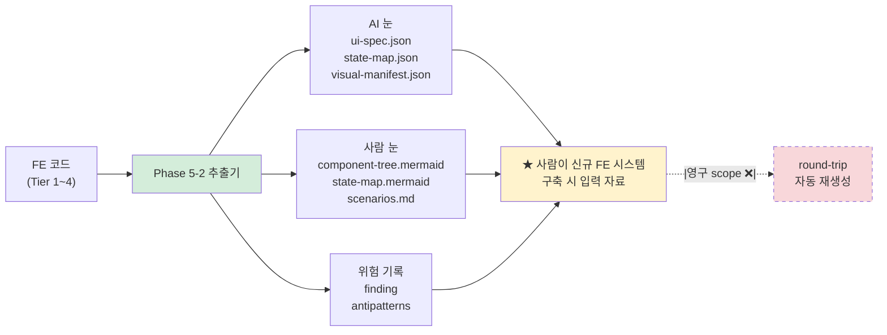

# ADR-FE-001: FE 추출기 가정 — spectrum cover Tier 1~4 + 한 방향 추출 사상

- 상태: 승인됨 (Accepted)
- 일자: 2026-05-01 / **갱신 2026-05-01 (Stage 6 — §6 Tier 4 carry → resolved)**
- 결정자: 윤주스 (TF Lead, Auto Mode 위임)
- 관련: ADR-001 (사상적 기반), ADR-002 (7대 산출물), ADR-008 (이중 렌더링 사상), ADR-FE-002 (이중 렌더링 FE 적용 — 짝), ADR-FE-004 (BE/FE 분리 — Tier 4 예외 정식), ADR-FE-005 (권위 매개체 12 채택), ADR-FE-006 (framework-neutral IR — 짝), DEC-2026-05-01-v1.4-FE-트랙-진입, DEC-2026-05-01-v1.4-Stage-2-Gate-결단 (G1-1), DEC-2026-05-01-v1.4-Stage-6-종결 (carry 종결)

> **본 ADR 의 위치** — v1.4 FE 트랙의 **사상 기둥 1**. ADR-001 (Schema-First+Contract-First+DDD-Lite+FSD) 의 §FSD 영역을 FE 코드 spectrum 전체로 확장한다. ADR-FE-002/005 와 짝.

---

## 1. 컨텍스트

v1.3.0 까지 본 방법론은 **BE 영역 (Spring Boot / NestJS) 만 입증** 되었다. PoC #01/#02 (Java/Spring) + PoC #03 (TypeScript/NestJS) = platform-agnostic 입증 ✅. 그러나:

- `methodology-spec/deliverables/7-ui-ux.md` 는 v1.1 신설 후 **PoC 입증 0회**.
- `methodology-spec/workflow/phase-5-2-ui.md` 도 BE 산출 흐름 inverse 로만 작성.
- 사용자 진단 (2026-05-01): **"FE 분석 방법이 없잖아"**.

Stage 1 research × 3 (공식문서 / 산업사례 / Senior) 의 합의:
- 현 FE 영역 = **5 진실 (server/client/URL/form/DOM)** 분산 / **시각 산출 visible** / **권위 매개체 격상** 부재.
- 본 방법론의 사상 (Schema-First / 한 방향 추출기) 을 FE 에 적용하려면 **추출기 가정** 자체를 명시해야 함.

본 ADR = 그 가정의 본체 격상.

### 1.1 사용자 7 요구사항 (Stage 0) 매핑

| 요구 | 본 ADR 반영 |
|---|---|
| 1. 산출물 → 마이그+테스트 기반 | §3 Tier 별 추출 산출물 정의 / §6 권위 매개체 12 (ADR-FE-005 짝) |
| 2. AI + 사람 동시 이해 | §4 한 방향 추출 사상 / 이중 렌더링 (ADR-FE-002 짝) |
| 3. UI visible 차원 | §3.3 deliverable 9 (visual-manifest) 신설 명시 |
| 4. 비즈니스 로직 동일 | §3.3 deliverable 8 (state-map — 5 진실) 신설 명시 |
| 5. BE/FE 분리 운영 | §5 BE/FE Phase 매핑 + Stage 6 ADR-FE-004 carry |
| 6. 큰 뭉텅이 승인제 | (Stage 게이트 — 본 ADR 범위 밖) |
| 7. 모든 단계 기록 | (Stage DEC + commit — 본 ADR 범위 밖) |

---

## 2. 결정

**FE 코드 spectrum 을 Tier 1~4 로 정의하고, 본 방법론을 "FE 코드 → 형식 명세 + 위험 기록" 한 방향 추출기로 명시 격상**.

### 2.1 핵심 명제 (3개)

```yaml
명제 1 (한 방향 추출):
  본 방법론 = FE 코드 → 형식 명세 + 위험 기록 추출기
  ❌ round-trip (산출물 → 신규 시스템) 검증은 영구 scope 제외 (DEC-round-trip-스코프-아웃 정합)
  ❌ FE 코드 → 산출물 → FE 코드 자동 재생성 시도 ❌
  ✅ 산출물 = 사람이 신규 FE 시스템 구축 시 입력 자료 / 회피 가이드

명제 2 (spectrum cover):
  Tier 1: Modern SPA (React 18+ / Vue 3 / Svelte / Solid / Qwik / Astro)
  Tier 2: jQuery legacy (jQuery + Bootstrap + Backbone / Knockout 변종)
  Tier 3: Vanilla JS (모듈 패턴 + 직접 DOM 조작)
  Tier 4: JSP / Thymeleaf / ERB 등 server-side template
  ⏳ Native (React Native / Flutter / Swift UI) → v1.5 이연

명제 3 (Tier 별 추출 가능성 차등):
  Tier 1 → 7대 산출물 7/7 (full)
  Tier 2 → 7대 산출물 5/7 (state-map / visual-manifest 부분)
  Tier 3 → 7대 산출물 4/7 (LLM 추론 의존도 ↑)
  Tier 4 → 7대 산출물 3/7 + ★ Stage 6 ADR-FE-004 BE/FE 분리 예외 (JSP = BE 통합 산출)
```

### 2.2 ADR-001 §FSD 와의 관계

ADR-001 §FSD = "FE 진영 사실상 표준" 채택. 그러나 spectrum 미명시. 본 ADR 로 격상:
- ADR-001 §FSD = Modern SPA 영역 (Tier 1) 의 **컴포넌트 분류** 표준
- ADR-FE-001 (본) = Tier 1~4 spectrum 전체의 **추출기 가정**

→ 두 ADR 은 짝 (ADR-001 = 분류 표준 / ADR-FE-001 = 추출기 사상).

---

## 3. Tier 별 추출 가능 영역 (★ 핵심 명세)

### 3.1 추출 산출물 매트릭스

| 산출물 | Tier 1 (Modern) | Tier 2 (jQuery) | Tier 3 (Vanilla) | Tier 4 (JSP) |
|---|---|---|---|---|
| **ui-spec.json** (pages/components/tokens/scenarios/flows) | ✅ 95% | ⚠️ 70% (jQuery widget LLM 추론) | ⚠️ 60% (LLM 추론 ↑) | ⚠️ 50% (template fragment) |
| **state-map.json** (5 진실) | ✅ 90% | ⚠️ 65% (DOM state 비중 ↑) | ⚠️ 55% | ❌ N/A (server-side) |
| **visual-manifest.json** (Playwright snapshot) | ✅ 95% | ✅ 90% | ✅ 90% | ✅ 90% (rendering 후 동일) |
| component-tree.mermaid | ✅ 95% | ⚠️ 60% (jQuery selector 기반 추론) | ⚠️ 50% | ❌ N/A (template inheritance) |
| design-tokens (DTCG) | ✅ 90% | ⚠️ 60% (Bootstrap 변수) | ⚠️ 40% (CSS 직접) | ⚠️ 50% (CSS) |
| user-flows.mermaid | ✅ 85% | ⚠️ 65% | ⚠️ 55% | ⚠️ 70% (form action) |
| scenarios.md | ✅ 70% | ⚠️ 55% | ⚠️ 50% | ⚠️ 50% |

### 3.2 미추출 (의도적 — 영구 scope 제외)

| 미추출 영역 | 이유 |
|---|---|
| 실제 화면 캡처 (Figma/Sketch 영역) | round-trip scope 제외 (DEC-round-trip-스코프-아웃) |
| 사용자 행동 분석 (애널리틱스) | 운영 측정 영역 (ADR-001 §명시적 제외) |
| A/B 테스트 변형 | Feature Flag 영역 (Phase 4 5.C 또는 별도) |
| 운영 NFR (LCP / CLS / TTI) | ADR-001 §명시적 제외 (Stage 3-2 갱신 — Gate 2 결단) |

### 3.3 신규 deliverable 8 / 9 (★ 본 v1.4 핵심)

본 ADR = deliverable 8 (state-map) + deliverable 9 (visual-manifest) 신설의 **사상 근거**:
- **deliverable 8 (state-map)** = 명제 3 의 5 진실 (server/client/URL/form/DOM) 분산 상태 추출. ADR-FE-002 의 "이중 렌더링 FE 적용" 정합.
- **deliverable 9 (visual-manifest)** = 사용자 요구 3 (UI visible) 정면 해소. ★ binary 진실 (snapshot hash) 모델 = ADR-FE-002 §visual 예외 정합.

→ ADR-FE-001 (사상) → schema (B1/B2) → deliverable doc (C1/C2) 순 (plan §2 의존 그래프 정합).

---

## 4. 한 방향 추출 사상 — 작업 흐름



**핵심 정합**:
- ADR-008 이중 렌더링 (AI 눈 + 사람 눈) → FE 영역 적용 = ADR-FE-002 (짝).
- DEC-round-trip-스코프-아웃 → FE 도 동일 (round-trip ❌).

---

## 5. BE Phase 0~6 ↔ FE Phase 0~6 매핑

| Phase | BE | FE |
|---|---|---|
| 0 (input) | inputs/ (코드 + 디자인 명세 / Storybook 설정) | (BE 동일 + Storybook + design 명세) |
| 1 (init) | inventory + stack-detection + tree | (BE 동일 + framework enum 6종 ★ ui-spec.schema 확장) |
| 2 (db) | schema.json + erd.mermaid | ❌ N/A (FE 영역 없음) |
| 3 (arch) | architecture.json + dependency-graph | (BE 동일 — FE 의 routing graph + module graph) |
| 4 (domain+rules) | domain.json + rules.json | (BE 의 도메인 = FE 의 reference / FE 자체는 ★ Stage 3-2 br_type fe_validation 등) |
| **4.5 (formal-spec)** | state-machine + sequence + decision-table + invariants + property | ★ deliverable 8 (state-map) = 4.5 state-machine 의 FE 변형 |
| 5-1 (api) | openapi.yaml + api-extension | (BE 의 openapi 가 진실 / FE 는 cross-link) |
| **5-2 (ui)** | ❌ N/A (BE 영역 없음) | ★ deliverable 7 (ui-base) + 8 (state) + 9 (visual) — Stage 3-1 분할 |
| 6 (antipatterns) | antipatterns.json + avoid-list + migration-cautions | (BE 동일 + FE 안티패턴 추가 / migration-cautions-fe.md = Stage 3-2) |

→ FE Phase 매핑은 BE 와 짝. Phase 0~6 동일 + Phase 5-2 는 FE 전용 분할 (Stage 3-1 작업).

---

## 6. ★ Tier 4 (JSP) 예외 — ★ Stage 6 ADR-FE-004 정식 종결 (resolved)

JSP / Thymeleaf / ERB 의 server-side template 은 **BE 와 FE 가 통합 산출**:
- 라우팅 = BE Spring MVC `@RequestMapping`
- 렌더링 = JSP (FE 영역) + 백엔드 데이터 (BE 영역)
- DOM 조작 = (있으면) jQuery / vanilla JS

→ **BE/FE 분리 운영 정책의 예외 = Scenario C** (★ ADR-FE-004 §2 정식 정의).

★ **Stage 6 종결 (2026-05-01)** — 본 §6 carry 종결:
- ADR-FE-004 (BE/FE 분리 운영 정책) Scenario C 정식 채택
- `methodology-spec/be-fe-separation.md` §5 Tier 4 통합 산출 절차 정식
- `legacy-spectrum.schema.json` `tier_4_be_fe_handling` enum 신설 (`scenario_c_integrated` / `legacy_carry_over_resolved_v14`)

본 ADR §3.1 매트릭스의 "Tier 4 → 7대 산출물 3/7 + Stage 6 ADR-FE-004 BE/FE 분리 예외" = ★ 정식 절차 결정 (Stage 6 종결).

---

## 7. 결과 (Consequences)

### 7.1 좋은 점

- **사용자 진단 직접 대응** ("FE 분석 방법이 없잖아") — Tier 1~4 spectrum 명시.
- **추출 가능성 차등 명시** — Tier 1 = 95% / Tier 4 = 50% → 사용자가 사전 기대치 조정 가능.
- **deliverable 8/9 신설 사상 근거 확립** — ADR-FE-001 (사상) → schema → deliverable doc 순 의존 명시.
- **BE 패턴 재사용 90%+** — Phase 0~6 매핑 / 이중 렌더링 / 한 방향 추출 / round-trip ❌. 새 사상 도입 0.

### 7.2 나쁜 점

- Tier 3 (Vanilla JS) 추출 신뢰도 50~60% — LLM 추론 의존 ↑ (mitigated by drift-validator + cross-validation).
- Tier 4 (JSP) 의 state-map ❌ — server-side state 가 BE 영역과 중복. Stage 6 ADR-FE-004 까지 carry.
- Modern SPA 만 입증 (Stage 4 mini-PoC = RealWorld React) — Tier 2/3/4 입증은 사내 적용 (release 후 adoption 트랙) carry.

### 7.3 무시한 다른 옵션

- **Modern SPA only 채택** — 거부. 사용자 진단 ("legacy 지원 부재") 정면 회피.
- **Tier 4 (JSP) 정식 산출물 의무화** — 거부. BE/FE 분리 default 정합 깸 (G2-3 결단). Stage 6 ADR-FE-004 예외 명시로 해소.
- **Native (React Native) v1.4 포함** — 거부. spectrum 폭 폭발 + 모바일 OS 의존 추가. v1.5 이연.

---

## 8. 적용 (Implementation)

### 8.1 schema 변경 (Stage 3-1 Phase B)

`schemas/ui-spec.schema.json` 확장 (B3):
- `framework` enum + `solid`, `qwik`, `astro`, `vanilla_js`, `jquery_legacy`, `jsp_template` (6종 추가)
- `components[].level` enum + `legacy_template`, `legacy_widget` (2종 추가)
- `pages[].event_handlers` / `api_calls` / `components[].suspense_boundary` 신규 필드

### 8.2 deliverable 변경 (Stage 3-1 Phase C)

- `methodology-spec/deliverables/7-ui-ux.md` 보강 (§6.4 legacy fallback Tier 1~4 신설)
- `methodology-spec/deliverables/8-state-map.md` 신설
- `methodology-spec/deliverables/9-visual-manifest.md` 신설

### 8.3 workflow 변경 (Stage 3-1 Phase D)

- `methodology-spec/workflow/phase-5-2-a-ui-base.md` 신설
- `methodology-spec/workflow/phase-5-2-b-state.md` 신설
- `methodology-spec/workflow/phase-5-2-c-visual.md` 신설
- `methodology-spec/workflow/phase-5-2-ui.md` → redirect stub

### 8.4 도구 시범 (Stage 3-1 Phase E)

- drift-validator FE 시범 (state-map.json ↔ state-map.mermaid)
- formal-spec-link-validator FE cross-link 진단

### 8.5 carry-over (Stage 3-2+)

- Stage 3-2 — ADR-FE-003 (legacy spectrum 정책 상세) + ADR-001 §명시적 제외 갱신
- Stage 4 — mini-PoC (RealWorld React fork / 1주 fail-fast)
- Stage 6 — ADR-FE-004 (BE/FE 분리 + JSP 예외)

---

## 9. 참조

### ADR
- ADR-001 (사상적 기반 §FSD)
- ADR-002 (7대 산출물)
- ADR-008 (이중 렌더링 사상)
- ADR-FE-002 (이중 렌더링 FE 적용 — 짝)
- ADR-FE-005 (권위 매개체 12 채택)

### DEC
- DEC-2026-04-29-round-trip-스코프-아웃 (한 방향 추출 사상 모체)
- DEC-2026-05-01-v1.4-FE-트랙-진입 (Stage 0)
- DEC-2026-05-01-v1.4-Stage-1-research-종결 (research × 3 합의)
- DEC-2026-05-01-v1.4-Stage-2-Gate-결단 (G1-1 spectrum + G2-2 legacy)

### Memory
- `project_v140_fe_track.md`
- `feedback_methodology_body_priority.md`

### Sources (research × 3 / Stage 1)
- `~/.claude/plans/research-official-v1.4-fe.md` (W3C SCXML / DTCG / WCAG)
- `~/.claude/plans/research-industry-v1.4-fe.md` (Storybook CSF / Playwright / MSW)
- `~/.claude/plans/research-senior-v1.4-fe.md` (12 매개체 통합 권고)

**End of ADR-FE-001.**
