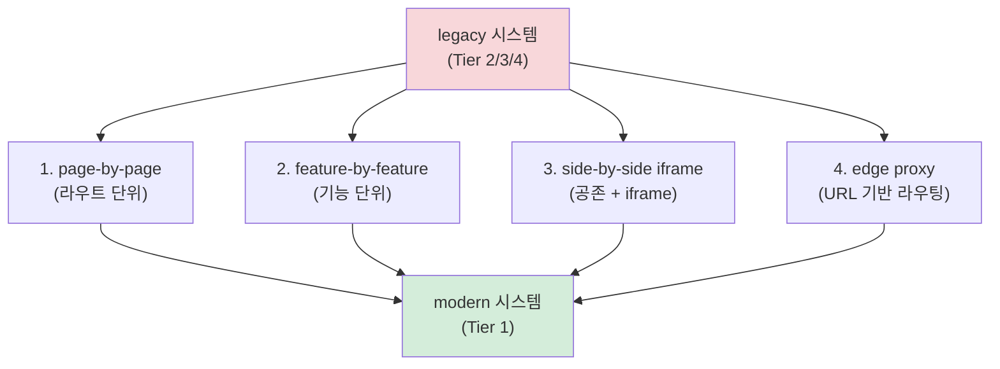

# ADR-FE-003: legacy spectrum 정책 — Tier 2/3/4 추출 정책 + Strangler 패턴

- 상태: 승인됨 (Accepted)
- 일자: 2026-05-01 / **갱신 2026-05-01 (Stage 6 — §2.4 Tier 4 carry → resolved)**
- 결정자: 윤주스 (TF Lead, Auto Mode 위임)
- 관련: ADR-001 (사상적 기반), ADR-FE-001 (FE 추출기 가정 — 짝), ADR-FE-002 (이중 렌더링 FE 적용), ADR-FE-004 (BE/FE 분리 운영 — Tier 4 정식), ADR-FE-006 (framework-neutral IR), DEC-2026-05-01-v1.4-Stage-2-Gate-결단 (G2-2 legacy Tier 1~4), DEC-2026-05-01-v1.4-Stage-6-종결 (carry 종결)

> **본 ADR 의 위치** — ADR-FE-001 §3.1 매트릭스의 **Tier 2/3/4 (jQuery / Vanilla / JSP) 추출 정책의 상세**. ADR-FE-001 = spectrum 가정 / ADR-FE-003 (본) = Tier 2/3/4 추출 절차 + 마이그레이션 패턴.

---

## 1. 컨텍스트

ADR-FE-001 (FE 추출기 가정) 은 spectrum Tier 1~4 cover 를 명시했지만, **Tier 2/3/4 의 구체 추출 절차와 마이그레이션 가이드는 미명시**. Stage 1 research-senior + Stage 2 Gate G2-2 결단 (legacy Tier 1~4 모두 / Tier 4 = Stage 6 ADR-FE-004 예외) 후속:

- 사용자 진단 ("FE 분석 방법이 없잖아") = 사실상 Tier 2/3/4 spectrum 직접 대응 부재가 핵심.
- Tier 2 (jQuery legacy) 는 산업 잔존도 ↑ — bootstrap 데이터 흐름 / DOM event 분산 추출 의무.
- Tier 3 (Vanilla JS) 는 모듈 패턴 / IIFE 단위 분류 (Atomic Design ❌).
- Tier 4 (JSP / Thymeleaf / ERB) 는 BE 와 통합 산출 → ADR-FE-004 (Stage 6) 예외.

본 ADR = Tier 2/3/4 추출 정책 + Martin Fowler **Strangler Fig Pattern** (2004) 인용 = 점진적 마이그레이션 사상.

### 1.1 Strangler Fig Pattern 인용

Martin Fowler, "StranglerFigApplication" (2004):

> "Gradually create a new system around the edges of the old, letting it grow slowly over several years until the old system is strangled."

→ legacy spectrum (Tier 2/3/4) 의 마이그레이션은 **rewrite 가 아니라 strangle** (점진적 대체).

본 방법론은 사람이 신규 FE 시스템 구축 시 **strangler 마이그레이션 plan 자체를 산출물로 제공** = `strangler-migration-plan.md` (deliverable 13 의 sub).

---

## 2. 결정

**Tier 2/3/4 추출 정책 + Strangler Fig Pattern 채택 + Tier 4 Stage 6 ADR-FE-004 예외.**

### 2.1 Tier 별 추출 정책 (핵심)

| Tier                              | 추출 가능                     | LLM 의존도 | 본체 산출물                            | legacy 산출물                                                    |
| --------------------------------- | ----------------------------- | ---------- | -------------------------------------- | ---------------------------------------------------------------- |
| **Tier 1 (Modern SPA)**           | 7대 7/7                       | 낮음       | 모두                                   | (해당 ❌)                                                        |
| **Tier 2 (jQuery legacy)**        | 5/7 (state-map / visual 부분) | 중         | ui-spec (legacy_widget) / antipatterns | legacy-spectrum + bootstrap-data-flow + strangler-migration-plan |
| **Tier 3 (Vanilla JS)**           | 4/7                           | 높음       | ui-spec / antipatterns                 | legacy-spectrum + bootstrap-data-flow + strangler-migration-plan |
| **Tier 4 (server-side template)** | 3/7                           | 높음       | ADR-FE-004 BE/FE 통합 산출 (Stage 6)   | legacy-spectrum (분리 detection 만)                              |

### 2.2 Tier 2 (jQuery legacy) 추출 절차

```yaml
detection_signals:
  - <script src="jquery..."> in HTML
  - $(selector) / jQuery(...) in JS
  - $.ajax / $.get / $.post 호출
  - data-* attribute 기반 plugin 패턴
  - Backbone / Knockout 변종 (선택)

추출_가능:
  - pages: Server URL → HTML page 매핑 (BE 라우팅 의존)
  - components: jQuery widget / plugin 단위 (LLM 추론 — level=legacy_widget)
  - design_tokens: Bootstrap 변수 (CSS / SCSS) — 신뢰도 ↓
  - user_flows: $(form).submit() / location.href / window.open 추적
  - state_sources: DOM state 비중 ↑ (input value / data-* attribute)
  - api_calls: $.ajax / $.get / $.post URL 매핑

추출_미흡:
  - state-map machine: 명시적 state machine 부재 (LLM 추론 신뢰도 0.50~0.65)
  - visual-manifest: ✅ 동일 (Playwright 동등 적용)
  - scenarios: LLM 추론 의존도 ↑

함정:
  - selector 분산 — 같은 element 를 여러 곳에서 jQuery 조작
  - data-* attribute 중심 → state 진실 source 분산
  - plugin 의존성 (jQuery UI / DataTables 등) — 진입점 추적 어려움
```

### 2.3 Tier 3 (Vanilla JS) 추출 절차

```yaml
detection_signals:
  - 모듈 패턴 (IIFE / namespace global)
  - addEventListener 직접 사용
  - querySelector / getElementById 직접
  - import 가 ES Modules 또는 CommonJS — 라이브러리 부재

추출_가능:
  - pages: HTML 파일 단위 (라우팅 부재 가능)
  - components: 모듈 단위 (level=legacy_widget 또는 legacy_template)
  - state_sources: DOM state 압도적 비중

추출_미흡:
  - design_tokens: CSS 직접 — 신뢰도 0.30~0.40
  - api_calls: fetch / XMLHttpRequest 흩어짐 — LLM 추론 의무
```

### 2.4 Tier 4 (server-side template) — Stage 6 ADR-FE-004 정식 (resolved)

> **Stage 6 종결 (2026-05-01)** — 본 §2.4 carry 종결. ADR-FE-004 §2.4 (Tier 4 통합 산출 절차 정식) + `methodology-spec/be-fe-separation.md` §5 정식 정의.

```yaml
detection_signals:
  - .jsp / .thymeleaf / .erb 파일
  - <%= %> / ${} / <%- %> 등 server-side 표현식
  - JSP request attribute / Thymeleaf model attribute

핵심: BE 와 통합 산출
  - 라우팅 = BE Spring MVC @RequestMapping (BE 영역)
  - 렌더링 = JSP (FE 영역)
  - 데이터 = BE controller 의 model attribute

→ Stage 6 ADR-FE-004 (BE/FE 분리 운영 + JSP 예외) 가 정식 처리.
→ 본 Stage 3-2 = legacy-spectrum.json detection 만 (분리 시점 인식).
```

---

## 3. Strangler Fig Pattern 적용 (migration-plan)

### 3.1 4 가지 strangle 접근



| 접근                    | 적합                               | 위험                        |
| ----------------------- | ---------------------------------- | --------------------------- |
| **page-by-page**        | Tier 2/3 (페이지 단위 분리 명확)   | 공통 layout / header drift  |
| **feature-by-feature**  | Tier 1+2 혼재 (기능 단위 strangle) | feature 경계 모호 시 ↑      |
| **side-by-side iframe** | Tier 4 / 사내 legacy               | iframe a11y / 검색 SEO 손실 |
| **edge proxy**          | URL prefix 기반 / micro-frontend   | 인프라 비용 ↑               |

### 3.2 strangler-migration-plan.md (산출물)

`legacy-spectrum.schema.json` `strangler_plan` 필드 inline 또는 별도 .md:

```yaml
strangler_plan:
  migration_target_tier: 1_modern_spa     # 목표 Tier
  approach: page_by_page                   # 4 접근 중 1
  estimated_phases: 5                       # 단계 수
  phase_breakdown:
    - phase: 1
      target_pages: [PAGE-LOGIN-001, PAGE-SIGNUP-001]
      effort_estimate: 1주
    - phase: 2
      ...
  rollback_strategy: feature_flag         # 롤백 방식
```

---

## 4. bootstrap 데이터 흐름 (legacy 산출물 sub)

Tier 2/3/4 의 **초기 데이터 진실 source** 추출:

| 방식                       | 출처                                                        | 추출              |
| -------------------------- | ----------------------------------------------------------- | ----------------- |
| `window.__INITIAL_STATE__` | server render (Next.js / Nuxt SSR / 직접 inline `<script>`) | inline JSON parse |
| `data-*` attribute         | HTML attribute (jQuery 패턴)                                | DOM scan          |
| AJAX fetch on load         | `$(document).ready` 시 fetch                                | network 호출 추적 |
| WebSocket on load          | bootstrap WebSocket connect                                 | endpoint 추적     |
| JSP request attribute      | `<%=request.getAttribute()%>`                               | Tier 4 (BE 통합)  |

→ `bootstrap-data-flow.md` 산출물 (legacy-spectrum 의 sub).

---

## 5. 결과 (Consequences)

### 5.1 좋은 점

- **사용자 진단 직접 대응** — Tier 2/3/4 의 구체 추출 절차 명시.
- **Strangler 패턴 = 산업 표준** — Martin Fowler 인용 / 사내 마이그레이션 plan 직접 활용 가능.
- **legacy 산출물 3종 신설 사상 근거 확립** — ADR-FE-003 (본) → schema (B4) → deliverable (C4) 순.
- **Tier 4 (JSP) 예외 명시** — BE/FE 분리 default 정합 깸 0 / Stage 6 ADR-FE-004 carry.

### 5.2 나쁜 점

- Tier 2/3 추출 신뢰도 0.50~0.65 — LLM 추론 의존 ↑ (mitigated by drift-validator + cross-validation 단계 3 도달 시 0.65~0.75).
- Strangler 의 4 접근 = 사용자 사내 환경 의존 — 본 방법론 = "추천만 / 결정은 사용자".
- Tier 4 정식 처리 = Stage 6 까지 carry (ADR-FE-004).

### 5.3 무시한 다른 옵션

- **Tier 2/3/4 통합 정책** — 거부. Tier 별 추출 가능성 / detection signal / 함정 모두 다름. 통합 시 산출물 의미 손실.
- **rewrite-only 권고** (strangler ❌) — 거부. 산업 사례 (Fowler / Sam Newman) 모두 strangle 권고. rewrite 는 비즈니스 위험 .
- **Tier 4 v1.4 정식 처리** — 거부. BE/FE 분리 default 깸. Stage 6 ADR-FE-004 정합 깸.

---

## 6. 적용 (Implementation)

### 6.1 schema 변경 (Stage 3-2 Phase B)

- `schemas/legacy-spectrum.schema.json` 신설 (B4) — tier_detection / bootstrap_flow / strangler_plan 통합.

### 6.2 deliverable 변경 (Stage 3-2 Phase C)

- `methodology-spec/deliverables/13-legacy-spectrum.md` 신설 (C4) — Tier 1~4 detection + bootstrap data flow + strangler plan 통합 산출물.

### 6.3 carry-over

- Stage 6 — ADR-FE-004 (BE/FE 분리 + Tier 4 JSP 예외 정식)
- Stage 4 mini-PoC = Tier 1 (Modern React) 만 검증. Tier 2/3/4 검증은 사내 적용 (release 후 adoption 트랙) carry.

---

## 7. 참조

### ADR

- ADR-001 (사상적 기반)
- ADR-FE-001 (FE 추출기 가정 — 짝)
- ADR-FE-002 (이중 렌더링 FE 적용)
- ADR-FE-004 (BE/FE 분리 — Tier 4 예외 / Stage 6)

### DEC

- DEC-2026-05-01-v1.4-Stage-1-research-종결 (legacy 챕터)
- DEC-2026-05-01-v1.4-Stage-2-Gate-결단 (G2-2 legacy Tier 1~4)
- DEC-2026-05-01-v1.4-Stage-3-1-종결 (Stage 3-1 carry)

### Sources

- Martin Fowler, "StranglerFigApplication" (2004): https://martinfowler.com/bliki/StranglerFigApplication.html
- Sam Newman, "Monolith to Microservices" (O'Reilly, 2019) — Strangler pattern 챕터

### Memory

- `project_v140_fe_track.md`

**End of ADR-FE-003.**
