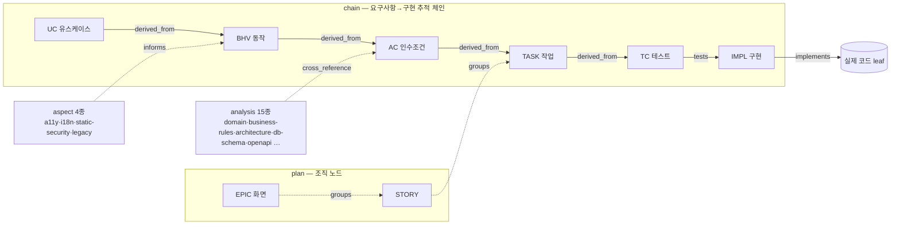
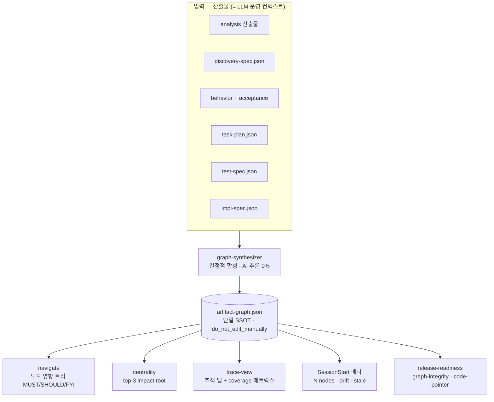
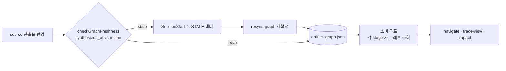
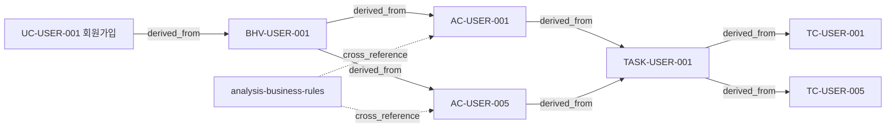

# Artifact Dependency Graph — 설계도

> dep-graph(`artifact-graph.json`)의 **구조·합성·소비**를 한눈에. 운영 절차/명령어는 [`dependency-graph.md`](dependency-graph.md), 그래프 모델 SSOT는 동 문서 §2.
> 이 문서는 그림(설계도) 중심 — 에디터/GitHub 에서 Mermaid 가 렌더됩니다.

---

## 1. 한 줄 정의

dep-graph 는 **요구사항→구현 추적성 그래프**다. 노드 = 산출물(artifact), 엣지 = 산출물 사이 관계. 코드 호출/모듈 그래프가 **아니다**(코드 연결은 `code_pointers` 앵커로만). 결정적 알고리즘으로 합성·탐색·검증된다.

---

## 2. 데이터 모델 — 노드 4종 × 엣지 8종

- **노드 4종(`artifact_kind`)**: `chain`(UC/BHV/AC/TASK/TC/IMPL) · `analysis`(15종) · `aspect`(4종) · `plan`(EPIC/STORY/OP).
- **엣지 8종** = hard 5 + soft 3:
  - hard(실선): `derived_from`(체인 전진) · `tests`(TC→IMPL) · `implements`(IMPL→코드) · `depends_on`(스키마/검증기) · `conforms_to`(계약 leaf).
  - soft(점선): `cross_reference`(analysis↔chain) · `informs`(aspect→chain) · `groups`(조직 포함).
- **노드 상태 4종**: `active` / `drift`(재검증 필요) / `propose`(신설 제안) / `deprecated`(삭제 마킹).
- 각 노드: `id · source_path · state · title · code_pointers[] · commit_hash · scope_id`.

---

## 3. 합성·소비 파이프라인 — 어떻게 만들어지고 누가 쓰나

- **합성**: `traceability-matrix-builder --graph` 가 6 stage 산출물 + analysis 를 읽어 노드·엣지로 합성(결정적).
- **소비**: 모든 소비자는 `artifact-graph.json` 한 파일만 읽는다(LLM·도구 동일). 사람은 `navigate`/`trace-view`, LLM 은 `navigate --json`.

---

## 4. 두 개의 루프 — 살아있는 그래프(운영)

- **동기화 루프(Loop A)**: 산출물이 바뀌면 그래프가 stale → 배너로 알리고 사람이 `resync-graph`(자동 재합성·write ❌ = 결정적·사람 결단).
- **소비 루프(Loop B)**: 각 단계가 그래프를 조회해 "이걸 바꾸면 뭐가 영향받나 / 어디가 안 닿았나"를 답한다.

---

## 5. 실제 인스턴스 예시 — RealWorld `USER` feature

> 실측 규모 — RealWorld 116노드/173엣지, ecommerce 138/202, poc-16 44/109. 전체를 한 화면에 그리면 클러터가 되므로(100+ 노드), feature/stage 단위 슬라이스로 본다.

---

## 6. 핵심 설계 원칙 (왜 이렇게)

| 원칙 | 이유 |
|---|---|
| json 단독 SSOT | 산출물 = LLM 운영 컨텍스트 그 자체(AX-native). committed 이중 렌더링 = drift 표면 → 폐기(ADR-011). |
| 결정적 합성 (AI 추론 0%) | 그래프는 산출물에서 기계적으로 도출 — 신뢰 가능·재현 가능. |
| reference-lens | 그래프 파생 뷰(navigate 본문·trace-view)는 사람/LLM 참고용 — 결정적 gate 에 절대 inject ❌. |
| 노드 폭증 회피 | Tier-2(스키마/스킬/소스파일)는 노드 아닌 leaf/속성. BE/FE 축도 노드 아닌 `layer` 속성. |
| 코드와의 경계 | dep-graph = 산출물 추적성. 코드↔코드(call graph)는 별도(`code_pointers` 앵커로만 연결). |

---

## 7. 참조

- [`dependency-graph.md`](dependency-graph.md) — 운영 가이드(명령어·8 결정·영향 등급 규칙) / 그래프 모델 SSOT.
- `schemas/artifact-graph-node.schema.json` · `artifact-graph-edge.schema.json` — 노드·엣지 스키마.
- `tools/traceability-matrix-builder/src/graph-synthesizer.js`(합성) · `tools/chain-driver/src/{impact-analyzer,centrality,trace-view}.js`(소비).
