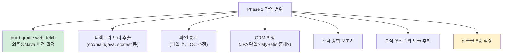
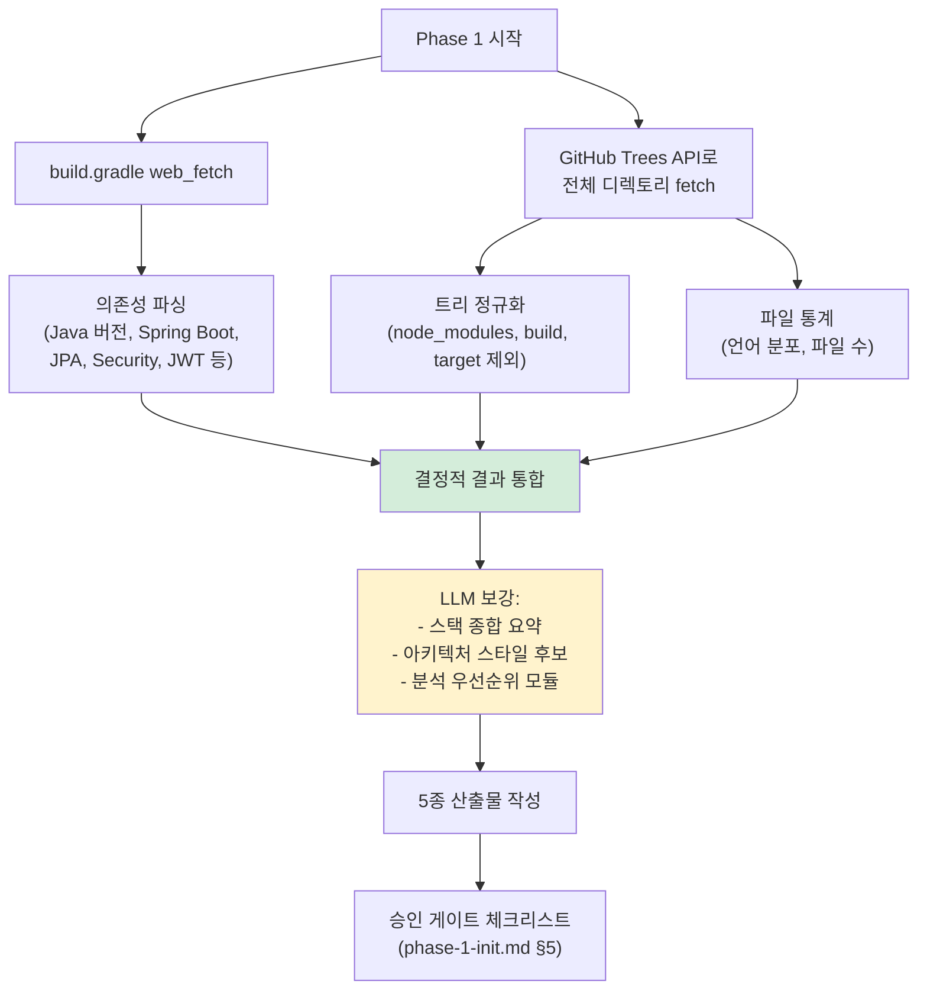
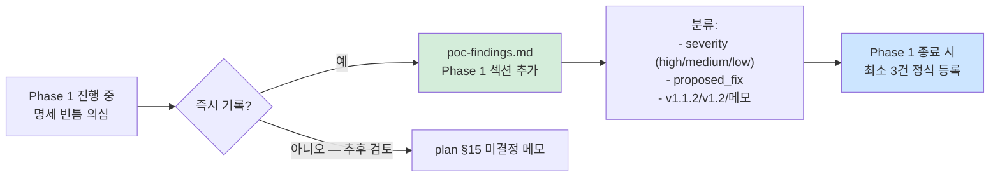

# Plan: PoC #01 — Phase 1 (init, 인벤토리)

> 작성일: 2026-04-27
> 작성자: Claude (윤주스 검토 대기)
> 적용 원칙: Work Principles 4원칙
> 상위 plan: methodology-v1.1/.claude/plans/plan-poc-realworld.md
> Phase 명세: ai-native-methodology/methodology-spec/workflow/phase-1-init.md

---

## §1. 목적

PoC #01 (RealWorld Spring Boot) Phase 1 — 분석 대상 레포의 **구조·스택·규모**를 파악하여 후속 phase가 사용할 메타정보 산출.

이 단계가 답하는 질문:
- 이 레포는 어떤 언어/프레임워크인가? (1차 추정 → 확정)
- 디렉토리 구조는?
- ORM은? (1차 추정: JPA → 확정)
- 규모는? (LOC, 파일 수)
- Phase 0 결과 manifest화

**진짜 목적 (PoC 한정)**: Phase 1 명세의 빈틈 발견. "결정적 처리 95%" 라는 가정이 web_fetch 환경에서도 유지되는가?

---

## §2. 작업 범위

### 2.1 In Scope



### 2.2 Out of Scope

- ❌ 모든 소스 파일 web_fetch (의존성/구조 확정에 필요한 만큼만)
- ❌ application.properties 파싱 (Phase 2에서 처리)
- ❌ Entity 클래스 상세 분석 (Phase 2/4에서 처리)
- ❌ Controller 어노테이션 추출 (Phase 5-1에서 처리)
- ❌ 자동화 스크립트 작성 (수동 PoC, 명세 검증이 목적)

---

## §3. 산출물 (변경 대상)

Phase 1 명세 §4.1 기준 — `examples/poc-01-realworld-spring/output/inventory/`:

| 파일 | 용도 | 형식 |
|---|---|---|
| `inventory.json` | AI용 구조화 데이터 | JSON |
| `tree.md` | 디렉토리 트리 (사람용) | Markdown |
| `stack-detection.md` | 스택 종합 보고서 | Markdown |
| `stats.json` | 파일/LOC 통계 | JSON |
| `_manifest.yml` | Phase 1 입력 + 신뢰도 메타 | YAML |

⚠️ Phase 1용 schema 부재 — `inventory.schema.json`이 `schemas/` 디렉토리에 없음. **이 자체가 finding 후보 (F-007 예약)**.

---

## §4. 입력 (전수 조사 결과)

### 4.1 Phase 0 산출 (이미 있음)

- `examples/poc-01-realworld-spring/source-info.md` — 1차 추정 스택, ground truth 자료 인덱스
- `examples/poc-01-realworld-spring/inputs/_manifest.yml` — 신뢰도 0.95, per_phase_expected.phase_1_init=0.95
- `examples/poc-01-realworld-spring/inputs/domain-context.md` — 5도메인 (User/Article/Comment/Tag/Profile)

### 4.2 Phase 1에서 web_fetch 필요한 파일 (우선순위)

| 우선순위 | 파일 | 목적 |
|---|---|---|
| P0 | `build.gradle` | Java 버전, Spring Boot 버전, 의존성 (JPA/Security/JWT/Lombok 등) 확정 |
| P0 | `settings.gradle` | 모듈 구조 (단일/멀티 module) |
| P0 | GitHub API: 디렉토리 트리 (`/repos/raeperd/realworld-springboot-java/git/trees/main?recursive=1`) | 전체 트리 + 파일 수 |
| P1 | `README.md` (이미 source-info.md에 요약, 보강용) | Java 버전 명시 확인 |
| P1 | `src/main/java/.../Application.java` (메인 클래스) | 패키지 root 확정 |
| P2 | `pom.xml` | (없으면 skip — Gradle 사용) |

### 4.3 ORM 자동 감지 단서 (Phase 1 명세 §3.2)

| 단서 | 확인 방법 |
|---|---|
| `spring-data-jpa` 의존성 | `build.gradle` |
| `@Entity`, `JpaRepository` | 디렉토리 트리에서 `domain/` 하위 파일명 추정 |
| `*.xml` mapper, `@Mapper` | 디렉토리 트리에 `resources/mapper/` 등 부재 확인 |
| `hibernate.cfg.xml` | 트리에 부재 확인 |

**예상 결과**: JPA 단일. MyBatis 혼재 신호 0% (source-info.md 기준).

---

## §5. 처리 흐름



---

## §6. 영향도

### 6.1 후속 Phase에 미치는 영향

| Phase | 영향 |
|---|---|
| Phase 2 (db) | `stack.backend.orm` 으로 JPA Entity 추출 진입 |
| Phase 3 (arch) | `modules_for_priority_analysis` + 디렉토리 트리로 모듈 식별 |
| Phase 4 (5.A) | ORM 종류 (JPA) 가 메서드 가드 추출 패턴 결정 |
| Phase 5-1 (api) | `stack.backend.framework` (Spring Web) 으로 Controller 패턴 식별 |

### 6.2 방법론 본체에 미치는 영향

- 신규 finding 발견 시 → `findings/poc-findings.md` Phase 1 섹션 채움
- inventory schema 부재 finding (F-007 예약) → v1.1.2 또는 v1.2 후보

### 6.3 PoC #01 다음 단계

Phase 1 완료 → Phase 2 (db) 진입 (윤주스 승인 후)

---

## §7. 리스크

### R-Phase1-1. web_fetch 한계 — 전체 트리 못 가져옴

**증상**: GitHub Trees API recursive=1이 거대 레포에서 truncated. RealWorld는 작아서 OK 예상이지만 검증 필요.

**대응**:
- truncated 응답 시 디렉토리 단위로 재귀 fetch
- LOC 통계는 추정치로 명시 (정확한 byte 분석 불가 — finding F-008 후보)

### R-Phase1-2. 결정적 처리 95% 가정이 web_fetch 환경에서 깨짐

**증상**: 명세는 git clone 환경 가정 (linguist 등 라이브러리 사용). web_fetch는 파일 1차원 정보만.

**대응**:
- 언어별 LOC는 파일 확장자 + GitHub API의 `size` 필드로 추정
- 정확도 한계를 inventory.json `warnings`에 명시
- finding F-009 후보: "web_fetch 환경에서 결정적 처리 정확도 명세 부재"

### R-Phase1-3. ORM 혼재 케이스 미감지

**증상**: source-info.md는 JPA 단일이라 단언했지만, 실제로 MyBatis 일부 혼재 가능성 (학습용이라 낮지만 0은 아님).

**대응**:
- build.gradle 의존성 전수 점검
- `resources/` 트리에서 mapper 디렉토리 부재 확인
- 발견 시 명세 §3.2 ORM 혼재 케이스 적용

### R-Phase1-4. monorepo 오감지

**증상**: settings.gradle에 `include` 다수 시 monorepo로 처리해야 함.

**대응**: settings.gradle 확인. RealWorld는 단일 모듈일 가능성 높음.

### R-Phase1-5. 분석 우선순위 추천이 사용자 의도와 다름

**증상**: source-info.md는 Article을 우선순위로 명시했으나, LLM 추론이 다른 결론을 낼 수 있음.

**대응**:
- LLM 추론 결과 + source-info.md의 ground truth 둘 다 제시
- 충돌 시 source-info.md 우선 (사용자 결정 존중)

---

## §8. 신뢰도 예측

manifest.yml의 `per_phase_expected.phase_1_init: 0.95` 기준.

**영역별 신뢰도 예측 (ADR-003 §7 가중 평균)**:

| 영역 | 예측 신뢰도 | extraction_method | element_count (예상) |
|---|---|---|---|
| 디렉토리 트리 | 0.98 | deterministic | 1 |
| 파일 통계 | 0.85 | pattern_matching (web_fetch 한계) | 1 |
| 패키지 매니페스트 파싱 | 0.98 | deterministic | ~30 (의존성 수) |
| ORM 자동 감지 | 0.95 | pattern_matching | 1~2 |
| 스택 종합 요약 | 0.90 | llm_with_grounding | 1 |
| 아키텍처 스타일 추론 | 0.70 | llm_with_grounding | 1~3 |
| 분석 우선순위 추천 | 0.75 | llm_with_grounding (source-info.md grounding) | 5 |

가중 평균 (요소 수 기반): 약 **0.93~0.95** 예상.

cap 0.98 미적용 (raw < 0.98).

---

## §9. 승인 게이트 (phase-1-init.md §5)

```
□ inventory.json schema 검증 (schema 부재 시 명세 §4.2 형식 준수)
□ tree.md 가독성 OK
□ 스택 감지 결과 = 실제와 일치 (사용자 확인)
□ ORM 자동 감지 결과 = 실제와 일치
□ 분석 우선순위 모듈 = 사용자 의도와 일치
□ 입력 manifest = Phase 0 정돈과 정합
```

---

## §10. Open Questions (3원칙 승인 전)

1. **web_fetch 횟수 한도**: build.gradle + Trees API 2회로 시작. 부족 시 추가 fetch 승인 필요?
   - 권장: P0 자동, P1 이상은 발견 즉시 보고하고 추가
2. **inventory.schema.json 부재**: Phase 1 산출물 schema가 아예 없음. 이번에 작성? 아니면 finding만 기록?
   - 권장: finding F-007로 기록만, schema 작성은 v1.1.2 또는 별도 사이클
3. **stats.json 정확도**: web_fetch로 정확한 LOC 불가. 추정치로 진행 OK?
   - 권장: GitHub API `size` 필드(byte) → LOC 추정 + warning 명시
4. **LLM 호출 횟수**: 스택 요약 + 우선순위 추천에 1~2회 LLM 호출 필요. PoC에서는 Claude 본인이 LLM 역할 — 별도 측정 어려움. `llm_calls`는 수동 추정?
   - 권장: 추정치 기록 (PoC 한계 명시)

---

## §11. 다음 단계 (이 plan 승인 후)

1. **2원칙**: 3개 에이전트 병렬 리서치
   - 공식문서 리서처: Spring Boot Gradle 의존성 파싱, GitHub Trees API
   - 테크기업 사례 리서처: Netflix/Google 등의 인벤토리/SBOM 작성 사례
   - Senior Engineer (Backend): JPA/MyBatis 혼재 감지 함정, monorepo 오감지 사례
2. **3원칙**: research 완료 후 Phase 1 실행 승인 받기
3. **실행**: web_fetch → 산출물 5종 작성 → finding 기록
4. **4원칙**: 실패 시 revert + Lessons Learned

---

## §12. Lessons Learned (Phase 1 완료 후 채워질 영역)

(현재 비어있음)

채워질 항목 후보:
- web_fetch 환경에서 결정적 처리 한계
- inventory schema 부재의 영향
- ORM 자동 감지 패턴의 실전 적용도
- 분석 우선순위 추천의 LLM vs ground truth 일치도

---

## §13. web_fetch 환경 한계 (3 에이전트 합의 반영)

### 13.1 명세 §6 가정 vs 실제 환경

명세 §6 의 "결정적 처리 95%" 신뢰도 표는 **git clone + linguist/cloc/tree-sitter 라이브러리 환경** 가정. 본 PoC 는 web_fetch 만 가능 → 절반 이상이 추정으로 전환됨.

### 13.2 환경별 신뢰도 표 (PoC 한정) — ADR-003 §9 해석 라벨 포함

ADR-003 §9 해석 가이드 (5단계):
- **≥0.95 거의 확실** (검토 생략 가능)
- **0.80~0.95 신뢰 가능** (샘플 검토 권장)
- **0.60~0.80 참고 수준** (전수 검토 권장)
- **0.50~0.60 낮음** (전수 검토 필수)
- **<0.50 매우 낮음** (차단)

| 영역 | 명세 §6 (git clone) | 본 PoC (web_fetch) | 해석 (ADR-003 §9) | 환산 근거 |
|---|---|---|---|---|
| 디렉토리 트리 | 1.0 → 0.98 cap | 0.95 | 거의 확실 (샘플 검토 경계) | Trees API truncated 위험 |
| 파일 통계 (LOC) | 1.0 → 0.98 cap | 0.55~0.60 | **낮음 (전수 검토 필수)** | byte/35 추정, AST 불가, Lombok 미사용 보정 |
| 파일 통계 (byte) | 1.0 → 0.98 cap | 0.95 | 거의 확실 | Languages API 정확 |
| 패키지 매니페스트 | 1.0 → 0.98 cap | 0.95 | 거의 확실 | build.gradle 단순 파싱 |
| ORM 자동 감지 | 0.95 | 0.85~0.95 | 신뢰 가능 (샘플 검토) | 의존성만 vs 4단서 점검 |
| 스택 종합 요약 | 0.9 | 0.85 | 신뢰 가능 | LLM + 직접 fetch 검증 |
| 아키텍처 candidates | 0.7 | 0.65 | **참고 수준 (전수 검토)** | 의존 그래프 없음 (상한) |
| 분석 우선순위 | 0.7 | 0.92 (ground truth 일치) / 0.60 (불일치) | 신뢰 가능 / 참고 수준 | source-info.md 우선 |

→ **inventory.json `confidence_breakdown` 의 각 영역에 `interpretation` 필드 추가 권장** (ADR-003 §9 라벨 자동 부여).

### 13.3 web_fetch 환경 운영 원칙

1. **결정적 처리 vs 추정 명시**: 모든 영역에 `extraction_method` (deterministic / pattern_matching / llm_with_grounding / estimation) 필수.
2. **inventory.warnings 의무화**: 환경 종속 추정 항목 4건 이상 명시.
3. **rate limit 모니터링**: GitHub API 60/h (unauth) — 호출마다 `X-RateLimit-Remaining` 로깅.
4. **Trees API truncated 검사**: 응답의 `truncated: true` 시 fallback 절차 (sub-tree 재호출) 발동.
5. **raw blob fetch 보강**: 핵심 파일 1~2개 (build.gradle, application.properties, 도메인 핵심 클래스) 은 raw fetch 로 확정.

### 13.4 명세 빈틈 (F-009 후보)

- Phase 1 명세 §6 신뢰도 표 — 환경 종속성 미명시
- v1.1.2 즉시 반영 후보 (high severity)

---

## §14. Finding 사전 등록 절차 (3 에이전트 합의)

### 14.1 PoC 의 진짜 KPI

- **finding 0~2건 = PoC 실패** (정직한 검증 안 함)
- **finding 5~15건 = 건강한 검증**
- **finding 20+ = 명세 자체가 부실**

### 14.2 사전 등록된 Finding 후보 8건 (research-phase1.md §3)

| ID | 제목 | severity | 즉시/유보 |
|---|---|---|---|
| F-007 | inventory.schema.json 부재 | high | v1.1.2 즉시 |
| F-008 | `total_loc` 의미 모호 (byte vs LOC) | medium | v1.1.2 즉시 |
| F-009 | Phase 1 §6 신뢰도 표 환경 종속성 미명시 | high | v1.1.2 즉시 |
| F-010 | Research 단계 web_fetch 차단 시 fallback 정책 부재 | medium | v1.2 후보 |
| F-011 | ADR-003 §7 element_count 정의 가이드 부재 | medium | v1.1.2 후보 |
| F-012 | inventory.json frontend 영역 omit 가이드 부재 | low | v1.2 후보 |
| F-013 | `modules_for_priority_analysis[].reason` 가이드 부재 | medium | v1.2 후보 |
| F-014 | `stack.backend.orm[]` primary/secondary 구분 부재 | low | v1.2 후보 |

### 14.3 등록 절차



### 14.4 정식 등록 양식 (poc-findings.md)

```yaml
finding_id: F-XXX
phase: 1
discovered_at: 2026-04-27
discoverer: Claude (Phase 1 진행 중)

description: |
  [한 줄 요약]
  [상세 설명]

context: |
  [발견 시점/케이스]

spec_gap: |
  [명세 어느 부분에 빈틈인지]

decision_made: |
  [본 PoC 에서 어떻게 처리했는지]

severity: high | medium | low
proposed_fix: [v1.1.2 즉시 | v1.2 후보 | 메모만]
```

### 14.5 Phase 1 종료 체크리스트

```
□ 사전 등록된 8건 (F-007~F-014) 中 정식 등록 3건 이상
□ Phase 1 진행 중 추가 발견 finding 정직 기록
□ 모든 finding 의 severity / proposed_fix 분류
□ findings/poc-findings.md 의 Phase 1 섹션 채움
□ 누적 통계 표 갱신 (Phase 0: 4건 → Phase 1: +N건)
```

---

## §15. 미결정 메모 (Open during Phase 1)

(Phase 1 진행 중 채워질 영역. 명세 빈틈이지만 즉시 finding 으로 등록할지 모호한 케이스.)

