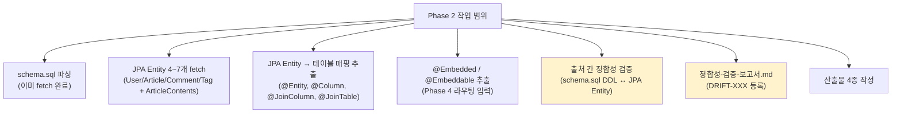
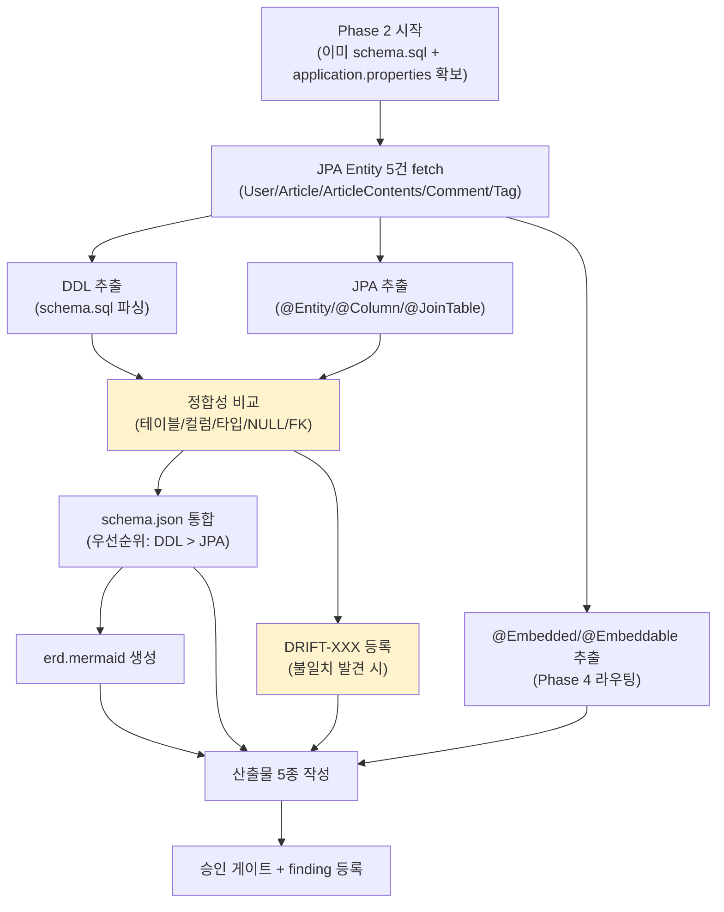

# Plan: PoC #01 — Phase 2 (db, DB 스키마 + 정합성 검증)

> 작성일: 2026-04-27
> 작성자: Claude (윤주스 검토 대기)
> 적용 원칙: Work Principles 4원칙
> 상위 plan: methodology-v1.1/.claude/plans/plan-poc-realworld.md
> Phase 명세: ai-native-methodology/methodology-spec/workflow/phase-2-db.md
> 산출물 명세: ai-native-methodology/methodology-spec/deliverables/04-DB-스키마.md
> Phase 1 인계: examples/poc-01-realworld-spring/output/inventory/_manifest.yml

---

## §1. 목적

PoC #01 (RealWorld Spring Boot) Phase 2 — DB 영역의 **단일 통합 스키마** 작성 + **출처 간 정합성 검증**.

이 단계가 답하는 질문:
- 이 시스템의 데이터 구조는?
- 출처들 (schema.sql DDL ↔ JPA Entity) 이 일치하는가?
- 도메인 추출 (Phase 4) 의 골격이 될 테이블 그룹은?

**진짜 목적 (PoC 한정)**: Phase 2 명세의 빈틈 발견 + 명세의 강한 검증 케이스 (다중 출처 정합성) 를 RealWorld 에 적용.

---

## §2. Phase 1 인계 사항 (이미 확보된 정보)

### 2.1 사전 fetch 완료 (rate limit 절약)

| 파일 | 내용 | 확정 사항 |
|---|---|---|
| `schema.sql` (2,425 bytes, 68 lines) | DDL 직접 정의 | 7 테이블, BIGSERIAL PK, FK 다수, 복합 PK 3개 (join tables) |
| `application.properties` (254 bytes) | datasource + JPA 설정 | H2 인메모리 + PostgreSQL 모드 + `ddl-auto=none` (schema.sql SoT) |

### 2.2 추출된 7 테이블 (schema.sql)

```
users           — id, name, bio, image, email, password
user_followings — follower_id, followee_id (복합 PK, FK→users 양쪽)
articles        — id, author_id, title, slug, description, body, created_at, updated_at
                  + UNIQUE (author_id, slug)
                  + FK author_id → users
tags            — id, value (UNIQUE)
articles_tags   — article_id, tag_id (복합 PK, join table)
article_favorites — article_id, user_id (복합 PK, join table)
comments        — id, author_id, article_id, body, created_at, updated_at
                  + FK author_id → users (ON DELETE CASCADE)
                  + FK article_id → articles (ON DELETE CASCADE)
```

### 2.3 도메인 ↔ 테이블 매핑 추정 (source-info.md ground truth 기반)

| 도메인 | 추정 테이블 | 비고 |
|---|---|---|
| User | users, user_followings | follow 관계 |
| Article | articles, article_favorites, articles_tags | favorite, tag 매핑 |
| Comment | comments | 단순 |
| Tag | tags | 단순 |
| Profile | (users 안에 포함) | 별도 테이블 없음 |

⭐ **`@Embedded` 활용 단서** (source-info.md): Article 의 ArticleContents (title/description/body) 를 `@Embedded` 로 분리 가능성. Phase 4 Aggregate 추출의 핵심 케이스.

---

## §3. 작업 범위

### 3.1 In Scope



### 3.2 Out of Scope

- ❌ 운영 DB 메타 분석 (H2 인메모리, 운영 환경 부재 — F-016 후보)
- ❌ Migration 파일 분석 (RealWorld 는 schema.sql 단일, migration 부재)
- ❌ 인덱스 분석 (운영 DB 없으므로 schema.sql + JPA `@Index` 만)
- ❌ Stored Procedures / Views (RealWorld 부재)
- ❌ Repository 메서드 가드 추출 (Phase 4 5.A 영역)
- ❌ ORM 메서드 호출 분석 (Phase 4 영역)

---

## §4. 산출물 (변경 대상)

Phase 2 명세 §4.1 + 04-DB-스키마.md §2.1 기준 — `output/db/`:

| 파일 | 형식 | 신뢰도 예상 |
|---|---|---|
| `schema.json` | JSON (db-schema.schema.json 준수) | 0.95 |
| `schema.sql` | SQL (통합 — 본 PoC 는 schema.sql 그대로 + JPA 보강 메모) | 0.98 |
| `erd.mermaid` | Mermaid erDiagram | 0.95 |
| `정합성-검증-보고서.md` | Markdown (DRIFT-XXX) | 0.90 |
| `_manifest.yml` | YAML (Phase 2 매니페스트) | 0.98 |
| `tables/` (선택) | 테이블별 상세 (생략 가능) | - |

✅ db-schema.schema.json **존재** — schema 검증 가능 (F-007 같은 부재 finding 없음).

---

## §5. 입력 (전수 조사 결과)

### 5.1 이미 확보된 입력

- `schema.sql` (DDL)
- `application.properties` (JPA + datasource 설정)
- Phase 1 산출물 5종 (스택, 도메인 우선순위 등)
- Phase 0 source-info.md (Design Principal — `@Embedded`, `@JoinTable` 선호)
- Phase 0 domain-context.md (도메인 흐름)

### 5.2 Phase 2 에서 추가 fetch 필요

| 우선순위 | 파일 | 목적 | 예상 LOC |
|---|---|---|---|
| P0 | `domain/user/User.java` | users 테이블 매핑 + Profile/Email/Password VO | 중간 |
| P0 | `domain/article/Article.java` | articles 테이블 매핑 + `@Embedded` ArticleContents | 중간 |
| P0 | `domain/article/ArticleContents.java` | `@Embeddable` 추출 (Phase 4 입력) | 작음 |
| P0 | `domain/article/comment/Comment.java` | comments 테이블 매핑 | 작음 |
| P0 | `domain/article/tag/Tag.java` | tags 테이블 매핑 | 작음 |
| P1 | `domain/user/Profile.java` | follow 관계 (`@JoinTable` 검증) | 작음 |
| P1 | `domain/article/comment/CommentService.java` (선택) | Comment ↔ Article FK 처리 | 작음 |
| P2 | `domain/user/Email.java`, `Password.java`, `Image.java`, `UserName.java` | VO 검증 (`@Column` 사용 여부) | 매우 작음 |

**총 P0 fetch: 5건** (rate limit 51 → 46 — 충분).

### 5.3 정합성 검증 출처 (Phase 2 명세 §3.4)

본 PoC 의 출처 조합:
- ✅ ORM (JPA Entity)
- ✅ Migration → 별칭 (schema.sql DDL — Spring Boot 의 `schema.sql` 자동 로드)
- ❌ ERD 부재
- ❌ 운영 DB 부재 (H2 인메모리 + ddl-auto=none)

→ **2 출처** (ORM + DDL) 정합성 검증. **명세의 핵심 케이스**!

통합 우선순위 (Phase 2 명세 §3.4):
- 본 PoC 한정: **schema.sql DDL > JPA Entity** (`ddl-auto=none` 이므로 DDL 이 실제 동작)
- 명세 기본값 (DB > ORM > ERD) 와 다름 → finding 후보 (F-016: ddl-auto 정책에 따른 우선순위 분기 가이드 부재)

---

## §6. 처리 흐름



---

## §7. 영향도

### 7.1 후속 Phase 에 미치는 영향

| Phase | 영향 |
|---|---|
| Phase 3 (arch) | 모듈 ↔ 테이블 그룹 매핑 (`tables[].related_entity_id` 활용) |
| Phase 4 (5.A DB 영역) | `@Embedded` Aggregate 추출의 핵심 입력. CHECK constraint → BR 후보. ORM 메서드 가드 추출의 출발점. |
| Phase 4 (5.A 신뢰도) | 정합성 보고서 의 drift 가 큰 영역은 신뢰도 ↓ (Phase 2 명세 §7) |
| Phase 5-1 (api) | 테이블 ↔ Entity ↔ DTO ↔ API 매핑 |
| Phase 6 (quality) | unused table → 안티패턴 (`AP-DB-UNUSED-XXX`). 심각한 drift → 안티패턴 격상 |

### 7.2 방법론 본체에 미치는 영향

- `ddl-auto=none` 케이스의 정합성 우선순위 (DDL > JPA) 가이드 부재 → F-016 후보
- 본 PoC 가 schema.sql + JPA 양쪽을 모두 가진 강한 검증 케이스 → 명세 §3.2 다중 출처 검증의 살아있는 예시

---

## §8. 리스크

### R-Phase2-1. JPA Entity 와 DDL 불일치 가능성

**증상**: 학습용 spec 이라도 schema.sql 이 손으로 작성되어 JPA `@Column(length = ...)` 와 DDL `VARCHAR(...)` 미세 차이 가능.

**대응**:
- 컬럼별 비교 (이름 / 타입 / nullable / unique / FK)
- DRIFT-XXX 등록
- severity 분류 (high: 운영 영향 / medium: 의도 불일치 / low: 메타 차이)

### R-Phase2-2. JPA `@JoinTable` vs DDL join table 의 표기 차이

**증상**: source-info.md "@JoinTable 선호" — articles_tags, article_favorites, user_followings 가 `@JoinTable` 어노테이션으로 표현됨. 별도 Entity 부재 가능성.

**대응**:
- Article.java / User.java 의 `@ManyToMany(...) @JoinTable(...)` 직접 확인
- DDL join table ↔ JPA `@JoinTable` 매핑 정확히 기록
- inventory.json `tables[].sources` 에 양 출처 명시

### R-Phase2-3. CHECK constraint 부재로 BR 추출 빈약

**증상**: schema.sql 에 CHECK 제약 없음 (확인됨). NOT NULL + UNIQUE 외 비즈니스 규칙 단서 부재.

**대응**:
- DDL 단계에서 BR 후보는 NOT NULL + UNIQUE + FK ON DELETE 정책 한정
- Phase 4 5.A 에서 JPA `@Size`, `@Pattern`, `@AssertTrue` 등 추가 추출
- 본 PoC 는 RealWorld 학습용 spec → BR 빈약 자체가 한계로 인정 (정직 보고)

### R-Phase2-4. application.properties 의 `MODE=PostgreSQL` 해석

**증상**: H2 in-memory 지만 PostgreSQL 호환 모드. database_type 을 어떻게 적을 것인가 (h2? postgresql?).

**대응**:
- `database_type: "postgresql"` (의도된 운영 DB) + `actual_runtime_db: "h2"` 보조 메타
- inventory.warnings 에 "운영 환경 부재 — H2 인메모리 + PostgreSQL 호환 모드" 명시

### R-Phase2-5. F-015 sub-agent cross-validation 적용 미숙

**증상**: Phase 1 에서 D 에이전트 보고 오차 50% (Lombok / Tree count). Phase 2 의 3 에이전트 결과도 cross-validation 필요.

**대응**:
- 모든 핵심 데이터 (테이블 수, FK 수, `@Embedded` 위치 등) 는 메인 에이전트가 직접 raw fetch 검증
- sub-agent 보고는 "참고만, 검증 필수" 마킹
- 신규 finding 발견 시 즉시 등록

---

## §9. 신뢰도 예측

명세 §6 + ADR-003 §9 5단계 라벨 적용.

| 영역 | 예측 신뢰도 | 해석 (ADR-003 §9) | extraction_method | element_count |
|---|---|---|---|---|
| 테이블 식별 | 0.98 | 거의 확실 | deterministic | 7 |
| 컬럼 식별 | 0.95 | 거의 확실 (boundary) | deterministic | ~35 |
| PK 식별 | 0.98 | 거의 확실 | deterministic | 7 (단일/복합) |
| FK 관계 | 0.95 | 거의 확실 | deterministic (DDL + JPA 양쪽) | ~8 |
| UNIQUE 제약 | 0.95 | 거의 확실 | deterministic | 2 (tags.value, articles unique) |
| `@Embedded` 식별 | 0.92 | 신뢰 가능 | pattern_matching (JPA) | 1~2 (예상) |
| 정합성 검증 | 0.90 | 신뢰 가능 | deterministic comparison | drift count |
| database_type | 0.85 | 신뢰 가능 | pattern_matching (datasource URL) | 1 |
| 컬럼 의미 추론 | 0.70 | 참고 수준 | llm_with_grounding | ~35 |

가중평균: **약 0.93~0.95 예상** (요소수 가중).

→ ADR-003 §9 해석: **신뢰 가능 (샘플 검토 권장)**.

---

## §10. 승인 게이트 (phase-2-db.md §5 + 04-DB-스키마.md §5)

```
□ schema.json schema 검증 통과 (db-schema.schema.json 준수)
□ erd.mermaid 렌더링 검증
□ 모든 테이블에 PK 명시 (단일/복합)
□ FK 명시 (8개 예상)
□ 정합성 검증 보고서 사람 검토 (DRIFT-XXX 가 있으면)
□ severity=high 항목 모두 결정 완료
□ 통합 우선순위 정책 (본 PoC: DDL > JPA) 명시 또는 사용자 변경
```

---

## §11. Open Questions (3원칙 승인 전)

1. **JPA Entity fetch 우선순위**: P0 5건 + P1 2건 = 7건. 충분한가, 더 필요한가?
   - 권장: P0 5건 으로 시작. 필요 시 P1 추가.
2. **database_type 표기**: `postgresql` (의도) vs `h2` (실제). 둘 다 표기 가능?
   - 권장: `postgresql` (의도된 운영 DB) + `actual_runtime_db: h2` 보조 메타 (schema 자체 정의는 없으나 추가 필드 가능).
3. **정합성 우선순위 정책**: schema.sql > JPA (본 PoC) vs 명세 기본 (DB > ORM > ERD). finding 으로 등록?
   - 권장: F-016 신규 finding 등록 ("ddl-auto 정책에 따른 우선순위 분기 가이드 부재").
4. **tables/{name}.md 별 상세 파일**: 생략 가능. 본 PoC 한정 어떻게?
   - 권장: 생략 (4시간 PoC 시간 제약). 산출물 4종 + _manifest.yml.

---

## §12. 다음 단계 (이 plan 승인 후)

1. **2원칙**: 3 에이전트 병렬 리서치
   - 공식문서 리서처: JPA `@Entity`/`@Embedded`/`@JoinTable`/`@Convert` + Spring Boot schema.sql 자동 로드
   - 테크기업 사례 리서처: 카카오/네이버 JPA + schema.sql 정합성 사례, 우아한형제들 도메인 추출 사례
   - Senior Engineer (BE): JPA-DDL 정합성 함정, `@Embedded` Aggregate 추출 함정, ddl-auto 정책 함정
2. **3원칙**: research 완료 후 Phase 2 실행 승인
3. **실행**: P0 fetch → 산출물 5종 작성 → finding 정식 등록
4. **4원칙**: 실패 시 revert + Lessons Learned

---

## §13. F-015 cross-validation 체크리스트 (Phase 1 신규 발견 적용)

Phase 1 에서 D 에이전트 보고 오차 50% 발생. Phase 2 에서 동일 실수 방지:

```
□ sub-agent 가 "테이블 수 N개" 보고 → 메인이 schema.sql 파싱 cross-check
□ sub-agent 가 "Entity X 에 @Embedded 있음" 보고 → 메인이 raw fetch cross-check
□ sub-agent 가 "FK ON DELETE Y" 보고 → 메인이 schema.sql 직접 확인
□ sub-agent 가 "JPA @Column(length=N)" 보고 → 메인이 raw fetch + DDL 비교
□ Cross-check 50%+ 오차 발견 시 즉시 finding 등록 (F-015 영향 확장)
```

---

## §14. Lessons Learned (Phase 2 완료 후 채워질 영역)

(현재 비어있음)

채워질 항목 후보:
- DDL ↔ JPA 정합성 검증 패턴 (본 PoC 의 강한 케이스)
- ddl-auto=none 환경의 우선순위 정책
- `@Embedded` Aggregate 추출 패턴
- F-015 (sub-agent cross-validation) 의 Phase 2 적용 결과
- RealWorld 학습용 spec 의 DB 영역 한계 (CHECK 부재 → BR 빈약)
