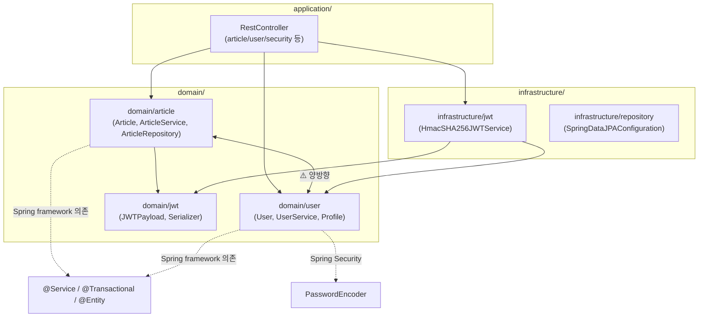
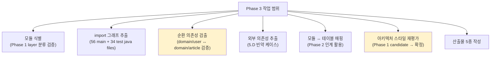
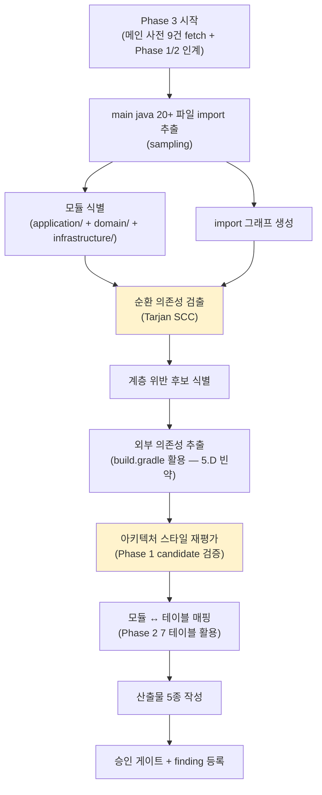

# Plan: PoC #01 — Phase 3 (arch, 아키텍처)

> 작성일: 2026-04-28
> 작성자: Claude (윤주스 검토 대기)
> 적용 원칙: Work Principles 4원칙
> 상위 plan: methodology-v1.1/.claude/plans/plan-poc-realworld.md
> Phase 명세: ai-native-methodology/methodology-spec/workflow/phase-3-arch.md
> 산출물 명세: ai-native-methodology/methodology-spec/deliverables/01-아키텍처.md
> Schema: ai-native-methodology/schemas/architecture.schema.json
> Phase 1 인계: output/inventory/_manifest.yml
> Phase 2 인계: output/db/_manifest.yml

---

## §1. 목적

PoC #01 Phase 3 — 시스템의 **모듈 구성과 의존 방향** 추출 + **모듈 ↔ 테이블 그룹 매핑** + **아키텍처 스타일 확정**.

이 단계가 답하는 질문:
- 모듈 경계는? (Phase 1 의 application/domain/infrastructure 3-tier 검증)
- 의존성 방향은? (순환 있나?)
- Phase 1 의 candidate (Hexagonal/Clean 0.65 / POJO domain 0.85) 가 의존 방향 검증 후 어떻게 바뀌나?
- 외부 시스템 통합점은? (RealWorld 빈약 예상)

**진짜 목적 (PoC 한정)**: Phase 1 candidate 의 검증 + 5.D 빈약 케이스의 명세 빈틈 발현.

---

## §2. Phase 1/2 인계 사항 + 메인 사전 검증 결과

### 2.1 Phase 1 결과 (검증 대상)

- 아키텍처 candidate:
  - Hexagonal/Clean (영향): 0.65
  - POJO domain 강조: 0.85
  - Layered (보강): 0.55
- 모듈 우선순위: Article (1) > User (2) > security (3)
- 디렉토리 구조: application/ + domain/ + infrastructure/ 3-tier (56 main java files)

### 2.2 Phase 2 결과 (인계)

- 7 테이블 + 9 DRIFT
- 테이블 그룹 매핑 후보: article 도메인 (4 테이블) / user 도메인 (2 테이블) / tag 도메인 (1 테이블)
- @Embeddable 7개 (Phase 4 5.A 라우팅)
- DRIFT-002 (user_followings 의미) — Phase 4 검증 대기

### 2.3 메인 사전 fetch 검증 결과 (F-015 적용) ⭐

9개 핵심 파일의 import 추출 결과:

**의존 방향**:



### 2.4 핵심 발견 (실측)

| # | 발견 | 영향 | finding 후보 |
|---|---|---|---|
| 1 | **domain/ 이 Spring 어노테이션 + Spring Data + Spring Security 직접 의존** | source-info.md ground truth "domain 패키지 외에서 Spring 어노테이션 최소" 와 일부 차이 — `@Service`, `@Transactional`, `@Entity`, `@Column`, `PasswordEncoder` 모두 도메인에 import | F-022 후보 (ground truth vs 실측 차이 처리 가이드 부재) |
| 2 | **domain/user ↔ domain/article 양방향 import** | 순환 의존성 후보. User.java 가 Article/ArticleContents/Comment import. Article.java 가 User/Comment import | AP-ARCH-CIRCULAR-001 안티패턴 후보 |
| 3 | **infrastructure/jwt → domain/user** | JWT 구현체 (HmacSHA256JWTService) 가 User Entity 직접 의존 | layer_violation 후보 (infrastructure 가 도메인 entity 의존 자체는 허용 가능 — port 인터페이스 부재) |
| 4 | **HTTP 클라이언트 부재** | 5.D 외부 의존성 빈약 (학습용 spec) — 외부 통합 0건 | F-019 (운영 환경 부재) 와 연계 |
| 5 | **application/ → infrastructure/ 의존** | RestController 가 UserJWTPayload (infrastructure) import | 정상 (Hexagonal 이 아니라는 증거) |

→ **아키텍처 재평가 (사전 추정)**:
- Phase 1: Hexagonal/Clean (영향) 0.65
- Phase 3 사전 분석: **"Layered + Spring-flavored DDD-Lite"** 가 더 정확. confidence 0.75.
- "Pure Hexagonal/Clean" 미달성 (domain framework 의존 + port/adapter 미분리)
- POJO domain 0.85 → **0.70 으로 하향 정정** (실측에서 Spring 의존 확인)

---

## §3. 작업 범위

### 3.1 In Scope



### 3.2 Out of Scope

- ❌ 런타임 의존성 (DI 컨테이너 동적 바인딩) — Phase 4 영역
- ❌ 빌드 타임 의존성 (Gradle task 순서) — Phase 1 inventory 참조
- ❌ Repository 메서드 가드 (Phase 4 5.A 영역)
- ❌ Service 도메인 메서드 의도 추출 (Phase 4 영역)
- ❌ 동적 import / 리플렉션 분석

---

## §4. 산출물 (변경 대상)

Phase 3 명세 §4.1 + 01-아키텍처.md §2.1 기준 — `output/architecture/`:

| 파일 | 형식 | 신뢰도 예상 |
|---|---|---|
| `architecture.json` | JSON (architecture.schema.json 준수 ✅) | 0.92 |
| `architecture.md` | Markdown (사람용) | 0.92 |
| `architecture.mermaid` | Mermaid flowchart (C4 Level 3) | 0.95 |
| `dependency-graph.mermaid` | Mermaid (의존성 그래프) | 0.95 |
| `circular-dependencies.md` | Markdown (순환 의존성 분석) | 0.95 |
| `_manifest.yml` | YAML (Phase 3 매니페스트) | 0.98 |

✅ architecture.schema.json **존재** — schema 검증 가능.

---

## §5. 입력 (전수 조사 결과)

### 5.1 이미 확보된 입력

- Phase 1 inventory (메인 사전 fetch 9건 추가)
- Phase 2 schema.json (7 테이블 + 9 DRIFT)
- 9개 핵심 파일 의존 방향 분석 (§2.3 §2.4)

### 5.2 Phase 3 추가 fetch 필요

| 우선순위 | 파일 | 목적 |
|---|---|---|
| P0 | 모든 main java 파일 (56개) 의 import 라인 | 의존 그래프 완성 |
| P1 | 모든 test java 파일 (34개) 의 import (선택) | 의존성 검증 보강 |
| P0 | `application/WebMvcConfiguration.java` | application 영역 의존 검증 |

**전수 fetch 전략**:
- raw fetch 56건 = rate limit 부담 (45 → -11 = 34 잔여)
- 또는 `gh api` 사용 (인증 시 5000/h)
- 또는 핵심 파일 sampling (15~20건) 으로 충분

→ **권장**: 핵심 sampling 20건 + 전체 패키지 import 통계 (서비스/컨트롤러/리포지토리/도메인 각 영역 sample).

### 5.3 외부 의존성 출처

build.gradle 의존성 (이미 Phase 1 에서 분석 완료):
- spring-boot-starter-web → Spring Web (server, no client)
- spring-boot-starter-security → Spring Security
- spring-boot-starter-data-jpa → Hibernate
- spring-boot-starter-validation → Bean Validation
- h2 (runtimeOnly) → H2 인메모리 DB
- spring-boot-starter-test → JUnit/Mockito

→ **외부 호출 지점 = 0건** (HTTP 클라이언트 / Kafka / SDK 모두 부재).

---

## §6. 처리 흐름



---

## §7. 영향도

### 7.1 후속 Phase 에 미치는 영향

| Phase | 영향 |
|---|---|
| Phase 4 (5.A) | 모듈 ↔ 도메인 매핑 = Bounded Context 후보. domain/user ↔ domain/article 양방향 의존 = Aggregate 경계 검증. layer_violation = 도메인 의도 검증 입력. |
| Phase 4 (5.D) | 외부 의존성 0건 — 5.D 빈약 인정 (PoC 한계 정직 보고) |
| Phase 5-1 (api) | application/article/RestController 등 → API 추출 (Phase 1 candidate 검증 결과 = layered 라면 Controller 패턴 일관) |
| Phase 6 (quality) | 순환 의존성 (있으면) → AP-ARCH-CIRCULAR-001. layer_violation → AP-ARCH-LAYER-VIOLATION-XXX. POJO domain ground truth vs 실측 차이 → 안티패턴 격상 검토. |

### 7.2 방법론 본체에 미치는 영향

- 도메인 framework 의존 (`@Service`, `PasswordEncoder` import in domain/) 의 처리 가이드 부재 — F-022 후보
- 5.D 빈약 케이스의 신뢰도 처리 — F-019 (운영 환경 부재) 와 연계
- 양방향 도메인 import = "순환 의존성" vs "Aggregate 양방향 참조" 분기 가이드 부재 — F-023 후보

---

## §8. 리스크

### R-Phase3-1. 56 java files import 전수 fetch 의 rate limit

**증상**: 56 raw fetch + sub-agent 작업 = 60/h unauth 한도 위협 (현재 45 → 작업 후 < 10).

**대응**:
- sampling 20건 + 패키지 단위 import 통계 (계층별 대표 파일)
- 또는 GitHub Search API (`grep -r "import io.github..."`) 활용
- 또는 메인이 zip download 후 로컬 grep (URL: `https://github.com/raeperd/realworld-springboot-java/archive/refs/heads/master.zip`)

### R-Phase3-2. 양방향 도메인 import = 순환 의존성? Aggregate 참조?

**증상**: User.java imports Article (CASCADE REMOVE 메서드 등). Article.java imports User. 둘 다 Entity 이고 cross-aggregate 참조.

**대응**:
- 명세 §3.1 "순환 의존성: Tarjan SCC 알고리즘" — 알고리즘 적용 시 양방향 = 순환
- 단 도메인 의도가 양방향이면 "정상" — Bounded Context 가 같은 BC 안의 cross-aggregate
- F-023 신규 finding: "도메인 cross-aggregate 양방향 참조 vs 순환 의존성 분기 가이드 부재"
- 본 PoC 한정: 양방향을 "low severity 순환 의존성" 으로 분류 + Phase 4 도메인 의도 검증 메모

### R-Phase3-3. 5.D 외부 의존성 빈약 결과 처리

**증상**: 외부 호출 지점 0건. external_dependencies[] = 빈 배열. Phase 4 5.D 진입 시 추출할 게 없음.

**대응**:
- 명세 §3.1 "외부 호출 지점" 0건 인정 + warnings 명시
- 5.D 빈약 자체가 PoC 한계 (plan-poc-realworld.md §2.3) — 정직 보고
- 사내 진짜 PoC 시 5.D 풍부한 케이스 별도 검증 필요

### R-Phase3-4. 아키텍처 스타일 재평가 — Phase 1 candidate 와 차이

**증상**:
- Phase 1: Hexagonal/Clean 0.65, POJO domain 0.85
- Phase 3 사전 분석: Layered + Spring-DDD-Lite 0.75, POJO domain 0.70

**대응**:
- 차이를 architecture.md 에 명시 (Phase 1 → Phase 3 정정 트레이스)
- inventory.json 의 architecture_style_candidates 도 갱신 권고 (사용자 결정)
- F-024 신규 finding: "Phase 1 candidate vs Phase 3 확정 의 차이 처리 절차 부재"

### R-Phase3-5. F-015 cross-validation Phase 3 적용

**증상**: Phase 1 D 오차 50% → Phase 2 0% (사전 적용으로 해소). Phase 3 도 동일 적용 필요.

**대응**:
- 메인이 핵심 9건 사전 fetch (이미 완료)
- sub-agent 도 직접 fetch 권장 (학습 코퍼스 의존 최소화)
- cross-check 시 50%+ 오차 발견 시 즉시 finding 등록

---

## §9. 신뢰도 예측

명세 §6 + ADR-003 §9 5단계 라벨.

| 영역 | 예측 신뢰도 | 해석 (ADR-003 §9) | extraction_method | element_count |
|---|---|---|---|---|
| 모듈 식별 | 0.98 | 거의 확실 | deterministic | 3 (application/domain/infrastructure) 또는 6 (sub-domain 포함) |
| 의존성 그래프 | 0.92 | 신뢰 가능 | pattern_matching (sampling 기반) | ~80 imports |
| 순환 의존성 검출 | 0.95 | 거의 확실 | deterministic (Tarjan) | 1~2 (domain/user ↔ domain/article) |
| 외부 호출 지점 | 0.95 | 거의 확실 | pattern_matching (build.gradle) | 0 (학습용 spec) |
| 모듈 책임 기술 | 0.85 | 신뢰 가능 | llm_with_grounding | 6 |
| 아키텍처 스타일 | 0.75 | 참고 수준 (boundary) | llm_with_grounding (사전 검증 강함) | 1 |
| 레이어 위반 판정 | 0.70 | 참고 수준 | llm_with_grounding | 1~3 |
| 모듈 ↔ 테이블 매핑 | 0.92 | 신뢰 가능 | deterministic (Phase 2 인계) | 7 (테이블 수) |

가중평균: **약 0.90~0.92 예상**.

→ ADR-003 §9 해석: **신뢰 가능 (샘플 검토 권장)**.

---

## §10. 승인 게이트

```
□ architecture.json schema 검증 (architecture.schema.json 준수)
□ Mermaid Component diagram 렌더링
□ 모든 모듈에 ID/책임 명시
□ 순환 의존성 = 0 또는 발견 시 안티패턴 등록 (domain/user ↔ domain/article 검증)
□ 모듈 ↔ 테이블 매핑 = 사용자 검토 (Phase 2 7 테이블)
□ 아키텍처 스타일 후보 = 사용자 검증 (Phase 1 → Phase 3 정정 트레이스)
□ 외부 의존성 위치 = Phase 4 5.D 라우팅 준비 (현재 0건)

# 보강
□ Phase 1 candidate 와 차이 명시 (정정 트레이스)
□ Spring framework 의존 (POJO ground truth 차이) finding 등록
□ 양방향 도메인 import 분기 (순환 vs Aggregate 참조) finding 등록
□ Phase 3 종료 시 finding 최소 3건 정식 등록
```

---

## §11. Open Questions (3원칙 승인 전)

1. **import 전수 fetch vs sampling**: 56건 vs 20건. 시간/rate limit vs 정확도.
   - 권장: sampling 20건 (계층별 대표) + grep 패키지 통계.

2. **모듈 식별 단위**: application/domain/infrastructure 3-tier vs sub-domain 분해 (article/user/jwt 등 7개)
   - 권장: 7개 sub-domain 단위 (Phase 4 BC 매핑 직결).

3. **양방향 도메인 import 처리**: 순환 의존성 vs Aggregate 참조
   - 권장: low severity 순환 + Phase 4 도메인 의도 검증 메모. F-023 등록.

4. **POJO ground truth 와 실측 차이**: source-info.md 정정 vs 안티패턴 등록
   - 권장: 둘 다 — source-info.md 보정 + AP-DOMAIN-FRAMEWORK-LEAK 안티패턴 후보.

---

## §12. 다음 단계 (이 plan 승인 후)

1. **2원칙**: 3 에이전트 병렬 리서치
   - 공식문서 리서처: Spring DDD 패턴, Hexagonal vs Layered 판정, dependency analysis 도구 (jdeps, Sonarqube), Spring Modulith
   - 테크기업 사례: 우형/카카오 도메인 모듈 분리, Hexagonal 적용 사례, 양방향 Aggregate 참조 사례
   - Senior BE: Spring 의존 도메인 vs Pure POJO 함정, 순환 의존성 vs Aggregate 참조 판정 함정, 5.D 빈약 케이스 함정

2. **3원칙**: research 완료 후 Phase 3 실행 승인
3. **실행**: import 분석 + 산출물 5종 + finding 정식 등록

---

## §13. F-015 cross-validation 체크리스트 (Phase 3 사전 적용)

```
□ 메인이 9건 핵심 import 직접 fetch 완료 ✅ (§2.3)
□ sub-agent 가 import 추출 시 메인 fetch 결과와 cross-check
□ "domain/user ↔ domain/article 양방향" 메인 검증 ✅
□ "domain/ → Spring framework 의존" 메인 검증 ✅
□ sub-agent 보고에서 50%+ 오차 발견 시 즉시 finding (F-015 영향 확장)
```

---

## §14. Lessons Learned (Phase 3 완료 후 채워질 영역)

(현재 비어있음)

채워질 항목 후보:
- Phase 1 candidate 의 Phase 3 검증 패턴
- 양방향 도메인 import 처리 결정
- POJO ground truth 와 framework 의존 실측 차이의 처리
- 5.D 빈약 케이스의 신뢰도/한계 표기
- F-022/F-023/F-024 신규 finding 의 v1.1.2/v1.2 분류
