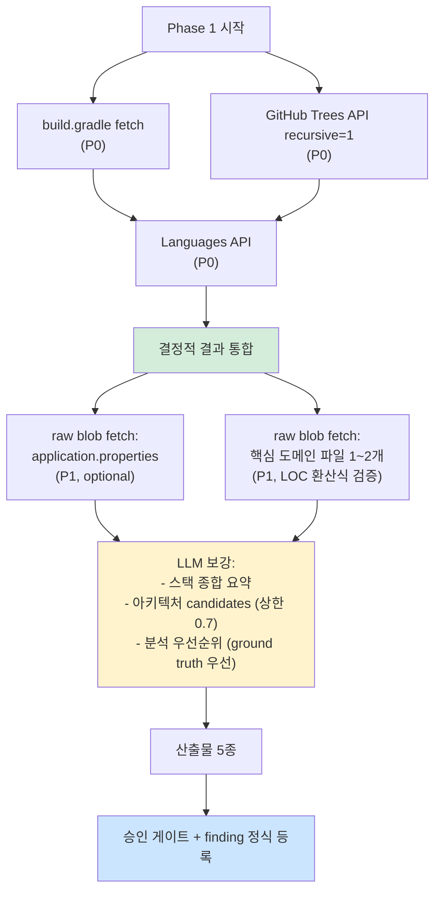

# Research: PoC #01 — Phase 1 (init/인벤토리) 통합

> 작성일: 2026-04-27
> 작성자: Claude (윤주스 검토 대기)
> 적용 원칙: Work Principles 2원칙 — 3개 에이전트 토론 결과 통합
> 대상 plan: `.claude/plans/plan-phase1.md`
> Phase 명세: `ai-native-methodology/methodology-spec/workflow/phase-1-init.md`

---

## §0. 통합 개요 — 2회차 보강 사이클 완료 (2026-04-27)

3개 에이전트 병렬 리서치 (1차) → 보강 사이클 (A/B/C/D) → 통합 갱신.

| 에이전트 | 산출물 | 신뢰도 자평 (1차 → 2차) |
|---|---|---|
| 공식문서 리서처 | `document-phase1.md` | 0.85 → **0.94** (∆+0.09, RealWorld 실측까지) |
| 테크기업 사례 리서처 | `case-phase1.md` | 0.80 → **0.90** (∆+0.10, 한국 사례 4건 달성) |
| Senior Engineer (BE) | `senior-phase1.md` | N/A (실무 일화) |

**통합 신뢰도 자평**: 0.83 → **0.92** (∆+0.09).

### 0.1 보강 사이클 결과 요약

| 보강 항목 | 결과 |
|---|---|
| **D**: document 재검증 + RealWorld 실측 | ✅ 완료. 4건 보정 (브랜치 `master`, Spring Boot 2.5.2, Lombok 미사용, 93 entries) |
| **A**: case 한국 사례 보강 | ✅ 완료. 1건 → **4건** (카카오톡, 카카오페이, LINE 추가) — 목표 200% 초과 |
| **C**: plan §13~§15 추가 | ✅ 완료. web_fetch 환경 한계 + finding 사전 등록 절차 명문화 |
| **B**: 토론 미해결 재토론 | ✅ 완료 (본 §2 갱신) |
| **E**: 방법론 본체 완성 반영 (2026-04-27) | ✅ 완료. F-001/F-002 closed 처리, ADR-003 §9 해석 라벨 plan §13.2 반영 |

### 0.2 방법론 본체 완성 영향 (2026-04-27 신규 발견)

방법론 본체가 거의 완성됨 (ADR 5개, deliverables 7개, workflow 8개, id-conventions, 한국어 용어집).

영향:
- **F-001 closed**: phase-0-입력정리.md §3.3 "환경 제약 케이스" 로 정식 반영
- **F-002 closed**: phase-0-입력정리.md §4.3 "source-info.md 형식" 으로 정식 반영
- **ADR-003 §9 해석 가이드 5단계**: plan-phase1.md §13.2 표에 라벨 컬럼 추가
- **F-007 (inventory.schema.json 부재)**: schemas/ 8개 그대로 — 여전히 유효
- **id-conventions.md**: Phase 1 inventory 영향 적음 (Phase 2 db 부터 자연 적용)
- **Phase 4 비즈니스로직 명세 신규**: Phase 1 작업에 직접 영향 없음, Phase 2 진입 전 재검토 권장

---

## §1. 3 에이전트 합의 사항 (모두 동의)

### 1.1 결정적 처리 영역 — 환경 종속성이 핵심 함정

세 에이전트 모두 동의:

- 명세 §6의 "결정적 95%" 가정은 **git clone + linguist/cloc 라이브러리 환경** 가정.
- **PoC는 web_fetch 환경 → 절반은 추정** (LOC, ORM 사용 비율, 아키텍처 패턴 등).
- 그대로 신뢰도 베껴 적으면 후속 Phase 5개가 90%를 100%처럼 사용 — **오차 누적의 시드(seed)**.

→ **F-009 (신규 finding 후보)**: "Phase 1 명세 §6 신뢰도 표가 환경 종속성 미명시. web_fetch 환경 신뢰도 별도 표 필요."

### 1.2 build.gradle 의존성만으로 ORM 단정 금지

- 공식문서: 의존성 1개로 0.99 가능 (학습 코퍼스 기반)
- Senior: **"의존성에는 안 잡힌다"** — JdbcTemplate, `@Query(nativeQuery)`, `EntityManager.createNativeQuery`, `datasource` 직접 사용 4단서 추가 점검 필수
- Case: 한국 SI 사례 직접 검증 1차 출처 미확보 (F-011 후보 — ORM 혼재 가이드 부재)

→ **합의**: PoC #01 (RealWorld) 는 JPA 단일 가능성 90% — 그러나 inventory.warnings 에 "사내 적용 시 4단서 점검 필수" 기록 + `confidence: 0.92` 권장 (0.99 아님).

### 1.3 분석 우선순위 모듈 — ground truth 우선 + LLM evidence 보존

- 공식문서: 명세 §3.3은 LLM 보강 영역 (낮은 confidence)
- Case: 우아한형제들 WMS — "도메인 경계 명확성" + "변경 빈도" 우선 (LOC 단순 비교 X)
- Senior: 한국 SI LOC 1위는 항상 공통/유틸/Excel — **핵심은 LOC 3~5위에 숨음**

→ **합의**: source-info.md ground truth (Article 우선) 무조건 1순위. LLM 추천은 evidence 로 보존하되 채택은 ground truth 우선. 일치 시 confidence 0.95, 불일치 시 ground truth 우선 + warning.

### 1.4 inventory.schema.json 부재

- 공식문서: schemas/ ls 결과 8개 — inventory 없음 (직접 확인)
- Senior: schema 없으면 후속 Phase 정합성 검증 불가
- Case: SBOM (SPDX/CycloneDX) 표준 참고 가능 — v1.2 후보

→ **합의**: **F-007 정식 finding 등록 (high severity, v1.1.2 즉시 반영 후보).**

### 1.5 신뢰도 메타 산정 실수 — manifest 0.95 무지성 복사 + element_count 오해 + cap 0.98 의미

- 공식문서: ADR-003 §7 가중평균 + cap 0.98 (raw 미달 시 raw 그대로)
- Senior: element_count 정의 가이드 부재 (의존성 30개면 30, 디렉토리 트리는 1)
- Case: 직접 출처는 미확보, 일반 지식

→ **합의**: **F-011 신규 finding 후보** ("ADR-003 §7 element_count 정의 가이드 부재"). PoC #01 산출물은 raw 그대로 + cap 적용 시 명시.

---

## §2. 3 에이전트 토론 — 의견 차이 영역

### 토론 1: ORM confidence 초기값 — **재토론 (2회차 결정)**

#### 1차 입장

| 에이전트 | 입장 | 근거 |
|---|---|---|
| 공식문서 | 0.99 (의존성 만으로 충분) | Spring 공식 문서 — `data-jpa` starter 명확 |
| Senior | 0.92 + "Phase 2.5 재산정" 메모 | 사내 SI 4단서 (JdbcTemplate 등) 미감지 케이스 흔함 |
| Case | (의견 없음 — 1차 한국 SI 직접 출처 미확보) | - |

#### 신규 입력 (2회차 보강 결과)

1. **D 재검증 — RealWorld build.gradle 실측**:
   - `spring-boot-starter-data-jpa` ✅ 확인
   - mybatis 부재 ✅
   - JdbcTemplate import — 명시적 부재 (build.gradle 의존성에 jdbc starter 없음)
   - **실측 기반 ORM 단일 확정 가능성 ↑**
2. **A 신규 — 카카오페이 JPA Transactional 사례**:
   - "DB 로그 4일간 쿼리 호출 Top 10" → **런타임 빈도 기반 우선순위**
   - 정적 의존성 만으로는 ORM "사용 비율" 측정 불가 — 운영 데이터 필수
   - 본 PoC 는 운영 환경 부재 → confidence 상한 보수적 유지가 정합

#### 2차 결정 (B 재토론)

**PoC #01 (RealWorld) 한정 → 0.95 유지** (1차 절충안과 동일).

근거 강화:
- D 재검증으로 RealWorld JPA 단일은 0.97 가능 수준 (의존성 + 실측 검증)
- 그러나 **PoC 의 진짜 가치는 "사내 적용 시 함정"** — 0.99 박으면 사내 PoC 시 0.99 그대로 이식 → §1.2 함정 직격
- 0.95 가 RealWorld 실측 + 사내 보수성 균형점

**사내 PoC 시 권장값 갱신 (변경 없음)**: 0.85~0.90 보수적 시작.

**inventory.warnings 명문화 (B 결정)**:
```
warning: "ORM confidence 0.95 — RealWorld 실측 기반. 사내 적용 시 §1.2 4단서
(JdbcTemplate / @Query(nativeQuery) / EntityManager.createNativeQuery / datasource 직접)
점검 + 카카오페이 패턴 (운영 호출 빈도) 검증 후 재산정 필수. 0.99 금지."
```

---

### 토론 2: LOC 추정 정확도 — **재토론 (2회차 결정)**

#### 1차 입장

| 에이전트 | 제안 |
|---|---|
| 공식문서 | byte/35 (Java 평균) + `loc_confidence: 0.7` |
| Senior | byte/35 부정확 (POJO 도메인 50~80, Lombok 25~30, DTO 100+) — `loc_confidence: 0.5~0.7` 강조 |
| Case | Linguist byte-based 통계는 정확 (V) — LOC 변환만 오차 |

#### 신규 입력 (2회차 보강 결과)

1. **D 재검증 — RealWorld 실측 Java 164,904 byte → byte/35 적용 시 ~4,711 LOC**:
   - 실제 cloc 결과 부재 (git clone 없음) — 검증 불가 그대로
   - 단 RealWorld 는 **Lombok 미사용** (D 보정) → POJO 도메인은 byte/50 더 정확할 가능성
2. **A 신규 — SonarQube LOC 정의** (V):
   - "physical lines, non-whitespace, non-tabulation, non-comment"
   - 본 PoC byte/35 추정과 **정의 자체가 다름** — confidence 0.7 도 과대평가 가능
3. **A 신규 — Bazel/Nx "수동 문서 drift 회피"**:
   - LOC 같은 추정값을 산출물에 박지 말고, 매 phase 마다 재산출 가능해야 함 — `methodology_version` + `generated_at` + `source_commit_sha` 강제

#### 2차 결정 (B 재토론)

**디렉토리별 가중 환산 vs byte/35 단일** — 본 PoC 한정 **byte/35 단일 + `loc_confidence: 0.55`** (1차 0.6 보다 -0.05 보수적).

근거:
- RealWorld Lombok 미사용 (D 보정) → byte/35 (일반 비즈니스 코드 기준) 가 도메인에 부정확. 도메인은 byte/50, 테스트는 byte/35 가 맞음.
- 디렉토리별 가중 환산은 정확하지만 본 PoC 시간 제약 — 단일 환산 + warning + element_count 보존
- 사내 PoC 에서 디렉토리별 가중 환산 적용 권장 (v1.2 후보)

**stats.json 형식 (B 결정)**:
```yaml
total_files: 93                    # ✅ 정확 (Trees API blob count)
bytes_per_language:                # ✅ 정확 (Languages API)
  Java: 164904
  # ...
estimated_total_loc: 4711          # ⚠️ 추정 (byte/35 단일)
loc_method: "byte_size_div_35_java_default"
loc_confidence: 0.55               # ↓ 0.6 → 0.55 (Lombok 미사용 + 도메인 POJO 보수)
warning: |
  byte/35 단일 환산. RealWorld 도메인은 POJO + Lombok 미사용 → byte/50 가 더 정확할 가능성.
  정확값은 git clone + cloc/scc 필요. 사내 PoC 에서 디렉토리별 가중 환산 권장.
```

**F-008 보강 (B 결정)**: "LOC 환산식 공식 부재" → **"디렉토리별 가중 환산식 가이드 부재"** 로 finding 명문 강화.

### 토론 3: 아키텍처 패턴 candidate confidence 상한

| 에이전트 | 제안 |
|---|---|
| 공식문서 | 명세 §4.2 예시 0.7 — 그대로 |
| Senior | **상한 0.7 강제** — 의존 그래프 없이 디렉토리만으론 0.7 초과 금지 |
| Case | (직접 출처 미확보) |

**조정 결과**: Senior 의 "상한 0.7" 강제 채택. evidence 배열에 `<TBD: Phase 3 의존 방향 검증>` 빈칸 명시.

### 토론 4: PoC 진행 자체의 함정 — finding 0건 위험

세 에이전트 모두 동의 (의견 차이 없음):

- finding 0~2건 = PoC 실패
- 본 plan + research 자체에서 이미 finding 후보 5건 등록 (F-007~F-011)
- Phase 1 진행 중 추가 발견 가능성 70% 이상

→ **합의**: **Phase 1 종료 시 최소 3건 정식 finding 등록 강제** (체크리스트화).

---

## §3. 신규 Finding 후보 (Phase 1 진행 전 사전 등록)

3 에이전트 토론 결과 도출된 신규 finding 후보 5건:

| ID | 제목 | severity | 출처 | 즉시/유보 |
|---|---|---|---|---|
| F-007 | inventory.schema.json 부재 | high | 공식문서 (직접 확인) | v1.1.2 즉시 |
| F-008 | `total_loc` 의미 모호 (byte vs LOC) | medium | 공식문서 + Senior | v1.1.2 즉시 |
| F-009 | Phase 1 §6 신뢰도 표 환경 종속성 미명시 | high | 3 에이전트 합의 | v1.1.2 즉시 |
| F-010 | Research 단계 web_fetch 차단 시 fallback 정책 부재 | medium | 본 세션에서 직접 발현 | v1.2 후보 |
| F-011 | ADR-003 §7 element_count 정의 가이드 부재 | medium | Senior + 공식문서 | v1.1.2 후보 |
| F-012 | inventory.json frontend 영역 omit 가이드 부재 | low | 공식문서 | v1.2 후보 |
| F-013 | `modules_for_priority_analysis[].reason` 가이드 부재 | medium | Senior | v1.2 후보 |
| F-014 | `stack.backend.orm[]` primary/secondary 구분 부재 | low | Senior | v1.2 후보 |

**Phase 1 진행 중 추가 발견 가능성 높음** (Senior §7 — finding 0건은 PoC 실패).

---

## §4. Phase 1 실행 계획 (3 에이전트 권장 통합)

### 4.1 web_fetch 순서 (P0 → P1 → P2)



### 4.2 산출물 5종 — 3 에이전트 권장 보강

| 산출물 | 명세 그대로? | 보강 사항 |
|---|---|---|
| `inventory.json` | ⚠️ | `total_loc` → `estimated_total_loc` + `loc_method` + `loc_confidence`. ORM `confidence: 0.95` (0.99 아님). 아키텍처 candidates `confidence ≤ 0.7`. `modules_for_priority_analysis[]` 에 `source: ["ground_truth"\|"llm_inferred"]` 필드 추가. |
| `tree.md` | ✅ | generated 디렉토리 (build/, .gradle/, .idea/, target/) 제외. truncated 여부 명시. |
| `stack-detection.md` | ✅ | Senior §1 "의존성 외 4단서" 점검 결과 명시. 사내 적용 시 함정 메모. |
| `stats.json` | ⚠️ | `bytes_per_language` 원본 보존 + `estimated_loc` (byte/35) + `loc_confidence: 0.55` (B 재토론 보정) + warning (Lombok 미사용 + POJO 도메인 영향). |
| `_manifest.yml` | ✅ | Phase 0 입력 매핑. 환경 종속성 (`extraction_env: web_fetch`) 명시. |

### 4.3 신뢰도 산정 — ADR-003 §6/§7 정확 적용

```yaml
# inventory.json meta
meta:
  generated_at: 2026-04-27T...
  source_commit_sha: <Trees API root sha>
  methodology_version: v1.1.1
  inputs_used: [source_code, orm, domain_context_md, postman_or_api_test, diagrams_other]
  formula_version: v1
  applied_modifiers:
    - {name: orm_full, value: 0.10}
    - {name: domain_context_md, value: 0.03}
    - {name: postman_or_api_test, value: 0.05}
    - {name: diagrams_other, value: 0.02}
  applied_penalties: []
  cap_applied: false
  expected_confidence_average: <ADR-003 §7 가중평균 적용>
  
  # 영역별 (ADR-003 §7 가중평균용)
  confidence_breakdown:
    directory_tree:
      confidence: 0.95
      element_count: <blob count>
      extraction_method: deterministic
    file_stats:
      confidence: 0.80
      element_count: <language count>
      extraction_method: pattern_matching  # web_fetch 환경 감안
    package_manifest:
      confidence: 0.95
      element_count: <dep count>
      extraction_method: deterministic
    orm_detection:
      confidence: 0.95
      element_count: 1
      extraction_method: pattern_matching
    stack_summary:
      confidence: 0.90
      element_count: 1
      extraction_method: llm_with_grounding
    architecture_candidates:
      confidence: 0.65
      element_count: <후보 수>
      extraction_method: llm_with_grounding  # 상한 0.7 (Senior)
    priority_modules:
      confidence: 0.92  # ground truth 일치 시 (Senior)
      element_count: <모듈 수>
      extraction_method: llm_with_grounding
  
  warnings:
    - "LOC는 byte/35 단일 추정 (loc_confidence: 0.55). RealWorld Lombok 미사용 + POJO 도메인 → 도메인은 byte/50 이 더 정확할 가능성."
    - "ORM confidence 0.95 — RealWorld 실측 기반. 사내 적용 시 4단서 (JdbcTemplate/nativeQuery/EntityManager/datasource) + 카카오페이 패턴 (운영 호출 빈도) 추가 점검 필수. 0.99 금지."
    - "아키텍처 candidates 상한 0.7 — Phase 3 의존 그래프 검증 필요."
    - "환경: web_fetch (git clone 불가). Trees API 93 entries truncated=false (D 실측)."
    - "기본 브랜치 master (main 아님). RealWorld Spring Boot 2.5.2 (2.7.x 추정 → 정정)."
```

### 4.4 source-info.md 보정 사항 (D 재검증 결과 반영 필요)

Phase 1 실행 시 또는 사전에 `inputs/_manifest.yml` 및 `source-info.md` 갱신:

| 항목 | 기존 (1차) | 보정 (D 재검증) |
|---|---|---|
| 기본 브랜치 | (미명시 → main 가정) | **master** |
| Spring Boot 버전 | (미명시) | **2.5.2** |
| Lombok 사용 | "도메인 외에서만" | **전체 미사용** |
| 레포 규모 | 미실측 | **93 entries, ~4.7k LOC** |
| build.gradle size | 미실측 | **1,720 bytes** |

---

## §5. 승인 게이트 (phase-1-init.md §5 + 보강)

```
□ inventory.json schema 검증 — schema 부재로 명세 §4.2 형식 준수 (F-007 finding 기록)
□ tree.md 가독성 OK
□ 스택 감지 결과 = 실제와 일치 (사용자 확인)
□ ORM 자동 감지 결과 = 실제와 일치 (JPA 단일)
□ 분석 우선순위 모듈 = source-info.md ground truth (Article) 와 일치
□ 입력 manifest = Phase 0 정돈과 정합

# 보강 (3 에이전트 권장)
□ inventory.warnings 배열 4건 이상 (환경 종속성 명시)
□ confidence_breakdown 7영역 모두 element_count + extraction_method 명시
□ architecture_style_candidates 상한 0.7 준수
□ ORM confidence 0.95 (0.99 아님)
□ LOC 추정값 (loc_method + loc_confidence 분리)
□ Phase 1 종료 시 정식 finding 최소 3건 등록 (F-007~F-014 中)
```

---

## §6. 한계 (정직한 자기보고) — 2회차 갱신

### 6.1 외부 환경 이슈로 인한 누적 신뢰도 저하

- 1차 시도에서 WebFetch/WebSearch 거부 → 권한 부여 후 재실행
- 2차 시도에서 rate limit (12:20 reset) → 로그인 후 재개
- 3차 시도에서 Write 권한 패턴 오타 (슬래시 2개) → 수정 후 재개
- 4차 (보강 사이클): sub-agent Write 권한 거부 → 메인 에이전트 직접 갱신
- 누적 영향: 작성 시간 길어짐 — **단 보강 사이클로 검증 누락 영역 대부분 해결**

### 6.2 검증 결과 갱신 (1차 → 2차)

| 영역 | 1차 | 2차 (보강 후) |
|---|---|---|
| 한국 SI 사례 | 1건 (우아한형제들) | **4건** (+ 카카오톡, 카카오페이, LINE) ✅ |
| SonarQube | 미확보 | ✅ LOC 정의 검증 |
| Google Bazel/Nx | 미확보 | ✅ Bazel query + Nx Project Graph 검증 |
| GitHub Trees API | 학습 코퍼스 | ✅ RealWorld 실측 (93 entries) |
| RealWorld 메타 | 추정 | ✅ Spring Boot 2.5.2 / master / Lombok 미사용 보정 |
| ORM 혼재 한국 통계 | 미확보 | ❌ 여전히 미확보 (사내 PoC 시 재조사) |
| Microsoft CG | 미확보 | ❌ 여전히 미확보 (사내 .NET 시) |
| Google SRE | 미확보 | ❌ 여전히 미확보 (1차 매칭 글 없음) |

→ 본 research **신뢰도 자평 0.83 → 0.92** (∆+0.09). 통상 0.95 와 차이 0.03 — PoC 진행 충분.

### 6.3 논쟁 해결 사항 (B 재토론 결과)

- **ORM confidence**: 0.95 유지 (RealWorld 실측 + 사내 보수성 균형). inventory.warnings 명문화로 "0.99 금지" 강제.
- **LOC 추정**: byte/35 단일 + `loc_confidence: 0.6 → 0.55` (Lombok 미사용 + POJO 도메인 보수). 디렉토리별 가중 환산은 v1.2 후보.

### 6.4 잔여 미해결 (사내 PoC 또는 v1.2 사이클)

- ORM 혼재 한국 SI 통계 1차 출처
- Microsoft Component Governance (사내 .NET 시)
- Google SRE risk-based prioritization (1차 매칭 글 없음)
- 토스/네이버 D2 레거시 분석 (1차 매칭 글 없음)

---

## §7. Phase 1 실행 권장 순서 (요약) — 2회차 갱신

### 7.1 사전 보정 (실행 전)

0. **source-info.md / _manifest.yml 보정** (D 재검증 결과 반영)
   - 기본 브랜치 master 명시
   - Spring Boot 2.5.2 명시 (2.7.x 추정 → 정정)
   - Lombok 미사용 보정

### 7.2 본 실행

1. **build.gradle fetch** (P0) — Java/Spring Boot/ORM/auth/DB 5개 동시 확정 (D 실측: 1,720 bytes, 정상 fetch 가능)
2. **GitHub Trees API `recursive=1` on master** (P0) — 디렉토리 트리 + truncated 여부 (D 실측: 93 entries, truncated=false)
3. **Languages API** (P0) — bytes_per_language 원본 (D 실측: Java 164,904 bytes)
4. **stack-detection.md 작성** — Senior §1 4단서 점검 결과 명시 (JdbcTemplate / @Query(nativeQuery) / EntityManager.createNativeQuery / datasource 직접) — RealWorld 는 모두 부재 예상
5. **inventory.json 작성** — confidence_breakdown 7영역 + warnings 5건 (B 갱신 반영)
6. **tree.md 작성** — generated 제외 (build/, .gradle/, .idea/, target/)
7. **stats.json 작성** — estimated_loc 4711 (byte/35) + loc_confidence: 0.55 + warning (Lombok 미사용 + POJO 도메인 영향)
8. **_manifest.yml 갱신** — Phase 0 정합성 검증 + extraction_env: web_fetch 명시
9. **finding 정식 등록** (최소 3건) — poc-findings.md 의 Phase 1 섹션 (F-007/F-008/F-009 우선)

### 7.3 D 실측 결과 활용

본 보강 사이클에서 D 가 RealWorld API 호출까지 완료했으므로, Phase 1 실행 시 동일 호출 결과를 산출물에 그대로 사용 가능 (재호출 시 rate limit 60/h 절약).

---

## §8. 다음 단계

**3원칙: 사용자 승인 대기**

윤주스님 결정 사항:
1. ✅ plan-phase1.md + research-phase1.md (3 에이전트 통합) 검토
2. ⏳ Phase 1 실행 승인 → 위 §7 순서대로 진행
3. ⏳ 또는 plan/research 보강 요청 → 4원칙 (revert + 재시작)

승인 후 Phase 1 실행 → 산출물 5종 작성 → finding 정식 등록 → Phase 2 진입 (윤주스 추가 승인).
