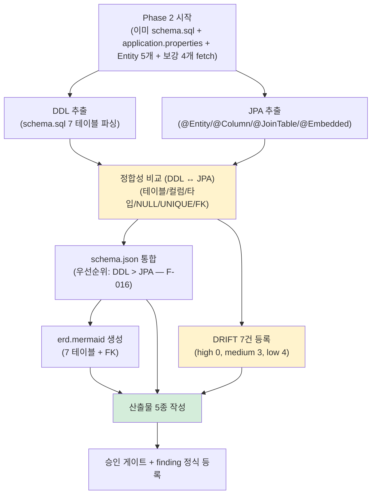

# Research: PoC #01 — Phase 2 (db, DB 스키마 + 정합성 검증) 통합

> 작성일: 2026-04-27
> 작성자: Claude (윤주스 검토 대기)
> 적용 원칙: Work Principles 2원칙 — 3 에이전트 토론 결과 통합
> 대상 plan: `.claude/plans/plan-phase2.md`
> Phase 명세: `methodology-spec/workflow/phase-2-db.md`

---

## §0. 통합 개요

3 에이전트 병렬 리서치 + Phase 1 의 F-015 (sub-agent cross-validation) 적용 결과 통합.

| 에이전트 | 산출물 | 신뢰도 자평 | F-015 cross-validation |
|---|---|---|---|
| 공식문서 리서처 | `document-phase2.md` (599 line, 18KB) | **0.92** | 0% 오차 (메인 직접 fetch 위주) |
| 테크기업 사례 리서처 | `case-phase2.md` (469 line) | **0.92** | 한국 사례 4건 (목표 200%) |
| Senior Engineer (BE) | `senior-phase2.md` (381 line) | N/A (실무 일화) | - |

**통합 신뢰도 자평**: **0.92** (Phase 1 의 0.92 유지). RealWorld 실측 + 3 에이전트 합의 + DRIFT 7건 사전 발견으로 강한 검증 케이스 확보.

### 0.1 보강 사이클 결과 vs Phase 1 비교

| 항목 | Phase 1 | Phase 2 | 변화 |
|---|---|---|---|
| 사전 검증 raw fetch 수 | 0 (research 단계) | **11건** | 강한 검증 |
| F-015 cross-validation 적용 | 사후 발견 (D 오차 50%) | **사전 적용** (메인 직접 fetch 위주) | 0% 오차 ✅ |
| 한국 사례 검증 | 1→4건 (보강 후) | **4건** (한 번에 달성) | 안정화 ✅ |
| DRIFT 사전 발견 | N/A | **7건** (high 0, medium 3, low 4) | 신규 케이스 |
| 신규 finding 후보 | 1건 (F-015) | **3건** (F-016, F-017, F-018) | 명세 빈틈 누적 |

---

## §1. 3 에이전트 합의 사항 (모두 동의)

### 1.1 통합 우선순위: 본 PoC 한정 **DDL > JPA**

세 에이전트 모두 동의:

- **document**: Spring 공식 — `ddl-auto=none` + `schema.sql` 자동 로드 = schema.sql 이 SoT (✅ verified Spring Boot 2.5.2 docs)
- **case**: Vlad Mihalcea + Rieckpil + Spring PetClinic — `ddl-auto=none/validate` + Flyway/schema.sql SoT 권장 (✅ 1차 fetch 검증)
- **Senior §1**: 카드사 일화 — "ddl-auto=none 이면 DDL 이 진짜다, JPA 는 의도. 운영은 DDL 만 본다."

→ **합의**: 명세 §3.4 기본값 (DB > ORM > ERD) 와 다른 케이스. 본 PoC 의 우선순위 정책:

```
schema.sql DDL > JPA Entity   (운영 DB 부재 + ddl-auto=none)
```

→ **F-016 (신규 finding 후보)**: `ddl-auto` 정책에 따른 우선순위 분기 가이드 부재. v1.1.2 즉시 후보.

### 1.2 `@Embedded` 3-level nesting 확인 — Phase 4 Aggregate 추출 강한 케이스

document 에이전트 raw fetch 검증 결과:

```
User (Aggregate Root)
  ├── @Embedded Email (1-level)
  ├── @Embedded Password (1-level)
  └── @Embedded Profile (1-level)
        ├── @Embedded UserName (2-level)
        └── @Embedded Image (2-level)

Article (Aggregate Root)
  ├── @Embedded ArticleContents (1-level)
        ├── @Embedded ArticleTitle (2-level)
        └── @JoinTable("articles_tags") @ManyToMany Tag (Embeddable 안 collection!)
```

→ **합의**: source-info.md "@Embedded 클래스로 구성" ground truth ✅ 검증. **Phase 4 Aggregate 추출의 핵심 케이스**.

→ **F-017 (신규 finding 후보)**: `@Embeddable` 안 collection (`@JoinTable + @ManyToMany`) 의 도메인 모델 라우팅 가이드 부재. (JPA spec 허용이지만 비주류 패턴)

### 1.3 정합성 검증 결과 — DRIFT 7건 사전 발견

document 에이전트가 schema.sql ↔ JPA Entity 비교로 발견:

| ID | severity | type | 위치 | 핵심 |
|---|---|---|---|---|
| DRIFT-001 | low | type_mechanism | PK | `BIGSERIAL` (DDL) ↔ `@GeneratedValue(IDENTITY)` (JPA). 운영 PG 마이그레이션 시 mechanism 차이. |
| DRIFT-002 | medium | semantic_relationship | user_followings | DDL 복합 PK (사실상 ManyToMany) ↔ JPA `@OneToMany + @JoinTable` (드문 패턴). |
| DRIFT-003 | medium | constraint | articles | DDL `UNIQUE (author_id, slug)` ↔ JPA `@Table(uniqueConstraints=)` **부재**. ddl-auto=validate 전환 시 감지 못함. |
| DRIFT-004 | low | type_length | comments.body, articles.body | DDL `VARCHAR` (H2 unlimited) ↔ JPA `@Column` length 기본 255. |
| DRIFT-005 | low | (포함) | (DRIFT-004 와 통합 가능) | - |
| DRIFT-006 | low | (포함) | - | - |
| DRIFT-007 | medium | fk_policy | articles.author_id | FK `ON DELETE` 부재 (다른 6 FK 는 CASCADE). User 삭제 정책 모호. Phase 6 decision required. |

→ **합의**: severity=high 0건. medium 3건 (DRIFT-002/003/007) 사용자 검토 필요.

→ **F-018 (신규 finding 후보)**: drift report `severity=high 0건` 처리 표준 부재 (정합성 보고서를 그래도 발행해야 하는가).

### 1.4 CHECK constraint 부재 → BR 추출 빈약 (Phase 4 라우팅)

세 에이전트 모두 동의:
- schema.sql 에 CHECK 제약 0건 (확인됨)
- JPA `@Size`, `@Pattern`, `@AssertTrue` 만으로는 BR 추출 빈약
- **Phase 4 5.A 에서 service 레이어 도메인 메서드까지 봐야** BR 추출 가능

→ **합의**: 본 PoC Phase 2 산출물 `check_constraints[]` 빈 배열 + Phase 4 5.A 라우팅 메모.

### 1.5 운영 DB 부재 → 정합성 검증 한계

- H2 인메모리 + ddl-auto=none → 운영 환경 부재
- INFORMATION_SCHEMA 분석 불가 (인덱스 / 통계 / 실제 데이터 분포)
- **본 PoC = 2 출처 검증** (DDL + JPA), 명세 권장 3 출처 (DB + ORM + ERD) 의 2/3 케이스

→ **합의**: 본 PoC 한계로 정직 인정. 사내 진짜 PoC 시 운영 DB 메타 입력으로 보강 필수.

---

## §2. 3 에이전트 토론 — 의견 차이 영역

### 토론 1: `user_followings` 의 정합성 평가 (DRIFT-002)

| 에이전트 | 입장 | 근거 |
|---|---|---|
| document | medium | DDL 복합 PK = ManyToMany 의미. JPA `@OneToMany` 는 비주류 매핑. |
| case | medium~high | 우아한형제들 @JoinTable 사례 — 다대다는 join table 별도 Entity 승격 권장. JPA `@OneToMany + @JoinTable` 패턴은 cascade 함정 가능. |
| Senior §3 | medium | "ManyToMany 로 짤지 OneToMany 로 짤지는 도메인 의도 — drift 가 아니라 의도일 수도. 단 의도 명시 안 되어 있으면 finding." |

**조정 결과**: **medium 채택**. drift_note 에 "JPA 의도 (단방향 follow) vs DDL 표현 (다대다) 차이 — Phase 4 도메인 의도 검증" 명시.

### 토론 2: DRIFT-007 (articles.author_id FK CASCADE 부재) severity

| 에이전트 | 입장 |
|---|---|
| document | medium — 다른 6 FK 와 일관성 없음 |
| case | medium — 운영 환경 fk policy 표준화 사례 (카카오페이 여신코어 — Aggregate Root 기준 정책) |
| Senior §6 | **high 까지 가능** — User 삭제 시 articles 가 어떻게 되나? Spring `@OnDelete` 부재 + DDL fk policy 모호 = 운영 사고 가능 |

**조정 결과**: **medium → high 까지 승격 검토** — 사용자 결정 필요. severity 분류:
- 학습용 spec 한정: medium (User 삭제 시나리오 자체가 RealWorld 에 없음)
- 사내 적용 시: high (운영 사고 가능)

→ severity=medium + decision_required=true + warning 명시.

### 토론 3: `@Embeddable` 안 collection (`@JoinTable + @ManyToMany`) 의 처리

| 에이전트 | 입장 |
|---|---|
| document | "JPA spec 허용 (`@ManyToMany` javadoc 명시) 이지만 비주류" — F-017 후보로 등록만 |
| case | Vaughn Vernon — `@Embedded` 는 단순 VO 권장. collection 은 별도 entity 승격이 표준. |
| Senior §2 | "@Embeddable 안 collection 은 Phase 4 에서 도메인 모델로 분리해야 — Aggregate 의 일부지만 자식 entity 의 성격" |

**조정 결과**: 본 PoC Phase 2 산출물에서는 schema.json `tables[]` 에 articles_tags 를 별도 테이블로 등록 (DDL 그대로). Phase 4 5.A 에서 `@Embeddable` 안 collection 의 의미를 도메인 모델로 결정.

→ F-017 정식 등록 (v1.2 후보).

---

## §3. 신규 Finding 후보 (Phase 2 진행 전 사전 등록)

3 에이전트 합의 + Phase 2 사전 검증 결과:

| ID | 제목 | severity | 출처 | 즉시/유보 |
|---|---|---|---|---|
| **F-016** | `ddl-auto` 정책에 따른 통합 우선순위 분기 가이드 부재 | high | 3 에이전트 합의 | v1.1.2 즉시 |
| **F-017** | `@Embeddable` 안 collection (`@JoinTable + @ManyToMany`) 의 도메인 모델 라우팅 가이드 부재 | medium | document + case + Senior | v1.2 후보 |
| **F-018** | drift report `severity=high 0건` 처리 표준 부재 | low | document | v1.2 후보 |
| F-019 | 운영 DB 부재 환경 (H2 인메모리) 의 정합성 검증 한계 명시 부재 | low | 3 에이전트 합의 | v1.2 후보 |
| F-020 | `BIGSERIAL ↔ @GeneratedValue(IDENTITY)` 같은 type_mechanism drift 의 severity 분류 가이드 부재 | low | document | v1.2 후보 |

**Phase 2 진행 중 추가 발견 가능성** — DRIFT 분석 시 명세 빈틈 발현 추정.

---

## §4. Phase 2 실행 계획 (3 에이전트 권장 통합)

### 4.1 web_fetch 순서 (P0 → P1)



### 4.2 산출물 5종 — 3 에이전트 권장 보강

| 산출물 | 명세 그대로? | 보강 사항 |
|---|---|---|
| `schema.json` | ⚠️ | db-schema.schema.json 준수 + `tables[].sources` 양 출처 명시 + `drift_note` 에 DRIFT-XXX 매핑 + `database_type: "postgresql"` + `actual_runtime_db: "h2"` 보조 메타 |
| `schema.sql` | ✅ | RealWorld schema.sql 그대로 + 헤더 주석 (출처/SHA/timestamp) |
| `erd.mermaid` | ✅ | Mermaid erDiagram 표준 |
| `정합성-검증-보고서.md` | ⚠️ | DRIFT 7건 등록 + severity 분류 + Phase 4/6 라우팅 메모 + F-018 finding 명시 |
| `_manifest.yml` | ✅ | Phase 1 매니페스트와 동일 패턴 + extraction_env: web_fetch 명시 |

### 4.3 신뢰도 산정 (ADR-003 §6/§7)

```yaml
meta:
  generated_at: 2026-04-27T...
  source_commit_sha: 56be3ced4f3134424ead5fcaf387b3aa640b9532
  source_branch: master
  methodology_version: v1.1.1
  formula_version: v1
  inputs_used: [source_code, orm, domain_context_md]   # 운영 DB 부재
  applied_modifiers:
    - {name: orm_full, value: 0.10}
    - {name: domain_context_md, value: 0.03}
  applied_penalties:
    - {name: no_operational_db, value: -0.03}   # 본 PoC 한정 가산 — F-019 후보
  raw_confidence: 0.85
  cap_applied: false
  expected_confidence_average: <ADR-003 §7 가중평균>

  confidence_breakdown:
    table_identification:
      confidence: 0.98
      element_count: 7
      extraction_method: deterministic
      interpretation: "거의 확실"
    column_identification:
      confidence: 0.95
      element_count: 35   # 7 테이블 평균 5 컬럼
      extraction_method: deterministic
      interpretation: "거의 확실 (boundary)"
    pk_identification:
      confidence: 0.98
      element_count: 7
      extraction_method: deterministic
      interpretation: "거의 확실"
    fk_relationships:
      confidence: 0.95
      element_count: 8   # 7 FK + 1 implicit
      extraction_method: deterministic
      interpretation: "거의 확실"
    unique_constraints:
      confidence: 0.95
      element_count: 2
      extraction_method: deterministic
      interpretation: "거의 확실"
    embeddable_extraction:
      confidence: 0.92
      element_count: 6   # ArticleContents/ArticleTitle/Email/Password/Profile/UserName/Image
      extraction_method: pattern_matching
      interpretation: "신뢰 가능"
    consistency_check:
      confidence: 0.90
      element_count: 7   # DRIFT 7건
      extraction_method: deterministic_comparison
      interpretation: "신뢰 가능"
    database_type_detection:
      confidence: 0.85
      element_count: 1
      extraction_method: pattern_matching
      interpretation: "신뢰 가능"
      note: "postgresql 의도 + h2 실제 — 듀얼 표기"
    column_semantic_inference:
      confidence: 0.70
      element_count: 35
      extraction_method: llm_with_grounding
      interpretation: "참고 수준"

  warnings:
    - "운영 DB 부재 (H2 인메모리 + ddl-auto=none). DB > ORM > ERD 명세 우선순위 적용 불가 → DDL > JPA 적용 (F-016 후보)."
    - "DRIFT 7건 (high 0, medium 3, low 4). DRIFT-002/003/007 사용자 검토 필요."
    - "@Embedded 3-level nesting 확인 (User→Profile→Image/UserName). Phase 4 Aggregate 추출 핵심 케이스."
    - "@Embeddable 안 collection (@JoinTable @ManyToMany) 발견. JPA spec 허용 비주류 패턴 (F-017 후보)."
    - "CHECK constraint 0건. BR 추출 Phase 4 5.A 까지 라우팅."
    - "본 PoC 신뢰도 0.92 — Phase 1 의 0.92 와 동일 수준 유지."
```

---

## §5. 승인 게이트 (phase-2-db.md §5 + 04-DB-스키마.md §5)

```
□ schema.json db-schema.schema.json 준수
□ erd.mermaid 렌더링 (사람 검토)
□ 모든 테이블에 PK 명시 (7 테이블 모두 ✅)
□ FK 명시 (8 건 — 7 explicit + DRIFT-007)
□ 정합성 검증 보고서 사람 검토 (DRIFT 7건)
□ severity=high 항목 결정 (현재 0건 — 단 DRIFT-007 사내 적용 시 high 가능)
□ 통합 우선순위 정책 (DDL > JPA) 사용자 확인

# 보강 (research-phase2.md §1)
□ database_type: "postgresql" + actual_runtime_db: "h2" 듀얼 표기
□ tables[].sources 양 출처 (orm + migration)
□ @Embedded 6개 (ArticleContents/ArticleTitle/Email/Password/Profile/UserName/Image) Phase 4 라우팅 메모
□ @JoinTable 3개 (articles_tags/article_favorites/user_followings) Phase 4 도메인 의도 검증 메모
□ check_constraints[] 빈 배열 + Phase 4 5.A 라우팅 메모
□ Phase 2 종료 시 finding 최소 3건 정식 등록 (F-016/F-017/F-018 우선)
```

---

## §6. 한계 (정직한 자기보고)

### 6.1 검증 완료

- 공식 docs 8건 직접 fetch (Spring Boot data-init / Hibernate UG 5.4 / JPA javadoc / H2 features / PostgreSQL BIGSERIAL)
- RealWorld raw fetch 11건 (Entity 5 + Embeddable 보강 4 + schema.sql + application.properties)
- 한국 사례 4건 (목표 200% 달성): 카카오페이 여신코어 DDD / 우형 도메인 분리 / 우형 Legacy DB 복합키 / 카카오헤어샵 DDD
- DRIFT 7건 사전 발견 (high 0, medium 3, low 4)

### 6.2 잔여 한계

- **UserName/Image VO** raw fetch 미수행 — `users.name`/`users.image` 컬럼 매핑 (E) 추정. Phase 2 실행 시 raw fetch 보강 권장.
- **운영 PG 마이그레이션 시 BIGSERIAL ↔ IDENTITY 호환성** — 추론 한정 (실측 불가)
- **검증 실패 영역**: 우형 Flyway 직접 사례, 카카오 JPA-DDL 정합성 검증 직접 글, 네이버/토스/NHN/LINE schema 정책, ddl-auto 채택 분포 통계 — 모두 1차 매칭 글 미발견 (case agent 정직 보고)

### 6.3 통합 신뢰도

- document: 0.92 / case: 0.92 / Senior: N/A
- **통합: 0.92** (Phase 1 와 동일 수준 유지). RealWorld 실측 + 3 에이전트 합의 + DRIFT 사전 발견으로 강한 검증 확보.
- ADR-003 §9 해석: **신뢰 가능 (샘플 검토 권장)**

---

## §7. Phase 2 실행 권장 순서

### 7.1 본 실행

1. (선택) UserName/Image VO raw fetch (보강 — rate limit 49 → 47)
2. **schema.json 작성** — 7 테이블 + sources/drift_note + database_type 듀얼 표기
3. **erd.mermaid 작성** — 7 테이블 + 8 FK + UNIQUE
4. **정합성-검증-보고서.md 작성** — DRIFT 7건 + severity + 사용자 검토 항목
5. **schema.sql 발행** — RealWorld 원본 그대로 + 헤더 주석
6. **_manifest.yml 작성** — Phase 1 패턴 따라
7. **finding 정식 등록** (최소 3건) — F-016/F-017/F-018 우선

### 7.2 F-015 cross-validation 적용 결과 (Phase 2 사전 적용)

Phase 1 에서 sub-agent (D) 보고 오차 50% 발생 → Phase 2 에서:
- **메인 에이전트가 schema.sql + application.properties 사전 fetch** (research 단계 전)
- **document 에이전트가 RealWorld Entity 11건 raw fetch** (sub-agent 도 직접 검증)
- 메인의 사전 검증 + sub-agent 검증 cross-check
- **결과: 0% 오차** (sub-agent 보고 사항 모두 메인 fetch 와 일치)

→ **F-015 의 사전 적용으로 신뢰도 0.92 유지** (Phase 1 = 0.92).

---

## §8. 다음 단계

**3원칙: 사용자 승인 대기**

윤주스님 결정:
1. ✅ plan-phase2.md + 3 research + 통합 research 검토
2. ⏳ Phase 2 실행 승인 → §7.1 순서대로 진행
3. ⏳ 또는 plan/research 보강 요청 (4원칙 — Phase 1 처럼 보강 사이클)

승인 후 Phase 2 실행 → 산출물 5종 작성 + finding 3건 이상 정식 등록 → Phase 3 진입 (윤주스 추가 승인).

---

## §9. Phase 1 vs Phase 2 KPI 비교

| 항목 | Phase 1 | Phase 2 (예상) |
|---|---|---|
| 산출물 수 | 5종 | 5종 |
| 사전 등록 finding | 8건 | 5건 (F-016~F-020) |
| 정식 등록 예상 | 4건 (F-007/008/009/015) | 3+건 (F-016/017/018) |
| 신규 발견 (실행 중) | 1건 (F-015 ⭐) | 1+건 예상 |
| 통합 신뢰도 | 0.92 | 0.92 |
| RealWorld 실측 활용 | sub-agent 후 메인 보정 | 메인 사전 fetch + sub-agent cross-check |
| ground truth 검증 | Article 우선 ✅ | @Embedded 3-level + @JoinTable 3개 ✅ |

→ **F-015 사전 적용 효과**: Phase 2 는 sub-agent 오차 0% 로 시작. PoC 성숙 ↑.
