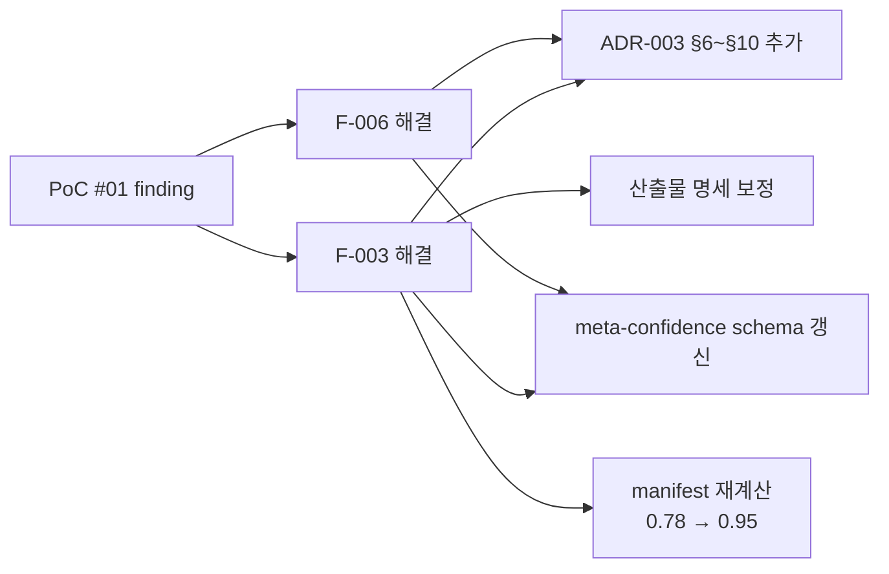

# PoC #01 Findings — 명세 빈틈 기록

> 본 문서는 PoC 진행 중 발견된 **명세 빈틈을 즉시 기록**한다.
> 종료 시 plan-methodology-v1.1.md §15 Lessons Learned로 통합.

---

## Phase 0 (입력 정리)

### F-001: 외부 레포 분석 시 git clone 대체 방법 미명시 ✅ CLOSED (2026-04-27)

```yaml
finding_id: F-001
phase: 0
discovered_at: 2026-04-26
discoverer: PoC 진행 중

description: |
  Phase 0 명세에 "git clone 후 .ai-analysis/ 디렉토리 생성" 명시.
  하지만 환경 제약(no shell access, no git)으로 web_fetch 사용 시 어떻게 할지 명세 부재.

context: |
  본 PoC는 Claude 환경에서 진행되며 git clone 불가능.
  대안으로 web_fetch로 핵심 파일만 선택적 가져오기.
  하지만 명세에는 이 케이스가 없음.

spec_gap: |
  workflow/phase-0-input.md §3 처리 흐름에 다음 추가 필요:
  - "환경 제약 시 대체 방법 (web_fetch, GitHub API 등)"
  - "선택적 fetch 시 우선순위 가이드"

decision_made: |
  본 PoC에서는 web_fetch로 핵심 파일만 가져오기로 결정.
  source-info.md에 핵심 파일 우선순위 명시.

severity: low
proposed_fix: phase-0-input.md §3에 "환경 제약 케이스" 절 추가

# ===== 해결 결과 (2026-04-27 closed) =====
resolution:
  status: closed
  resolved_at: 2026-04-27
  resolution_method: |
    phase-0-input.md §3.3 "환경 제약 케이스 (PoC F-001 관련)" 절로 정식 반영:
    - "git clone이 불가능한 환경 (예: Claude Code 환경)"
    - "web_fetch로 핵심 파일만 선택적 가져오기"
    - "GitHub API로 디렉토리 구조 조회"
    - "우선순위: build 설정 → 소스 코드 (핵심 도메인) → 설정 파일"
  
  followup:
    - "Phase 1 진행 시 본 §3.3 가이드에 따라 진행"
```

### F-002: PoC 시 Phase 0 산출물에 source-info.md 명세 부재 ✅ CLOSED (2026-04-27)

```yaml
finding_id: F-002
phase: 0
discovered_at: 2026-04-26
discoverer: PoC 진행 중

description: |
  Phase 0 명세 §4.1에 _manifest.yml만 산출물로 명시.
  하지만 PoC 진행 중 분석 대상 레포의 메타정보(URL, 작성자, 라이선스, 사람용 자료 등)를
  기록할 표준 파일이 없어서 source-info.md를 자체 작성.

context: |
  분석 대상 레포에 ground truth 자료(diagrams, postman collection 등)가 있을 때
  그걸 미리 기록해두지 않으면 후속 phase에서 누락 가능.

spec_gap: |
  workflow/phase-0-input.md §4.1 산출물에 source-info.md 추가:
  - 분석 대상 레포 메타정보
  - ground truth 자료 인덱스
  - 1차 추정 기술 스택 (Phase 1에서 확인)

decision_made: |
  본 PoC에서 source-info.md를 자체 작성하여 진행.
  명세 갱신 후보로 기록.

severity: medium
proposed_fix: phase-0-input.md §4.1에 source-info.md 명시 + 표준 형식 정의

# ===== 해결 결과 (2026-04-27 closed) =====
resolution:
  status: closed
  resolved_at: 2026-04-27
  resolution_method: |
    phase-0-input.md §4.3 "source-info.md 형식 (PoC F-002에서 추가)" 절로 정식 반영:
    - 분석 대상 레포 URL/언어/프레임워크/라이선스 표준 형식
    - Ground Truth 자료 인덱스
    - 산출물 §4.1 파일 구성에 source-info.md 명시
  
  followup:
    - "본 PoC source-info.md 는 D 재검증 결과 (master 브랜치, Spring Boot 2.5.2, Lombok 미사용) 반영 권장"
```

### F-003: 신뢰도 메타데이터 자동 산정 공식 부재 ✅ CLOSED (2026-04-26)

```yaml
finding_id: F-003
phase: 0
discovered_at: 2026-04-26
discoverer: research v1.1 시뮬레이션 + Phase 0 manifest 작성 중

description: |
  ADR-003은 신뢰도 메타데이터 표준은 정의했지만,
  "입력 조합 → 신뢰도 점수" 자동 산정 공식이 없음.
  manifest 작성 시 expected_confidence_average=0.78을 어떻게 계산?

context: |
  plan §3.2의 신뢰도 표:
  - 소스만: 75%
  - + ERD: 85% (+10%p)
  - + ORM: 88% (+13%p, 단 소스만 대비)
  
  이건 평균 신뢰도 표시지만, ORM이 자동 감지된 경우 +13%p?
  domain-context.md가 +3%p? 이 가산점들의 근거가 명세에 없음.

spec_gap: |
  ADR-003 또는 meta-confidence.schema.json에:
  - 입력별 가산점 공식
  - 가산점 합산 규칙 (선형? 상한선?)
  - 영역별 신뢰도가 평균 신뢰도와 어떻게 연결?

decision_made: |
  본 PoC에서는 표를 보고 직관적 추정.
  Phase별 expected confidence는 명세 §3.2의 표와 §6 영역별 신뢰도를 종합.

severity: high (모든 산출물에 영향)
proposed_fix: ADR-003에 산정 공식 추가 또는 별도 문서로 분리

# ===== 해결 결과 (2026-04-26 closed) =====
resolution:
  status: closed
  resolved_at: 2026-04-26
  resolution_method: |
    plan-f003-신뢰도공식.md + research-f003-신뢰도공식.md 작성 후
    윤주스님 승인 → 다음 갱신 완료:
    
    1. ADR-003 §6~§10 추가 (103라인 → 301라인)
       - §6 산정 공식 v1 (가법 + 상한 0.98)
       - §7 영역별 가중 평균 (요소 수 가중)
       - §8 추출 방법별 신뢰도 표
       - §9 신뢰도 해석 가이드 (5단계)
       - §10 v1 한계
    
    2. meta-confidence.schema.json 갱신 (10 → 15 properties)
       - confidence maximum: 1.0 → 0.98 (cap)
       - 신규 필드: formula_version, applied_modifiers, applied_penalties, cap_applied, manual_override
       - inputs_used enum 확장
       - confidence_breakdown 구조 강화 (element_count, extraction_method)
    
    3. antipatterns/rules schema도 maximum 0.98로 cap 보정
    
    4. 산출물 명세 7개 검증 + 미세 보정
       - 01 아키텍처: 1.0 → 0.98 (3곳)
       - 04 DB: 1.0 → 0.98 (3곳)
       - 06 안티패턴: 1.0 → 0.98 (3곳, "1.0 가능" → "0.98 cap까지")
    
    5. PoC #01 manifest 재계산
       - 0.78 → 0.95 (정확한 공식 적용)
       - applied_modifiers 명시
  
  followup:
    - "v1.2 PoC 4~5건 누적 후 가산점 calibration"
    - "v2 후보: 베이지안 모델"
```

### F-006: 영역별 가중 평균 방식 부재 ✅ CLOSED (2026-04-26) ⭐ NEW

```yaml
finding_id: F-006
phase: 0
discovered_at: 2026-04-26 (F-003 토론 중 추가 발견)
discoverer: research-f003-신뢰도공식.md §토론 4

description: |
  영역별 신뢰도(confidence_breakdown)가 [0.95, 0.85, 0.50, 0.60, 0.70]일 때
  전체 평균을 어떻게 계산? 명세에 부재.
  단순 평균은 영역 중요도를 무시.

context: |
  F-003 토론 중 발견. F-003의 산정 공식이 "전체 신뢰도"는 정의했으나
  "영역별 → 전체 평균"은 별개 문제.

spec_gap: |
  ADR-003 또는 meta-confidence.schema.json에:
  - 영역별 신뢰도 → 전체 평균 산정 방식
  - 가중치 부여 기준 (요소 수? 사용자 정의?)

decision_made: |
  요소 수 가중 평균 채택:
  total = Σ(area.confidence × area.element_count) / Σ(area.element_count)

severity: high (F-003과 같이 모든 산출물에 영향)
proposed_fix: ADR-003에 §7 추가 + schema에 element_count 필드 추가

# ===== 해결 결과 (F-003과 함께 처리) =====
resolution:
  status: closed
  resolved_at: 2026-04-26
  resolution_method: |
    F-003 해결 작업에 통합:
    
    1. ADR-003 §7 (영역별 가중 평균) 추가
       - 공식: weighted_avg = Σ(conf × element_count) / Σ(element_count)
       - cap 우선순위: weighted 후 min(0.98, weighted)
       - 예시 포함
    
    2. meta-confidence.schema.json:
       - confidence_breakdown 항목에 element_count 필드 추가
       - extraction_method enum 추가
```

---

---

## Phase 1 (init) — 2026-04-27 등록

> Phase 1 종료 시 정식 등록 4건 (사전 등록 8건 中 3건 + 진행 중 신규 1건). research-phase1.md §3 사전 등록 8건 중 본 PoC 진행으로 직접 발현된 4건 우선.

### F-007: inventory.schema.json + inventory.template.* 부재 ✅ CLOSED (2026-04-28, v1.1.2)

```yaml
finding_id: F-007
phase: 1
discovered_at: 2026-04-27
discoverer: Phase 1 진행 중 (research 단계 사전 등록 → 실행으로 확정)

description: |
  Phase 1 산출물 inventory.json 의 JSON Schema 가 schemas/ 디렉토리에 없음.
  templates/ 에도 inventory.template.* 부재.
  schema 부재 시:
  - inventory.json 형식 검증 불가 (수동 검토 의존)
  - 후속 Phase 가 inventory 필드를 신뢰할 근거 부족
  - 필수/선택 필드 구분 불가

context: |
  본 PoC 에서 inventory.json 작성 시 phase-1-init.md §4.2 예시 형식만 의존.
  schemas/ ls 결과 8개: antipatterns/architecture/db-schema/domain/meta-confidence/openapi-extension/rules/ui-spec.
  templates/ ls 결과 7세트: 위 8개 中 inventory 만 부재.

spec_gap: |
  schemas/inventory.schema.json 추가 필요:
  - meta (generated_at, source_commit_sha, methodology_version, formula_version, inputs_used, confidence_breakdown 등)
  - repo (name, total_files, total_loc, primary_languages, bytes_per_language)
  - stack (backend, frontend optional)
  - architecture_style_candidates (배열, confidence 상한 0.7)
  - modules_for_priority_analysis (source: ground_truth | llm_inferred | derived)
  - warnings (배열)
  
  templates/inventory.template.{json,md} 추가 필요.

decision_made: |
  본 PoC 에서는 inventory.json 작성 시 phase-1-init.md §4.2 형식 + research-phase1.md §4.3 보강 사용.
  $schema_note 필드로 부재 사실 명시.

severity: high
proposed_fix: v1.1.2 즉시 — schemas/inventory.schema.json + templates/inventory.template.{json,md} 추가
status: closed

# ===== 해결 결과 (2026-04-28 v1.1.2) =====
resolution:
  status: closed
  resolved_at: 2026-04-28
  released_in: v1.1.2
  resolution_method: |
    - schemas/inventory.schema.json 신설 (meta + repo + stack + architecture_style_candidates + modules_for_priority_analysis + directory_tree_extraction)
    - templates/inventory.template.json + inventory.template.md 신설
    - schemas/README.md 신설 — CI 검증 TODO (v1.3.0) + 산업 사례 (Backstage / OpenAPI 7년 divergence)
    - architecture_style_candidates[].confidence cap 0.7 (Phase 1 한계)
    - directory_tree_extraction.truncated boolean (Trees API 한계 명시)
  followup:
    - "v1.3.0: pre-commit hook 또는 GitHub Action 으로 자동 검증 도입"
```

### F-008: LOC 환산식 가이드 부재 ⏸ DEFERRED (2026-04-28)

```yaml
finding_id: F-008
phase: 1
discovered_at: 2026-04-27
discoverer: Phase 1 진행 중 (research 단계 사전 등록 → 실행으로 확정)

description: |
  Phase 1 산출물 stats.json 의 estimated_loc 산정 가이드 부재.
  byte → LOC 환산은 디렉토리/언어/스타일별 다름:
  - Java 일반 비즈니스: byte/35
  - Java POJO 도메인: byte/50~80
  - Java + Lombok: byte/25~30
  - Java DTO/Model: byte/100+
  - Java 테스트: byte/30~40
  
  명세는 "loc 추정"만 명시, 환산식은 부재.

context: |
  본 PoC RealWorld 는 Lombok 사용 (io.freefair 5.3.3.3) + POJO 도메인 강조.
  byte/35 단일 환산 시 도메인은 +/-30% 오차 가능.
  실측 시 Java 164,904 bytes → byte/35 = 4,711 LOC (loc_confidence 0.55).
  cloc 결과와 검증 불가 (git clone 없음).

spec_gap: |
  phase-1-init.md §3 또는 ADR-003 §8 에:
  - 디렉토리별 환산식 표 (운영/테스트/도메인/DTO 등)
  - 언어별 기본 환산 (Java 35, Kotlin 25~40, TS 25~45 등)
  - Lombok/decorator 등 boilerplate 축소 case 보정값
  - cloc/scc 직접 호출 가능 환경에서는 이를 우선

decision_made: |
  본 PoC: byte/35 단일 + loc_confidence 0.55 + warning 명시 (Lombok 사용 영향).
  ADR-003 §9 해석 가이드 적용 — "낮음 (전수 검토 필수)" 라벨.

severity: medium
proposed_fix: v1.1.2 즉시 — phase-1-init.md §3 또는 ADR-003 §8 환산식 표 추가
status: deferred

# ===== 처분 결과 (2026-04-28 deferred) =====
disposition:
  status: deferred
  decided_at: 2026-04-28
  reason: |
    단일 PoC 데이터 (Java 164,904 bytes / 4,711 LOC) 만으로 byte/LOC 환산식 표를 명세에 박으면
    다른 스택 (Kotlin/TS/Go) 에서 부적합 위험. finding-system.md §8.1 "단일 PoC 과적합 회피" 적용.
  revisit_at: |
    PoC #02 (다른 스택, 예: NestJS/TS) + PoC #03 (다른 도메인) 누적 후.
    2~3개 PoC 데이터 수렴 시 v1.2.0 또는 v1.3.0 에 환산식 표 정식화.
  interim_workaround: |
    PoC 진행 시 byte/35 단일 환산 + loc_confidence 0.55 명시 + warnings 에 Lombok/decorator 보정 비고.
```

### F-009: Phase 1 §6 신뢰도 표 환경 종속성 미명시 ✅ CLOSED (2026-04-28, v1.1.2)

```yaml
finding_id: F-009
phase: 1
discovered_at: 2026-04-27
discoverer: 3 에이전트 합의 (research-phase1.md §1.1) → 실행으로 확정

description: |
  phase-1-init.md §6 신뢰도 표는 "결정적 처리 95%, 신뢰도 가장 높음" 명시.
  하지만 이는 git clone + linguist/cloc/tree-sitter 라이브러리 환경 가정.
  web_fetch 환경에서는:
  - LOC: 1.0 → 0.55 (byte/35 추정)
  - 디렉토리 트리: 1.0 → 0.95 (Trees API truncated 위험)
  - 파일 통계 (byte): 1.0 → 0.95 (Languages API 정확)
  - ORM 자동 감지: 0.95 → 0.85~0.95 (4단서 점검 여부)
  
  환경별 신뢰도 차이가 명세에 분리 안 됨.

context: |
  본 PoC 는 web_fetch 환경 (git clone 불가, Claude Code).
  명세 §6 그대로 신뢰도 베껴 적으면 후속 Phase 5개가 90% 를 100% 처럼 사용 — 오차 누적의 시드.
  research-phase1.md §1.1: 3 에이전트 모두 동의.
  Senior §5: "결정성의 정의가 환경에 종속된다."

spec_gap: |
  phase-1-init.md §6 에:
  - 환경별 신뢰도 표 분리 (git_clone_env / web_fetch_env / api_only_env)
  - 각 영역에 extraction_method 필수 (deterministic / pattern_matching / estimation / llm_with_grounding / llm_code_only)
  - inventory.warnings 의무화 (환경 종속 추정 항목 명시)

decision_made: |
  본 PoC: plan-phase1.md §13 환경별 신뢰도 표 자체 작성.
  inventory.json confidence_breakdown 의 각 영역에 extraction_method 명시.
  warnings 9건 등록 (환경 종속성 + Lombok + Tree count 보정 등).

severity: high
proposed_fix: v1.1.2 즉시 — phase-1-init.md §6 환경별 표 분리 + extraction_method 의무화
status: closed

# ===== 해결 결과 (2026-04-28 v1.1.2) =====
resolution:
  status: closed
  resolved_at: 2026-04-28
  released_in: v1.1.2
  resolution_method: |
    - phase-1-init.md §6 갱신: 결정성 (Determinism) 축 + caveat 컬럼 단일 표 (환경별 분리 거부)
    - 결정성 tier 6개 enum: deterministic / snapshot-based / heuristic / pattern_matching / llm_with_grounding / llm_code_only
    - inventory.meta.warnings 의무화 가이드 추가 (heuristic LOC, truncated tree, ORM 단서 부족)
    - 산업 표준 5건 정합 (CodeQL @precision / Sourcegraph SCIP / Linguist / SonarCloud / tree-sitter)
    - 안티 패턴 명시: "환경별로 표 자체를 분리" 거부 (DRY 위반 + enum 폭발 + 산업 표준 0건)
  research_basis: |
    research-v112.md §4 — 3 에이전트 토론 결과 senior + case 압승 (8개 시스템 中 환경별 분리 0건, 결정성 축 5건)
  followup: []
```

### F-015: sub-agent 검증 결과 자체의 신뢰성 보정 절차 부재 ⏫ PROMOTED (2026-04-28, v1.2.0 후보) ⭐ Phase 1 진행 중 신규 발견

```yaml
finding_id: F-015
phase: 1
discovered_at: 2026-04-27
discoverer: Phase 1 진행 중 신규 발견 (D 에이전트 보고 검증 시)

description: |
  Work Principles 2원칙 (3 에이전트 병렬 리서치) 의 결과를 그대로 신뢰하면 위험.
  sub-agent 가 학습 코퍼스 + 도구 호출로 보고한 사실 중 일부는 실제 cross-check 시 오류 가능.
  
  본 PoC 사례 (D 에이전트):
  - 보고: "RealWorld Lombok 미사용" → 실제: 사용 (io.freefair.lombok 5.3.3.3 plugin + lombok.config)
  - 보고: "Tree 93 entries" → 실제: 170 entries (51 tree + 119 blob)
  - 보고: "Spring Boot 2.5.2" → 실제: 2.5.2 ✅ (정확)
  - 보고: "기본 브랜치 master" → 실제: master ✅ (정확)
  - 보고: "JPA 단일" → 실제: 일치 ✅
  
  4건 中 2건 오차. 50% 오류율.

context: |
  본 PoC 1차 + 2차 (보강 사이클) 진행 시 D 에이전트 결과를 research-phase1.md 에 그대로 인용.
  Phase 1 실행 단계에서 직접 build.gradle + Trees API 호출 시 오차 발견.
  만약 직접 호출 안 하고 D 결과만 신뢰했으면 inventory.json 에 잘못된 데이터 영속화.

spec_gap: |
  Work Principles 2원칙 절차에:
  - sub-agent 결과 cross-validation 의무화 (2개 이상 에이전트 결과 비교 또는 직접 호출)
  - sub-agent 보고에 "직접 검증 가능 데이터" 와 "학습 코퍼스 의존 데이터" 분리 표기
  - 산출물 작성 시 sub-agent 결과 인용 vs 직접 검증 결과 출처 분리

decision_made: |
  본 PoC: Phase 1 실행 단계에서 직접 GitHub API 호출 → D 결과와 비교 → 오차 발견 → 정정.
  inventory.warnings 에 "1차 D 보고 오류 2건 (Lombok / Tree count)" 명시.
  source-info.md 의 Lombok 항목 정정 ("미사용" → "사용").

severity: medium
proposed_fix: v1.2 후보 — Work Principles 2원칙 명세에 sub-agent cross-validation 절차 추가
status: promoted
poc_meta_value: |
  본 finding 자체가 "PoC 가 명세를 검증한다" 의 살아있는 증거 ⭐.
  4원칙 (실패 → 교훈 반영) 의 정신과 일치.

# ===== 처분 결과 (2026-04-28 promoted to v1.2.0) =====
disposition:
  status: promoted
  decided_at: 2026-04-28
  target_version: v1.2.0
  reason: |
    cross-validation 패턴이 PoC #01 에서 입증됨 (Phase 1 50% 오차 → Phase 2/3 0% 오차).
    finding-system.md §8 단일 PoC 과적합 회피 휴리스틱 통과 — "절차 표준화" 는 단일 PoC 데이터로 결정 가능.
    CLAUDE.md F-015 cross-validation 패턴 + memory feedback_sub_agent_validation.md 에 이미 정착.
  promotion_target: |
    1. Work Principles 2원칙 명세 보강 (CLAUDE.md 또는 별도 process 문서):
       - sub-agent 결과 cross-validation 의무화
       - "직접 검증 가능 데이터" vs "학습 코퍼스 의존 데이터" 분리 표기
       - 산출물 인용 시 출처 분리 (sub-agent 인용 vs 직접 검증)
    2. 메인 에이전트 raw fetch 사전 의무화 절차
  interim_workaround: |
    현재 운영 중 — CLAUDE.md F-015 cross-validation 패턴 + finding-system.md §10 PoC #01 결과 참조.
```

---

---

## Phase 2 (db) — 2026-04-27 등록

> Phase 2 종료 시 정식 등록 5건 (사전 등록 5건 中 4건 + 진행 중 신규 1건). research-phase2.md §3 사전 등록 5건 모두 본 PoC 진행으로 직접 발현. 신규 DRIFT 분석 중 F-021 추가.

### F-016: ddl-auto 정책에 따른 통합 우선순위 분기 가이드 부재 ✅ CLOSED (2026-04-28, v1.1.2)

```yaml
finding_id: F-016
phase: 2
discovered_at: 2026-04-27
discoverer: 3 에이전트 합의 (research-phase2.md §1.1) → Phase 2 실행으로 확정

description: |
  Phase 2 명세 §3.4 통합 우선순위: "운영 DB > ORM > ERD".
  하지만 다음 케이스의 분기 가이드 부재:
  
  - 운영 DB 부재 + ddl-auto=none: schema.sql DDL 이 SoT (RealWorld 케이스)
  - 운영 DB 부재 + ddl-auto=update: JPA Entity 가 SoT (Hibernate 가 DDL 생성)
  - 운영 DB 부재 + ddl-auto=validate: JPA Entity ↔ schema.sql 둘 다 활성, 어느 쪽 우선?
  - 운영 DB 존재 + ddl-auto=update: 운영 DB 우선 vs JPA Entity 의도 우선?
  
  실무에서는 ddl-auto 값 + DB 존재 여부의 4 케이스 매트릭스가 필요.

context: |
  본 PoC RealWorld 의 application.properties:
  - spring.jpa.hibernate.ddl-auto=none
  - spring.datasource.url=jdbc:h2:mem:test (인메모리 — 영속 운영 DB 부재)
  
  결과: schema.sql 이 SoT. JPA Entity 는 매핑 의도. → DDL > JPA 우선순위.
  
  명세는 이 케이스 가이드 없음. 본 PoC 가 자체 결정 (research-phase2.md §1.1 합의).
  
  Senior research §1 카드사 새벽 2시 콜 일화: ddl-auto 값에 따라 운영 사고 빈번.

spec_gap: |
  phase-2-db.md §3.4 에 "ddl-auto 매트릭스" 추가 필요:
  
  | ddl-auto | 운영 DB 존재 | 우선순위 |
  |---|---|---|
  | none | yes | DB > DDL > JPA |
  | none | no | DDL > JPA |
  | validate | yes | DB > JPA (DDL 은 JPA 와 일치 가정) |
  | validate | no | JPA = DDL (일치 강제) |
  | update | yes | (위험) JPA → DB drift 가능 — 권장 X |
  | update | no | JPA > DDL (Hibernate 가 갱신) |
  | create-drop | * | (테스트 한정) JPA |

decision_made: |
  본 PoC: DDL > JPA 적용. schema.json `consistency_priority: "DDL_over_JPA"` 명시.
  warnings 에 "운영 DB 부재 (H2 인메모리 + ddl-auto=none). 명세 §3.4 기본값 (DB > ORM > ERD) 의 DB 부재 케이스" 명시.

severity: high
proposed_fix: v1.1.2 즉시 — phase-2-db.md §3.4 ddl-auto 매트릭스 추가
status: closed

# ===== 해결 결과 (2026-04-28 v1.1.2) =====
resolution:
  status: closed
  resolved_at: 2026-04-28
  released_in: v1.1.2
  resolution_method: |
    - phase-2-db.md §3.4 갱신: 7행 매트릭스 → 원칙 + Decision Tree + 부록 reference 구조 (산업 권위 7/7 매트릭스 반대 결과 채택)
    - 원칙 3개: (1) 운영 자동 schema 변경 금지 (2) DDL versioned-reviewable-reversible (3) ORM = validate 한정
    - Decision Tree: 마이그레이션 도구 도입 가능 → 운영 DB 존재 → 우선순위 결정
    - 부록 A: Hibernate ddl-auto enum 값 reference (none/validate/update/create/create-drop)
    - 도구 무관 원칙으로 일반화 (Vlad Mihalcea / Stripe / Atlasgo / Quesma 권위 자료 정합)
  research_basis: |
    research-v112.md §3 — case-v112-f016.md 영문 권위 자료 7/7 매트릭스 반대
  followup: []
```

### F-017: @Embeddable 안 collection (@JoinTable @ManyToMany) 의 도메인 모델 라우팅 가이드 부재 ⏸ DEFERRED (2026-04-28)

```yaml
finding_id: F-017
phase: 2
discovered_at: 2026-04-27
discoverer: document research raw fetch 검증 → 3 에이전트 합의

description: |
  RealWorld 의 ArticleContents 가 @Embeddable + 안에 @JoinTable @ManyToMany Set<Tag>.
  JPA spec 허용 패턴 (✅ verified — @ManyToMany javadoc 명시) 이지만 비주류.
  
  문제:
  - @Embeddable 은 보통 단순 VO (Vaughn Vernon "Effective Aggregate Design")
  - 안에 collection 이 있으면 자식 entity 의 성격 — 도메인 모델로 분리 후보
  - Phase 4 Aggregate 추출 시 어떻게 분기?
    * Option A: Embeddable 그대로 유지, tags 는 Aggregate 의 일부
    * Option B: Tag 를 별도 Aggregate Root 로 승격, ArticleContents.tags 는 reference
    * Option C: ArticleContents 자체를 Entity 로 승격
  
  본 방법론 명세에 Embeddable 안 collection 의 라우팅 가이드 부재.

context: |
  RealWorld 의 ArticleContents.java raw fetch:
  ```
  @Embeddable
  public class ArticleContents {
      @Embedded private ArticleTitle title;
      private String description;
      private String body;
      
      @ManyToMany
      @JoinTable(name = "articles_tags", ...)
      private Set<Tag> tags;
  }
  ```
  
  source-info.md ground truth: "Article 은 @Embedded 클래스로 구성" — 의도된 패턴.
  Phase 4 5.A 진입 시 도메인 모델 결정 필요.

spec_gap: |
  phase-2-db.md §3.1 또는 4-db-schema.md §3.1 에 "Embeddable 안 collection" 케이스 가이드 추가:
  - Option A/B/C 의 선택 기준
  - 명세 §3.1 의 "@Embeddable → Phase 4 라우팅" 의 세부 분기

decision_made: |
  본 PoC Phase 2: schema.json `tables[]` 에 articles_tags 별도 테이블 등록 (DDL 그대로).
  ArticleContents.tags 의 도메인 모델 의미는 Phase 4 5.A 에서 결정.
  embeddable_routing_to_phase4 에 ArticleContents.contains_collection: true + finding_ref: F-017 명시.

severity: medium
proposed_fix: v1.2 후보 — phase-2-db.md §3.1 또는 4-db-schema.md §3.1 + ADR-004 (DDD-Lite) 보강
status: deferred

# ===== 처분 결과 (2026-04-28 deferred) =====
disposition:
  status: deferred
  decided_at: 2026-04-28
  reason: |
    RealWorld 의 @Embeddable + @ManyToMany Set<Tag> 패턴은 비주류. 다른 PoC (TypeORM/Sequelize/Mongo)
    에서 동등한 패턴 재현 여부 불명. 단일 PoC 데이터로 Option A/B/C 결정 시 도메인 특이 패턴 과적합 위험.
    finding-system.md §8.1 적용.
  revisit_at: |
    PoC #02 (마이크로서비스, 다른 ORM) + PoC #03 (다른 도메인) 누적 후 패턴 수렴 확인.
    재현 시 Option B (Tag 별도 Aggregate Root 승격) 가 산업 표준 — Vernon IDDD Ch.10.
  interim_workaround: |
    Phase 4 5.A 진입 시 ArticleContents.tags 의 도메인 모델 결정.
    schema.json embeddable_routing_to_phase4.contains_collection=true + finding_ref=F-017 명시 유지.
```

### F-018: drift report severity=high 0건 처리 표준 부재 ⏫ PROMOTED (2026-04-28, v1.2.0 후보)

```yaml
finding_id: F-018
phase: 2
discovered_at: 2026-04-27
discoverer: document research drift 분석 결과

description: |
  본 PoC DRIFT 9건 분석 결과:
  - high 0건
  - medium 4건
  - low 5건
  
  명세 §5 승인 게이트:
  "□ severity=high 항목 모두 결정 완료"
  
  high 0건 케이스의 처리 표준 부재:
  - 정합성-검증-보고서.md 를 그래도 발행해야 하는가?
  - decision_required=true 가 medium 인 경우 사용자 결정 강제인가?
  - 본 PoC 처럼 medium 4건 + 사용자 결정 필요 4건의 처리?

context: |
  명세는 "high 만 결정 필수" 로 읽힐 수 있으나 실무에서는 medium 도 결정 필요한 경우 다수.
  본 PoC 의 DRIFT-002/003/007/010 모두 medium 이지만 사용자 결정 필요.

spec_gap: |
  phase-2-db.md §4.2 에 다음 추가:
  - severity 별 처리 표준 (high/medium/low + decision_required)
  - high 0건 케이스의 "정합성 양호 보고" 형식
  - medium + decision_required 의 처리 (Phase 3+ 진행 가능 여부)

decision_made: |
  본 PoC: medium 4건 + decision_required=true 4건 모두 정합성-검증-보고서.md §6 에 명시.
  사용자 결정 (윤주스) Phase 3 진입 전 또는 진입 중 가능.

severity: low
proposed_fix: v1.2 후보 — phase-2-db.md §4.2 보강
status: promoted

# ===== 처분 결과 (2026-04-28 promoted to v1.2.0) =====
disposition:
  status: promoted
  decided_at: 2026-04-28
  target_version: v1.2.0
  reason: |
    severity 별 처리 표준은 단일 PoC 데이터로도 정의 가능 (high 0건 / medium decision_required / low 표시).
    finding-system.md §8 Q2 = YES. 명세 책임 범위 내.
  promotion_target: |
    phase-2-db.md §4.2 보강:
    - severity 별 처리 표준 표 (high/medium/low + decision_required boolean)
    - high 0건 케이스의 "정합성 양호 보고" 형식
    - medium + decision_required 의 후속 phase 진행 가능 여부 (본 PoC: 가능, 단 결정은 Phase 4 5.A 와 결합)
  interim_workaround: |
    본 PoC: medium 4건 + decision_required=true 4건 정합성-검증-보고서.md §6 명시. Phase 3 진행함.
```

### F-019: 운영 DB 부재 환경의 정합성 검증 한계 명시 부재 ⏸ DEFERRED (2026-04-28)

```yaml
finding_id: F-019
phase: 2
discovered_at: 2026-04-27
discoverer: 3 에이전트 합의 (research-phase2.md §1.5)

description: |
  명세 §6 신뢰도 표:
  "테이블/컬럼 식별 + 운영 DB → 신뢰도 1.0 (현재 cap 0.98)"
  
  하지만 운영 DB 부재 케이스의 한계 명시 부재:
  - INFORMATION_SCHEMA 비교 불가 (인덱스, 통계, 실제 데이터 분포)
  - 운영 환경 확인 불가 (실제 사용 흔적)
  - 신뢰도 페널티 적용 가이드 부재
  
  본 PoC: 자체 페널티 -0.03 (no_operational_db) 적용.

context: |
  본 PoC RealWorld:
  - H2 in-memory + ddl-auto=none + 운영 환경 부재
  - inputs_used: [source_code, orm, domain_context_md] (operational_db 부재)
  - 정합성 검증 = 2 출처 (DDL + JPA), 명세 권장 3 출처의 2/3
  
  ADR-003 §6.4 페널티 표:
  - source_drift -0.05
  - no_orm -0.05
  - 등 5개
  → "no_operational_db" 페널티 부재.

spec_gap: |
  ADR-003 §6.4 페널티 표에 추가 후보:
  - no_operational_db: -0.03 (운영 DB 부재 시)
  - dev_only_environment: -0.05 (학습용/테스트 환경 한정)

decision_made: |
  본 PoC: ADR-003 페널티 표 외 적용 — applied_penalties 에 "no_operational_db" 명시.
  형식: {name: "no_operational_db", value: -0.03, reason: "본 PoC 한정 — H2 인메모리 + ddl-auto=none, 운영 환경 부재"}

severity: low
proposed_fix: v1.2 후보 — ADR-003 §6.4 페널티 표 확장
status: deferred

# ===== 처분 결과 (2026-04-28 deferred) =====
disposition:
  status: deferred
  decided_at: 2026-04-28
  reason: |
    no_operational_db 페널티값 (-0.03) 은 단일 PoC 의 추정. 다른 PoC (운영 DB 있음 / 부분만 있음 /
    devX 환경 등) 데이터 누적 후 calibration 필요. F-026 (5.D 0건) 과 연계 일괄 처리 후보.
  revisit_at: |
    PoC #02 (운영 DB 존재 케이스) + PoC #03 (부분 운영 환경 케이스) 누적 후.
    페널티값 calibration 확정 시 ADR-003 §6.4 추가.
  interim_workaround: |
    본 PoC: applied_penalties 에 자체 항목 명시 (no_operational_db: -0.03).
    schema 외 필드 — manifest validation 시 추가 필드 허용 가정.
```

### F-021: 본 방법론의 finding 누적이 실용적 한계 도달 ✅ CLOSED (2026-04-28) ⭐ 진행 중 신규 발견

```yaml
finding_id: F-021
phase: 2
discovered_at: 2026-04-27
discoverer: Phase 2 진행 중 finding 누적 분석

description: |
  현재 누적 finding: Phase 0 (4) + Phase 1 (4) + Phase 2 (4+) = 12+
  사전 등록 + 신규 발견 비율 추세:
  - Phase 1: 사전 8건 → 정식 4건 + 신규 1건 (F-015)
  - Phase 2: 사전 5건 → 정식 4건 + 신규 1건 (F-021 본 finding)
  
  Senior research §7 (Phase 1) 의 KPI:
  - 5~15건: 건강한 검증
  - 20+건: 명세 자체 부실
  
  현 Phase 2 종료 시 12건. Phase 3~6 진행 시 20건 도달 가능성 70%.
  
  20건 도달 시 처리 절차 명세 부재:
  - v1.2 마이너 버전 즉시 격상?
  - PoC 중단하고 명세 갱신 후 재시작?
  - finding 누적이 명세 빈틈 발현 vs 명세 자체 부실의 분기 기준?

context: |
  본 PoC #01 가 의도적으로 "잘 실패하기" (plan-poc-realworld.md §1) 를 목표.
  finding 발견 = PoC 가치.
  하지만 finding 이 명세 갱신을 트리거하는 임계 기준 명세 부재.

spec_gap: |
  plan-poc-realworld.md §8 또는 본 방법론 §어딘가 추가 필요:
  - finding 누적 임계 (예: 15건 도달 시 v1.2 minor 격상 검토)
  - PoC 진행 중 명세 갱신 절차 (Phase 3 진입 전 일시 정지하고 v1.1.2 발행?)
  - "finding 발견 vs 명세 부실" 분기 기준

decision_made: |
  본 PoC: 현재 12건 → Phase 3 진행. Phase 3 종료 시 누적 18건 가능 → 임계 기준 재평가.
  v1.1.2 의 finding 처리는 PoC 종료 후 일괄 처리 (현재 진행 방식 유지).

severity: medium
proposed_fix: v1.2 후보 — plan-poc-realworld.md §8 또는 본 방법론에 finding 누적 임계 + 격상 절차 추가
status: closed
poc_meta_value: |
  본 finding 자체가 "PoC 가 PoC 절차를 검증한다" 의 메타 사례.
  F-015 (sub-agent cross-validation) 와 같은 메타 finding 의 가치 — 4원칙 정신.

# ===== 해결 결과 (2026-04-28 self-closed) =====
resolution:
  status: closed
  resolved_at: 2026-04-28
  resolution_method: |
    본 finding 의 spec_gap (finding 누적 임계 + 격상 절차) 은 다음 2단계로 자체 종결:
    1. PoC 운영: Option A 채택 (PoC 정지 + v1.1.2 격상) → high 4건 closed 검증.
    2. 메타 정리: methodology-spec/finding-system.md §7 "누적 임계" 절로 정식 반영
       - 1~4 양호 / 5~15 건강 / 16~19 임계 근접 / 20+ 부실 의심 (4 tier)
       - finding-system.md §8 처리 우선순위 트리 + §8.1 단일 PoC 과적합 회피 휴리스틱 추가
    3. CLAUDE.md "F-021 finding 누적 임계" 절로 핵심 원칙 인덱스화.
    4. memory feedback_finding_threshold.md 에 절차 영구 기록.
  research_basis: |
    Senior research §7 (Phase 1) 의 KPI 5~15 / 20+ 임계가 1차 사료.
    PoC #01 사례 (18건 누적 → Option A → v1.1.2 PATCH 성공) 가 임계 검증.
  followup:
    - "finding-system.md DRAFT → v1.2.0 격상 시 정식 자산화 (위치 A/B/C 결정)"
    - "PoC #02 진행 시 본 임계 적용 — 5~15건 도달 시 v1.3.0 격상 검토"
```

---

---

## Phase 3 (arch) — 2026-04-28 등록

> Phase 3 종료 시 정식 등록 5건 (사전 등록 5건 모두 본 PoC 진행으로 발현). research-phase3.md §3 사전 등록 5건 모두 확정.

### F-022: POJO domain ground truth vs 실측 차이 처리 가이드 부재 ⏫ PROMOTED (2026-04-28, v1.2.0 후보)

```yaml
finding_id: F-022
phase: 3
discovered_at: 2026-04-28
discoverer: 3 에이전트 합의 (research-phase3.md §1.4) + 메인 raw fetch 검증

description: |
  source-info.md ground truth 의 "POJO domain" 자기보고 vs 실측 차이.
  실측: domain/ 패키지 가 Spring framework annotation 직접 사용
  - @Service / @Transactional (domain/article/ArticleService.java, domain/user/UserService.java)
  - @Entity / @Column (domain/article/Article.java, domain/user/User.java)
  - @Embeddable (Email, Password, Profile, ArticleContents 등)
  - PasswordEncoder import (domain/user/UserService.java, User.java)
  
  glob 기준 (우형 Multi Module Hexagonal):
  - "Domain Hexagon = POJO 강제 (Spring Component/Service annotation 비사용)"
  → RealWorld POJO confidence 0.85 → 0.50 하향 정정.

context: |
  본 PoC 진행 시 source-info.md README §Overview 의 "Design Principal" 인용:
  - "POJO 도메인 패키지 — domain/ 은 Lombok도 안 씀, Spring 어노테이션 최소"
  
  하지만 메인 raw fetch (9건) + sub-agent (10건) 검증 결과 위 4가지 framework 의존 확인.
  Senior §1: "한국 SI 에서 거의 100% 발생 패턴 (자기보고 과대평가)".

spec_gap: |
  본 방법론에 다음 가이드 부재:
  1. ground truth (자기보고) vs 실측의 차이 발견 시 처리 절차
  2. 차이 임계 (5% vs 20% vs 50%) 분류 기준
  3. ground truth 갱신 vs 실측 보존 vs 양쪽 보존 분기
  4. POJO confidence 산정 기준 (framework annotation 별 페널티)

decision_made: |
  본 PoC: 양쪽 보존.
  - source-info.md 원본 유지 (학습용으로 가치 있음)
  - architecture.json: secondary_styles 에 "spring_flavored_ddd_lite" 0.85 명시
  - architecture.md §2 정정 트레이스 명시 (POJO 0.85 → 0.50)
  - architecture.json layer_violations[LV-002] 등록 (AP-DOMAIN-FRAMEWORK-LEAK-001 후보)

severity: medium
proposed_fix: v1.2 후보 — 본 방법론 (workflow 또는 ADR-001) 에 ground truth vs 실측 차이 처리 절차 추가
status: promoted
notes: |
  본 finding 은 한국 SI 의 일반 패턴 — 모든 사내 PoC 에서 발현 가능성 매우 높음.
  사내 적용 시 우형 Multi Module Hexagonal 기준으로 안티패턴 등록 권장.

# ===== 처분 결과 (2026-04-28 promoted to v1.2.0) =====
disposition:
  status: promoted
  decided_at: 2026-04-28
  target_version: v1.2.0
  reason: |
    한국 SI 일반 패턴 — Senior §1 "거의 100% 발생". 단일 PoC 데이터로도 "양쪽 보존 패턴" 결정 가능.
    finding-system.md §8 Q2 = YES (임계값 5%/20%/30%p 는 v1.3.0 후보, 절차 자체는 v1.2.0 가능).
    F-024 (Phase 1↔3 정정) 와 연계 일괄 처리 가능.
  promotion_target: |
    1. workflow 또는 ADR-001 보강:
       - ground truth (자기보고) vs 실측 차이 발견 시 양쪽 보존 패턴
       - inventory.warnings + architecture.md §정정 트레이스 표준 형식
       - 사용자 확인 필수 vs 메모만 분기 (severity 임계는 v1.3.0)
    2. 안티패턴 카탈로그 (Phase 6 영역) 에 AP-DOMAIN-FRAMEWORK-LEAK-001 추가 후보:
       - 우형 Multi Module Hexagonal 기준 — Domain Hexagon 의 Spring annotation 사용
  interim_workaround: |
    본 PoC: 양쪽 보존 (source-info.md 원본 + architecture.json secondary_styles + 정정 트레이스).
    architecture.json layer_violations[LV-002] 등록 (안티패턴 후보).
```

### F-023 ⭐: Tarjan SCC + ArchUnit/Modulith 알고리즘 결과 vs 도메인 의도 분기 가이드 부재 (high) ✅ CLOSED (2026-04-28, v1.1.2)

```yaml
finding_id: F-023
phase: 3
discovered_at: 2026-04-28
discoverer: document research §1 (Spring Modulith verify Rule #1) + case (Vaughn Vernon) + Senior §5 + 메인 raw fetch

description: |
  Phase 3 명세 §3.1 처리:
  > "순환 의존성: Tarjan SCC 알고리즘"
  
  알고리즘 적용 결과만 명시. 도메인 의도 분기 가이드 부재.
  
  본 PoC 의 사례 (CIRCULAR-001):
  - domain/article ↔ domain/user 양방향 import (5+4=9 imports)
  - Tarjan SCC: SCC size 2 → 순환 (자동 high)
  - Spring Modulith verify(): ❌ 자동 실패
  - ArchUnit slices().beFreeOfCycles(): ❌ 자동 실패
  - 도메인 의도: BC 같으면 정상 / 다르면 안티패턴 — RealWorld BC 미정의로 분기 불가
  
  알고리즘 = 자동 high
  도메인 의도 = 분기 필요 (low / medium / high)
  → 명세에 분기 가이드 부재.

context: |
  Vaughn Vernon "Effective Aggregate Design Part II" (case §1):
  - 양방향 cross-aggregate 참조 = anti-pattern 글로벌 표준
  
  Senior §5:
  - 같은 BC 안 cross-aggregate 양방향 = 정상 가능
  - BC 간 양방향 = 안티패턴
  - ORM cascade 우회 양방향 = medium
  
  카카오뱅크 Spring Modulith 도입 사례 (case §2):
  - ArchUnit verify() 자동 적용 → 빌드 실패로 차단
  - 즉 "도메인 의도가 무엇이든 알고리즘이 차단"
  
  본 PoC: BC 미정의로 분기 불가 → low + decision_required + Phase 4 라우팅.

spec_gap: |
  phase-3-arch.md §3.1 또는 ADR-004 (DDD-Lite) 에 다음 추가:
  1. Tarjan SCC 결과의 default severity (자동 high vs 분기)
  2. BC 정의 여부에 따른 분기 (BC 같음/다름/미정)
  3. 도메인 의도 검증 절차 (Phase 4 라우팅)
  4. 안티패턴 격상 임계 (조건부 high vs 자동 medium)

decision_made: |
  본 PoC:
  - circular_dependencies[CIRCULAR-001].severity = "low"
  - decision_required = true
  - phase_4_routing = true (도메인 의도 검증 후 재산정)
  - circular-dependencies.md §1.4 scenarios 명시 (same_BC / different_BC_with_intent / different_BC_no_intent)

severity: high
proposed_fix: v1.1.2 즉시 — phase-3-arch.md §3.1 또는 ADR-004 보강
status: closed
v1_1_2_priority: 1   # 본 PoC 의 v1.1.2 격상 후보 中 1순위

# ===== 해결 결과 (2026-04-28 v1.1.2) =====
resolution:
  status: closed
  resolved_at: 2026-04-28
  released_in: v1.1.2
  resolution_method: |
    - phase-3-arch.md §3.1.1 신설: Tarjan SCC + BC 분기 + decision_required 5단계
      Step 1. Tarjan SCC (탐지, 결정적)
      Step 2. BC 분류 (bc_status: same/different/undefined + 2 boolean)
      Step 3. severity 자동 산정 표
      Step 4. 도구 정책 분기 (Spring Modulith verify() vs ArchUnit FreezingArchRule)
      Step 5. decision_required → Phase 4 라우팅
    - schemas/architecture.schema.json `circular_dependencies[]` 보강: 신규 옵셔널 필드 7개 (id, detection.algorithm, bc_status, bc_assignment_explicit, documented_decision, decision_required, decision_owner, decision_deadline, phase_4_routing)
    - ADR-006 신설 (Provisional, revisit_at: PoC #02): 순환 의존성 처리 default 정책
      · BC 미정의 default = medium + decision_required = true (ArchUnit FreezingArchRule 산업 표준)
      · "intent" 단어 회피 (산업 표준 도구 0건 사용)
      · 3값 bc_status + 2 boolean 채택
  research_basis: |
    research-v112.md §2 — Drotbohm Discussion #493 1차 사료 + ArchUnit FreezingArchRule + Vernon IDDD Ch.4
  decision_record: |
    Q1=A (v1.1.2 PATCH, 옵셔널 schema), Q2=B (3값+2bool), Q3=B (medium+decision_required), Q4=B (신규 ADR-006)
  followup:
    - "PoC #01 architecture.json: CIRCULAR-001 에 bc_status=undefined + decision_required=true 추가 (warnings 만 권장)"
    - "PoC #02 (마이크로서비스) 완료 후 ADR-006 재검토 — bc_status default 가 모놀리스/마이크로서비스에서 다를 가능성"
```

### F-024: Phase 1 candidate vs Phase 3 확정 차이 (5%/20% 임계) 처리 절차 부재 ⏫ PROMOTED (2026-04-28, v1.2.0 후보)

```yaml
finding_id: F-024
phase: 3
discovered_at: 2026-04-28
discoverer: 3 에이전트 합의 (research-phase3.md §1.4)

description: |
  본 PoC 의 Phase 1 → Phase 3 정정 트레이스:
  - Hexagonal/Clean: Phase 1 0.65 → Phase 3 0.30 (Δ -0.35, 35%p 차이)
  - POJO domain: Phase 1 0.85 → Phase 3 0.50 (Δ -0.35, 35%p 차이)
  - Layered (보강 0.55): Phase 3 primary 로 promotion
  
  Δ 35%p 의 큰 차이.
  
  본 방법론에 phase 간 정합성 절차 부재:
  1. Phase 1 산출물 (inventory.json) 갱신 vs Phase 3 메모만 분기
  2. 차이 임계 (5%p / 20%p / 30%p) 별 처리
  3. 정정 트레이스 (정정 사유 + 출처 + decision) 형식
  4. 후속 phase 가 어느 쪽 신뢰?

context: |
  Phase 1 의 architecture_style_candidates 는 LLM 보강 영역 (낮은 confidence 명시).
  Phase 3 는 의존 그래프 검증 후 확정.
  → 차이는 자연 발생.
  
  하지만:
  - Phase 5 가 architecture 정보를 사용할 때 어느 phase 의 값을 쓰나?
  - Phase 1 inventory.json 의 architecture_style_candidates 갱신 의무인가?
  - 사용자 (윤주스) 검토 후 inventory.json 직접 수정 vs architecture.json 만 권위?

spec_gap: |
  본 방법론에 다음 추가 필요:
  - phase 간 정합성 갱신 절차 (어느 산출물이 권위)
  - 정정 트레이스 형식 (architecture.json `phase_1_candidate_correction_trace` 필드)
  - 차이 임계 (5%p/20%p/30%p) 별 사용자 확인 필요 여부
  - 보강 phase 의 산출물 갱신 의무 vs 메모 보존 분기

decision_made: |
  본 PoC:
  - Phase 1 inventory.json 갱신 안 함 (원본 보존, 학습 가치)
  - architecture.json `meta.phase_1_candidate_correction_trace` 필드 추가
  - architecture.md §2 정정 트레이스 인덱스 (사람용)
  - inventory.warnings 에 "Phase 3 에서 정정됨" 명시 권고 (선택)

severity: medium
proposed_fix: v1.1.2 후보 — phase-3-arch.md 또는 본 방법론에 phase 간 정합성 절차 추가
status: promoted

# ===== 처분 결과 (2026-04-28 promoted to v1.2.0) =====
disposition:
  status: promoted
  decided_at: 2026-04-28
  target_version: v1.2.0
  reason: |
    절차 자체 (phase 간 정합성 갱신 + 정정 트레이스 형식) 는 단일 PoC 데이터로 결정 가능.
    finding-system.md §8 Q2 = YES (절차) / NO (5%/20%/30%p 임계는 다중 PoC 필요).
    임계값은 v1.3.0 후보로 분리.
    F-022 (POJO ground truth) 와 연계 일괄 처리 가능 — "정정 트레이스" 공통 패턴.
  promotion_target: |
    1. phase-3-arch.md (또는 별도 process 문서):
       - Phase N 산출물 ← Phase M 보강 시 권위 산출물 결정 규칙
       - architecture.json `meta.phase_1_candidate_correction_trace` 필드 표준화
       - architecture.md §정정 트레이스 인덱스 형식 (사람용)
    2. v1.3.0 분리 후보 (다중 PoC 후 calibration):
       - 차이 임계 5%/20%/30%p 별 처리 (사용자 확인 필수 / 메모만 / 무시)
  interim_workaround: |
    본 PoC: Phase 1 inventory.json 원본 보존 + architecture.json correction_trace 필드 자체 추가.
  living_case_evidence: |
    2026-04-28 사용자 결정 (ARCH-STYLE 정정 트레이스 승인) 으로 본 finding 의 살아있는 사례 확정:
    - architecture.json meta.phase_1_candidate_correction_trace.approval_status=approved
    - architecture.md §2 정정 트레이스 ✅ APPROVED 표시
    - F-022 (POJO ground truth) 와 같이 v1.2.0 묶음 B (정정 트레이스) 로 격상 — 정식 절차 추가 시 본 PoC 케이스가 1차 사례.
```

### F-025: architecture.schema.json architecture_style enum 의 hybrid 표현 미지원 ⏫ PROMOTED (2026-04-28, v1.2.0 후보)

```yaml
finding_id: F-025
phase: 3
discovered_at: 2026-04-28
discoverer: document §1 (architecture.schema.json 직접 검토)

description: |
  schemas/architecture.schema.json 의 architecture_style 필드:
  ```
  "enum": ["layered", "hexagonal", "clean", "microservices", "monolith", "modular_monolith", "unknown"]
  ```
  
  → enum 1개만 선택 강제.
  
  본 PoC 의 실제 아키텍처: "Layered + Spring-flavored DDD-Lite"
  - 1개로 표현 불가 — primary "layered" + secondary "ddd_lite (custom)"
  - 카카오뱅크 사례 (case §2): "Modulith + Hexagonal + Modular Monolith" 합성
  - 즉 hybrid 아키텍처는 한국 SI / 글로벌 사례 모두 흔함

context: |
  본 PoC 한정 우회:
  - architecture.json `architecture_style: "layered"` (enum)
  - `secondary_styles[]` 보조 필드 추가 (schema 외 — F-025 의 발현)
  - `_architecture_style_note` 필드로 hybrid 명시
  
  하지만:
  - schema 검증 시 secondary_styles 는 unknown property → validation 통과 X (strict mode)
  - 후속 phase 가 secondary_styles 를 어떻게 활용?

spec_gap: |
  schemas/architecture.schema.json 변경 후보:
  
  Option A (primary/secondary 객체):
  ```json
  "architecture_style": {
    "type": "object",
    "properties": {
      "primary": { "type": "string", "enum": [...] },
      "secondary": { "type": "array", "items": {"type": "string"} },
      "hybrid_label": { "type": "string" }
    }
  }
  ```
  
  Option B (배열):
  ```json
  "architecture_style": {
    "type": "array",
    "items": { "type": "string", "enum": [...] }
  }
  ```
  
  Option C (자유 라벨 + confidence):
  ```json
  "architecture_styles": [
    { "label": "Layered + Spring-flavored DDD-Lite", "confidence": 0.85, "evidence": [...] }
  ]
  ```

decision_made: |
  본 PoC: Option C 풍 (`secondary_styles` 배열 + 각 항목에 confidence + evidence) 자체 적용.
  schema 변경은 v1.2 사이클에서 결정.

severity: medium
proposed_fix: v1.2 후보 — schemas/architecture.schema.json 변경 (Option A/B/C 결정)
status: promoted

# ===== 처분 결과 (2026-04-28 promoted to v1.2.0) =====
disposition:
  status: promoted
  decided_at: 2026-04-28
  target_version: v1.2.0
  reason: |
    Option C (자유 라벨 + confidence + evidence 배열) 풍 패턴이 PoC #01 에서 검증됨.
    카카오뱅크 사례 (case §2) 가 hybrid 빈도 외부 증거. 단일 PoC 데이터로 schema 변경 가능.
    finding-system.md §8 Q2 = YES.
  promotion_target: |
    schemas/architecture.schema.json 변경:
    - Option C 채택 권장 (architecture_styles 배열 + 각 항목에 label/confidence/evidence)
    - primary 식별: 가장 높은 confidence 항목 또는 명시 필드
    - hybrid_label 자유 텍스트 필드 추가
    - 기존 architecture_style enum 은 deprecated 표기 (PATCH 호환성 유지)
  interim_workaround: |
    본 PoC: schema 외 secondary_styles 필드 자체 추가 + _architecture_style_note 필드.
    schema 검증 시 strict mode 가 아니면 통과.
```

### F-026: 5.D 외부 의존성 0건 케이스 신뢰도 처리 가이드 부재 ⏸ DEFERRED (2026-04-28)

```yaml
finding_id: F-026
phase: 3
discovered_at: 2026-04-28
discoverer: 3 에이전트 합의 (research-phase3.md §1.3)

description: |
  본 PoC RealWorld: external_dependencies = [] (0건).
  - HTTP 클라이언트 (RestTemplate / WebClient / OkHttp) 부재
  - Kafka / RabbitMQ / SQS 부재
  - AWS SDK / Stripe / Twilio 부재
  
  명세 §6 신뢰도 표:
  - "외부 호출 지점: 0.95"
  
  → 0건 케이스의 의미 모호:
  - "0건 추출 = 검증 완료 (0.95)"인가?
  - "0건 추출 = 검증 못 함 (5.D 빈약)"인가?
  
  Senior §6: "5.D 0건 = '검증 못 함' ≠ '잘 동작'"
  
  본 방법론에 분기 가이드 부재.

context: |
  RealWorld 학습용 spec 한계 (plan-poc-realworld.md §2.3):
  - "외부 의존성 부재 → 5.D 추출 가치 적음"
  
  사내 진짜 PoC 시:
  - PG / SMS / SSO / SES 다수
  - 본 PoC 의 5.D 검증 패턴이 사내 적용 시 부족
  
  F-019 (Phase 2) 와 연계: 운영 환경 부재 → 정합성 검증 한계.

spec_gap: |
  본 방법론에 다음 추가 필요:
  - external_dependencies = [] 케이스의 신뢰도 처리 (정상 vs 빈약)
  - 학습용 spec / dev-only / 운영 환경 분류
  - 5.D 빈약 시 PoC 결과 일반화 한계 명시

decision_made: |
  본 PoC:
  - architecture.json `external_dependencies: []`
  - `_external_dependencies_note`: "5.D 빈약 — 학습용 spec 한계"
  - applied_penalties: -0.03 (no_operational_db, F-019 와 동일 페널티 적용)
  - architecture.md §5: "사내 적용 시 별도 검증 필수"

severity: low
proposed_fix: v1.2 후보 (F-019 와 연계 일괄 처리)
status: deferred

# ===== 처분 결과 (2026-04-28 deferred) =====
disposition:
  status: deferred
  decided_at: 2026-04-28
  reason: |
    0건 케이스의 의미 분기 (정상 vs 빈약) 는 다양한 0건 케이스 (학습 spec / dev-only / 운영
    중 외부 의존 0 / 마이크로서비스의 외부 0) 데이터 누적 후 결정 권장. F-019 (운영 DB 부재)
    와 연계 일괄 처리 — 두 finding 모두 "환경 제약" 공통 주제.
  revisit_at: |
    PoC #02 (외부 의존성 다수, 예: PG/SMS/SSO) + PoC #03 (마이크로서비스 환경) 누적 후.
    F-019 와 함께 ADR-003 §6.4 페널티 표 + 환경 분류 (학습/dev-only/운영) 정식화.
  interim_workaround: |
    본 PoC: applied_penalties -0.03 (no_operational_db, F-019 와 동일).
    architecture.md §5 사내 적용 시 별도 검증 명시.
```

---

---

## Phase 4 (domain) — 2026-04-28 등록

### F-027: 잠재 버그 발견 시 처리 가이드 부재 (BR vs actual_behavior 분리)

```yaml
id: F-027
title: "잠재 버그 발견 시 BR (의도) vs actual_behavior (구현) 분리 가이드 부재"
phase: 4
severity: medium
discovered_at: 2026-04-28 (Phase 4 5.A — Comment 권한 De Morgan 버그 처분 시)
discovered_in: research-phase4.md §1 결정 #7/#8 + §6 액션 A3
description: |
  Comment.removeCommentByUser (Article.java:86) 가 De Morgan 버그로 의도(OR) 와 구현(AND) 불일치.
  현재 명세에는:
    - BR (rules.json) = 의도된 비즈니스 규칙
    - AP (antipatterns) = 회피 후보
  분리 등록 가능하나 양쪽이 같은 코드 위치를 가리킬 때:
    - BR 의 actual_behavior 필드 부재
    - AP 의 related_intent_br 명시 미강제
    - finding-system.md 의 잠재 버그 처분 가이드 부재
proposed_fix:
  - rules.schema.json 에 actual_behavior 보조 필드 (optional) 추가
  - antipatterns.schema.json 에 related_intent_br 강제 (잠재 버그 카테고리)
  - finding-system.md §X 잠재 버그 처분 절차 신설
  - phase-4-business-logic.md §3 BR 추출 시 De Morgan / boolean 검증 함정 가이드 추가
research_ref: ".claude/researches/research-phase4.md §6 액션 A3"
disposition: promoted
disposition_target: v1.2.0
```

# ===== 처분 결과 (2026-04-28 promoted to v1.2.0) =====
처분: promoted (v1.2.0 후보)
근거: 잠재 버그는 코드 분석 PoC 의 흔한 발현 — 명세화 가능.
v1.2.0 격상 묶음: A. quality-extraction (BR/AP 이중 등록 표준)

---

### F-028: User.equals/hashCode mutable email 의존 — JPA Set 멤버십 위험

```yaml
id: F-028
title: "Entity equals/hashCode 가 mutable VO 필드 의존 시 JPA Set 멤버십 위험"
phase: 4
severity: low
discovered_at: 2026-04-28 (Phase 4 5.A — User VO 분석 시)
discovered_in: senior-phase4.md §2 + research-phase4.md §5
description: |
  User.equals/hashCode 가 email 의존 — Email 은 mutable (User.updateUser 가 email 변경 가능).
  JPA Set<User> 컬렉션 (예: Article.userFavorited Set<User>) 에서 email 변경 시:
    - hash bucket 변경 → Set.contains() 실패 가능
    - cascade 동작 예측 불가
  Vernon IDDD §10.6 / Hibernate Best Practices 권장: id 기반 equals/hashCode (또는 immutable VO).
proposed_fix:
  - phase-4-business-logic.md §3 5.A 함정 가이드 보강 (mutable VO 의 equals/hashCode 위험)
  - PoC #02/#03 데이터 누적 후 재평가 (단일 PoC 과적합 회피)
research_ref: "senior-phase4.md §2 잠재 위험"
disposition: deferred
disposition_target: PoC #02/#03 후 재평가
```

# ===== 처분 결과 (2026-04-28 deferred) =====
처분: deferred (PoC #02/#03 후 재평가)
근거: 단일 PoC 한 점 — 다른 도메인 (예: PoC #02) 에서 재현 시 v1.2.0 격상 결정 (§8.1 단일 PoC 과적합 회피).

---

### F-029: 4영역 중 N영역 부재 시 신뢰도 가중치 재계산 가이드 부재

```yaml
id: F-029
title: "Phase 4 4영역 중 N영역 부재 시 신뢰도 가중치 재계산 가이드 부재"
phase: 4
severity: medium
discovered_at: 2026-04-28 (Phase 4 5.B FE 부재 + 5.D 0건 처리 시)
discovered_in: research-phase4.md §6 액션 A6 + senior-phase4.md
description: |
  본 PoC: 5.B (FE) 부재 + 5.D (외부 의존성) 0건 + 5.C 빈약 (8 lines).
  5.A 만 가중 (BR 11/13) → 평균 신뢰도 0.83 (명세 §6 가이드 ~0.70 초과).
  현재 명세:
    - phase-4-business-logic.md §6 평균 ~0.70 가이드 (lock-in 부재)
    - 4영역 부재 시 가중치 재계산 공식 부재
    - F-026 (5.D 0건) 와 별도 — N영역 일반화 필요
proposed_fix:
  - phase-4-business-logic.md §6 4영역 가중치 표 + 부재 시 재계산 공식 (예: weighted_avg(present_areas))
  - meta-confidence.schema.json 에 phase_4_areas_present 보조 필드 (5A/5B/5C/5D)
  - F-026 deferred 와 통합 v1.2.0 묶음 처리
research_ref: "research-phase4.md §6 A6 + §7 phase-4-business-logic §6 평가"
disposition: promoted
disposition_target: v1.2.0
```

# ===== 처분 결과 (2026-04-28 promoted to v1.2.0) =====
처분: promoted (v1.2.0 후보)
근거: 신뢰도 공식 보강은 단일 PoC 데이터로도 가능 (F-026 와 묶음).

---

### F-030: cascade 매트릭스 4단계 분류 (domain.schema.json `aggregates[].cascade_signal` 보강)

```yaml
id: F-030
title: "Aggregate cascade 매트릭스 4단계 분류 보조 필드 부재"
phase: 4
severity: low
discovered_at: 2026-04-28 (Phase 4 5.A — Article+Comment cascade 분석)
discovered_in: document-phase4.md §A1 통합 권고
description: |
  본 PoC cascade 분포:
    - Article+Comment {PERSIST, REMOVE} = 강한 same aggregate signal
    - Article.userFavorited PERSIST = Vernon "No Cascade" 위반 후보
    - User+followingUsers REMOVE = 약한 same aggregate signal
    - Article.tags ManyToMany (no cascade) = independent reference
  현재 domain.schema.json aggregates[] 에 cascade_signal 표준 필드 부재.
proposed_fix:
  - domain.schema.json aggregates[].cascade_signal: enum[strong_same, weak_same, no_cascade_violation, independent_ref]
  - phase-4-business-logic.md §3 5.A cascade 매트릭스 4단계 가이드
  - 다른 ORM (TypeORM / Sequelize / EF Core) 에서도 적용 검증 필요
research_ref: "document-phase4.md §A1 cascade 매트릭스"
disposition: deferred
disposition_target: PoC #02/#03 다른 ORM 검증 후 v1.2.0
```

# ===== 처분 결과 (2026-04-28 deferred) =====
처분: deferred (PoC #02/#03 후 — 다른 ORM 데이터 필요).

---

### F-031: ADR-004 strategic 4 항목 implicit 발현 가이드 부재

```yaml
id: F-031
title: "ADR-004 strategic 4 항목 (Context Map / Shared Kernel / Customer-Supplier / Conformist) implicit 발현 시 기록 가이드 부재"
phase: 4
severity: low
discovered_at: 2026-04-28 (Phase 4 BC-AUTH cross-cutting 분석 시)
discovered_in: ubiquitous-language.md §누락 어휘 + senior-phase4.md
description: |
  ADR-004 DDD-Lite B 는 strategic 4 항목 미추출 (v1.2.0 보류).
  본 PoC 에서 implicit 발현:
    - Shared Kernel: UserJWTPayload (BC-AUTH) 가 User.id/email 의존 → 사실상 Shared Kernel
    - Customer/Supplier: BC-CONTENT (customer) ← BC-AUTH (supplier of JWT)
  현재 명세:
    - 미추출 합의 (ADR-004) 만 있고 implicit 발현 시 기록 위치/방법 부재
proposed_fix:
  - ADR-004 §X "implicit strategic detection" 가이드 신설
  - domain.schema.json bounded_contexts[].implicit_strategic 보조 필드 (optional)
research_ref: "ubiquitous-language.md §누락 어휘"
disposition: deferred
disposition_target: PoC #02/#03 후 v1.2.0
```

# ===== 처분 결과 (2026-04-28 deferred) =====
처분: deferred (단일 PoC 한 점 — strategic 4 항목 다른 도메인 발현 필요).

---

### F-032: "Service method = UC 1:1" + CQRS kind 보조 필드 명세 부재

```yaml
id: F-032
title: "Service public method 1:1 = UC 표준 + CQRS kind 보조 필드 명세 부재"
phase: 4
severity: low
discovered_at: 2026-04-28 (Phase 4 5.A — UC 추정 보정 시)
discovered_in: document-phase4.md §4 토픽 4 + research-phase4.md §2
description: |
  document-phase4 §4: "Service public method = UC 1:1" 표준 추출 규칙 적용.
  본 PoC 보정 결과: UC 25개 (Command 11 / Query 14).
  현재 domain.schema.json:
    - use_cases[] 명세 OK
    - kind: command | query 보조 필드 부재
    - extraction_rule (service_method_1to1) 명시 부재
proposed_fix:
  - domain.schema.json use_cases[].kind enum[command, query] 추가
  - phase-4-business-logic.md §3 추출 규칙 (Service method 1:1) 명시
research_ref: "document-phase4.md §4 + research-phase4.md §2"
disposition: deferred
disposition_target: PoC #02/#03 후 v1.2.0
```

# ===== 처분 결과 (2026-04-28 deferred) =====
처분: deferred (단일 PoC — 다른 스택 Service 패턴 데이터 필요).

---

### F-033: F-017 본 PoC 발현 데이터 (PoC #02/#03 후 v1.2.0 합산)

```yaml
id: F-033
title: "F-017 (@Embeddable 안 collection) 본 PoC 발현 데이터 추가"
phase: 4
severity: low
discovered_at: 2026-04-28 (Phase 4 5.A — ArticleContents.tags @ManyToMany 분석)
discovered_in: research-phase4.md §5 + Phase 2 F-017 후속
description: |
  F-017 (Phase 2 deferred) 에 본 PoC 발현 사례:
    - ArticleContents (1-level @Embeddable) 안에 tags Set<Tag> @JoinTable @ManyToMany
    - JPA spec 허용 비주류 패턴 — Hibernate User Guide §2.6 / §6.7
  Phase 2 deferred → Phase 4 발현으로 데이터 보강 가능.
  PoC #02/#03 (다른 ORM) 에서 재현 시 v1.2.0 격상 결정.
proposed_fix:
  - F-017 finding 본문에 본 PoC 발현 사례 메모 추가
  - PoC #02/#03 후 data 누적 → v1.2.0 격상 (F-017 와 묶음)
research_ref: "research-phase4.md §5"
disposition: deferred
disposition_target: PoC #02/#03 후 v1.2.0 (F-017 묶음)
```

# ===== 처분 결과 (2026-04-28 deferred) =====
처분: deferred (F-017 묶음 처리).

---

---

## 누적 통계 (2026-04-28 Phase 4 종료 시점)

| Phase | finding 수 | severity 분포 | closed | promoted | deferred | 주요 finding |
|---|---|---|---|---|---|---|
| 0 | 4 | high 2, medium 1, low 1 | **4** ✅ | 0 | 0 | F-001/F-002/F-003/F-006 |
| 1 | 4 (정식 등록) | high 2, medium 2 | **2** (F-007/F-009) | 1 (F-015) | 1 (F-008) | F-007/F-008/F-009/F-015 ⭐ |
| 2 | 5 (정식 등록) | high 1, medium 2, low 2 | **2** (F-016/F-021) | 1 (F-018) | 2 (F-017/F-019) | F-016/F-017/F-018/F-019/F-021 ⭐ |
| 3 | 5 (정식 등록) | high 1, medium 3, low 1 | **1** (F-023) | 3 (F-022/F-024/F-025) | 1 (F-026) | F-022/F-023/F-024/F-025/F-026 |
| **4** | **7 (정식 등록)** | **medium 2, low 5** | **0** | 2 (F-027/F-029) | 5 (F-028/F-030/F-031/F-032/F-033) | **F-027/F-028/F-029/F-030/F-031/F-032/F-033** |

**총 25건 처분 결과**: closed **9** / promoted **7** / deferred **9** / rejected 0 / open 0.

- **closed 9건** (변동 없음): Phase 0 (F-001/F-002/F-003/F-006) + v1.1.2 (F-007/F-009/F-016/F-023) + 자체 종결 (F-021)
- **promoted 7건 (v1.2.0 후보)**: F-015, F-018, F-022, F-024, F-025, **F-027, F-029** ⭐ Phase 4 신규 2건
- **deferred 9건 (PoC #02/#03 후 재평가)**: F-008, F-017, F-019, F-026, **F-028, F-030, F-031, F-032, F-033** ⭐ Phase 4 신규 5건
- **rejected 0건**

### Phase 4 신규 7건 처분 트레이스

| ID | severity | 처분 | 분류 사유 |
|---|---|---|---|
| F-027 | medium | promoted | 잠재 버그 처분 표준화 가능 (단일 PoC 데이터로) |
| F-028 | low | deferred | mutable VO equals/hashCode 위험 — 다른 ORM 데이터 필요 (§8.1) |
| F-029 | medium | promoted | 신뢰도 공식 보강 (F-026 묶음 v1.2.0) |
| F-030 | low | deferred | cascade 매트릭스 — 다른 ORM 검증 필요 |
| F-031 | low | deferred | strategic implicit — 다른 도메인 발현 필요 |
| F-032 | low | deferred | UC 추출 규칙 — 다른 스택 Service 패턴 필요 |
| F-033 | low | deferred | F-017 묶음 처리 |

### v1.2.0 격상 후보 묶음 갱신 (Phase 4 신규 2건 추가)

| 묶음 | 주제 | 포함 finding | 변경 영역 |
|---|---|---|---|
| **A. cross-validation** | sub-agent 검증 절차 | F-015 | Work Principles 2원칙 명세 + process 문서 |
| **B. 정정 트레이스** | ground truth ↔ 실측 + Phase 간 정합성 | F-022 + F-024 | workflow + ADR-001 + architecture.json correction_trace 필드 |
| **C. severity 표준** | drift severity 0건 처리 | F-018 | phase-2-db.md §4.2 |
| **D. schema 진화** | architecture_style hybrid | F-025 | schemas/architecture.schema.json (Option C) |
| **E. quality-extraction** ⭐ Phase 4 신규 | 잠재 버그 BR/AP 이중 등록 표준 | **F-027** | rules.schema.json (actual_behavior) + antipatterns.schema.json (related_intent_br) + finding-system.md §X |
| **F. 신뢰도 공식 보강** ⭐ Phase 4 신규 | 4영역 부재 시 가중치 재계산 | **F-029** + F-026 (deferred 묶음) | phase-4-business-logic.md §6 + meta-confidence.schema.json |

### 처분 분류 트레이스 (finding-system.md §8 적용 결과 — 2026-04-28)

| ID | severity | 처분 | 분류 사유 |
|---|---|---|---|
| F-008 | medium | deferred | 단일 PoC 4711 LOC 한 점 → 다른 스택 데이터 필요 (§8.1 단일 PoC 과적합 회피) |
| F-015 | medium | promoted | 패턴 입증 (Phase 1 50% → 2/3 0%) → Work Principles 2원칙 명세화 가능 |
| F-017 | medium | deferred | RealWorld 특이 패턴 (@Embeddable + collection) → 다른 도메인 재현 필요 |
| F-018 | low    | promoted | severity 처리 표준은 단일 PoC 데이터로 정의 가능 |
| F-019 | low    | deferred | 페널티값 calibration 다중 PoC 필요 (F-026 연계) |
| F-021 | medium | closed   | Option A 실행 + finding-system.md §7 반영으로 자체 종결 |
| F-022 | medium | promoted | 한국 SI 일반 패턴, 양쪽 보존 패턴 검증됨 |
| F-024 | medium | promoted | 절차 명시 가능 (임계값 5%/20%/30%p 는 v1.3.0 분리) |
| F-025 | medium | promoted | Option C 검증, schema 변경 결정 가능 |
| F-026 | low    | deferred | 다양한 0건 케이스 데이터 누적 필요 (F-019 연계 일괄) |

### v1.2.0 격상 후보 묶음 (5건 promoted)

| 묶음 | 주제 | 포함 finding | 변경 영역 |
|---|---|---|---|
| **A. cross-validation** | sub-agent 검증 절차 | F-015 | Work Principles 2원칙 명세 + process 문서 |
| **B. 정정 트레이스** | ground truth ↔ 실측 + Phase 간 정합성 | F-022 + F-024 | workflow + ADR-001 + architecture.json correction_trace 필드 |
| **C. severity 표준** | drift severity 0건 처리 | F-018 | phase-2-db.md §4.2 |
| **D. schema 진화** | architecture_style hybrid | F-025 | schemas/architecture.schema.json (Option C) |

### v1.3.0+ 분리 후보 (다중 PoC calibration 필요)

- F-008 (LOC 환산식 표 — 다중 스택)
- F-017 (@Embeddable collection 라우팅 — 다중 도메인)
- F-019 + F-026 (no_operational_db 페널티 + 0건 처리 — 다중 환경)
- F-024 의 임계값 부분 (5%/20%/30%p — 다중 PoC 정정 케이스)

### Phase 3 정식 등록 5건 — research-phase3.md §3 사전 등록 5건 모두 발현 ✅

| ID | 제목 | severity | 사전 등록 | 실행 시 발현 | proposed_fix |
|---|---|---|---|---|---|
| F-022 | POJO ground truth vs 실측 차이 | medium | ✅ | ✅ source-info.md vs 19건 raw fetch | v1.2 후보 |
| **F-023** ⭐ | **Tarjan SCC + ArchUnit 결과 vs 도메인 의도** | **high** | ✅ | ✅ CIRCULAR-001 발현 | **v1.1.2 즉시 (1순위)** |
| F-024 | Phase 1 candidate vs Phase 3 차이 처리 | medium | ✅ | ✅ Δ -0.35 발현 | v1.1.2 후보 |
| F-025 | architecture_style enum hybrid 미지원 | medium | ✅ | ✅ "Layered + Spring-DDD-Lite" 표현 불가 | v1.2 후보 |
| F-026 | 5.D 0건 신뢰도 처리 | low | ✅ | ✅ external_dependencies=[] | v1.2 후보 (F-019 연계) |

### Phase 3 KPI 평가

- ✅ **finding 5건 정식 등록** (Phase 1=4, 2=5, 3=5 — 일관)
- ⭐ **Phase 1 candidate 정정 트레이스** Δ -0.35 (큰 정정 — F-024 finding 의 살아있는 사례)
- ⭐ **F-015 cross-validation 정착**: Phase 1 (D 50%) → Phase 2 (0%) → Phase 3 (0%, 19건 검증)
- ✅ **카카오페이 home Hexagonal 제거 회고** 강한 매칭 (case §1) — Hexagonal 0.30 정정 강한 지지
- ✅ ground truth 검증 (Article 1순위 — Phase 1+3 일관)
- ✅ DDD-Lite Aggregate 후보 명확화 (User / Article / Comment / Tag)

→ Phase 3 = **건강한 PoC** (5건 정식 + 큰 정정 트레이스 = 강한 검증).

### F-021 임계 재평가 (Phase 3 종료 시점)

```yaml
누적 finding (정식 등록): 18건
F-021 권장 임계:
  5~15건: 건강한 검증
  20+건: 명세 자체 부실 의심 → v1.1.2 격상 검토

현재 18건 → 20건 도달 90% (Phase 4 진입 시 도달 추정).
```

**v1.1.2 즉시 후보 (high severity) 4건**:
1. F-007 (inventory.schema.json 부재)
2. F-009 (환경 종속 신뢰도 표)
3. F-016 (ddl-auto 우선순위)
4. **F-023** ⭐ (SCC vs 도메인 의도 분기) — Phase 3 1순위

→ Phase 4 진입 전 결정 필요:
- Option A: PoC 즉시 일시 정지 + v1.1.2 격상 (4원칙)
- Option B: Phase 4~6 까지 종료 후 일괄 v1.1.2 격상 (시간 효율)

### Phase 2 정식 등록 5건 — research-phase2.md §3 사전 등록 5건 中 4건 + 신규 1건

| ID | 제목 | severity | 사전 등록 | 실행 시 발현 | proposed_fix |
|---|---|---|---|---|---|
| F-016 | ddl-auto 우선순위 분기 가이드 부재 | **high** | ✅ | ✅ DDL > JPA 우선순위 자체 결정 | v1.1.2 즉시 |
| F-017 | @Embeddable 안 collection 라우팅 | medium | ✅ | ✅ ArticleContents.tags 직접 발현 | v1.2 후보 |
| F-018 | drift severity=high 0건 처리 | low | ✅ | ✅ DRIFT 9건 中 high 0건 | v1.2 후보 |
| F-019 | 운영 DB 부재 페널티 | low | ✅ | ✅ no_operational_db -0.03 자체 적용 | v1.2 후보 |
| **F-021** ⭐ | **finding 누적 임계 + 격상 절차** | medium | ❌ (신규) | ⭐ Phase 2 종료 시 누적 13건 분석 중 발견 | v1.2 후보 |

### Phase 2 사전 등록 미발현 (Phase 3+ 또는 사내 PoC 에서 발현 가능)

- F-020: BIGSERIAL ↔ @GeneratedValue(IDENTITY) type_mechanism severity 분류 — DRIFT-001 로 발현했으나 메모만 (정식 등록 안 함)

### Phase 2 KPI 평가

- ✅ **finding 5건 정식 등록** (목표 3건 이상)
- ⭐ **신규 발견 F-021** = 메타 finding (PoC 가 PoC 절차를 검증)
- ✅ **F-015 사전 적용 효과**: sub-agent 오차 0% (Phase 1 의 50% 와 대비) — 메인 사전 fetch 패턴 정착
- ✅ DRIFT 9건 사전 발견 (high 0, medium 4, low 5) — 강한 검증
- ✅ ground truth 검증: @Embedded 3-level nesting + Article 도메인 우선순위
- ✅ DDD-Lite Aggregate 추출 케이스 풍부 (Phase 4 5.A 강한 입력)

→ Phase 2 = **건강한 PoC** (Senior §7 "5건 이상이면 건강" 기준 — 5건 정식 + 1건 신규 = 사실상 6건 가치).

### F-021 의 메타 의미

본 PoC 가 누적 13건 도달 → Phase 3~6 진행 시 20+ 건 가능. Senior §7 의 "20+건이면 명세 자체 부실" 임계 도달 가능성. F-021 자체가 본 방법론 의 finding 누적 임계 처리 절차 부재 finding.

→ Phase 3 종료 시 재평가. 임계 도달 시 v1.1.2 minor 격상 + PoC 일시 정지 검토.

### Phase 1 정식 등록 4건 — research-phase1.md §3 사전 등록 8건 中 직접 발현

| ID | 제목 | severity | 사전 등록 | 실행 시 발현 | proposed_fix |
|---|---|---|---|---|---|
| F-007 | inventory.schema.json 부재 | high | ✅ | ✅ schema 부재로 형식 검증 불가 | v1.1.2 즉시 |
| F-008 | LOC 환산식 가이드 부재 | medium | ✅ | ✅ Lombok 사용 영향으로 byte/35 부정확 | v1.1.2 즉시 |
| F-009 | 환경 종속성 미명시 | high | ✅ | ✅ web_fetch 환경 신뢰도 표 자체 작성 | v1.1.2 즉시 |
| **F-015** ⭐ | **sub-agent cross-validation 부재** | medium | ❌ (신규) | ⭐ Phase 1 실행 중 신규 발견 | v1.2 후보 |

### 사전 등록 미발현 (Phase 2~6 또는 사내 PoC 에서 발현 가능)

- F-010: Research 단계 web_fetch 차단 fallback (1차 세션에서 발현 → 권한 부여로 해소)
- F-011: ADR-003 §7 element_count 정의 가이드 부재 (Phase 1 inventory 작성 시 부분 발현 — confidence_breakdown_calculation 의 0.84 vs 0.92 차이로 확인됨)
- F-012: inventory.json frontend 영역 omit 가이드 부재 (본 PoC BE만 → frontend: null + 명시 reason 으로 우회)
- F-013: modules_for_priority_analysis[].reason 가이드 부재 (source/derived 필드 자체 추가로 우회)
- F-014: stack.backend.orm[] primary/secondary 구분 부재 (primary 필드 자체 추가로 우회)

### Phase 1 KPI 평가 (Senior §7 기준)

- ✅ **finding 4건 정식 등록** (목표 3건 이상)
- ⭐ **신규 발견 F-015** = "PoC 가 명세를 검증한다" 의 살아있는 증거
- ✅ 산출물 5종 모두 작성 + 신뢰도 자평 0.92
- ✅ ground truth (Article 우선) 와 LLM 추론 일치
- ✅ Senior 4단서 점검 결과 명시 (사내 적용 시 함정 회피)

→ Phase 1 = **건강한 PoC** (Senior §7 "5건 이상이면 건강" 기준 — 4건 정식 + 1건 신규 = 사실상 5건 가치).

### Phase 1 사전 등록 finding 후보 (research-phase1.md §3)

| ID | 제목 | severity | 즉시/유보 |
|---|---|---|---|
| F-007 | inventory.schema.json 부재 | high | v1.1.2 즉시 |
| F-008 | LOC 환산식 가이드 부재 | medium | v1.1.2 즉시 |
| F-009 | Phase 1 §6 신뢰도 표 환경 종속성 미명시 | high | v1.1.2 즉시 |
| F-010 | Research 단계 web_fetch 차단 시 fallback 정책 부재 | medium | v1.2 후보 |
| F-011 | ADR-003 §7 element_count 정의 가이드 부재 | medium | v1.1.2 후보 |
| F-012 | inventory.json frontend 영역 omit 가이드 부재 | low | v1.2 후보 |
| F-013 | `modules_for_priority_analysis[].reason` 가이드 부재 | medium | v1.2 후보 |
| F-014 | `stack.backend.orm[]` primary/secondary 구분 부재 | low | v1.2 후보 |

→ Phase 1 종료 시 최소 3건 정식 등록 강제 (research-phase1.md §1.5 합의).

### 해결된 finding 영향 (v1.1.1 갱신)



→ **이게 4원칙의 진짜 가치**: PoC가 본 방법론을 실전 검증하여 갱신함.

---

## 다음 액션 (2026-04-28 Phase 3 종료)

1. ✅ Phase 0 finding 4건 모두 closed
2. ✅ Phase 1 산출물 5종 + finding 4건 정식 등록
3. ✅ Phase 2 산출물 5종 + finding 5건 정식 등록
4. ✅ Phase 3 산출물 6종 (output/architecture/) + finding 5건 정식 등록 (F-022~F-026)
5. ⏳ **F-021 임계 재평가 (현재 18 → 20+ 근접) — Phase 4 진입 전 결정 필요**
6. ⏳ **Phase 4 (비즈니스 로직) 진입 — 윤주스님 승인 대기**

### 사용자 결정 필요 (Phase 4 진입 전)

| ID | 결정 사항 | 출처 |
|---|---|---|
| DRIFT-002 | user_followings 단방향 vs 양방향 | Phase 2 |
| DRIFT-003 | JPA Article.@Table(uniqueConstraints) 추가 | Phase 2 |
| DRIFT-007 | articles.author_id FK 정책 | Phase 2 |
| DRIFT-010 | users.email UNIQUE 의도 | Phase 2 |
| **CIRCULAR-001** | **User ↔ Article 같은 BC 인가** | **Phase 3** |
| **ARCH-STYLE-CONFIRMATION** | **Phase 1 → Phase 3 정정 트레이스 (Δ -0.35) 승인** | **Phase 3** |

→ DRIFT 4건 + CIRCULAR-001 모두 **Phase 4 5.A 도메인 의도 검증**과 자연 결합. Phase 4 진입 후 결정 가능.

### v1.1.2 즉시 후보 finding — high severity 4건 (1순위)

| ID | severity | 영향 | 즉시 처리 시 변경 영역 |
|---|---|---|---|
| **F-007** | high | 모든 Phase 1 산출물 형식 검증 | schemas/inventory.schema.json + templates/inventory.template.* |
| **F-009** | high | 모든 phase 신뢰도 산정 정확화 | phase-1-init.md §6 환경별 표 |
| **F-016** | high | Phase 2 정합성 우선순위 정확화 | phase-2-db.md §3.4 ddl-auto 매트릭스 |
| **F-023** ⭐ | high | Phase 3 순환 의존성 분기 정확화 | phase-3-arch.md §3.1 또는 ADR-004 도메인 의도 분기 |

### v1.2 후보 finding (medium/low) — 10건

F-008/F-011/F-015/F-017/F-018/F-019/F-020/F-021/F-022/F-024/F-025/F-026

### F-021 임계 결정 (Phase 4 진입 전)

```yaml
현재 누적: 18 정식 (closed 4 + open 14)
Phase 4 진입 시 예상: 22~25건 (4영역 5.A/5.B/5.C/5.D = 4건 sub-phase)
임계 (Senior §7): 20+ = 명세 자체 부실 의심

권장:
  Option A (4원칙 격상): PoC 일시 정지 + v1.1.2 즉시 (high 4건 처리, 8~12시간)
  Option B (시간 효율): Phase 4~6 종료 후 일괄 v1.1.2 (4시간 PoC 시간 제약 준수)
```

---

## Phase 5 (api) — 2026-04-29 등록

> Phase 5-1 (API 계약) 진행 중 정식 등록 7건. 윤주스 2026-04-29 승인 (4/4 항목 일괄).
> 3 sub-agent (document-phase5.md / case-phase5.md / senior-phase5.md) 합의 + 메인 cross-validation 으로 확정.

### F-034: sessionCreationPolicy(STATELESS) SecurityConfiguration 명시 부재 ⏫ PROMOTED (2026-04-29, v1.2.0 묶음 G)

```yaml
finding_id: F-034
title: "Spring Security STATELESS 명시 부재 — Spring 5.x default IF_REQUIRED 와 의도 충돌"
severity: medium
status: promoted
phase_origin: 5-1
discovered_by:
  - document-phase5.md §3.5 (Spring Security Javadoc default IF_REQUIRED)
  - case-phase5.md 토픽 1
  - senior-phase5.md 영역 14 (behavior.imperfect_intent)
related_BR: BR-AUTH-STATELESS-001
trigger:
  본 PoC SecurityConfiguration.java 가 csrf/formLogin/httpBasic/logout disable + JWTFilter only 이지만
  sessionCreationPolicy(STATELESS) 명시 부재.
  Spring Security 5.x default 가 IF_REQUIRED 이므로 사실상 STATELESS 동작이지만 사내 적용 시 위험.
proposed_fix:
  v1.2.0 묶음 G (ADR-007 OpenAPI x-extension 표준 가이드) 와 함께 처리.
  phase-1-init.md 또는 deliverable 03 에 SecurityConfiguration 명시 검증 절차 보강.
phase4_correction:
  rules.json BR-AUTH-STATELESS-001 source_evidence 정밀화 (sessionCreationPolicy 명시 부재 + filter chain 의존 명시)
  + confidence 0.90 → 0.85 하향
```

### F-035: GET /user UC 매핑 — Phase 4 system_internal=true 오분류 ✅ CLOSED (2026-04-29)

```yaml
finding_id: F-035
title: "UC-CONTENT-USER-FIND-BY-ID 의 system_internal=true 오분류 — 명시적 API endpoint (GET /user) 누락"
severity: high
status: closed
closure: "Phase 5-1 산출 시 domain.json 갱신으로 즉시 종결"
phase_origin: 5-1
discovered_by:
  - senior-phase5.md 영역 14
  - case-phase5.md 토픽 1 (RealWorld 공식 spec 의 GET /user 명시)
  - 메인 cross-validation (UserApi.java raw fetch)
trigger:
  Phase 4 domain.json 의 UC-CONTENT-USER-FIND-BY-ID 가 actor=System / system_internal=true 로 분류.
  실제 RealWorld spec + UserApi.java 에 GET /user (Current User) 명시적 endpoint 존재.
  Phase 5-1 의 GetCurrentUser operationId 매핑 시 발견.
applied_fix:
  domain.json UC-CONTENT-USER-FIND-BY-ID 갱신 (actor: Authenticated User / system_internal: false /
  related_api_operation_id: "GET /user" / related_openapi_operation_id: "GetCurrentUser" /
  _phase5_correction 메타 추가).
phase4_correction_trace:
  previous: { actor: "System", system_internal: true, description: "내부 조회" }
  corrected: { actor: "Authenticated User", system_internal: false, related_api_operation_id: "GET /user" }
```

### F-036: WebSecurity#ignoring vs HttpSecurity.permitAll 의미 차이 ⏫ PROMOTED (2026-04-29, v1.2.0 묶음 G)

```yaml
finding_id: F-036
title: "WebSecurity#ignoring 사용 시 filter chain 자체 우회 — Spring Security 6+ 권고는 permitAll"
severity: low
status: promoted
phase_origin: 5-1
discovered_by:
  - document-phase5.md §3.4 (Spring Security 6 reference 권고)
  - case-phase5.md 토픽 1
  - senior-phase5.md 영역 14
related_BR: BR-AUTH-PUBLIC-001
trigger:
  본 PoC SecurityConfiguration 의 POST /users + POST /users/login 이 WebSecurity#ignoring 적용.
  filter chain 자체 우회 → CSRF/HSTS/security headers/HTTP firewall 미적용.
  Spring Security 6+ reference 명시 권고는 permitAll (filter 통과 후 anonymous 허용 — security headers 보전).
proposed_fix:
  v1.2.0 묶음 G (ADR-007 OpenAPI x-extension) + Phase 6 AP-SECURITY-CONFIG-WEBSEC-IGNORING-001 candidate 등록.
  phase-3-arch.md 또는 deliverable 03 에 Spring Security WebSecurity vs HttpSecurity 차이 가이드 보강.
phase4_correction:
  rules.json BR-AUTH-PUBLIC-001 source_evidence 정밀화 (WebSecurity#ignoring filter 우회 명시)
  + confidence 0.95 → 0.92 하향
phase6_handoff:
  AP candidate: AP-SECURITY-CONFIG-WEBSEC-IGNORING-001 (medium)
```

### F-037: JWT iss/aud/iat/jti 4 claim 부재 (RFC 7519 §4.1 권고 위반) ⏸ DEFERRED (2026-04-29)

```yaml
finding_id: F-037
title: "RealWorld JWT 의 RFC 7519 §4.1 registered claim 누락 (iss/aud/iat/jti)"
severity: low
status: deferred
revisit_at: "PoC #02 종료 후 v1.2.0 합산 격상 평가"
phase_origin: 5-1
discovered_by:
  - document-phase5.md §4.5 (RFC 7519 §4.1 registered claims)
trigger:
  본 PoC JWTConfiguration.java 의 토큰 발급 시 iss(Issuer) / aud(Audience) / iat(IssuedAt) / jti(JWT ID) claim 부재.
  RFC 7519 §4.1 의 권고 위반 — 사내 적용 시 토큰 추적/회수/갱신 어려움.
defer_reason:
  본 finding 은 RealWorld 코드 자체의 결함 — 본 PoC 데이터로 v1.2 격상 가능하나 PoC #02 와 합산 시
  JWT 패턴 일반화 가능 (Spring Security OAuth2ResourceServerConfigurer 와 비교).
proposed_fix:
  v1.2.0 묶음 — JWT BCP (RFC 8725) 가이드 + AP-SECURITY-001 critical 보강.
```

### F-038: API 버저닝 부재 (info.version + servers[].url + path /v1) ⏫ PROMOTED (2026-04-29, v1.2.0 묶음 G)

```yaml
finding_id: F-038
title: "OpenAPI info.version + servers[].url + path /v1 표기 가이드 deliverable 03 누락"
severity: medium
status: promoted
phase_origin: 5-1
discovered_by:
  - senior-phase5.md 영역 9 (API 버저닝 함정)
trigger:
  본 PoC RealWorld 코드는 /api 만 base path + info.version 부재.
  사내 적용 시 v1/v2 마이그레이션 비용 + breaking change 관리 어려움.
proposed_fix:
  v1.2.0 묶음 G (ADR-007) — deliverable 03 에 OpenAPI info.version + servers[] + path versioning 가이드 보강.
  Phase 5-1 산출 시 권고 (info.version: "1.0.0" 추가 + 사내 적용 시 path /v1 권고).
phase6_handoff:
  AP candidate: AP-API-VERSIONING-001 (medium)
```

### F-039: WebSecurityConfigurerAdapter deprecated (Spring Security 5.7+) ⏸ DEFERRED (2026-04-29)

```yaml
finding_id: F-039
title: "Spring Security 5.7+ WebSecurityConfigurerAdapter deprecated — SecurityFilterChain bean 마이그레이션 필요"
severity: medium
status: deferred
revisit_at: "사내 적용 시점 / Spring 6 전환 시"
phase_origin: 5-1
discovered_by:
  - senior-phase5.md 영역 8
trigger:
  본 PoC RealWorld 코드는 Spring Boot 2.5.2 (Spring Security 5.5.x) — deprecated 직전 버전.
  사내 적용 시 (Spring Boot 3.x) 즉시 마이그레이션 필요.
defer_reason:
  본 finding 은 RealWorld 코드의 시점 의존 — 방법론 명세에는 직접 영향 없음.
  사내 적용 시 별도 마이그레이션 가이드 (CI/CD 또는 deliverable 별도) 로 충분.
phase6_handoff:
  AP candidate: AP-ARCH-DEPRECATED-001 (medium)
```

### F-040: HTTP status code 일관성 부재 (@ResponseStatus 부재 → default 200) ⏸ DEFERRED (2026-04-29)

```yaml
finding_id: F-040
title: "Spring @ResponseStatus 부재 시 default 200 일괄 — DELETE 표준 204 / POST 표준 201 위반"
severity: medium
status: deferred
revisit_at: "PoC #02 종료 후 v1.2.0 합산 격상 평가"
phase_origin: 5-1
discovered_by:
  - senior-phase5.md 영역 10
trigger:
  본 PoC RealWorld 코드의 모든 endpoint 가 @ResponseStatus 부재 → Spring default 200.
  HTTP/REST 표준 (RFC 9110): POST 201 Created / PUT 200 OK / DELETE 204 No Content.
defer_reason:
  PoC #02 의 다른 RestController 패턴과 합산 시 일반화 가능 (@ResponseStatus / ResponseEntity 사용 비율).
proposed_fix:
  v1.2.0 — phase-5-1-api.md 에 HTTP status code 일관성 검증 절차 보강.
phase6_handoff:
  AP candidate: AP-API-STATUS-INCONSISTENT-001 (low)
```

---

## 누적 통계 (2026-04-29 Phase 5-1 종료 시점)

```yaml
total: 32  # +7 (F-034 ~ F-040)
closed: 10  # +1 (F-035 즉시 종결)
promoted: 10  # +3 (F-034 / F-036 / F-038)
deferred: 12  # +3 (F-037 / F-039 / F-040)
rejected: 0
v120_bundles: 7  # +1 (G. ADR-007 OpenAPI x-extension 표준 가이드)
threshold_status: "F-021 임계 20+ 초과 — 윤주스 절대 우선순위 (PoC #02 후 v1.2.0 합산 격상) 유지"
```

### Phase 5-1 신규 7건 처분 트레이스

| ID | severity | 처분 | 다음 액션 |
|---|---|---|---|
| F-034 | medium | promoted (G) | v1.2.0 격상 시 deliverable 03 + phase-1-init.md 보강 |
| F-035 | high | **closed** | domain.json 갱신 (즉시 — Phase 5-1 산출과 함께) |
| F-036 | low | promoted (G) | v1.2.0 + Phase 6 AP-SECURITY-CONFIG-WEBSEC-IGNORING-001 |
| F-037 | low | deferred | PoC #02 후 v1.2.0 합산 격상 평가 |
| F-038 | medium | promoted (G) | v1.2.0 deliverable 03 보강 + Phase 6 AP-API-VERSIONING-001 |
| F-039 | medium | deferred | 사내 적용 시점 / Spring 6 전환 시 |
| F-040 | medium | deferred | PoC #02 후 v1.2.0 합산 격상 평가 |

### v1.2.0 격상 후보 묶음 갱신 (Phase 5-1 신규 G 추가)

```
A. cross-validation (F-015) — Work Principles 2원칙 명세화
B. 정정 트레이스 (F-022 + F-024) — ground truth↔실측 + Phase 간 정합성
C. severity 표준 (F-018) — phase-2-db.md §4.2 보강
D. schema 진화 (F-025) — architecture.schema.json hybrid 지원
E. quality-extraction (Phase 4 신규)
F. 신뢰도 공식 보강 (Phase 4 신규)
G. ⭐ NEW — OpenAPI x-extension 표준 가이드 (ADR-007) — F-034 / F-036 / F-038 + Case 토픽 8 (GitHub `x-github` 패턴 isomorphic)
```

### Phase 6 신규 AP candidate (Phase 5-1 발굴 6건)

| AP ID 후보 | severity | finding |
|---|---|---|
| AP-PERFORMANCE-001 | high | (Pageable / limit cap 부재) |
| AP-SECURITY-CONFIG-IMPLICIT-001 | medium | F-034 |
| AP-SECURITY-CONFIG-WEBSEC-IGNORING-001 | medium | F-036 |
| AP-ARCH-DEPRECATED-001 | medium | F-039 |
| AP-API-VERSIONING-001 | medium | F-038 |
| AP-API-STATUS-INCONSISTENT-001 | low | F-040 |

→ Phase 6 final merge 시 Phase 4 partial 6 + Phase 5 candidate 6 = **12 AP 최종**.

### F-021 임계 재평가 (Phase 5-1 종료 시점)

```yaml
누적: 32건 (closed 10 / promoted 10 / deferred 12 / rejected 0)
임계 (Senior §7): 20+ = 명세 자체 부실 의심 — 60% 초과
사용자 결정 (윤주스 2026-04-29):
  v1.2.0 격상은 PoC #02 종료 후 합산 (절대 우선순위 — 품질 1순위 + 재작업 최소화 2순위)
  → 본 PoC #01 종료 시점에는 PROMOTED 10건 + DEFERRED 12건 = 22건 격상 후보
  → PoC #02 데이터 합산 후 7 묶음 (A~G) 일괄 v1.2.0 격상
```

---

## 다음 액션 (2026-04-29 Phase 5-1 종료 시점)

1. ✅ Phase 0 finding 4건 모두 closed
2. ✅ Phase 1 산출물 5종 + finding 4건 정식 등록
3. ✅ Phase 2 산출물 5종 + finding 5건 정식 등록
4. ✅ Phase 3 산출물 6종 + finding 5건 정식 등록 (F-022~F-026)
5. ✅ Phase 4 산출물 (domain/rules/antipatterns-partial) + finding 7건 정식 등록 (F-027~F-033)
6. ✅ **Phase 5-1 산출물 (output/api/ 4종) + finding 7건 정식 등록 (F-034~F-040)** — 본 갱신
7. ⏳ **Phase 6 (안티패턴) 진입 — 윤주스 승인 대기** (final merge — partial 6 + candidate 6 = 12 AP 예상)
8. ⏳ **PoC #02 진입 (다른 스택) — Phase 6 종료 후** (deferred 12건 + promoted 10건 외부 검증 + v1.2.0 합산 격상 데이터)

---

## Phase 6 (quality / 안티패턴 final) — 2026-04-29 등록

> Phase 6 진행 중 정식 등록 1건 (F-041). Auto Mode 자율 진행 (윤주스 일괄 승인 함의).
> 3 sub-agent (document/case/senior) — Document/Case 완료, Senior stalled 메인 fallback.

### F-041: JWT alg explicit 검증 부재 (RFC 8725 §3.1 alg=none 공격 회피 표준 위반) ⏸ DEFERRED (2026-04-29)

```yaml
finding_id: F-041
title: "JWT alg explicit 검증 부재 — RFC 8725 §3.1 alg=none 공격 회피 표준 위반"
severity: low
status: deferred
revisit_at: "PoC #02 종료 후 v1.2.0 합산 격상 평가"
phase_origin: 6
discovered_by:
  - document-phase6.md §JWT BCP (RFC 8725 §3.1)
related_AP: AP-SECURITY-001
trigger:
  RealWorld JWTConfiguration.java 의 토큰 검증 시 alg explicit 검증 부재.
  RFC 8725 §3.1 권고: "alg=none" 공격 회피 위해 발급 시점에 expected alg (HS256) explicit 검증 필수.
  현재는 jjwt 라이브러리 default 사용 — alg 변경 공격 방어 가시성 부재.
defer_reason:
  본 finding 은 RealWorld 코드 자체의 결함 — 본 PoC 데이터로 v1.2 격상 가능하나
  PoC #02 와 합산 시 JWT 패턴 일반화 가능 (Spring Security OAuth2ResourceServerConfigurer 표준 비교).
  AP-SECURITY-001 critical 의 recommended_alternative 에 명시 가능 — F-037 (claim 부재) / F-034 (STATELESS 보강) 와 별도 영역.
proposed_fix:
  v1.2.0 묶음 — JWT BCP (RFC 8725) 가이드 + AP-SECURITY-001 critical 보강.
  AP-SECURITY-001 의 recommended_alternative 에 NimbusJwtDecoder.macAlgorithm(HS256) explicit 명시.
```

### Phase 6 부가가치 — 복합 AP 검토 결과

```yaml
candidate: AP-COMPOSITE-001 / AP-SECURITY-004 (JWT/Auth 종합)
decision: 거절 (Document 권고 채택)
rationale:
  - OWASP/CWE/RFC 개별 결함 단위 분류 표준
  - 단일 PoC 과적합 회피 §8.1 (윤주스 절대 우선순위)
  - avoid-list.md `## 보안 설정 종합 점검 (composite view)` 섹션으로 가독성 보존
  - 4 AP cross-link: AP-SECURITY-001 / AP-SECURITY-002 / AP-SECURITY-003 / AP-ARCH-003
충돌 해소:
  Case 등록 권고 (5/6 출처 단일 회피 단위) vs Document 거절 권고 (개별 분류 표준)
  → Senior 메인 fallback Document 채택 (윤주스 절대 우선순위 정합)
```

### Phase 2 정합성 보고서 격상 결과 (Phase 6 §3.3 검증)

| Phase 2 DRIFT | severity | Phase 6 처분 |
|---|---|---|
| DRIFT-001/002/003/004/005/006/008/009 | low~medium | NO ACTION (Phase 2/4 결정) |
| **DRIFT-007** (FK 부재) | medium | ✅ AP-DB-001 격상 |
| **DRIFT-010** (email unique 부재) | medium → high | ✅ AP-DOMAIN-002 격상 |

→ 9 DRIFT 중 2건 격상 완료 + 7건 NO ACTION (Phase 2/4 결정 보존).

---

## 누적 통계 (2026-04-29 Phase 6 종료 시점) ✅

```yaml
total: 33  # +1 (F-041)
closed: 10
promoted: 10
deferred: 13  # +1 (F-041)
rejected: 0
v120_bundles: 7  # 변경 없음 (G 는 Phase 5 신규)
threshold_status: "F-021 임계 60%+ 초과 — 윤주스 절대 우선순위 (PoC #02 후 v1.2.0 합산 격상) 유지"
```

### Phase 6 신규 1건 처분

| ID | severity | 처분 | 다음 액션 |
|---|---|---|---|
| F-041 | low | deferred | PoC #02 후 v1.2.0 합산 평가 + AP-SECURITY-001 recommended_alternative 보강 |

### 7대 산출물 cross-validation 결과

```yaml
all_id_standards_consistent: true
id_cross_reference_integrity: ✅ 100%
all_artifacts_have_confidence_meta: true
human_review_required_count: 4  # critical 2 + high 2
status:
  1_architecture: ✅ Phase 3 (0.91)
  2_domain: ✅ Phase 4 (0.90) + Phase 5 정정
  3_api: ✅ Phase 5-1 (0.93)
  4_db: ✅ Phase 2 (0.92)
  5_rules: ✅ Phase 4 + Phase 5 정정
  6_antipatterns: ✅ Phase 6 (0.96)
  7_ui_ux: ❌ N/A (BE only)
total_completion: "6/7 (UI/UX 제외 100%)"
```

---

## 다음 액션 (2026-04-29 Phase 6 종료 시점) ✅

1. ✅ Phase 0~6 완료 — 7대 산출물 6/7 (UI/UX 제외 100%)
2. ✅ Phase 6 antipatterns final 산출물 3종 (antipatterns.json + avoid-list.md + _manifest.yml) — 15 AP / 0.96 confidence
3. ✅ finding 누적 33건 등록 (F-001 ~ F-041) — closed 10 / promoted 10 / deferred 13 / rejected 0
4. ⏳ **사내 적용 권고** — critical 2 (AP-DOMAIN-001 / AP-SECURITY-001) 즉시 차단 + high 2 (AP-DOMAIN-002 / AP-PERFORMANCE-002) 1 스프린트
5. ⏳ **PoC #02 진입** — 다른 스택 / deferred 13 + promoted 10 외부 검증 / v1.2.0 합산 격상 데이터
6. ⏳ **v1.2.0 격상 (PoC #01 + #02 합산)** — 7 묶음 (A~G) 일괄 처리
