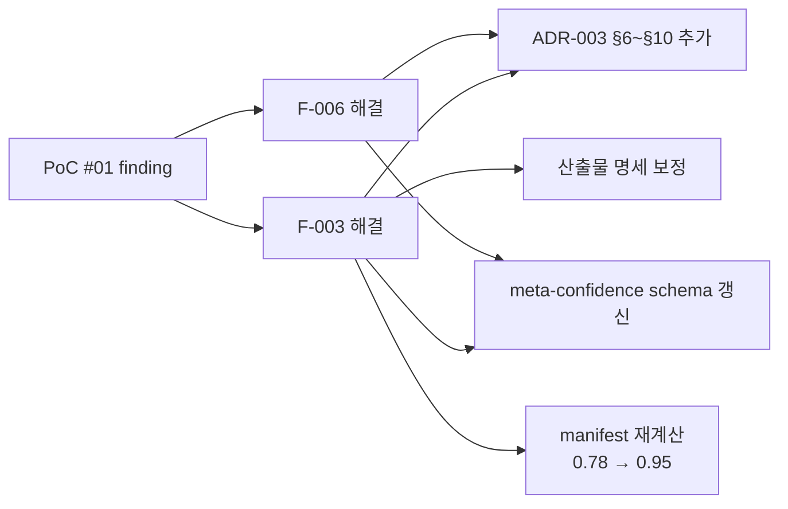

# PoC #01 Findings — 명세 빈틈 기록

> 본 문서는 PoC 진행 중 발견된 **명세 빈틈을 즉시 기록**한다.
> 종료 시 plan-methodology-v1.1.md §15 Lessons Learned로 통합.

---

## Phase 0 (입력 정리)

### F-001: 외부 레포 분석 시 git clone 대체 방법 미명시

```yaml
finding_id: F-001
phase: 0
discovered_at: 2026-04-26
discoverer: PoC 진행 중

description: |
  Phase 0 명세에 "git clone 후 .ai-analysis/ 디렉토리 생성" 명시.
  하지만 환경 제약(no shell access, no git)으로 web_fetch 사용 시 어떻게 할지 명세 부재.

context: |
  본 PoC는 Claude 환경에서 진행되며 git clone 불가능.
  대안으로 web_fetch로 핵심 파일만 선택적 가져오기.
  하지만 명세에는 이 케이스가 없음.

spec_gap: |
  workflow/phase-0-입력정리.md §3 처리 흐름에 다음 추가 필요:
  - "환경 제약 시 대체 방법 (web_fetch, GitHub API 등)"
  - "선택적 fetch 시 우선순위 가이드"

decision_made: |
  본 PoC에서는 web_fetch로 핵심 파일만 가져오기로 결정.
  source-info.md에 핵심 파일 우선순위 명시.

severity: low
proposed_fix: phase-0-입력정리.md §3에 "환경 제약 케이스" 절 추가
```

### F-002: PoC 시 Phase 0 산출물에 source-info.md 명세 부재

```yaml
finding_id: F-002
phase: 0
discovered_at: 2026-04-26
discoverer: PoC 진행 중

description: |
  Phase 0 명세 §4.1에 _manifest.yml만 산출물로 명시.
  하지만 PoC 진행 중 분석 대상 레포의 메타정보(URL, 작성자, 라이선스, 사람용 자료 등)를
  기록할 표준 파일이 없어서 source-info.md를 자체 작성.

context: |
  분석 대상 레포에 ground truth 자료(diagrams, postman collection 등)가 있을 때
  그걸 미리 기록해두지 않으면 후속 phase에서 누락 가능.

spec_gap: |
  workflow/phase-0-입력정리.md §4.1 산출물에 source-info.md 추가:
  - 분석 대상 레포 메타정보
  - ground truth 자료 인덱스
  - 1차 추정 기술 스택 (Phase 1에서 확인)

decision_made: |
  본 PoC에서 source-info.md를 자체 작성하여 진행.
  명세 갱신 후보로 기록.

severity: medium
proposed_fix: phase-0-입력정리.md §4.1에 source-info.md 명시 + 표준 형식 정의
```

### F-003: 신뢰도 메타데이터 자동 산정 공식 부재 ✅ CLOSED (2026-04-26)

```yaml
finding_id: F-003
phase: 0
discovered_at: 2026-04-26
discoverer: research v1.1 시뮬레이션 + Phase 0 manifest 작성 중

description: |
  ADR-003은 신뢰도 메타데이터 표준은 정의했지만,
  "입력 조합 → 신뢰도 점수" 자동 산정 공식이 없음.
  manifest 작성 시 expected_confidence_average=0.78을 어떻게 계산?

context: |
  plan §3.2의 신뢰도 표:
  - 소스만: 75%
  - + ERD: 85% (+10%p)
  - + ORM: 88% (+13%p, 단 소스만 대비)
  
  이건 평균 신뢰도 표시지만, ORM이 자동 감지된 경우 +13%p?
  domain-context.md가 +3%p? 이 가산점들의 근거가 명세에 없음.

spec_gap: |
  ADR-003 또는 meta-confidence.schema.json에:
  - 입력별 가산점 공식
  - 가산점 합산 규칙 (선형? 상한선?)
  - 영역별 신뢰도가 평균 신뢰도와 어떻게 연결?

decision_made: |
  본 PoC에서는 표를 보고 직관적 추정.
  Phase별 expected confidence는 명세 §3.2의 표와 §6 영역별 신뢰도를 종합.

severity: high (모든 산출물에 영향)
proposed_fix: ADR-003에 산정 공식 추가 또는 별도 문서로 분리

# ===== 해결 결과 (2026-04-26 closed) =====
resolution:
  status: closed
  resolved_at: 2026-04-26
  resolution_method: |
    plan-f003-신뢰도공식.md + research-f003-신뢰도공식.md 작성 후
    윤주스님 승인 → 다음 갱신 완료:
    
    1. ADR-003 §6~§10 추가 (103라인 → 301라인)
       - §6 산정 공식 v1 (가법 + 상한 0.98)
       - §7 영역별 가중 평균 (요소 수 가중)
       - §8 추출 방법별 신뢰도 표
       - §9 신뢰도 해석 가이드 (5단계)
       - §10 v1 한계
    
    2. meta-confidence.schema.json 갱신 (10 → 15 properties)
       - confidence maximum: 1.0 → 0.98 (cap)
       - 신규 필드: formula_version, applied_modifiers, applied_penalties, cap_applied, manual_override
       - inputs_used enum 확장
       - confidence_breakdown 구조 강화 (element_count, extraction_method)
    
    3. antipatterns/rules schema도 maximum 0.98로 cap 보정
    
    4. 산출물 명세 7개 검증 + 미세 보정
       - 01 아키텍처: 1.0 → 0.98 (3곳)
       - 04 DB: 1.0 → 0.98 (3곳)
       - 06 안티패턴: 1.0 → 0.98 (3곳, "1.0 가능" → "0.98 cap까지")
    
    5. PoC #01 manifest 재계산
       - 0.78 → 0.95 (정확한 공식 적용)
       - applied_modifiers 명시
  
  followup:
    - "v1.2 PoC 4~5건 누적 후 가산점 calibration"
    - "v2 후보: 베이지안 모델"
```

### F-006: 영역별 가중 평균 방식 부재 ✅ CLOSED (2026-04-26) ⭐ NEW

```yaml
finding_id: F-006
phase: 0
discovered_at: 2026-04-26 (F-003 토론 중 추가 발견)
discoverer: research-f003-신뢰도공식.md §토론 4

description: |
  영역별 신뢰도(confidence_breakdown)가 [0.95, 0.85, 0.50, 0.60, 0.70]일 때
  전체 평균을 어떻게 계산? 명세에 부재.
  단순 평균은 영역 중요도를 무시.

context: |
  F-003 토론 중 발견. F-003의 산정 공식이 "전체 신뢰도"는 정의했으나
  "영역별 → 전체 평균"은 별개 문제.

spec_gap: |
  ADR-003 또는 meta-confidence.schema.json에:
  - 영역별 신뢰도 → 전체 평균 산정 방식
  - 가중치 부여 기준 (요소 수? 사용자 정의?)

decision_made: |
  요소 수 가중 평균 채택:
  total = Σ(area.confidence × area.element_count) / Σ(area.element_count)

severity: high (F-003과 같이 모든 산출물에 영향)
proposed_fix: ADR-003에 §7 추가 + schema에 element_count 필드 추가

# ===== 해결 결과 (F-003과 함께 처리) =====
resolution:
  status: closed
  resolved_at: 2026-04-26
  resolution_method: |
    F-003 해결 작업에 통합:
    
    1. ADR-003 §7 (영역별 가중 평균) 추가
       - 공식: weighted_avg = Σ(conf × element_count) / Σ(element_count)
       - cap 우선순위: weighted 후 min(0.98, weighted)
       - 예시 포함
    
    2. meta-confidence.schema.json:
       - confidence_breakdown 항목에 element_count 필드 추가
       - extraction_method enum 추가
```

---

---

## Phase 1 (init) — 진행 시 채워짐

(아직 비어있음)

---

## Phase 2 (db) — 진행 시 채워짐

(아직 비어있음)

---

## Phase 3 (arch) — 진행 시 채워짐

(아직 비어있음)

---

## 누적 통계

| Phase | finding 수 | severity 분포 | closed |
|---|---|---|---|
| 0 | 4 | high 2, medium 1, low 1 | 2 (F-003, F-006) |
| 1 | (대기) | - | - |
| 2 | (대기) | - | - |
| 3 | (대기) | - | - |

**총 4건** (Phase 0). closed 2건 (F-003, F-006). 진행하면 더 발견 예상.

### 해결된 finding 영향 (v1.1.1 갱신)



→ **이게 4원칙의 진짜 가치**: PoC가 본 방법론을 실전 검증하여 갱신함.

---

## 다음 액션

1. ✅ F-003/F-006 해결 완료 (방법론 v1.1.1로 격상 가능)
2. ⏳ Phase 1 진입 (윤주스님 승인 대기)
3. ⏳ Phase 1 시작 시 build.gradle + 디렉토리 구조 web_fetch
