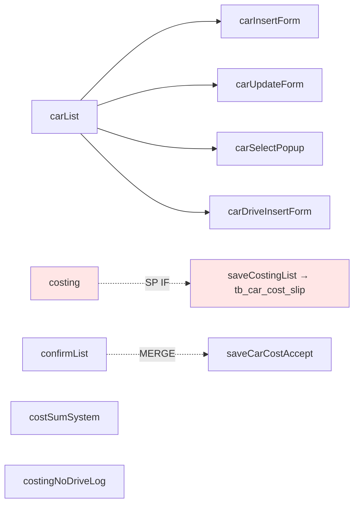

# PoC #15 EFI-WEB car — UI Spec

> phase ui 사람용 markdown / Scenario C (JSP server-rendered) / Modern FE 미적용.

## 결론

| 항목 | 사실 |
|---|---|
| **framework** | jsp_template (Scenario C) |
| **design_system_approach** | ad_hoc (legacy / inline CSS + script + JSP) |
| **pages** | **10** (Mgt 5 + Cost 5) — 14 JSP 중 명명 page 10 + popup/include/ajax 보조 4 |
| **state_sources 5 진실** | 모두 **detected=false** (Modern FE 라이브러리 0건) |
| **machines** | 0 (server-side state 본질) |
| **visual snapshots** | 0 (Playwright 미실행 / no-simulation 정합 / 14 carry) |
| **types** | 8 Java class/interface (DTO/VO 0건 — HashMap-based AP-DOMAIN-001) |

## Pages (10)

| ID | name | route | role |
|---|---|---|---|
| PAGE-CAR-MGT-001 | 차량 목록 | /ifrs/car/carList | LEADER |
| PAGE-CAR-MGT-002 | 차량 등록 폼 | /ifrs/car/carInsertForm | LEADER |
| PAGE-CAR-MGT-003 | 차량 수정 폼 | /ifrs/car/carUpdateForm | LEADER |
| PAGE-CAR-MGT-004 | 차량 선택 popup | /ifrs/car/carSelectPopup | — |
| PAGE-CAR-MGT-005 | 차량 운행 등록 폼 | /ifrs/car/carDriveInsertForm | — |
| PAGE-CAR-COST-001 | 차량 비용 계산 (★ SP IF anchor) | /ifrs/car/cost/costing | — |
| PAGE-CAR-COST-002 | 차량 비용 확정 (★ scriptlet) | /ifrs/car/cost/confirmList | ADMIN |
| PAGE-CAR-COST-003 | 비용 합산 시스템 (★ scriptlet) | /ifrs/car/cost/costSumSystem | ADMIN |
| PAGE-CAR-COST-004 | 운행 로그 없는 비용 계산 | /ifrs/car/cost/costingNoDriveLog | — |
| PAGE-CAR-COST-005 | 회계전표 popup | /ifrs/car/cost/popCarCostSlip | — |

## State Sources 5 진실 (모두 detected=false)

| source_type | detected | note |
|---|---|---|
| server_cache | ❌ | TanStack/SWR/Apollo 미사용 |
| client_state | ❌ | Zustand/Redux/Jotai 미사용 |
| url_state | ❌ | request.getParameter 만 |
| form_state | ❌ | form action=/submit 만 / React Hook Form 미사용 |
| dom_state | ❌ | `<input value=...>` + JSP `<%= %>` 직접 |

★ scenario C 정합 (server-side state paradigm).

## Visual Manifest (carry)

| 항목 | 값 |
|---|---|
| total_snapshots | 0 |
| baseline_count | 0 |
| drift_count | 0 |
| simulation_count | 0 |
| **carry_count** | **14** (모든 JSP) |

→ Playwright / Storybook 본 PoC 환경 미실행 (no-simulation 정합) / Modern 마이그레이션 시 visual regression baseline 신설 의무.

## Types (8 Java class)

| ID | name | kind | layer |
|---|---|---|---|
| T-CAR-001 | CarMgtController | class | presentation |
| T-CAR-002 | CarCostController | class | presentation |
| T-CAR-003 | CarMgtService | interface | application |
| T-CAR-004 | CarCostService | interface | application |
| T-CAR-005 | CarMgtServiceImpl | class | application |
| T-CAR-006 | CarCostServiceImpl | class | application |
| T-CAR-007 | CarMgtDAO | class | infrastructure |
| T-CAR-008 | CarCostDAO | class | infrastructure |

**DTO/VO class = 0건** ★ — HashMap-based paradigm (AP-DOMAIN-001) / `Map param` / `Map<String, String>` / `EgovMap` 만.

`captured_by = manual_extraction` (Java source / ts-morph 등 자동 도구 부적용 / javaparser carry).

## Mermaid (page hierarchy)

