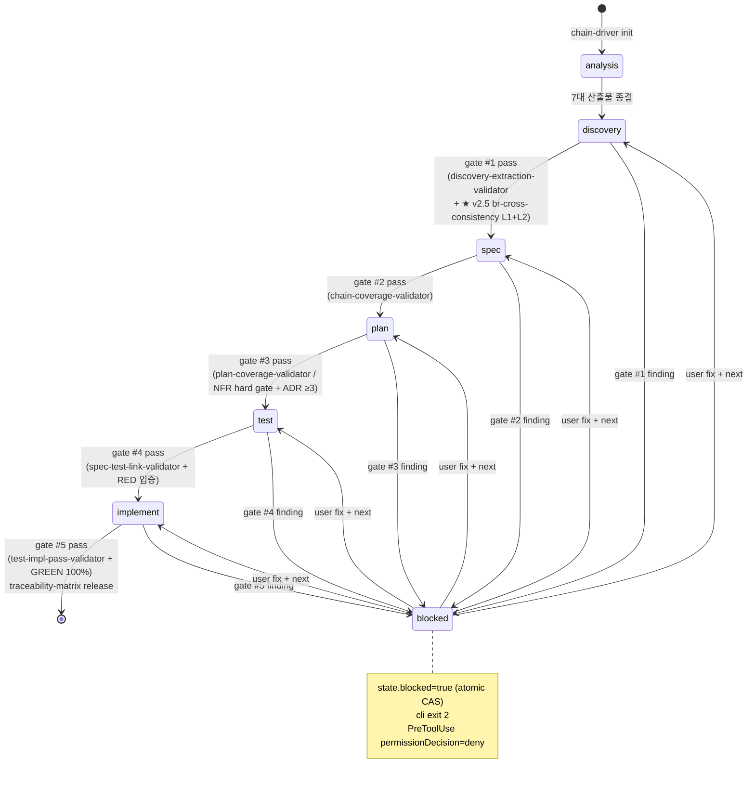
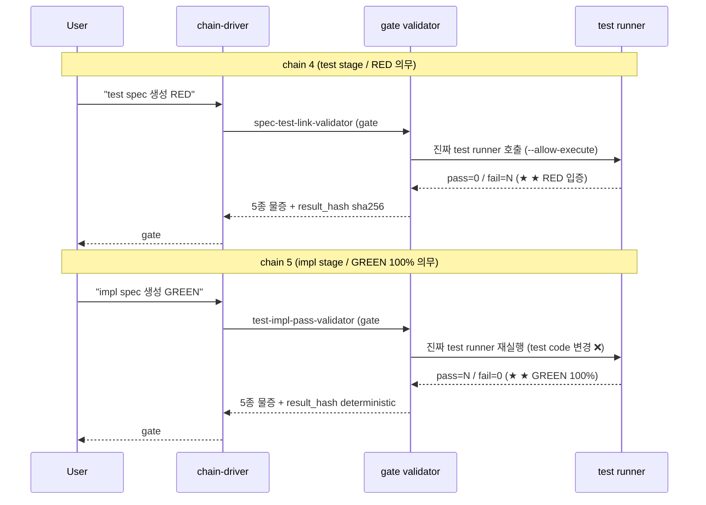

# Chain Harness Guide — init / next / blocked / unblock loop

본 가이드 = chain harness 5 요소 enforcement 의 사용자 mental model. state.json + mechanical gate trio + revisit detector 가 어떻게 함께 동작하는지.

> **갱신 이력**: v2.0.0 작성 → v2.5.1 정합 갱신 → v3.6.9 정합 갱신 → **v9.0.1 6-stage 정합 갱신** (★ planning→discovery 개칭 + plan stage 신설 / state.schema `current_chain` 6-stage enum 정합 / DEC-2026-05-21).

## 1. Chain harness 가 무엇인가?

★ ★ ★ v2.0 paradigm — Aider 패턴 정합. **chain-driver 가 mechanical 하게 stage 순서 + gate 통과 + revisit loop 를 강제**. LLM "통과한 척 / RED 확인한 척" 시뮬레이션 ❌.

★ ★ v2.5 paradigm 확장 — chain 1 gate 가 **Layer 2 LLM (Claude Code sub-agent invocation)** 의무 통합. `br-cross-consistency-validator` 가 chain 1 gate 통과 의무 요소로 격상. semantic_drift_detected 또는 confidence_cap_exceeded finding 발생 시 chain 진입 차단.

5 요소:
1. **Driver** — `tools/chain-driver/` cli + 6 module
2. **State 영속** — `.aimd/state.json` (atomic CAS write)
3. **Mechanical gate trio** — state.blocked + cli exit 2 + PreToolUse deny
4. **Skill auto-invoke (D21')** — hooks/hooks.json suppressOutput=true
5. **Chain-revisit detector** — git diff --numstat + LOC threshold

## 2. state.json 의 의미

`<project>/.aimd/state.json` 의 핵심 필드 (전체 = `schemas/state.schema.json`):

```json
{
  "version": "1.0",
  "project_id": "<basename>",
  "current_chain": "analysis" | "discovery" | "spec" | "plan" | "test" | "implement" | "revisit_pending",
  "current_scope": null | "<slug>",
  "stage_progress": { "analysis": {...}, "discovery": {...}, "spec": {...}, "plan": {...}, "test": {...}, "implement": {...} },
  "last_gate": { "id": "#1"|"#2"|"#3"|"#4", "stage": "discovery"|"spec"|"test"|"implement", "decision": "go"|"stop"|"revisit", "decision_at": "<ISO>" },
  "pending_revisit": null | { "target_stage": "...", "confidence_loc": <int> },
  "blocked": false | true,
  "block_reason": "validator_critical" | "validator_high" | "coverage_threshold" | "evidence_missing" | "..."
}
```

★ ★ chain N = gate #N (★ v10.0.0 / INTERNAL CONVENTION). gate #1=discovery / #2=spec / #3=plan / #4=test / #5=implement.

★ ★ atomic write CAS — chain-driver 가 state 갱신 시 expectedVersion 비교 후 fdatasync + rename. Windows fallback 동작.

## 3. Init → next → done loop

### 3.1 Init (chain harness 시작)

```bash
node tools/chain-driver/src/cli.js init <project-dir>
```

→ `.aimd/state.json` 신규 생성 (current_chain: "analysis" / blocked: false). 이후 사용자 prompt 로 chain stage 진입.

### 3.2 Next (다음 stage 진입)

```bash
node tools/chain-driver/src/cli.js next
```

작동:
1. 현재 stage 의 종결 자격 검증 (gate validator 호출)
2. gate finding 발견 시 → state.blocked=true / cli exit 2 / 사용자 fix 후 재시도
3. gate pass 시 → 다음 stage 로 전이 + state 갱신 / cli exit 0

★ next 호출 시점 = 보통 hook 자동 (UserPromptSubmit hook 이 stage 매칭 prompt 감지 후 chain-driver hooks-bridge 호출).

### 3.3 Blocked 마주칠 때

`state.blocked=true` 가 되면:
- chain-driver `next` cli exit 2 (다음 stage 진입 거부)
- PreToolUse hook 이 `<project>/.aimd/output/**` Write/Edit 차단 (permissionDecision=deny)
- 사용자가 finding fix 후 재시도

### 3.4 Unblock 절차

```bash
# 현재 state 확인
node tools/chain-driver/src/cli.js state

# block_reason 에 따라 fix
# 1. validator_critical/high — finding 보고 source 수정 후 다음 단계
# 2. user_intervention — 사용자 명시 결단 입력
# 3. tmp_files_pending — recoverTmpFiles 호출
# 4. schema_migration — chain-driver migrate

# state 재검증 / 재시도
node tools/chain-driver/src/cli.js next
```

### 3.5 State transition 시각화 (★ stateDiagram-v2)



★ current_chain = `state.schema.json` enum 정합 (analysis / discovery / spec / plan / test / implement / revisit_pending). blocked = 별도 boolean field. plan stage (chain 3) 는 hard gate 미보유 (deferred / plan-agent 본격 구현 v9.x+ carry).

## 4. Mechanical gate trio (★ ★ ★ no-simulation enforcement)

```
┌─ (i) state.blocked ──── 영속 / atomic CAS write
│
├─ (ii) cli exit 2 ────── chain-driver next 가 blocked 시 거부
│
└─ (iii) PreToolUse deny ─ Claude Code hook 이 Write/Edit 차단
                            (Auto Mode 도 사용자 'go' 거부 시 차단)
```

★ ★ ★ **3 layer 모두** — LLM 양심 의존 회피. 어느 한 layer 만 의존 시 우회 가능.

## 5. Skill auto-invoke (D21')

`hooks/hooks.json` 의 UserPromptSubmit hook:

```
matcher: (discovery|발견|탐색|planning|기획|spec|명세|behavior|plan|계획|test|테스트|implement|구현)
action:  chain-driver hooks-bridge → suggest-skill (stderr)
suppressOutput: true (★ LLM context 미주입)
additionalContext: "LLM SHALL NOT auto-invoke" 차단 문구
```

★ D21' 정합 — 권고만 stderr 로 사용자 콘솔 노출 / LLM 이 즉시 따르는 척 차단.

★ ★ **v2.5.1 1-depth + category prefix paradigm**: skill 디렉토리 = `skills/<category>-<name>/SKILL.md` (예: `skills/analysis-input-collection/SKILL.md`). hooks-bridge 가 flat path 자동 lookup. Claude Code plugin 표준 정합.

## 5.1 ★ v2.5 chain 1 gate — Layer 2 LLM 통합 (사상 본질)

chain 1 gate (discovery → spec 진입) 시 chain-driver 가 호출하는 validator:

```
1. discovery-extraction-validator (★ v11.0.0 rename / 기존 planning-extraction-validator)
2. ★ br-cross-consistency-validator (v2.4 신규 / v2.5 Layer 2 본격 통합)
   ├─ Layer 1 (결정적):
   │   · 두 표현 ≥ 1 의무 (natural_language + given_when_then)
   │   · structure 검증 (given 안 결과 키워드 ❌ / when 안 전제 키워드 ❌)
   │   · BR id 4토막 strict
   └─ Layer 2 (★ Claude Code sub-agent invocation / Sonnet 4.6):
       · 31 BR batch 1회 호출 (PoC #01 13 + PoC #03 18 = corroboration 자료)
       · NL ↔ GWT 의미 등가성 평가 / semantic_score per BR
       · DETERMINISTIC_THRESHOLD = 0.85 / confidence cap = 0.85
       · finding 신설: semantic_drift_detected (medium) + confidence_cap_exceeded (low)
```

gate-eval.js 의 evaluateGate:
- `layer2_threshold` block reason (★ session 14차 신설)
- severityRank rank 2 (coverage_threshold 수준)
- applyUserDecision user "go" → go-with-warnings 허용

> ★ Anthropic API / OpenAI API 영역 ❌ → **Claude Code sub-agent (Task tool) invocation paradigm** 정합 (★ session 11차 정정).
> ★ Static Tool 시뮬레이션 금지 정합 — sub-agent persona 시뮬레이션 ❌.

## 6. Chain-revisit detector

`tools/chain-driver/src/revisit-detect.js`:

```
1. git diff --numstat <baseline_sha>..HEAD
2. path-to-chain whitelist 9 pattern (analysis/* / planning-spec / behavior-spec / etc)
3. LOC threshold ≥ 5 (revisit_ignore_globs 학습)
4. revisit 감지 시 사용자 prompt → go (revisit) / stop
```

baseline_sha = state.json 의 `last_baseline_sha` 필드. chain stage 종결 시 갱신.

## 7. 5종 물증 (no-simulation 정책 핵심)

chain 4 (test) + chain 5 (implement) 종결 시 다음 모두 검증:

| 필드 | 목적 |
|---|---|
| `tool_version` | test runner 버전 |
| `tool_stdout_path` | raw stdout 로그 |
| `tool_stderr_path` | raw stderr 로그 |
| `invocation_timestamp` | ISO timestamp |
| `duration_ms` | 실행 소요 |
| `result_hash` | sha256 (위조 차단 / SARIF Appendix F 정합) |
| `reproduction_command` | 사용자 재현 가능 명령 |

★ `real_tool: true` 시 7 필드 모두 의무 / `simulation_only: true` = 자동 fail.

## 8. Common 시나리오

### A. 처음 chain harness 진입

```
1. node tools/chain-driver/src/cli.js init <project>
2. "이 코드베이스 분석 시작" → analysis stage
3. analysis 종결 후 "발견 단계 시작" (또는 "기획 단계 시작") → chain 1 (discovery)
4. ... (각 stage 자연어 prompt)
```

### B. gate finding 마주침

```
$ chain-driver next
[chain-driver] gate #2 / chain-coverage-validator finding 3건
[chain-driver] state.blocked=true / block_reason=validator_critical
exit 2

$ chain-driver state
{ stage: "spec", blocked: true, block_reason: "validator_critical", findings: [...] }

# fix 후
$ chain-driver next
[chain-driver] gate #2 pass / next stage = test
exit 0
```

### C. Revisit (이미 종결한 stage 로 돌아가기)

```
# 사용자가 chain 1 산출물 (planning-spec) 수정
$ git diff
... (planning-spec 변경)

$ chain-driver revisit-detect
[chain-driver] revisit 감지 / chain 1 → 현재 chain 5
[chain-driver] 사용자 prompt: revisit / stop ?
```

### D. RED → GREEN 전환 시각화 (★ sequenceDiagram)



★ ★ ★ chain 4 의 test code = chain 5 에서 그대로 재호출 (test 변경 ❌). impl 추가만으로 RED → GREEN 전환 입증.

## 9. 막혔을 때

- **chain-driver init 안 됨** → [common-errors.md](./common-errors.md) §Init failures
- **state.blocked 풀이 안 됨** → [common-errors.md](./common-errors.md) §Blocked unlock
- **next 가 무한 blocked** → finding source 직접 fix / `--dry-run` 으로 검증

## 10. 참조

- [`../tools/chain-driver/README.md`](../tools/chain-driver/README.md) — 도구 cli 7 command
- [`../schemas/state.schema.json`](../schemas/state.schema.json) — state 영속 schema
- [`../schemas/intervention-log.schema.json`](../schemas/intervention-log.schema.json) — 사용자 결단 로그
- [`../flows/sdlc-4stage-flow.json`](../flows/sdlc-4stage-flow.json) — chain harness master SSOT
- [`../hooks/README.md`](../hooks/README.md) — hooks lifecycle + D21' 정합
- ADR-CHAIN-005 — chain harness driver state machine + 5 요소 enforcement
- DEC-2026-05-06-sub-plan-5-종결 + DEC-2026-05-06-sub-plan-6-종결
