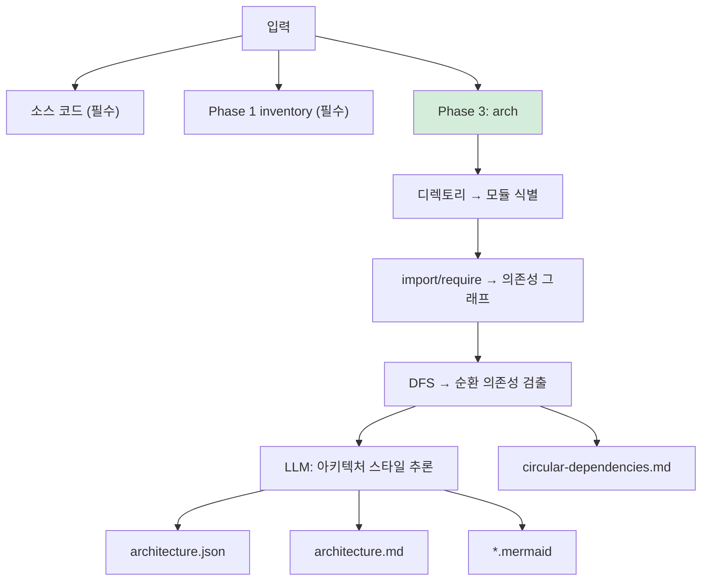
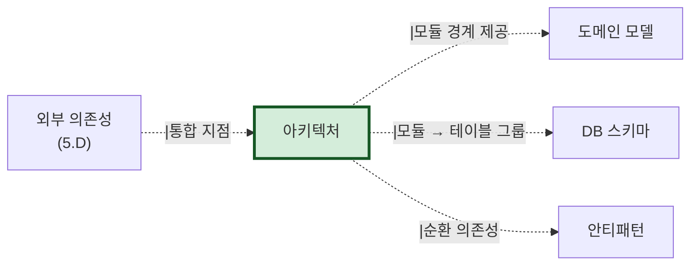

# 산출물 #1: 아키텍처/의존성 (Architecture & Dependencies)

> 본 문서는 아키텍처/의존성 산출물의 **표준 명세**다.
> 사상: Schema-First (ADR-001 참조)
> 관련 schema: `schemas/architecture.schema.json`
> 관련 template: `templates/architecture.template.{md,mermaid}`

---

## 1. 목적

**이 산출물이 답하는 질문**: "이 시스템은 어떤 모듈로 구성되며, 모듈 간 의존 관계는?"

**소비자**:
- 아키텍트 (시스템 구조 파악)
- 개발자 (모듈 경계·영향 범위 판단)
- AI 재구현 시 (모듈 분리·빌드 순서 결정)
- TF Lead (분석 우선순위 결정)

---

## 2. 형식

### 2.1 파일 구성

```
output/architecture/
├── architecture.json              # AI용 (구조화)
├── architecture.md                # 사람용 요약
├── architecture.mermaid           # C4 Level 3 컴포넌트 다이어그램
├── dependency-graph.mermaid       # 모듈 간 의존성 그래프
└── circular-dependencies.md       # 순환 의존성 보고서 (있을 경우)
```

### 2.2 핵심 결정

- Mermaid `flowchart`로 C4 Level 3 표현 (도구 의존성 없음, git diff 가능)
- 모듈 = 패키지/디렉토리 단위 (언어별 관례)
- 순환 의존성은 **안티패턴(#6)**으로도 등록

---

## 3. 추출 범위

### 3.1 추출 대상

| 항목 | 추출 출처 | 결정적/LLM |
|---|---|---|
| 모듈 식별 | 디렉토리 구조 + 패키지 선언 | 결정적 (0.98) |
| 모듈 간 의존성 | import/require 그래프 (AST) | 결정적 (0.98) |
| 순환 의존성 | 의존성 그래프 DFS/BFS | 결정적 (0.98) |
| 아키텍처 스타일 추론 | 디렉토리 패턴 + 의존 방향 | LLM (0.70) |
| 레이어 분류 | controller/service/repository 패턴 | 결정적 + LLM (0.85) |
| 외부 의존성 | 패키지 매니페스트 (pom.xml, package.json 등) | 결정적 (0.98) |

### 3.2 미추출 (의도적)

- 런타임 의존성 (DI 컨테이너 동적 바인딩) → Phase 4에서 추론
- 빌드 타임 의존성 (Gradle task 순서) → 인벤토리에서 참조
- 외부 서비스 통합 → Phase 4 5.D에서 처리

---

## 4. 아키텍처 스타일 추론 패턴

| 스타일 | 감지 단서 | 신뢰도 |
|---|---|---|
| Layered | `controller/`, `service/`, `repository/` 디렉토리 | 0.85 |
| Hexagonal | `port/`, `adapter/`, `application/`, `domain/` | 0.80 |
| Clean Architecture | `usecase/`, `entity/`, `interface/`, `infrastructure/` | 0.80 |
| MVC | `models/`, `views/`, `controllers/` | 0.85 |
| Monolith | 단일 빌드 + 단일 배포 단위 | 0.90 |
| Microservices | 다중 서비스 디렉토리 + 독립 빌드 | 0.80 |
| 혼합/불분명 | 위 패턴에 맞지 않음 | 0.50 (LLM 추론) |

---

## 5. 추출 흐름



---

## 6. 신뢰도 기준

| 영역 | 신뢰도 | 근거 |
|---|---|---|
| 모듈 식별 | 0.98 | 디렉토리/패키지 직접 추출 |
| 모듈 간 의존성 | 0.98 | AST import 그래프 |
| 순환 의존성 검출 | 0.98 | 그래프 알고리즘 (결정적) |
| 아키텍처 스타일 추론 | 0.70 | LLM — 사람 검토 권장 |
| 레이어 분류 | 0.85 | 디렉토리 패턴 + LLM 보강 |
| 외부 의존성 | 0.98 | 매니페스트 직접 파싱 |

**사람 검토 필수**: 아키텍처 스타일 추론

---

## 7. 검증 체크리스트

```
□ architecture.json schema 검증 통과
□ Mermaid 렌더링 확인
□ 모든 모듈에 ID 부여
□ 순환 의존성 있으면 안티패턴(#6)에도 등록
□ 아키텍처 스타일 = 사용자 확인
□ Phase 1 inventory와 모듈 수 정합
```

---

## 8. 산출물 간 참조



---

## 9. 흔한 함정

### 9.1 generated 코드 포함
- 증상: `build/`, `dist/` 등의 import까지 그래프에 포함
- 대응: `.gitignore` + 추가 제외 패턴 적용

### 9.2 동적 import 누락
- 증상: `require(variable)`, `import()` 동적 호출 감지 실패
- 대응: 동적 import 패턴 별도 추적 + 신뢰도↓ 표기

### 9.3 아키텍처 스타일 과신
- 증상: 디렉토리명만 보고 Hexagonal 판단 → 실제론 Layered
- 대응: 의존 방향 분석 필수 (domain → infra 의존 시 Hexagonal 아님)
