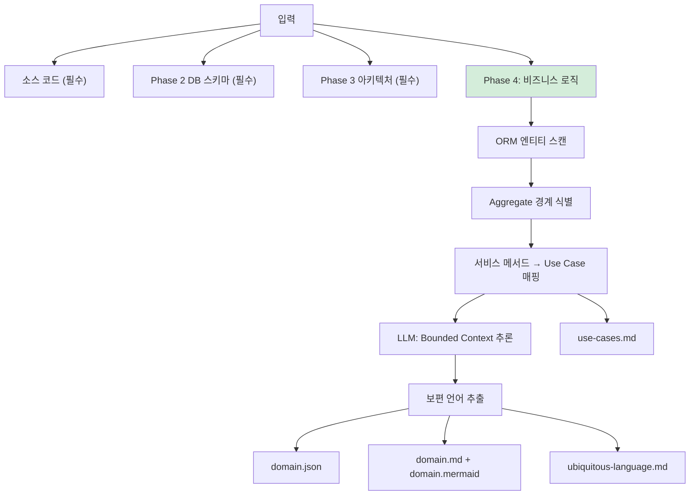
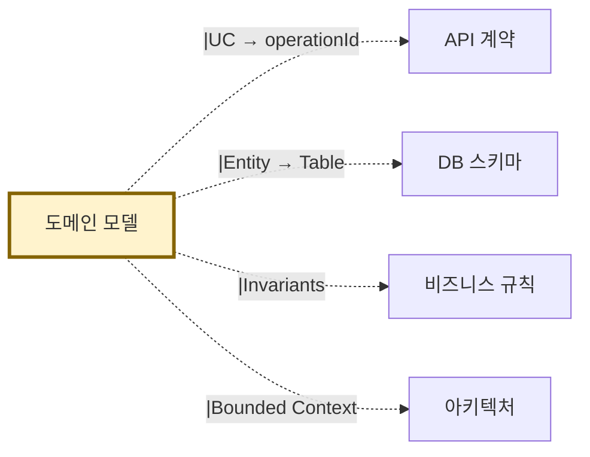

# 산출물 #2: 도메인 모델 (Domain Model — DDD-Lite B)

> 본 문서는 도메인 모델 산출물의 **표준 명세**다.
> 사상: DDD-Lite B 강도 (ADR-004 참조)
> 관련 schema: `schemas/domain.schema.json`
> 관련 template: `templates/domain.template.{md,mermaid}`

---

## 1. 목적

**이 산출물이 답하는 질문**: "이 시스템의 핵심 개념과 행동은? 도메인 경계는?"

**소비자**:
- BE 개발자 (도메인 로직 이해)
- 아키텍트 (Bounded Context 식별)
- AI 재구현 시 (엔티티/VO/Aggregate 자동 생성)
- 기획자/PM (보편 언어 사전)

---

## 2. 형식

### 2.1 파일 구성

```
output/domain/
├── domain.json                    # AI용 (구조화)
├── domain.md                      # 사람용 요약
├── domain.mermaid                 # classDiagram (엔티티 관계)
├── use-cases.md                   # 유스케이스 카탈로그
└── ubiquitous-language.md         # 보편 언어 사전
```

### 2.2 DDD-Lite B 적용 범위 (ADR-004)

```
✅ 추출:
  - Bounded Context (가벼운 그룹화)
  - Entity (식별자 가진 객체)
  - Value Object (불변 값 객체)
  - Aggregate (트랜잭션 경계)
  - Aggregate Root
  - Invariants (집합체 불변식)
  - Repository (집합체 단위 영속화)
  - Domain Service (도메인 로직)
  - Use Case
  - Ubiquitous Language (보편 언어)

❌ 미추출 (v1.2 이후):
  - Context Map, Subdomain 분류, Domain Event, Saga
```

---

## 3. 추출 범위

### 3.1 추출 대상

| 항목 | 추출 출처 | 결정적/LLM |
|---|---|---|
| Entity | ORM `@Entity` | 결정적 (0.95) |
| Aggregate Root | `@OneToMany cascade=ALL, orphanRemoval=true` | 결정적 (0.90) |
| Value Object | `@Embeddable` | 결정적 (0.95) |
| Repository | Repository 클래스 | 결정적 (0.95) |
| Domain Service | Service 클래스 안 도메인 로직 | LLM 추론 (0.70) |
| Invariants | 메서드 안 가드 절, DB CHECK | LLM 추론 (0.65) |
| Bounded Context | 패키지 구조 + 모듈 경계 | LLM 추론 (0.60) |
| Ubiquitous Language | 클래스명 + 메서드명 + ERD 컬럼 | LLM 추출 (0.75) |
| Use Case | 서비스 메서드 + Controller 매핑 | LLM 추론 (0.75) |

### 3.2 미추출 (의도적)

- 도메인 이벤트 → v1.2 이후 (ADR-004)
- 비즈니스 정책 상세 → 비즈니스 규칙 산출물(#5)로 분리
- 영속화 상세 → DB 스키마 산출물(#4)로 분리

---

## 4. 엔티티 형식

```yaml
- id: E-ORDER-Order
  type: aggregate_root
  bounded_context: BC-ORDER
  attributes:
    - name: id
      type: Long
      pk: true
    - name: status
      type: OrderStatus (enum)
    - name: totalAmount
      type: Money (value_object)
  
  children:
    - entity: E-ORDER-OrderItem
      relation: "1:N"
      cascade: ALL
      orphan_removal: true
  
  invariants:
    - "주문 상태가 PENDING/PAID일 때만 취소 가능"
    - "totalAmount = Σ(items.price × items.quantity)"
  
  repository: OrderRepository (JpaRepository)
  
  source: src/main/java/com/example/order/Order.java
  confidence: 0.90
  extraction_method: pattern_matching
```

---

## 5. 유스케이스 형식

```yaml
- id: UC-ORDER-001
  name: "주문 생성"
  actor: "인증된 사용자"
  preconditions:
    - "장바구니에 1개 이상 상품"
  postconditions:
    - "Order 생성 (status=PENDING)"
    - "재고 차감"
  
  related_entities: [E-ORDER-Order, E-ORDER-OrderItem, E-PRODUCT-Product]
  related_apis: [createOrder]
  related_rules: [BR-ORDER-001, BR-ORDER-007]
  
  source: OrderService.createOrder()
  confidence: 0.75
```

---

## 6. 추출 흐름



---

## 7. 신뢰도 기준

| 영역 | ORM 있음 | ORM 없음 |
|---|---|---|
| Entity 식별 | 0.95 | 0.60 (LLM) |
| Aggregate 경계 | 0.90 | 0.50 (LLM) |
| Value Object | 0.95 | 0.55 (LLM) |
| Repository | 0.95 | 0.70 |
| Use Case | 0.75 | 0.60 |
| Bounded Context | 0.60 | 0.50 |
| 보편 언어 | 0.75 | 0.65 |

**평균**: ORM 있을 때 ~85%, 없을 때 ~60%

**사람 검토 필수**: Bounded Context 경계, Invariants

---

## 8. 검증 체크리스트

```
□ domain.json schema 검증 통과
□ classDiagram Mermaid 렌더링
□ 모든 Entity에 ID 표준 (E-{도메인}-{이름}) 적용
□ Aggregate Root 명시 (ORM cascade=ALL 기준)
□ Use Case ↔ API operationId 매핑 일관성
□ 보편 언어 = 사용자 검토
```

---

## 9. 산출물 간 참조



---

## 10. 흔한 함정

### 10.1 Anemic Domain Model
- 증상: Entity에 getter/setter만 있고 도메인 로직이 Service에
- 대응: AP-DOMAIN-ANEMIC-XXX 등록 + 도메인 로직 위치 기록

### 10.2 Aggregate 과잉
- 증상: 모든 Entity를 Aggregate Root로 판정
- 대응: cascade=ALL + orphanRemoval 기준 엄격 적용

### 10.3 ORM 없는 프로젝트
- 증상: MyBatis만 사용 → @Entity 없음 → Entity 자동 감지 실패
- 대응: SQL Mapper + DTO 클래스에서 LLM 추론, 신뢰도↓ 표기
