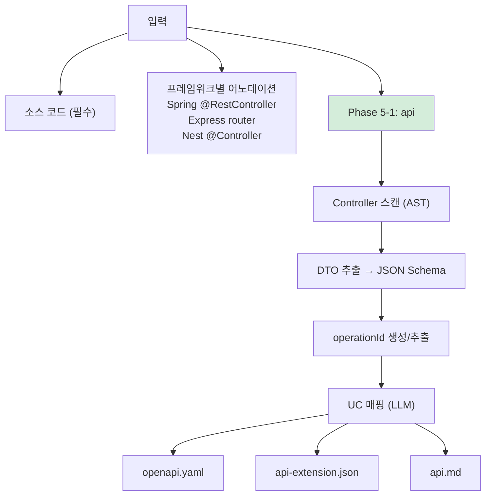
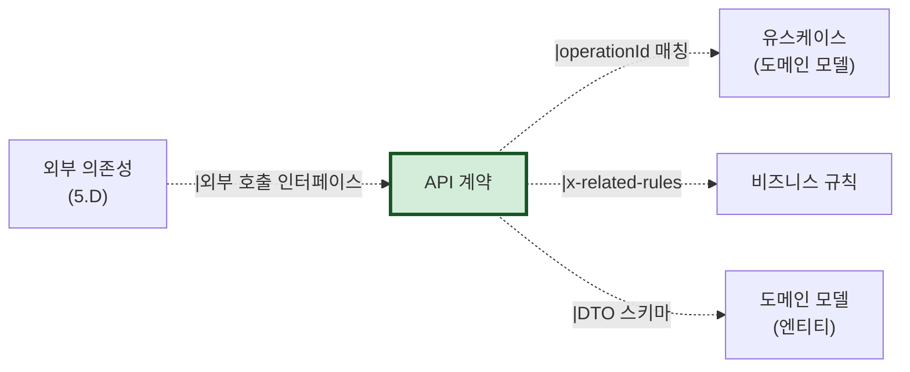

# 산출물 #3: API 계약 (API Contract)

> 본 문서는 API 계약 산출물의 **표준 명세**다.
> 사상: Contract-First (ADR-001 참조)
> 관련 schema: `schemas/openapi-extension.schema.json`
> 관련 표준: OpenAPI 3.1

---

## 1. 목적

**이 산출물이 답하는 질문**: "이 시스템에서 무엇을 호출할 수 있는가? 입력/출력은?"

**소비자**:
- FE 개발자 (BE 호출 인터페이스)
- 외부 통합 파트너 (API 사용자)
- AI 재구현 시 (계약 테스트 자동 생성)
- 자동 문서 도구 (Swagger UI 등)

---

## 2. 형식

### 2.1 파일 구성

```
output/api/
├── openapi.yaml                     # 표준 OpenAPI 3.1 (산업 표준 그대로)
├── api-extension.json               # AI 분석 메타 (operationId ↔ UC 매핑 등)
├── api.md                           # 사람용 요약
└── (선택) swagger-ui-build/          # Swagger UI 정적 빌드
```

### 2.2 핵심 결정: 산업 표준 유지

OpenAPI 자체는 **변형 없이** 표준대로. 우리 분석 메타는 **별도 파일**(`api-extension.json`)에. 이렇게 해야:
- 기존 OpenAPI 도구체인 (codegen, mock server) 그대로 사용
- 외부 공유 시 표준만 전달
- 우리 메타는 내부 분석 추적용

---

## 3. 추출 범위

### 3.1 추출 대상

| 항목 | 추출 출처 | 결정적/LLM |
|---|---|---|
| 엔드포인트 (path/method) | Controller/Router 어노테이션 | 결정적 (AST) |
| 요청/응답 스키마 | DTO 클래스 + ORM 매핑 | 결정적 + LLM 보강 |
| 에러 코드 | 예외 클래스 + 핸들러 매핑 | 결정적 + LLM |
| 인증/권한 | `@PreAuthorize`, security config | 결정적 + LLM |
| operationId | 메서드명 또는 LLM 생성 | 결정적 + LLM |
| operationId ↔ UC 매핑 | LLM 추론 (의미 매칭) | LLM |

### 3.2 미추출 (의도적)

- API 사용 빈도, 응답시간 → NFR 영역
- 비즈니스 정책 description (긴 설명) → 비즈니스 규칙 산출물(#5)로 분리

---

## 4. 책임 분담 — API에 안 담기는 것

ADR-002 §책임 분담 원칙. API에는 **인터페이스 형식만**, 정책은 비즈니스 규칙으로:

```yaml
# ❌ 안 좋은 예 (API에 정책 박힘)
post:
  description: |
    주문을 생성합니다. 주류는 19세 이상만 가능하고,
    재고 부족 시 거부되며, 5만원 이상은 무료배송이고...

# ✅ 좋은 예 (API는 형식만, 정책은 분리)
post:
  operationId: createOrder
  responses:
    '201': { ... }
    '403': 
      description: '권한/정책 거부'
      content:
        application/json:
          schema:
            example: { code: 'AGE_RESTRICTED' }
  x-related-rules: [BR-ORDER-007, BR-ORDER-008, BR-ORDER-009]
  x-related-use-cases: [UC-ORDER-001]
```

`x-related-rules`, `x-related-use-cases`는 OpenAPI 확장 (`x-` prefix). 비즈니스 규칙 산출물에 자세히.

---

## 5. 추출 흐름



---

## 6. 신뢰도 기준

| 영역 | 신뢰도 | 근거 |
|---|---|---|
| 엔드포인트 식별 | 0.95 | 어노테이션 직접 추출 |
| 요청/응답 스키마 | 0.85 | DTO 클래스 추출 |
| 에러 코드 | 0.70 | 예외 핸들러 추적 — 일부 누락 가능 |
| 인증/권한 | 0.75 | `@PreAuthorize` 표현식의 도메인 메서드는 별도 분석 |
| operationId ↔ UC 매핑 | 0.65 | LLM 의미 매칭 — 사람 검토 권장 |

**사람 검토 필수**: operationId ↔ UC 매핑

---

## 7. 검증 체크리스트

```
□ OpenAPI 3.1 lint 통과 (spectral 등)
□ 모든 operationId가 unique
□ DTO 스키마가 JSON Schema 호환
□ 에러 응답 표준화 (4xx/5xx)
□ 인증/권한 명시 (security 섹션)
□ x-related-rules, x-related-use-cases 메타 있음
□ Swagger UI 렌더링 검증
```

---

## 8. 산출물 간 참조



---

## 9. 흔한 함정

### 9.1 description에 정책 박기
- 증상: API description에 비즈니스 규칙 줄줄이
- 대응: 정책은 BR-XXX로 분리, API는 `x-related-rules`로 참조

### 9.2 표준 미준수
- 증상: REST 원칙 위반, HTTP 동사 잘못 사용
- 대응: AP-API-XXX로 등록

### 9.3 Swagger annotation 부재
- 증상: Spring `@Operation` 등 없어서 추출 어려움
- 대응: LLM이 메서드명/파라미터로 추론, 신뢰도↓ 표기
