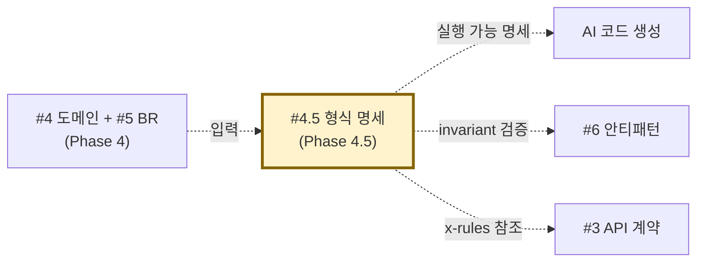

# 산출물 #4.5: 형식 명세 (Formal Spec)

> 본 문서는 형식 명세 산출물의 **표준 명세**다.
> 사상: 이중 렌더링 (ADR-008) + 자연어 빈약성 보완 + AI 코드 생성 정확도 향상
> 관련 schema: `schemas/formal-spec.schema.json`
> 관련 template: `templates/formal-spec.template.md` 외 4건
> 관련 workflow: `workflow/phase-4-5-formal-spec.md`
> 신설: v1.2.0 (묶음 L) — PoC #02 C-Sprint 1+1.5+2 누적 검증 정식 격상

---

## 1. 목적

**이 산출물이 답하는 질문**:
- "이 시스템의 Aggregate Root 생애주기는?" (state)
- "Use Case 의 호출 순서는?" (sequence)
- "BR 의 분기는 모두 처리되는가?" (decision table)
- "도메인 invariant 는 실행 가능한가?" (invariants)
- "모든 입력에서 invariant 가 성립하는가?" (property test)

**소비자**:
- AI 코드 생성기 (자연어 60% → 형식 90%)
- BE 개발자 (구현 분기/예외 처리)
- QA (Property test → 자동 케이스 생성)
- 신규 시스템 구축자 (산출물 5종 직접 입력)

---

## 2. 형식 (5 산출물 — 이중 렌더링 정합)

### 2.1 파일 구성

```
output/formal-spec/
├── state-machines/
│   ├── <AggregateRoot>.json     # AI 눈 (XState 호환)
│   └── <AggregateRoot>.mermaid  # 사람 눈 (stateDiagram-v2)
├── sequence-diagrams/
│   ├── UC-<UseCase>.json        # AI 눈
│   └── UC-<UseCase>.mermaid     # 사람 눈 (sequenceDiagram)
├── decision-tables/
│   ├── BR-<RuleId>.json         # AI 눈
│   └── BR-<RuleId>.md           # 사람 눈 (markdown 표)
├── invariants/
│   └── <AggregateRoot>.ts       # 실행 가능 (AI + 사람 공용)
├── property-tests/
│   ├── <AggregateRoot>.spec.ts  # fast-check (TS)
│   └── <AggregateRoot>PropertyTest.java (옵션)  # jqwik (Java)
├── generated-code/              # 단방향 round-trip (코드 부재 BR)
│   └── <Aggregate>-with-<rule>.{java,sql}
└── _manifest.yml                # meta-confidence
```

### 2.2 State Machine 형식

```yaml
# state-machines/User-Account.json (요약)
id: User-Account
initial: anonymous
states:
  anonymous:
    on:
      SIGNUP: registered
  registered:
    on:
      LOGIN: authenticated
  authenticated:
    on:
      LOGOUT: anonymous
      UPDATE_PROFILE: authenticated
```

### 2.3 Decision Table 형식 (★ 핵심 — 자연어 빈약성 9 항목)

```yaml
# decision-tables/BR-USER-FOLLOW-NO-SELF-001.json
br_id: BR-USER-FOLLOW-NO-SELF-001
trigger: "POST /api/profiles/{username}/follow"
condition: "follower_id == followee_id"
action: "거부"
expected_result: "self-follow 차단"
rejection_method: "throw IllegalArgumentException (Domain 계층)"
verification_location: "User.canFollow() — Aggregate Root invariant"
http_status: 400
error_message: "Cannot follow yourself"
unfollow_consistency: "동일 규칙 적용"
current_state: "코드 부재 (F-074)"
```

자연어 4 항목 (44%) + **형식화 5 항목 (56% — 자연어 빈약 영역)**.

### 2.4 Invariants 형식

```typescript
// invariants/UserFollow.ts (요약)
export type UserFollow = {
  follower_id: UUID
  followee_id: UUID
  followed_at: Date
}

export function createUserFollow(
  follower: UserId,
  followee: UserId,
  at: Date
): UserFollow {
  if (follower === followee) {
    throw new Error('BR-USER-FOLLOW-NO-SELF-001 violation')
  }
  return { follower_id: follower, followee_id: followee, followed_at: at }
}
```

### 2.5 Property Test 형식

```typescript
// property-tests/UserFollow.spec.ts
import * as fc from 'fast-check'

test('BR-USER-FOLLOW-NO-SELF-001: self-follow always rejected', () => {
  fc.assert(fc.property(uuidArb, (id) => {
    expect(() => createUserFollow(id, id, new Date())).toThrow()
  }))
})
```

---

## 3. 신뢰도 기준 (ADR-009 정합)

| 검증 단계 | raw confidence |
|---|---|
| 자연어 단독 (Phase 4 까지) | 60-70% |
| + 5 산출물 작성 | 70-80% |
| + Cross-validation 의무 | 80-87% (시뮬 패널티) |
| + 진짜 static tool 실행 | 90-95% |

---

## 4. 검증 체크리스트

```
□ 5 산출물 모두 작성 (이중 렌더링 정합 100%)
□ formal-spec.schema.json 통과
□ Cross-validation 완료 (Senior + Static — 진짜 도구 우선)
□ Static tool 시뮬레이션 사용 시 신뢰도 -5%p 패널티 명시
□ Drift 검출 시 finding 등록 (cross_validation.double_hit 표기)
□ Property test 실행 가능 / 통과
□ generated-code 단방향 round-trip 검증 (코드 부재 BR 시)
□ _manifest.yml 신뢰도 정직 표기
```

---

## 5. 산출물 간 참조



---

## 6. 흔한 함정

### 6.1 자연어 빈약성 자기-시인 누락
- 증상: rules.json 의 자연어로 충분하다고 착각
- 대응: F-074 패턴 — 자연어 9 항목 점검 (44% / 100% 정량) → 5+ 항목 누락 시 형식화 필수

### 6.2 Self-reference 함정 (Sprint 1 발견)
- 증상: 코드 → 형식 → 코드 재생성 = 자명한 100%
- 대응: 코드 부재 BR 선택 → 자연어 → 형식 → 코드 생성 (단방향)

### 6.3 Static tool 시뮬레이션
- 증상: AI sub-agent 에 "Static Analyzer persona" 부여
- 대응: ★★★ DEC-static-tool-실행-의무화 — 진짜 도구 의무. 시뮬레이션 시 -5%p 패널티 + 명시.

### 6.4 이중 렌더링 갭
- 증상: .mermaid 만 / .json 만 작성
- 대응: ADR-008 강제 — 양쪽 의무. drift 검증 (Sprint 3 #2 정합 100% 목표).
