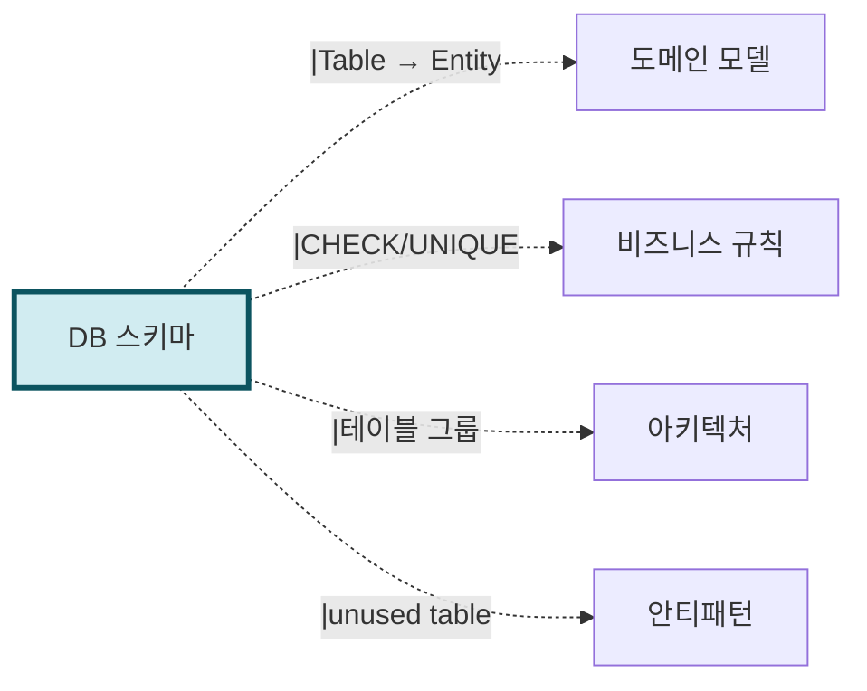

# 산출물 #4: DB 스키마 (Database Schema)

> 본 문서는 DB 스키마 산출물의 **표준 명세**다.
> 사상: Schema-First (ADR-001 참조)
> 관련 schema: `schemas/db-schema.schema.json`
> 관련 template: `templates/erd.template.mermaid`

---

## 1. 목적

**이 산출물이 답하는 질문**: "이 시스템의 데이터는 어떻게 영속되는가?"

**소비자**:
- DBA (스키마 리뷰)
- BE 개발자 (ORM 매핑 이해)
- AI 재구현 시 (DDL 자동 생성, migration 작성)

---

## 2. 형식

### 2.1 파일 구성

```
output/db/
├── schema.json                    # AI용 (구조화)
├── schema.sql                     # 통합 SQL (CREATE TABLE)
├── erd.mermaid                    # ERD (Mermaid erDiagram)
├── 정합성-검증-보고서.md           # 다중 출처 시 (보조)
└── tables/                        # 테이블별 상세 (선택)
    ├── orders.md
    └── users.md
```

---

## 3. 추출 범위

### 3.1 추출 대상

| 항목 | 추출 출처 | 결정적/LLM |
|---|---|---|
| 테이블/컬럼 | ORM 엔티티, Migration, ERD, 운영DB | 결정적 |
| PK/FK | ORM 어노테이션, ERD 관계 | 결정적 |
| 인덱스 | 운영 DB INFORMATION_SCHEMA | 결정적 |
| 컬럼 의미 | ERD 코멘트, ORM JavaDoc | 결정적 + LLM |
| 테이블 그룹 (도메인 매핑) | 패키지 구조 + 테이블 접두어 | LLM 추론 |

### 3.2 다중 출처 통합 우선순위

```
운영 DB (실제 동작) > ORM (코드 의도) > ERD (문서)
```

### 3.3 미추출 (의도적)

- 쿼리 성능, 실행 계획 → NFR 영역
- 데이터 마이그레이션 전략 → v2 (재구현 단계)

---

## 4. 신뢰도 기준

| 영역 | 입력 조합 | 신뢰도 |
|---|---|---|
| 테이블/컬럼 식별 | 소스만 | 0.85 |
| 테이블/컬럼 식별 | + ERD | 0.95 |
| 테이블/컬럼 식별 | + 운영 DB | 0.98 |
| FK 관계 | 소스만 | 0.70 |
| FK 관계 | + ERD/DB | 0.95 |
| 인덱스 | + 운영 DB | 0.98 |
| 컬럼 의미 추론 | + ERD 코멘트 | 0.85 |

---

## 5. 검증 체크리스트

```
□ schema.json schema 검증 통과
□ erd.mermaid 렌더링 확인
□ 모든 테이블에 PK 명시
□ FK 명시 또는 부재 사유 기록
□ 정합성 검증 보고서 사람 검토 (다중 출처 시)
□ severity=high 항목 모두 결정 완료
```

---

## 6. 산출물 간 참조



---

## 7. 흔한 함정

### 7.1 ERD를 무조건 SoT로
- 증상: 옛 ERD를 신뢰하여 운영 DB와 불일치 무시
- 대응: 통합 우선순위 정책 (DB > ORM > ERD)

### 7.2 deprecated 테이블 포함
- 증상: 코드에서 안 쓰는 테이블도 추출
- 대응: ORM 사용 추적 → 사용 흔적 없으면 AP-DB-UNUSED-XXX

### 7.3 ORM 우회 SQL 무시
- 증상: JPA + Native Query 혼재인데 ORM만 봄
- 대응: Native Query 위치 함께 기록 → Phase 4 5.A로 전달
