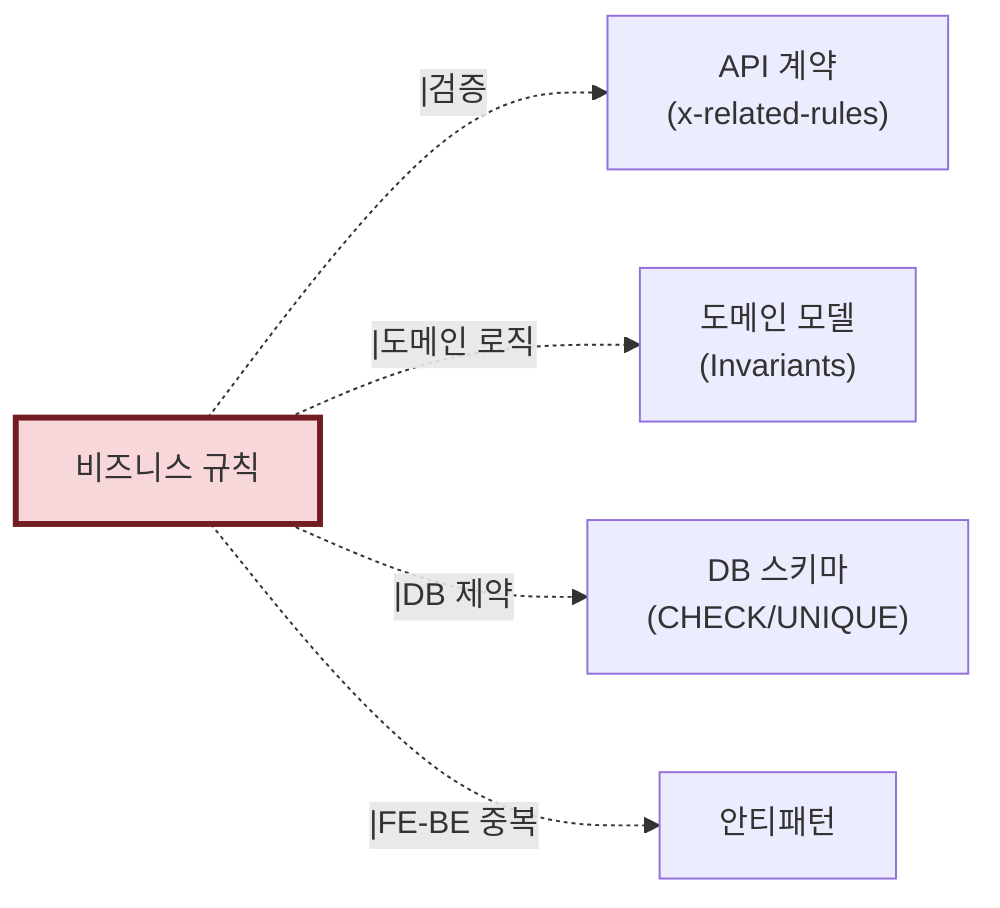

# 산출물 #5: 비즈니스 규칙 (Business Rules)

> 본 문서는 비즈니스 규칙 산출물의 **표준 명세**다.
> 사상: DDD-Lite (ADR-004) + 4영역 추출 (plan.md §5)
> 관련 schema: `schemas/rules.schema.json`
> 관련 template: `templates/rules.template.md`

---

## 1. 목적

**이 산출물이 답하는 질문**: "이 시스템에는 어떤 정책·규칙이 있는가?"

**소비자**:
- 기획자/PM (정책 인벤토리)
- BE/FE 개발자 (검증 로직 재구현)
- QA (테스트 케이스 도출)
- AI 재구현 시 (Given/When/Then 테스트 자동 생성)

---

## 2. 형식

### 2.1 파일 구성

```
output/rules/
├── rules.json                     # AI용 (구조화, Given/When/Then)
├── rules.md                       # 사람용 카탈로그
├── state-diagrams/                # 상태 다이어그램 (있을 경우)
│   └── order-status.mermaid
└── conflicts.md                   # 규칙 간 충돌 보고서 (있을 경우)
```

### 2.2 Given/When/Then 형식 (핵심)

```yaml
- id: BR-ORDER-CANCEL-001
  name: "주문 상태별 취소 가능 여부"
  given:
    - "주문이 존재함"
  when:
    - "Order.cancel() 호출 시"
    - "POST /orders/{id}/cancel 요청 시 (UC-ORDER-002)"
  then:
    - "status가 PENDING 또는 PAID여야 함"
    - "그 외 상태면 IllegalStateException"
  
  rationale: "이미 발송된 주문은 취소할 수 없음"
  extracted_area: "5.A DB"
  source: src/main/java/com/example/order/Order.java:45
  confidence: 0.80
  extraction_method: pattern_matching
  human_review_required: false
```

---

## 3. 추출 4영역 (plan.md §5)

비즈니스 규칙은 코드 한 곳에 있지 않다. **4개 영역에서 병렬 추출**:

| 영역 | 추출 대상 | 신뢰도 |
|---|---|---|
| **5.A DB** | ORM 메서드 가드, SQL CASE/WHERE, DB CHECK/UNIQUE, Trigger | 0.65~0.85 |
| **5.B FE** | 폼 validation (yup/zod), 권한별 UI 분기, 라우팅 가드 | 0.70~0.85 |
| **5.C 설정** | application.yml 매직 넘버, Feature Flag, 환경별 정책 차이 | 0.75~0.80 |
| **5.D 외부** | 외부 서비스 정책 (PG 한도, SMS 제한 등) | 0.50 |

### 3.1 미추출 (의도적)

- 비즈니스 로직의 "왜?" (코드에는 What만 있음) → 사람 검토로 보완
- 암묵지 (문서화 안 된 규칙) → domain-context.md grounding으로 부분 보완

---

## 4. 신뢰도 기준

| 영역 | 평균 신뢰도 | 근거 |
|---|---|---|
| 5.A DB CHECK 제약 | 0.85 | DB 메타 직접 추출 |
| 5.A SQL CASE 정책 | 0.65 | LLM 의도 추론 |
| 5.A ORM 메서드 가드 | 0.80 | 코드 패턴 매칭 |
| 5.B FE validation | 0.85 | 스키마 직접 추출 |
| 5.B 권한 분기 | 0.70 | LLM 추론 |
| 5.C 매직 넘버 | 0.80 | 설정 파일 추출 |
| 5.D 외부 정책 | 0.50 | LLM 추론 |

**평균**: ~50% (소스만), ~75% (여러 출처)

> ⚠️ **비즈니스 규칙은 7대 산출물 중 신뢰도가 가장 낮다.** 코드에는 What만 있고 Why는 없기 때문. 사람 검토 게이트 강제.

---

## 5. 검증 체크리스트

```
□ rules.json schema 검증 통과
□ 모든 BR에 ID 표준 (BR-{도메인}-{이름}-{번호}) 적용
□ Given/When/Then 형식 준수
□ 추출 영역 (5.A/5.B/5.C/5.D) 명시
□ human_review_required 항목 사용자 검토 완료
□ FE-BE 검증 중복/누락 → 안티패턴(#6)에 등록
□ 상태 다이어그램 Mermaid 렌더링 (있을 경우)
□ 규칙 간 충돌 검토
```

---

## 6. 산출물 간 참조



---

## 7. 흔한 함정

### 7.1 API description에 정책 박기
- 증상: OpenAPI description에 비즈니스 정책 상세 기술
- 대응: 정책은 BR-XXX로 분리, API는 `x-related-rules`로 참조만

### 7.2 FE-BE 검증 불일치
- 증상: FE에서 max=100인데 BE에서 max=50
- 대응: AP-VALIDATION-MISMATCH-XXX 등록

### 7.3 매직 넘버 의미 불명
- 증상: `if (age >= 19)` — 왜 19인지 코드만으로 알 수 없음
- 대응: BR에 등록 + human_review_required=true + rationale 비워둠
