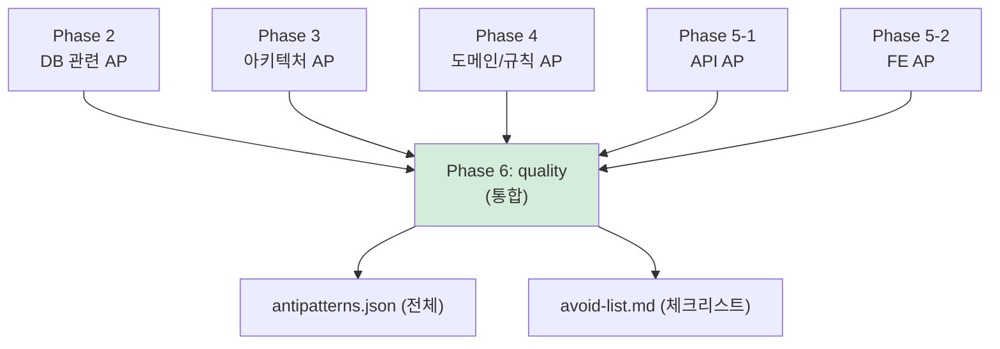
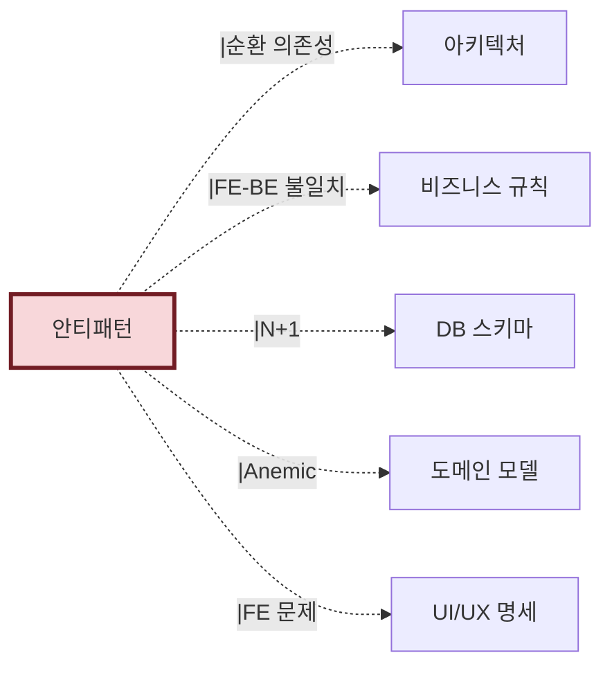

# 산출물 #6: 안티패턴 (Antipatterns)

> 본 문서는 안티패턴 산출물의 **표준 명세**다.
> 관련 schema: `schemas/antipatterns.schema.json`
> 관련 template: `templates/antipatterns.template.md`

---

## 1. 목적

**이 산출물이 답하는 질문**: "이 시스템에서 무엇을 피해야 하는가?"

**소비자**:
- 개발자 (재구현 시 같은 실수 방지)
- 아키텍트 (구조적 문제 파악)
- TF Lead (기술 부채 우선순위)
- AI 재구현 시 (회피 목록으로 코드 생성 제약)

---

## 2. 형식

### 2.1 파일 구성

```
output/antipatterns/
├── antipatterns.json               # AI용 (구조화)
├── avoid-list.md                   # 사람용 체크리스트
└── (선택) details/                 # 개별 안티패턴 상세
    └── AP-DB-N-PLUS-ONE-001.md
```

### 2.2 안티패턴 형식

```yaml
- id: AP-DB-N-PLUS-ONE-001
  category: DB
  name: "N+1 쿼리"
  severity: high
  
  description: "OrderService.getOrders()에서 주문 목록 조회 후 각 주문의 아이템을 개별 쿼리로 가져옴"
  
  location:
    file: src/main/java/com/example/order/OrderService.java
    line: 45
  
  evidence: "ORM lazy loading + 루프 내 접근"
  detection_method: pattern_matching  # deterministic | pattern_matching | llm_inference
  
  recommendation: "fetch join 또는 @EntityGraph 적용"
  related_rules: []
  related_entities: [E-ORDER-Order, E-ORDER-OrderItem]
  
  confidence: 0.90
```

---

## 3. 추출 범위

### 3.1 카테고리별 추출 대상

| 카테고리 | 안티패턴 예시 | 감지 방법 | 신뢰도 |
|---|---|---|---|
| **DB** | N+1 쿼리, SQL에 비즈니스 로직 박힘 | 패턴 매칭 | 0.85~0.98 |
| **ARCH** | 순환 의존성, God Class, 레이어 위반 | AST 분석 | 0.98 |
| **DOMAIN** | Anemic Domain Model, Entity에 UI 로직 | LLM 추론 | 0.70 |
| **API** | REST 원칙 위반, 일관성 없는 응답 | 패턴 매칭 + LLM | 0.80 |
| **FE** | 인라인 스타일 난무, 컴포넌트 분류 부재 | 패턴 매칭 | 0.85 |
| **VALIDATION** | FE-BE 검증 불일치, 중복 검증 | 교차 분석 | 0.75 |
| **CONFIG** | 매직 넘버, 환경별 정책 분산 | 설정 파일 추출 | 0.80 |

### 3.2 미추출 (의도적)

- 성능 안티패턴 (측정 필요) → NFR 영역
- 보안 취약점 → SAST 도구 영역
- 테스트 코드 안티패턴 → v1.2 이후

---

## 4. 수집 흐름 — Phase 6에서 통합



> 안티패턴은 **각 Phase에서 발견 → Phase 6에서 통합**. Phase 6 이전에도 부분 산출물로 존재.

---

## 5. 신뢰도 기준

| 감지 방법 | 신뢰도 | 비고 |
|---|---|---|
| 정적 분석 (AST) | 0.98 | 순환 의존성, God Class |
| 패턴 매칭 | 0.85~0.90 | N+1, 인라인 스타일 |
| 교차 분석 | 0.75~0.85 | FE-BE 불일치 |
| LLM 추론 | 0.60~0.70 | Anemic Domain, 의도 추론 |

**톤**: 안티패턴은 "오류"가 아니라 **"회피 후보"**. 시니어 채택 저항 완화를 위해 단정적 표현 지양.

---

## 6. 검증 체크리스트

```
□ antipatterns.json schema 검증 통과
□ 모든 AP에 ID 표준 (AP-{카테고리}-{이름}-{번호}) 적용
□ severity (high/medium/low) 부여
□ 감지 방법 명시 (detection_method)
□ recommendation 필수 기재
□ confidence < 0.70이면 human_review_required 표기
□ 다른 산출물에서 발견된 AP가 모두 통합됨 (Phase 6)
```

---

## 7. 산출물 간 참조



---

## 8. 흔한 함정

### 8.1 단정적 표현
- 증상: "이건 잘못됐다" → 시니어 반발
- 대응: "회피 후보: ~하면 ~위험이 있음" 톤

### 8.2 false positive
- 증상: 의도적 설계를 안티패턴으로 오탐
- 대응: confidence 표기 + 사용자 검토 게이트

### 8.3 Phase 6 통합 누락
- 증상: Phase 2에서 발견한 AP가 최종 목록에 빠짐
- 대응: 각 Phase 산출물에 AP 섹션 → Phase 6에서 전수 수거
