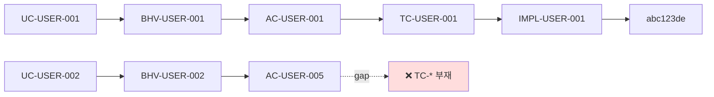

# 산출물 #22: Traceability Matrix (★ v2.0 cross-cutting)

> **사상**: ADR-CHAIN-001 §4 (매 gate 갱신 의무) / DO-178C bidirectional traceability + IEC 62304 (★ 산업 권위 — Official research) / ADR-008 v2 §10 (matrix.json + matrix.md + matrix.mermaid 이중 렌더링)
> **schema**: `schemas/traceability-matrix.schema.json`
> **생성 phase**: cross-cutting — `/_base-build-traceability-matrix` (skill / sub-plan-4 / `skills/_base/`)
> **gate**: 매 gate #1~#5 prerequisite

## 1. 목적

**답하는 질문**: "UC → BHV → AC → TASK → TC → IMPL + commit_hash chain end-to-end 추적성은?" (★ v10.0.0 TASK layer)

**활용**: 사용자 검토 / 감사 / 산업 표준 (DO-178C / IEC 62304) 정합 입증.

매 chain stage gate 종결 시 갱신 의무 (chain 1~5 모두).

## 2. 형식

```
.aimd/output/_traceability/
├── matrix.json       # ★ AI 눈 (단일 진실)
├── matrix.md         # ★ 사람 눈 (표 형식)
└── matrix.mermaid    # ★ graph view (≥ 100 cell 분할 정책 = sub-plan-3 carry sp2-c4)
```

## 3. 추출 범위

| 항목 | 출처 | 도구 | 신뢰도 |
|---|---|---|---|
| matrix cells | 4 chain 산출물 | 결정적 | 100% |
| use_case_id / behavior_id / acceptance_id / test_id / impl_id | 4 chain forward+backward link | 결정적 | 100% |
| impl_commit_hash | git rev-parse | 결정적 | 100% |
| status (green/yellow/red) | gap detect 결과 | 결정적 | 100% |
| severity (critical/high/medium/low) | acceptance-criteria.severity | 결정적 | 100% |
| coverage_summary (forward/backward) | matrix scan | 결정적 | 100% |

**입력**: discovery-spec.json + behavior-spec.json + acceptance-criteria.json + test-spec.json + impl-spec.json.

## 4. 검증 도구

| 도구 | 검증 |
|---|---|
| **traceability-matrix-builder** (★ sub-plan-3 신설) | matrix.json + matrix.md + matrix.mermaid 동시 산출 |
| chain-coverage-validator | forward+backward coverage ≥ 0.85 (★ ADR-010 v2 §2.6 ratchet) |
| schema-validator | severity_floor (critical=1.0 const) |

## 5. 예시 (matrix cells)

```yaml
matrix:
  - use_case_id: UC-USER-001
    behavior_id: BHV-USER-001
    acceptance_id: AC-USER-001
    test_id: TC-USER-001
    impl_id: IMPL-USER-001
    impl_commit_hash: "abc123def4567890abc123def4567890abc12345"
    status: green
    severity: must
  - use_case_id: UC-USER-002
    behavior_id: BHV-USER-002
    acceptance_id: AC-USER-005
    test_id: ~   # gap
    impl_id: ~
    status: red
    severity: must
    gaps: ["TC-* 부재 / chain-coverage-validator violation"]

coverage_summary:
  forward_coverage: 0.92
  backward_coverage: 0.88
  threshold: 0.85
  severity_floor:
    critical: 1.0
    high: 0.95
    medium: 0.90
    low: 0.85
  green_count: 18
  yellow_count: 3
  red_count: 1
```

## 6. 사람 눈 (matrix.md 발췌)

```markdown
| UC-* | BHV-* | AC-* | TC-* | IMPL-* | commit | status | severity |
|---|---|---|---|---|---|---|---|
| UC-USER-001 | BHV-USER-001 | AC-USER-001 | TC-USER-001 | IMPL-USER-001 | abc123de | 🟢 green | must |
| UC-USER-002 | BHV-USER-002 | AC-USER-005 | — | — | — | 🔴 red | must |
```

## 7. mermaid graph view



## 8. carry

| # | 항목 | 시점 |
|---|---|---|
| sp2-c4 | matrix mermaid ≥ 100 cell 시 분할 정책 | sub-plan-3 |
| sp2-c3 | impl-spec binary artifact 보존 정책 | sub-plan-5 (PoC #05) |

## 9. 산업 권위 (★ Official research)

- **DO-178C** (avionics) — bidirectional traceability 의무 (System Req ↔ HLR ↔ LLR ↔ Source ↔ Test 5 layer)
- **IEC 62304** (의료기기 SW) — class C (life-threatening) 100% coverage
- **ISO/IEC 25010:2023** — Functional Correctness sub-characteristic 매핑

본 산출물 = 산업 권위 표준 차용 / 본 방법론 첫 정식 도입 (ADR-CHAIN-001 §4).
