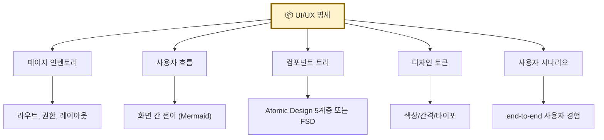
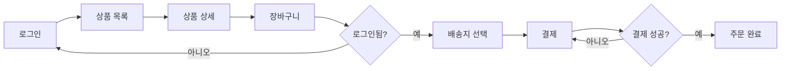
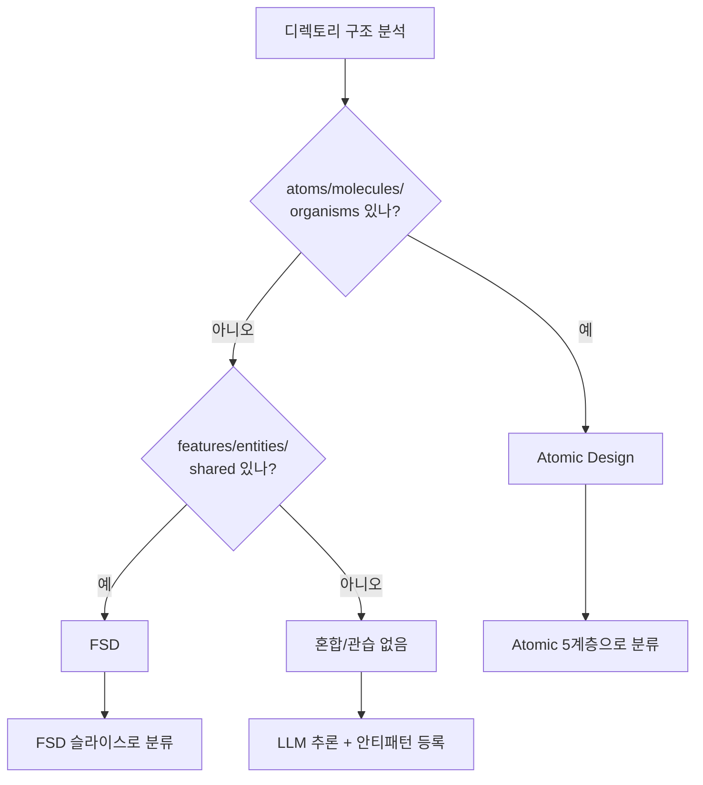
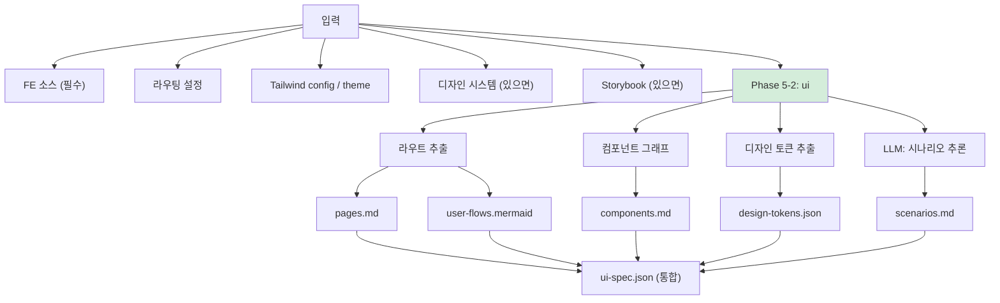
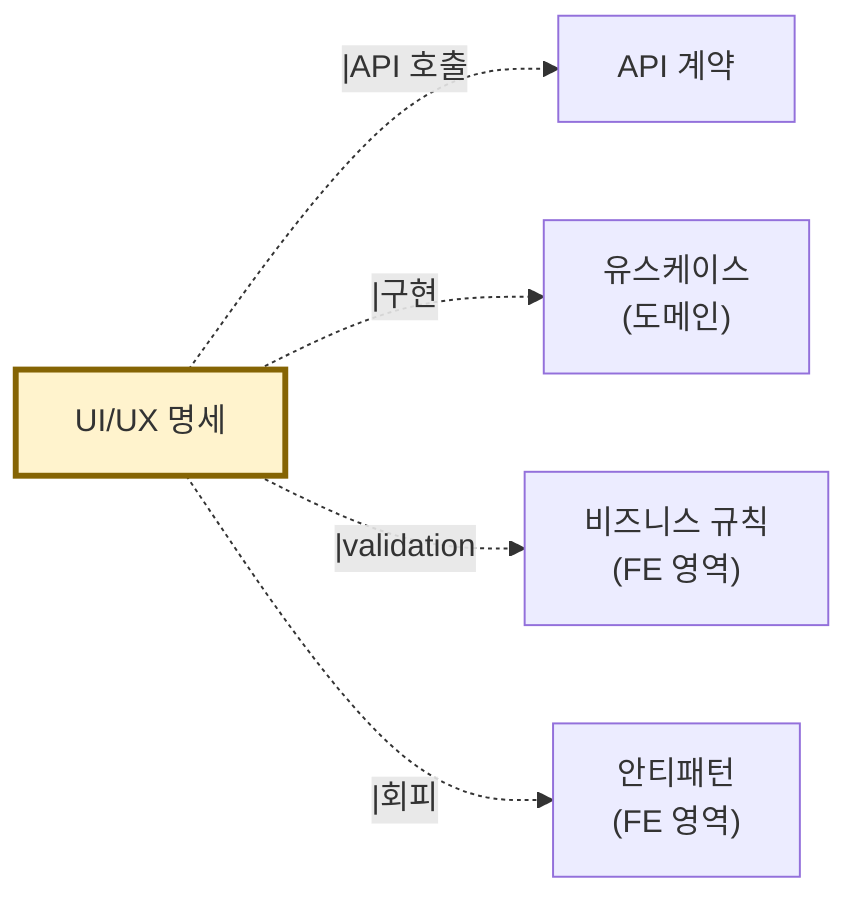

# 산출물 #7: UI/UX 명세 (UI/UX Specification)

> 본 문서는 UI/UX 명세 산출물의 **표준 명세**다.
> 사상: FSD + Atomic Design (ADR-001 §FE) + ★ ADR-FE-001 (FE 추출기 가정 — Tier 1~4 spectrum)
> 관련 schema: `schemas/ui-spec.schema.json`
> ⭐ v1.1 신설 산출물 (ADR-002 참조) / ★ v1.4 Stage 3-1 보강 (legacy Tier 1~4 / DTCG 2025.10 / deliverable 8/9 분담)

---

## 1. 목적

**이 산출물이 답하는 질문**: "어떤 화면들이 있으며, 어떻게 흐르는가?"

**소비자**:
- FE 개발자 (재구현 시 1차 입력)
- 기획자/PM (화면 인벤토리)
- 디자이너 (디자인 시스템 토큰)
- AI 재구현 시 (FE 컴포넌트 자동 생성, 라우팅 설정)

### 1.1 ★ deliverable 8 / 9 와의 분담 (v1.4 Stage 3-1)

| 산출물 | 영역 |
|---|---|
| **#7 ui-spec** (본 문서) | pages / components / design-tokens / scenarios / user-flows (정적 구조) |
| **#8 state-map** | 분산 상태 5 진실 + state machine (동적 행동) |
| **#9 visual-manifest** | snapshot PNG (시각 진실) — ★ binary 진실 모델 |

→ 3 산출물이 짝. ADR-FE-002 §2.2 매트릭스 정합. 본 산출물은 정적 구조만 담당.

---

## 2. 형식

### 2.1 파일 구성

```
output/ui/
├── ui-spec.json             # AI용 (통합)
├── pages.md                 # 페이지 인벤토리
├── user-flows.mermaid       # 사용자 흐름 다이어그램
├── components.md            # 컴포넌트 트리
├── design-tokens.json       # 디자인 토큰
└── scenarios.md             # 사용자 시나리오
```

### 2.2 5개 하위 항목



---

## 3. 추출 범위

### 3.1 추출 대상

| 항목 | 출처 | 결정적/LLM |
|---|---|---|
| 페이지 인벤토리 | React Router, Next.js routes, Vue Router 등 | 결정적 |
| 페이지 권한 | 라우팅 가드 + `@PreAuthorize` 추론 | 결정적 + LLM |
| 사용자 흐름 | navigate() 호출 + Link 컴포넌트 | 결정적 + LLM (조건부 분기) |
| 컴포넌트 트리 | JSX import 그래프 | 결정적 |
| Atomic 분류 | 디렉토리 구조 + 컴포넌트명 | LLM 추론 |
| FSD 슬라이스 | Feature/Entity/Shared 디렉토리 | 결정적 |
| 디자인 토큰 | Tailwind config, CSS variables, theme.ts | 결정적 |
| 사용자 시나리오 | 페이지 흐름 + 인증 + API 호출 패턴 | LLM 추론 |

### 3.1.1 ★ framework 감지 enum (v1.4 Stage 3-1)

`ui-spec.schema.json` `framework` enum = **13 종 + unknown** (★ ADR-FE-001 spectrum Tier 1~4 정합):

| Tier | enum 값 | 채택 근거 |
|---|---|---|
| Tier 1 (Modern SPA) | `react`, `vue`, `angular`, `svelte`, `solid`, `qwik`, `astro`, `next`, `nuxt`, `remix` | ADR-001 §FSD + Stage 1 research-industry §3 |
| Tier 2 (jQuery legacy) | `jquery_legacy` | 사용자 진단 직접 대응 |
| Tier 3 (Vanilla JS) | `vanilla_js` | spectrum cover |
| Tier 4 (server-side template) | `jsp_template` | ★ Stage 6 ADR-FE-004 BE/FE 분리 예외 |

→ Native (React Native / Flutter) = v1.5 이연 (ADR-FE-001 §2.1 명제 2).

### 3.2 미추출 (의도적)

- 실제 화면 캡처/디자인 (Figma 영역)
- 사용자 행동 분석 (애널리틱스 영역)
- A/B 테스트 변형 (Feature Flag와 일부 중복, 5.C에서 처리)

---

## 4. 페이지 인벤토리 형식

```yaml
- id: PAGE-ORDER-001
  name: "주문 목록"
  route: /orders
  layout: MainLayout
  auth_required: true
  roles: [USER, ADMIN]
  
  related_apis: [getOrders]
  related_use_cases: [UC-ORDER-LIST]
  related_components: [OrderListPage, OrderCard]
  
  source: src/pages/orders/index.tsx
  confidence: 0.95
```

---

## 5. 사용자 흐름 형식 (Mermaid flowchart)



---

## 6. 컴포넌트 트리 — Atomic Design vs FSD

### 6.1 Atomic Design (전통)

```
Atoms       Button, Input, Icon
Molecules   SearchBar, Card, FormField
Organisms   Header, ProductList, CheckoutForm
Templates   MainTemplate, AuthTemplate
Pages       HomePage, OrderListPage
```

### 6.2 FSD (Feature-Sliced Design)

```
app/        앱 진입점
processes/  복잡한 비즈니스 흐름
pages/      라우팅 단위
widgets/    재사용 큰 단위
features/   기능 단위
entities/   비즈니스 엔티티 단위 UI
shared/     공유 (UI Kit, Lib, API)
```

### 6.3 자동 감지



### 6.4 ★ legacy fallback Tier 1~4 (v1.4 Stage 3-1)

ADR-FE-001 spectrum 정합. Tier 별 컴포넌트 분류 fallback:

| Tier | 분류 방식 | level enum | 신뢰도 |
|---|---|---|---|
| Tier 1 (Modern SPA) | Atomic Design or FSD (위 §6.3) | `atom` ~ `widget` | 0.85~0.95 |
| Tier 2 (jQuery legacy) | jQuery selector + plugin 단위 추론 | `legacy_widget` | 0.55~0.65 |
| Tier 3 (Vanilla JS) | 모듈 패턴 + IIFE 단위 | `legacy_widget` 또는 `legacy_template` | 0.50~0.60 |
| Tier 4 (JSP / Thymeleaf) | template fragment + include 그래프 | `legacy_template` | 0.50~0.55 |

**Tier 별 추출 가능성** (ADR-FE-001 §3.1 매트릭스):
- Tier 1 → 7대 산출물 7/7 (full)
- Tier 2 → 5/7 (state-map / visual-manifest 부분)
- Tier 3 → 4/7 (LLM 추론 의존도 ↑)
- Tier 4 → 3/7 + ★ Stage 6 ADR-FE-004 BE/FE 분리 예외

---

## 7. 디자인 토큰 형식

### 7.1 ★ DTCG Design Tokens Format Module 2025.10 (v1.4 Stage 3-1)

- **spec URL** (★ 고정): https://www.designtokens.org/TR/2025.10/format/
- **status**: Final Community Group Report (★ W3C Standard ❌ — ADR-FE-005 §2.2.1 명시 의무)
- **publication**: 2025-10-28
- **필드**: `$value` (required) / `$type` (optional) / `$description` (optional)

```yaml
# DTCG 2025.10 정합 — $type/$value 명시 권장
color:
  primary:
    $value: "#0066FF"
    $type: color
    $description: "메인 브랜드 색상"
  danger:
    $value: "#FF0033"
    $type: color

spacing:
  sm:
    $value: "8px"
    $type: dimension
  md:
    $value: "16px"
    $type: dimension

typography:
  heading-1:
    $value:
      fontSize: "32px"
      fontWeight: 700
    $type: typography
```

### 7.2 ui-spec.schema.json `design_tokens` 필드 의무

```yaml
design_tokens:
  spec_source: "https://www.designtokens.org/TR/2025.10/format/"   # ★ URL 고정
  spec_status: "community_group_report"                            # ★ Standard ❌ 명시
  uses_dtcg_field_names: true                                       # $value / $type / $description 사용 여부
  extracted_from: [tailwind_config, dtcg_format_module, css_variables]
  colors: { ... }
  spacing: { ... }
  typography: { ... }
  consistency_score: 0.85
```

→ ADR-FE-005 §2.2.1 정합 의무.

---

## 8. 사용자 시나리오 형식

```yaml
- id: SCN-ORDER-001
  name: "신규 사용자 첫 주문"
  actor: "비로그인 사용자"
  steps:
    - 상품 목록 진입 (PAGE-PRODUCT-LIST)
    - 상품 상세 클릭 (PAGE-PRODUCT-DETAIL)
    - 장바구니 추가 → 토스트 안내
    - 장바구니 진입 → 로그인 유도 모달
    - 로그인/회원가입 (PAGE-AUTH)
    - 회원가입 완료 후 장바구니로 자동 복귀
    - 주문 진행 (PAGE-CHECKOUT)
  
  related_use_cases: [UC-ORDER-CREATE, UC-USER-SIGNUP]
  related_pages: [PAGE-PRODUCT-LIST, PAGE-PRODUCT-DETAIL, PAGE-CART, PAGE-AUTH, PAGE-CHECKOUT]
  related_apis: [createUser, login, addToCart, createOrder]
```

**핵심**: 유스케이스(UC)는 시스템 행동, 시나리오(SCN)는 사용자 경험. 둘은 다름.

---

## 9. 추출 흐름



---

## 10. 신뢰도 기준 (R8 — plan.md §12 + ★ ADR-009 §2.4 정합)

| 영역 | 단계 1 (raw) | 단계 3 (drift-validator) | 단계 5 (진짜 도구) |
|---|---|---|---|
| 페이지 인벤토리 | 0.95 | 0.95 | 0.95 |
| 컴포넌트 트리 | 0.90 | 0.93 | 0.95 (Storybook CSF v3 실행 시) |
| 사용자 흐름 (단순) | 0.85 | 0.90 | 0.92 (Playwright E2E 실행 시) |
| 사용자 흐름 (조건부 분기) | 0.65 | 0.78 | 0.88 |
| 디자인 토큰 (좋은 케이스 / DTCG) | 0.90 | 0.93 | 0.95 (DTCG validator 진짜 실행 시) |
| 디자인 토큰 (나쁜 케이스 / 인라인) | 0.30 | 0.30 | 0.40 (★ AP-FE-* 안티패턴 등록) |
| 사용자 시나리오 | 0.60 | 0.65 | 0.75 (기획자 검토 통과) |

**평균** (단계 3): 약 80% (FE 코드 품질에 진폭). ★ ADR-009 §2.4.1 표 정합.

→ Tier 1 (Modern SPA) 기준. Tier 2~4 = 위 §6.4 fallback 표 정합.

---

## 11. 검증 체크리스트

```
□ schema 검증 통과
□ 모든 PAGE에 ID, route, auth, roles 명시
□ 사용자 흐름 Mermaid 렌더링
□ 컴포넌트 분류 방식 (Atomic / FSD) 명시
□ 디자인 토큰 명세 (없으면 안티패턴 등록)
□ 사용자 시나리오 = 기획자 검토 완료
□ 페이지 ↔ API ↔ UC 매핑 일관성
```

---

## 12. 산출물 간 참조



---

## 13. 흔한 함정

### 13.1 디자인 시스템 부재
- 증상: 인라인 스타일/매직 색상값 난무
- 대응: design-tokens.json 신뢰도↓ + AP-FE-XXX 등록

### 13.2 컴포넌트 분류 부재
- 증상: 모든 컴포넌트가 src/components/ 평면 배치
- 대응: LLM 추론으로 후보 분류 + AP 등록

### 13.3 라우팅 설정 분산
- 증상: 라우트가 여러 파일에 흩어짐
- 대응: 통합 추출 + AP 등록

### 13.4 시나리오 vs 유스케이스 혼동
- 증상: SCN과 UC를 같은 것으로 다룸
- 대응: 명세 §8 명확화 (시스템 행동 vs 사용자 경험)
