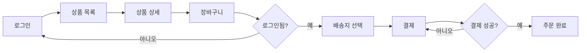

# 산출물 #7: UI/UX 명세 (UI/UX Specification)

> **사상**: FSD + Atomic Design (ADR-001 §FE) + legacy Tier 1~4 spectrum (ADR-FE-001) + DTCG 2025.10 토큰 (ADR-FE-005)
> **schema**: `schemas/ui-spec.schema.json`
> **생성 phase**: `ui` phase (`/analyze-ui`)

---

## 1. 목적

**답하는 질문**: "어떤 화면들이 있으며, 어떻게 흐르는가?"

**AI 재구현 시 활용**: FE 컴포넌트 자동 생성 / 라우팅 설정

### 1.1 deliverable 8 / 9 와의 분담

| 산출물                   | 영역                                                                    |
| ------------------------ | ----------------------------------------------------------------------- |
| **#7 ui-spec** (본 문서) | pages / components / design-tokens / scenarios / user-flows (정적 구조) |
| **#8 state-map**         | 분산 상태 5 진실 + state machine (동적 행동)                            |
| **#9 visual-manifest**   | snapshot PNG (시각 진실 — binary 진실 모델)                             |

→ 3 산출물이 짝. ADR-FE-002 §2.2 매트릭스 정합 + ADR-002 (책임 분담 원칙). 본 산출물은 정적 구조만 담당.

---

## 2. 형식

```
output/ui/
├── ui-spec.json             # json 단독 SSOT (pages / components / user-flows / scenarios 통합)
└── design-tokens.json       # 디자인 토큰 (DTCG)
```

**하위 항목** (ui-spec.json 내 구조화): pages / user-flows / components / design-tokens / scenarios

---

## 3. 추출 범위

### 3.1 추출 대상 (출처 / 방법 / 신뢰도)

| 항목                      | 출처                                                   | 방법         | 신뢰도 (Tier 1)      |
| ------------------------- | ------------------------------------------------------ | ------------ | -------------------- |
| 페이지 인벤토리           | React Router, Next.js routes, Vue Router 등            | 결정적       | 0.95                 |
| 페이지 권한               | 라우팅 가드 + `@PreAuthorize` 추론                     | 결정적 + LLM | 0.85                 |
| 사용자 흐름 (단순)        | navigate() 호출 + Link 컴포넌트                        | 결정적 + LLM | 0.85                 |
| 사용자 흐름 (조건부 분기) | 조건부 navigate                                        | LLM          | 0.65                 |
| 컴포넌트 트리             | JSX import 그래프                                      | 결정적       | 0.90                 |
| Atomic 분류               | 디렉토리 구조 + 컴포넌트명                             | LLM 추론     | 0.85                 |
| FSD 슬라이스              | Feature/Entity/Shared 디렉토리                         | 결정적       | 0.95                 |
| 디자인 토큰 (좋은 케이스) | Tailwind config, CSS variables, theme.ts, DTCG 2025.10 | 결정적       | 0.90                 |
| 디자인 토큰 (나쁜 케이스) | 인라인 스타일 산재                                     | LLM          | 0.30 (AP-FE-\* 등록) |
| 사용자 시나리오           | 페이지 흐름 + 인증 + API 호출 패턴                     | LLM 추론     | 0.60                 |

**입력**: FE 소스 + 라우팅 설정 + Tailwind config / theme + (선택) Storybook
**평균 신뢰도** (drift-validator 적용 후 / ADR-009 §2.4.1 정합): ~80% (FE 코드 품질에 진폭)

### 3.2 framework 감지 enum (Tier 1~4)

`ui-spec.schema.json` `framework` enum = **13 종 + unknown**:

| Tier                          | enum 값                                                                                | 비고                                   |
| ----------------------------- | -------------------------------------------------------------------------------------- | -------------------------------------- |
| Tier 1 (Modern SPA)           | `react`, `vue`, `angular`, `svelte`, `solid`, `qwik`, `astro`, `next`, `nuxt`, `remix` | 7대 산출물 7/7 추출 가능               |
| Tier 2 (jQuery legacy)        | `jquery_legacy`                                                                        | 5/7 (state-map / visual-manifest 부분) |
| Tier 3 (Vanilla JS)           | `vanilla_js`                                                                           | 4/7 (LLM 추론 의존도 ↑)                |
| Tier 4 (server-side template) | `jsp_template`                                                                         | 3/7 + ADR-FE-004 BE/FE 분리 예외       |

→ Native (React Native / Flutter) = v1.5 이연.

### 3.3 미추출 (의도적)

- 실제 화면 캡처/디자인 (Figma 영역) — #9 visual-manifest 가 부분 담당
- 사용자 행동 분석 (애널리틱스 영역)
- A/B 테스트 변형 (Feature Flag 와 일부 중복, 5.C 에서 처리)

---

## 4. 페이지 인벤토리 형식

```yaml
- id: PAGE-ORDER-001
  name: '주문 목록'
  route: /orders
  layout: MainLayout
  auth_required: true
  roles: [USER, ADMIN]

  related_apis: [getOrders]
  related_use_cases: [UC-ORDER-LIST]
  related_components: [OrderListPage, OrderCard]

  source: src/pages/orders/index.tsx
  confidence: 0.95
```

---

## 5. 사용자 흐름 형식 (ui-spec.json 에 구조화 / 아래는 view-time 시각화 예시)



---

## 6. 컴포넌트 트리 — Atomic Design vs FSD

### 6.1 Atomic Design (전통)

```
Atoms       Button, Input, Icon
Molecules   SearchBar, Card, FormField
Organisms   Header, ProductList, CheckoutForm
Templates   MainTemplate, AuthTemplate
Pages       HomePage, OrderListPage
```

### 6.2 FSD (Feature-Sliced Design)

```
app/        앱 진입점
processes/  복잡한 비즈니스 흐름
pages/      라우팅 단위
widgets/    재사용 큰 단위
features/   기능 단위
entities/   비즈니스 엔티티 단위 UI
shared/     공유 (UI Kit, Lib, API)
```

### 6.3 자동 감지

| 디렉토리 패턴                             | 분류                                      |
| ----------------------------------------- | ----------------------------------------- |
| `atoms/`, `molecules/`, `organisms/` 존재 | Atomic Design (5계층 분류)                |
| `features/`, `entities/`, `shared/` 존재  | FSD (슬라이스 분류)                       |
| 위 둘 다 부재                             | 혼합/관습 없음 → LLM 추론 + 안티패턴 등록 |

### 6.4 legacy fallback (Tier 1~4)

| Tier                     | 분류 방식                          | level enum                             | 신뢰도    |
| ------------------------ | ---------------------------------- | -------------------------------------- | --------- |
| Tier 1 (Modern SPA)      | Atomic Design or FSD (위 §6.3)     | `atom` ~ `widget`                      | 0.85~0.95 |
| Tier 2 (jQuery legacy)   | jQuery selector + plugin 단위 추론 | `legacy_widget`                        | 0.55~0.65 |
| Tier 3 (Vanilla JS)      | 모듈 패턴 + IIFE 단위              | `legacy_widget` 또는 `legacy_template` | 0.50~0.60 |
| Tier 4 (JSP / Thymeleaf) | template fragment + include 그래프 | `legacy_template`                      | 0.50~0.55 |

### 6.5 Screen+Journey 우선 / Component 분해 후순위 (ADR-FE-006 정합)

본 component-tree 산출물은 **L4 Presentation 보조 산출물** (ADR-FE-006 명제 2 / IR 4계층 매트릭스):

| 우선 단위                      | 비고                                                   |
| ------------------------------ | ------------------------------------------------------ |
| **Screen** (PAGE-XXX)          | framework-neutral / 신규 스택 즉시 활용 가능           |
| **Journey** (SCN-XXX)          | framework-neutral / 사용자 시나리오 즉시 활용          |
| **State machine** (FSM-FE-XXX) | SCXML+XState — framework-neutral                       |
| Component (CMP-XXX)            | **보조** — Atomic/FSD 분해는 framework-coupling 위험 ↑ |

**Component 분해 framework-coupling 위험**:

- Atomic Design (Brad Frost) — React/Vue/Angular 모두 적용 가능 / 단 atom/molecule 경계는 분해자 주관
- FSD (Feature-Sliced Design) — React 진영 산업 표준 / 다른 framework 정합도 ↓
- 사용자 사내 환경 (React+TS+TanStack) → 신규 스택 (Vue / Solid / Astro) 이식 시 component 재분해 의무

**권고**:

- ✅ Screen + Journey + state-map = **신규 시스템 즉시 활용** (framework-neutral)
- ⚠️ Component-tree = **참고용** / 신규 스택 정해진 후 그 스택의 관용구로 재분해 의무
- ✅ design-tokens (DTCG) = framework-neutral / 즉시 활용

→ ADR-FE-006 §2.2 IR 4계층 매트릭스 정합.

---

## 7. 디자인 토큰 형식 (DTCG 2025.10)

### 7.1 DTCG Design Tokens Format Module 2025.10

- **spec URL** (고정): https://www.designtokens.org/TR/2025.10/format/
- **status**: Final Community Group Report (W3C Standard ❌ — ADR-FE-005 §2.2.1 명시 의무)
- **publication**: 2025-10-28
- **필드**: `$value` (required) / `$type` (optional) / `$description` (optional)

```yaml
# DTCG 2025.10 정합 — $type/$value 명시 권장
color:
  primary:
    $value: '#0066FF'
    $type: color
    $description: '메인 브랜드 색상'
  danger:
    $value: '#FF0033'
    $type: color

spacing:
  sm:
    $value: '8px'
    $type: dimension
  md:
    $value: '16px'
    $type: dimension

typography:
  heading-1:
    $value:
      fontSize: '32px'
      fontWeight: 700
    $type: typography
```

### 7.2 ui-spec.schema.json `design_tokens` 필드 의무

```yaml
design_tokens:
  spec_source: 'https://www.designtokens.org/TR/2025.10/format/' # URL 고정
  spec_status: 'community_group_report' # Standard ❌ 명시
  uses_dtcg_field_names: true # $value / $type / $description 사용 여부
  extracted_from: [tailwind_config, dtcg_format_module, css_variables]
  colors: { ... }
  spacing: { ... }
  typography: { ... }
  consistency_score: 0.85
```

---

## 8. 사용자 시나리오 형식

```yaml
- id: SCN-ORDER-001
  name: '신규 사용자 첫 주문'
  actor: '비로그인 사용자'
  steps:
    - 상품 목록 진입 (PAGE-PRODUCT-LIST)
    - 상품 상세 클릭 (PAGE-PRODUCT-DETAIL)
    - 장바구니 추가 → 토스트 안내
    - 장바구니 진입 → 로그인 유도 모달
    - 로그인/회원가입 (PAGE-AUTH)
    - 회원가입 완료 후 장바구니로 자동 복귀
    - 주문 진행 (PAGE-CHECKOUT)

  related_use_cases: [UC-ORDER-CREATE, UC-USER-SIGNUP]
  related_pages:
    [
      PAGE-PRODUCT-LIST,
      PAGE-PRODUCT-DETAIL,
      PAGE-CART,
      PAGE-AUTH,
      PAGE-CHECKOUT,
    ]
  related_apis: [createUser, login, addToCart, createOrder]
```

**핵심**: UC = 시스템 행동 / SCN = 사용자 경험. 둘은 다름.

---

## 9. 검증 체크리스트

```
□ schema 검증 통과
□ 모든 PAGE 에 ID, route, auth, roles 명시
□ 사용자 흐름 ui-spec.json 에 구조화 (시각화는 view-time 도구)
□ 컴포넌트 분류 방식 (Atomic / FSD) 명시
□ 디자인 토큰 명세 (없으면 안티패턴 등록)
□ 사용자 시나리오 = 기획자 검토 완료
□ 페이지 ↔ API ↔ UC 매핑 일관성
```

---

## 10. 산출물 간 참조

| 방향                    | 의미            |
| ----------------------- | --------------- |
| UI → API                | API 호출        |
| UI → UC (DOM)           | 구현            |
| UI → RULES              | FE validation   |
| UI → AP                 | FE 안티패턴     |
| UI → #8 state-map       | page ↔ FSM 연결 |
| UI → #9 visual-manifest | page → snapshot |

---

## 11. 흔한 함정

### 11.1 디자인 시스템 부재

- 증상: 인라인 스타일/매직 색상값 난무
- 대응: design-tokens.json 신뢰도↓ + AP-FE-XXX 등록

### 11.2 컴포넌트 분류 부재

- 증상: 모든 컴포넌트가 src/components/ 평면 배치
- 대응: LLM 추론으로 후보 분류 + AP 등록

### 11.3 라우팅 설정 분산

- 증상: 라우트가 여러 파일에 흩어짐
- 대응: 통합 추출 + AP 등록

### 11.4 시나리오 vs 유스케이스 혼동

- 증상: SCN 과 UC 를 같은 것으로 다룸
- 대응: §8 명확화 (시스템 행동 vs 사용자 경험)
