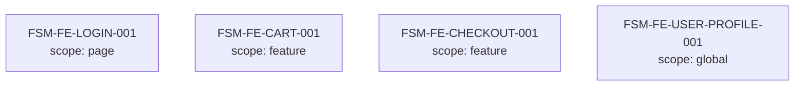
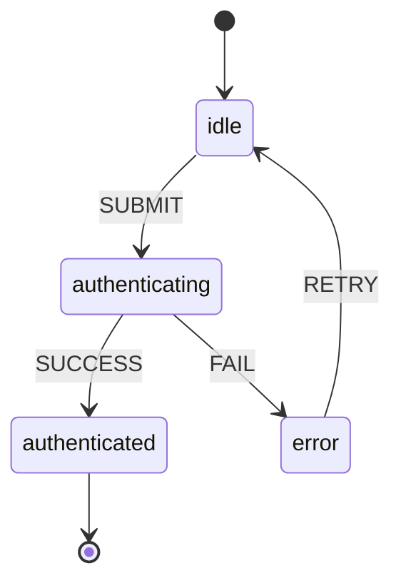

# 산출물 #8: State Map (분산 상태 5 진실)

> **사상**: 이중 렌더링 FE 적용 (ADR-FE-002) + W3C SCXML 1.0 + XState v5+ 호환 (ADR-FE-005)
> **schema**: `schemas/state-map.schema.json`
> **생성 phase**: `ui` phase 5-2-b (`/analyze-state`)

---

## 1. 목적

**답하는 질문**: "FE 의 비즈니스 로직 = 어디에 어떻게 분산되어 있는가?"

**AI 재구현 시 활용**: XState v5+ machine config 직접 변환 / FE 가 어떤 BE state 를 cache 하는지 정합 검증

### 1.1 deliverable 7 / 9 와의 분담

| 산출물 | 영역 |
|---|---|
| **#7 ui-spec** | pages / components / design-tokens / scenarios / user-flows (정적 구조) |
| **#8 state-map** (본 문서) | 분산 상태 5 진실 + state machine (동적 행동) |
| **#9 visual-manifest** | snapshot PNG (시각 진실) |

---

## 2. 형식

```
output/state-map/
├── state-map.json              # AI 눈 (SCXML 1.0 + XState v5+ 호환)
├── state-map.mermaid           # 사람 눈 (overview)
├── per-machine/
│   ├── FSM-FE-LOGIN-001.mermaid
│   ├── FSM-FE-CART-001.mermaid
│   └── ...
└── _manifest.yml               # trust_level + validation_history
```

### 2.1 5 진실 분류 (★ 핵심)

| 진실 | 흔한 라이브러리 | 흔한 안티패턴 |
|---|---|---|
| 1. server cache | TanStack Query, SWR, Apollo Cache, RTK Query | local state 에 fetch 결과 복사 (★ stale cache) |
| 2. client state | Zustand, Redux, Jotai, Recoil, MobX | 모든 데이터 global store 에 (★ over-globalization) |
| 3. URL state | React Router, Next.js, TanStack Router | URL 진실 무시 (★ 새로고침 시 상태 손실) |
| 4. form state | React Hook Form, Formik, native form | client state 에 form 값 직접 (★ re-render 폭발) |
| 5. DOM state | useRef, refs API | controlled input 으로 DOM 진실 무시 |

**모든 5 진실의 detected 여부 명시 의무** (`state_sources` 배열 minItems=5/maxItems=5).
→ 진실 별 안티패턴 = AP-FE-XXX 등록 (Phase 6).

---

## 3. 추출 범위

### 3.1 추출 대상 (출처 / 방법 / 신뢰도 / 의존)

| 항목 | 출처 | 방법 | 신뢰도 (단계 1 / 3 / 5) | 선행 의존 |
|---|---|---|---|---|
| state_sources (5 진실) | 라이브러리 import 그래프 | 결정적 | 0.85 / 0.90 / 0.95 | — |
| machines (FSM) | useReducer / Zustand store / Redux slice / XState | 결정적 + LLM | 0.70 / 0.80 / 0.90 | state_sources |
| transitions | dispatch / setState / mutate 호출 추적 | 결정적 + LLM | 0.65 / 0.78 / 0.88 | machines |
| guards | if 조건 / 검증 함수 | LLM 추론 | 0.50 / 0.65 / 0.85 (XState type-check 통과 시) | transitions |
| parallel regions | 동시 active region 감지 | LLM 추론 | 0.40 / 0.55 / 0.80 | machines |
| history nodes | route restore / modal 복원 | LLM 추론 | 0.40 / 0.55 / 0.80 | machines |
| cross_links | `api` phase + `business-logic` phase (rules) + `ui` phase 5-2-a (ui-spec) | 결정적 + LLM | 0.75 / 0.85 / 0.90 | machines |

**입력**: FE 소스
**평균 신뢰도** (단계 3 / ADR-009 §2.4.1 정합): ~78% (drift-validator FE 적용 시)
**단계**: 1=raw / 3=drift-validator / 5=XState SCXML 진짜 import

### 3.2 미추출 (의도적)

- 실시간 데이터 흐름 (WebSocket / SSE) — Stage 5+ 검토
- service worker / push notification — Stage 5+ 검토
- 운영 NFR (state transition latency) — ADR-001 명시적 제외

---

## 4. SCXML + XState 호환 (★ 권위 매개체)

- **W3C SCXML 1.0** (REC 2015-09-01): https://www.w3.org/TR/scxml/
  - state element: `<state>` / `<parallel>` / `<final>` / `<history>` 모두 지원
- **XState v5+** SCXML XML 직접 import 지원
- 본 산출물의 `state-map.json` → SCXML XML 변환 시 XState machine 재생성 가능

```yaml
state_machines:
  - id: FSM-FE-LOGIN-001
    scxml_compliant: true
    xstate_compatible: true
    rendered_mermaid_path: per-machine/FSM-FE-LOGIN-001.mermaid

# Stage 5+ 검증 (★ 단계 5 진짜 도구)
# scxml_export_validated: true
# scxml_export_artifact_path: output/state-map/scxml/FSM-FE-LOGIN-001.scxml
```

---

## 5. 다이어그램 형식 (이중 렌더링 정합)

### 5.1 overview (state-map.mermaid)



### 5.2 per-machine (FSM-FE-XXX-NNN.mermaid)



→ drift-validator FE 적용 대상 (state-map.json ↔ state-map.mermaid 의미 동일성).

---

## 6. cross-link (`formal-spec` phase 패턴)

`cross_links[]` 배열 의무 (api / ui-spec / rules 중 1개 이상):

```yaml
cross_links:
  - from_machine: FSM-FE-LOGIN-001
    to_artifact: api
    to_id: postLogin           # OpenAPI operationId
    link_type: triggers
  - from_machine: FSM-FE-LOGIN-001
    to_artifact: ui-spec
    to_id: PAGE-LOGIN-001
    link_type: implements
  - from_machine: FSM-FE-LOGIN-001
    to_artifact: rules
    to_id: BR-AUTH-001
    link_type: validates
```

---

## 7. 검증 체크리스트

```
□ schema 검증 (state-map.schema.json) 통과
□ state_sources 5 항목 (server/client/URL/form/DOM) 모두 detected 명시
□ 모든 machine 에 ID, scope, initial, states 명시
□ rendered_mermaid_path 경로 존재 (이중 렌더링 정합)
□ drift-validator FE 통과 (state-map.json ↔ .mermaid 의미 동일성)
□ cross_links 의무 (api / ui-spec / rules 중 1개 이상)
□ scxml_compliant=true 머신 → SCXML XML 변환 가능 (Stage 5+ 검증)
□ trust_step 명시 (1~8)
□ primary_source_type=mixed 머신 → finding 등록 (분산 위험)
```

---

## 8. 산출물 간 참조

| 방향 | 의미 |
|---|---|
| SM → UI | implements UC |
| SM → API | triggers operationId |
| SM → RULES | validates BR |
| SM → AP | 회피 (5 진실 안티패턴) |

→ ADR-008 (이중 렌더링 사상) + ADR-FE-002 정합.

---

## 9. 흔한 함정

### 9.1 race condition (server cache ↔ client state)
- 증상: TanStack Query cache 와 Zustand mirror state 가 어긋남
- 대응: server cache 가 진실 / client state 는 derived 만 / mirror 금지

### 9.2 stale cache
- 증상: refetch 안 한 server cache 가 outdated
- 대응: invalidation 정책 (mutation 후 invalidateQueries) 명시

### 9.3 split brain (URL state ↔ form state)
- 증상: 새로고침 시 form 값이 URL 과 어긋남
- 대응: URL 진실 우선 / form 은 URL 에서 hydrate

### 9.4 over-globalization
- 증상: 모든 데이터를 Redux/Zustand 에 put → re-render 폭발
- 대응: scope 최소화 (component < feature < global 순)

### 9.5 controlled input 으로 DOM 진실 무시
- 증상: focus / scroll 위치 손실
- 대응: useRef 로 DOM 진실 보존
