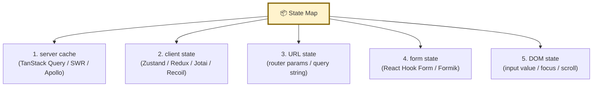
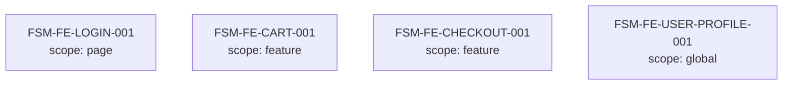
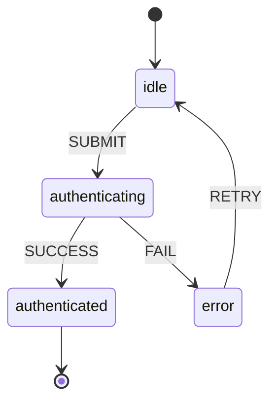
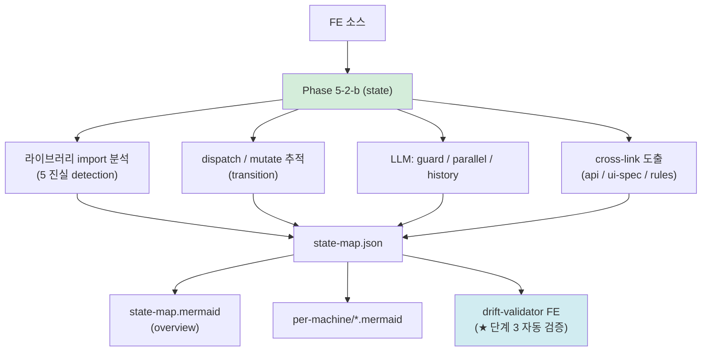
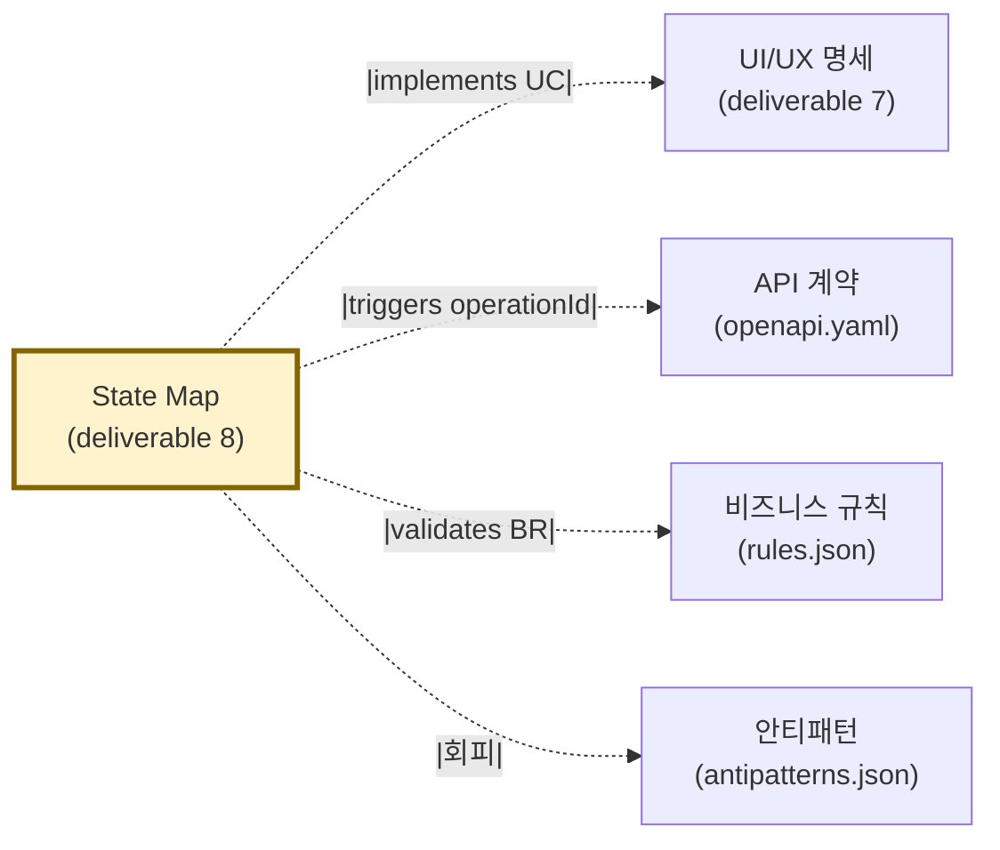

# 산출물 #8: State Map (분산 상태 5 진실)

> 본 문서는 State Map 산출물의 **표준 명세**다.
> 사상: ADR-FE-002 (이중 렌더링 FE 적용) + ADR-FE-005 (권위 매개체 12 — W3C SCXML 1.0 + XState v5+ 호환)
> 관련 schema: `schemas/state-map.schema.json`
> ⭐ v1.4 신설 산출물 (ADR-FE-001 / ADR-FE-002 / DEC-2026-05-01-v1.4-Stage-2-Gate-결단 G1-3)

---

## 1. 목적

**이 산출물이 답하는 질문**: "FE 의 비즈니스 로직 = 어디에 어떻게 분산되어 있는가?"

**소비자**:
- FE 개발자 (재구현 시 1차 입력 — state machine 직접 import)
- BE 개발자 (FE 가 어떤 BE state 를 cache 하는지 정합 검증)
- AI 재구현 시 (XState v5+ machine config 직접 변환)
- 사용자 (요구 4 — "비즈니스 로직 동일" 정면 해소)

### 1.1 deliverable 7 / 9 와의 분담

| 산출물 | 영역 |
|---|---|
| **#7 ui-spec** | pages / components / design-tokens / scenarios / user-flows (정적 구조) |
| **★ #8 state-map** (본 문서) | 분산 상태 5 진실 + state machine (동적 행동) |
| **#9 visual-manifest** | snapshot PNG (시각 진실) |

→ 3 산출물이 짝. ADR-FE-002 §2.2 매트릭스 정합.

---

## 2. 형식

### 2.1 파일 구성

```
output/state-map/
├── state-map.json              # AI 눈 (SCXML 1.0 + XState v5+ 호환)
├── state-map.mermaid           # 사람 눈 (overview)
├── per-machine/
│   ├── FSM-FE-LOGIN-001.mermaid
│   ├── FSM-FE-CART-001.mermaid
│   └── ...
└── _manifest.yml               # trust_level + validation_history
```

### 2.2 5 진실 분류 (★ 핵심)



**모든 5 진실의 detected 여부 명시 의무** (state-map.schema.json `state_sources` 배열 minItems=5/maxItems=5).

---

## 3. 추출 범위

### 3.1 추출 대상

| 항목 | 출처 | 결정적/LLM |
|---|---|---|
| state_sources (5 진실) | 라이브러리 import 그래프 | 결정적 |
| machines (FSM) | useReducer / Zustand store / Redux slice / XState | 결정적 + LLM (state 추론) |
| transitions (transition) | dispatch / setState / mutate 호출 추적 | 결정적 + LLM |
| guards | if 조건 / 검증 함수 | LLM 추론 |
| parallel regions | 동시 active region 감지 | LLM 추론 |
| history nodes | route restore / modal 복원 | LLM 추론 |
| cross_links | Phase 5-1 (api) + 4 (rules) + 5-2-a (ui-spec) | 결정적 + LLM |

### 3.2 미추출 (의도적)

- 실시간 데이터 흐름 (WebSocket / SSE 영역) — Stage 5+ 검토
- service worker / push notification — Stage 5+ 검토
- 운영 NFR (state transition latency) — ADR-001 §명시적 제외

---

## 4. 5 진실 분산 분류 — 흔한 패턴

| 진실 | 흔한 라이브러리 | 흔한 안티패턴 |
|---|---|---|
| server cache | TanStack Query, SWR, Apollo Cache, RTK Query | local state 에 fetch 결과 복사 (★ stale cache) |
| client state | Zustand, Redux, Jotai, Recoil, MobX | 모든 데이터를 global store 에 (★ over-globalization) |
| URL state | React Router, Next.js, TanStack Router | URL 진실 무시 (★ 새로고침 시 상태 손실) |
| form state | React Hook Form, Formik, native form | client state 에 form 값 직접 (★ re-render 폭발) |
| DOM state | useRef, refs API | controlled input 으로 DOM 진실 무시 |

→ 진실 별 안티패턴 = `antipatterns.json` AP-FE-XXX 등록 (Phase 6 + Stage 3-2).

---

## 5. SCXML 호환 + XState 호환 (★ 권위 매개체)

### 5.1 W3C SCXML 1.0 (REC 2015-09-01)

- spec URL: https://www.w3.org/TR/scxml/
- 채택 근거: ADR-FE-005 §2 / Stage 1 research × 3 합의
- state element: `<state>` / `<parallel>` / `<final>` / `<history>` 모두 지원

### 5.2 XState v5+ SCXML import

XState v5+ 는 SCXML XML 직접 import. 본 산출물의 `state-map.json` → SCXML XML 변환 시 XState machine 재생성 가능.

```yaml
# state-map.json → SCXML 변환 → XState
state_machines:
  - id: FSM-FE-LOGIN-001
    scxml_compliant: true
    xstate_compatible: true
    rendered_mermaid_path: per-machine/FSM-FE-LOGIN-001.mermaid

# Stage 5+ 검증 (★ 단계 5 진짜 도구)
# scxml_export_validated: true
# scxml_export_artifact_path: output/state-map/scxml/FSM-FE-LOGIN-001.scxml
```

→ Stage 4 mini-PoC + Stage 5 본격 PoC 에서 진짜 변환 검증.

---

## 6. 다이어그램 형식 (★ 이중 렌더링 정합)

### 6.1 overview (state-map.mermaid)



### 6.2 per-machine (FSM-FE-XXX-NNN.mermaid)



→ drift-validator FE 적용 대상 (state-map.json ↔ state-map.mermaid 의미 동일성).

---

## 7. cross-link (Phase 4.5 패턴)

`state-map.json` `cross_links[]` 배열 의무:

```yaml
cross_links:
  - from_machine: FSM-FE-LOGIN-001
    to_artifact: api
    to_id: postLogin           # OpenAPI operationId
    link_type: triggers
  - from_machine: FSM-FE-LOGIN-001
    to_artifact: ui-spec
    to_id: PAGE-LOGIN-001
    link_type: implements
  - from_machine: FSM-FE-LOGIN-001
    to_artifact: rules
    to_id: BR-AUTH-001
    link_type: validates
```

→ Phase 4.5 cross-link 의무화 패턴 (BE 와 동일).

---

## 8. 추출 흐름



---

## 9. 신뢰도 (★ ADR-009 §2.4.1 정합)

| 영역 | 단계 1 | 단계 3 (drift) | 단계 5 (XState 진짜 import) |
|---|---|---|---|
| state_sources detection | 0.85 | 0.90 | 0.95 |
| machine.states | 0.70 | 0.80 | 0.90 |
| transitions | 0.65 | 0.78 | 0.88 |
| guards (LLM) | 0.50 | 0.65 | 0.85 (XState type-check 통과 시) |
| parallel / history | 0.40 | 0.55 | 0.80 |
| cross_links | 0.75 | 0.85 | 0.90 |

**평균** (단계 3): 약 78% — drift-validator FE 적용 시 ADR-009 §2.4.1 표 정합.

---

## 10. 검증 체크리스트

```
□ schema 검증 (state-map.schema.json) 통과
□ state_sources 5 항목 (server/client/URL/form/DOM) 모두 detected 명시
□ 모든 machine 에 ID, scope, initial, states 명시
□ rendered_mermaid_path 경로 존재 (이중 렌더링 정합)
□ drift-validator FE 통과 (state-map.json ↔ .mermaid 의미 동일성)
□ cross_links 의무 (api / ui-spec / rules 중 1개 이상)
□ scxml_compliant=true 머신 → SCXML XML 변환 가능 (Stage 5+ 검증)
□ trust_step 명시 (1~8)
□ primary_source_type=mixed 머신 → finding 등록 (분산 위험)
```

---

## 11. 산출물 간 참조



→ ADR-008 (이중 렌더링 사상) + ADR-FE-002 정합.

---

## 12. 흔한 함정

### 12.1 race condition (server cache ↔ client state)
- 증상: TanStack Query 의 cache 와 Zustand 의 mirror state 가 어긋남
- 대응: server cache 가 진실 / client state 는 derived 만 / mirror 금지

### 12.2 stale cache
- 증상: refetch 안 한 server cache 가 outdated
- 대응: invalidation 정책 (mutation 후 invalidateQueries) 명시

### 12.3 split brain (URL state ↔ form state)
- 증상: 새로고침 시 form 값이 URL 과 어긋남
- 대응: URL 진실 우선 / form 은 URL 에서 hydrate

### 12.4 over-globalization
- 증상: 모든 데이터를 Redux/Zustand 에 put → re-render 폭발
- 대응: scope 최소화 (component < feature < global 순)

### 12.5 controlled input 으로 DOM 진실 무시
- 증상: focus / scroll 위치 손실
- 대응: useRef 로 DOM 진실 보존

---

## 13. 다음

- Phase 5-2-c (visual) 진입 (deliverable 9 산출)
- Phase 6 (`/analyze-quality`) 에서 AP-FE-STATE-XXX 안티패턴 등록
- Stage 3-2 — rules.schema.json `br_type` enum `fe_validation` 추가 시 본 산출물의 validates cross-link 정합
- Stage 4 mini-PoC 에서 XState SCXML import 진짜 실행 검증
