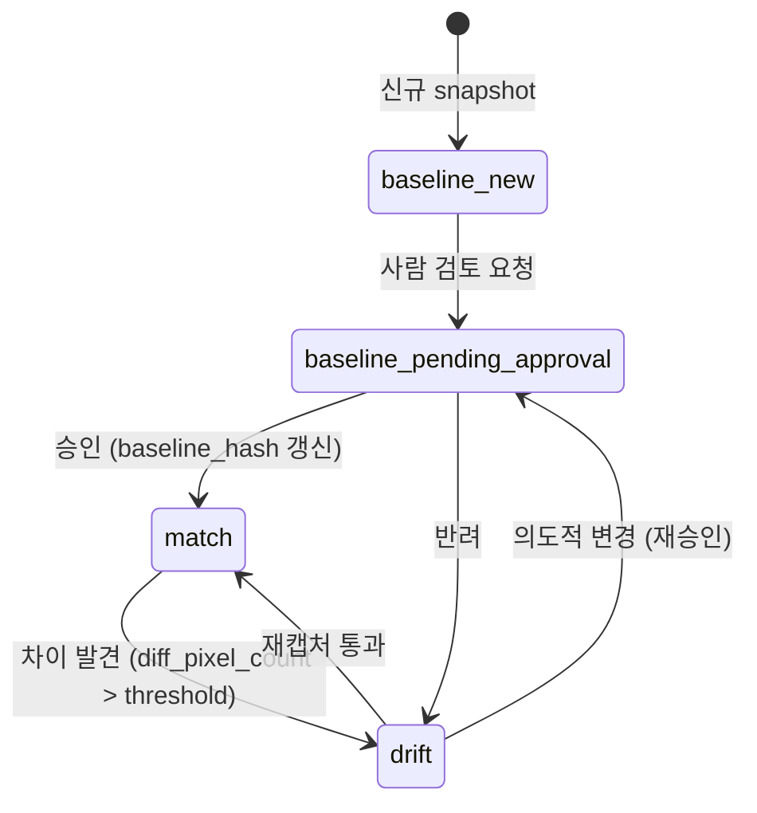
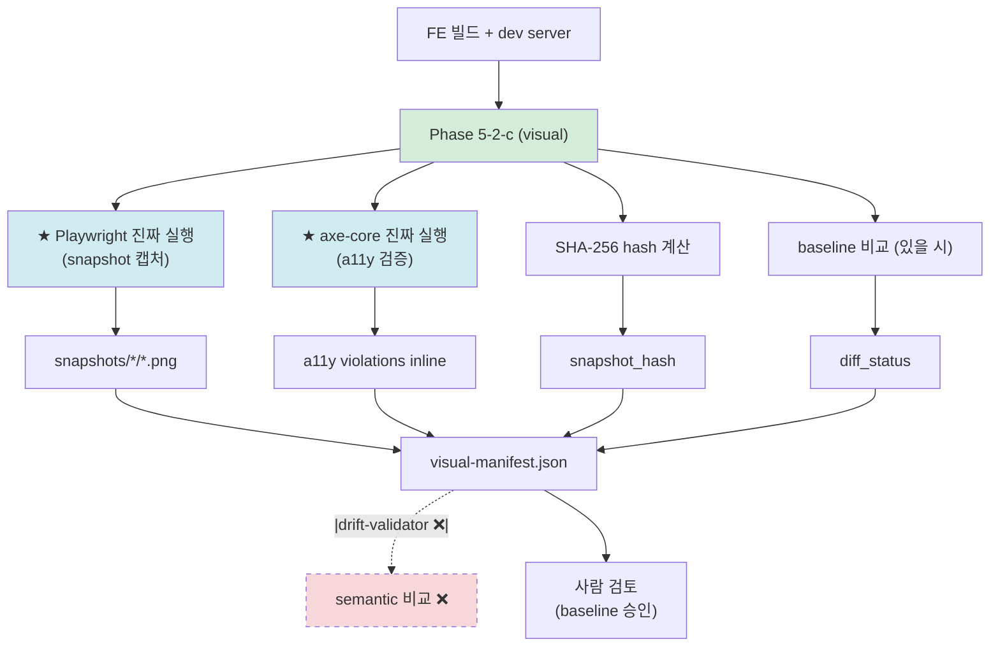
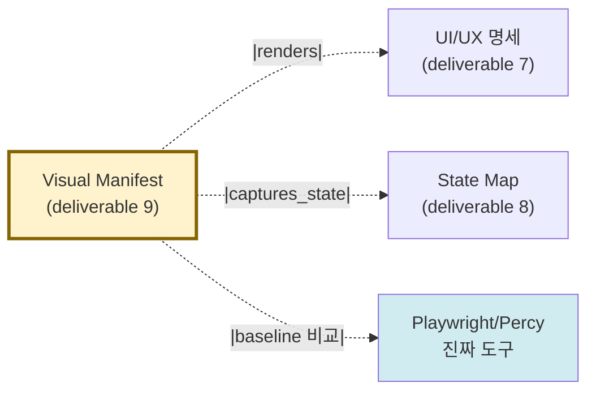

# 산출물 #9: Visual Manifest (시각 산출 매니페스트)

> 본 문서는 Visual Manifest 산출물의 **표준 명세**다.
> 사상: ADR-FE-002 §2.3 (★ visual 예외 — binary 진실 모델) + ADR-FE-005 (Playwright + axe-core 채택) + ADR-009 §2.4.2 (binary trust path)
> 관련 schema: `schemas/visual-manifest.schema.json`
> ⭐ v1.4 신설 산출물 (사용자 요구 3 — "UI visible 차원" 정면 해소)

---

## 1. 목적

**이 산출물이 답하는 질문**: "이 화면이 실제로 어떻게 보이는가?"

**소비자**:
- 디자이너 (baseline 승인 권한)
- PM / 기획자 (요구 3 — visible 검증)
- FE 개발자 (재구현 시 시각 비교 baseline)
- AI 재구현 시 (snapshot diff 통과를 코드 생성 종료 조건으로 사용)
- a11y 검증자 (axe-core inline 결과 활용)

### 1.1 ★ binary 진실 모델 (ADR-FE-002 §2.3)

ADR-008 의 이중 렌더링 사상 (AI 눈 + 사람 눈) 은 visual 영역에서 **불완전 적용**:
- AI 눈 = `visual-manifest.json` (메타 + path + hash)
- 사람 눈 = ❌ mermaid 표현 불가능 / ✅ Storybook static + GitHub PNG 직접 렌더
- **★ 진실 = snapshot PNG (binary)** — JSON 도 mermaid 도 진실 아님

→ 다른 6 산출물과 다른 trust path. drift-validator 적용 ❌ / Playwright snapshot diff ✅.

---

## 2. 형식

### 2.1 파일 구성

```
output/visual/
├── visual-manifest.json        # AI 눈 (메타 + viewport matrix + a11y)
├── snapshots/
│   ├── desktop/
│   │   ├── PAGE-HOME-001.png       # ★ binary 진실
│   │   ├── PAGE-LOGIN-001.png
│   │   └── ...
│   ├── tablet/
│   ├── mobile-portrait/
│   └── mobile-landscape/
├── baselines/                  # 사람 승인 baseline (git-lfs 또는 별도 branch)
│   └── ...
└── _manifest.yml
```

### 2.2 viewport matrix 정책

```yaml
viewport_matrix:
  - {label: desktop,         width: 1440, height: 900,  dpr: 1.0}
  - {label: tablet,          width: 768,  height: 1024, dpr: 2.0}
  - {label: mobile-portrait, width: 375,  height: 667,  dpr: 2.0}
  - {label: mobile-landscape, width: 667, height: 375,  dpr: 2.0}
```

→ 매트릭스 정의 의무 (snapshot 일관성 진실 모델).

### 2.3 locale matrix (선택 — i18n 영향 검증)

```yaml
locale_matrix:
  - {locale: ko-KR, label: 한국어}
  - {locale: en-US, label: English}
  - {locale: ja-JP, label: 日本語}
```

---

## 3. 추출 범위

### 3.1 추출 대상

| 항목 | 출처 | 도구 |
|---|---|---|
| snapshot PNG | 실제 페이지 렌더 + 캡처 | ★ Playwright `toHaveScreenshot()` 또는 Percy / Chromatic |
| snapshot_hash | SHA-256 of PNG | (계산 — 결정적) |
| a11y_violations inline | axe-core 진짜 실행 | ★ axe-core `axe.run()` |
| viewport coverage | viewport_matrix × pages | (계산) |

### 3.2 미추출 (의도적)

- 화면 동영상 / 인터랙션 녹화 — Stage 5+ 검토
- 픽셀 단위 디자인 명세 (Figma 영역) — round-trip scope 제외
- 운영 perf 메트릭 (LCP / CLS) — ADR-001 §명시적 제외

---

## 4. snapshot hash 진실 모델 (★ 핵심)

```yaml
visual_truth_model:
  primary_truth: "snapshot PNG (binary)"
  hash_algorithm: SHA-256

  manifest_role: |
    binary 메타 + viewport matrix + a11y violations inline.
    ❌ 진실 / 진실의 일부 / 진실의 cache 아님.
    ✅ binary 진실에 대한 관찰 가능한 메타.

  diff_strategy:
    primary_tool: [playwright_real, percy_real, chromatic_real]
    method: pixel diff + threshold + region exclusion
    NOT: drift-validator (semantic comparison ❌)

  baseline_management:
    storage: [git_lfs, baseline_branch, external_storage]
    update_authority: "디자이너 + PM 승인 후 baseline_hash 갱신"
    drift_detection: "Playwright snapshot diff 자동 (CI)"
```

---

## 5. ★ no-simulation 정책 강제 (ADR-FE-002 §2.3 정합)

본 산출물은 **진짜 도구 실행 의무**:

```yaml
captured_by enum:
  ✅ playwright_real    # 권장
  ✅ percy_real         # 대안 1
  ✅ chromatic_real     # 대안 2
  ✅ puppeteer_real     # 대안 3
  ✅ cypress_real       # 대안 4
  ❌ simulation         # ★ -5%p 패널티 + simulation_reason 의무

5종_물증_의무 (real 도구 시):
  - captured_by_version    # 도구 버전
  - stdout_path            # stdout 로그 경로
  - duration_ms            # 캡처 소요 ms
  - reproduction_command   # 재현 명령
  - result_hash            # 결과 종합 hash
```

→ ADR-009 §2.2.1 FE 도구 enum + DEC-static-tool-실행-의무화 정합.

→ schema 의 `if/then` 강제 (visual-manifest.schema.json `allOf`).

---

## 6. baseline 상태 머신



**상태 의미**:
- `match` — baseline 일치 ✅
- `drift` — 차이 발견 (사람 검토 필요)
- `baseline_new` — 신규 snapshot (baseline 없음)
- `baseline_pending_approval` — 사람 승인 대기

---

## 7. cross-link (Phase 4.5 패턴)

```yaml
cross_links:
  - from_snapshot: VIS-LOGIN-001
    to_artifact: ui-spec
    to_id: PAGE-LOGIN-001
    link_type: renders
  - from_snapshot: VIS-LOGIN-001
    to_artifact: state-map
    to_id: FSM-FE-LOGIN-001
    link_type: captures_state
```

---

## 8. 추출 흐름



---

## 9. 신뢰도 (★ ADR-009 §2.4.2 binary trust path)

| 단계 | 조건 | 신뢰도 |
|---|---|---|
| 1-2-3 | (mermaid 검증 불가) | ❌ N/A |
| 5 | Playwright/Percy/Chromatic 진짜 실행 | 85-92% |
| 6 | snapshot baseline + diff 0건 도달 | 90-95% |
| 7 | 사람 디자이너 리뷰 통과 | 95%+ |

→ 다른 6 산출물과 다른 trust path (mermaid 단계 1~3 ❌).

★ simulation 시 -5%p 패널티 + simulation_reason 의무.

---

## 10. 검증 체크리스트

```
□ schema 검증 (visual-manifest.schema.json) 통과
□ viewport_matrix 정의 (≥ 1 항목)
□ 모든 snapshot 에 ID, page_id, viewport_label, snapshot_path, snapshot_hash 명시
□ snapshot_path 파일 실제 존재
□ snapshot_hash = SHA-256 64 hex chars
□ ★ captured_by ∈ [playwright_real, percy_real, chromatic_real, puppeteer_real, cypress_real]
□ ★ captured_by=simulation 시 simulation_reason 의무
□ ★ real 도구 시 5종 물증 (version / stdout / duration / reproduction / result_hash)
□ baseline_hash 비교 결과 diff_status 명시
□ a11y_violations inline (axe-core 진짜 실행) — 있으면
□ wcag_level 명시 (2.1-AA 또는 2.2-AA — ratchet path 정합)
□ cross_links 의무 (ui-spec 또는 state-map 중 1개 이상)
□ baseline_management 명시
```

---

## 11. 산출물 간 참조



→ ADR-FE-002 §2.3 (visual 예외) 정합.

---

## 12. 흔한 함정

### 12.1 flaky test
- 증상: 동일 페이지 2회 캡처 시 hash 다름 (애니메이션 / 폰트 로딩 race)
- 대응: `await page.waitForLoadState('networkidle')` + `mask` region 또는 `disable_animations`

### 12.2 dynamic content (시간 / 사용자명)
- 증상: 매 캡처마다 timestamp / 랜덤 데이터로 hash 변경
- 대응: mock data 고정 + masked region (Playwright `mask` 옵션)

### 12.3 font drift
- 증상: 폰트 로딩 안 된 상태에서 캡처
- 대응: `document.fonts.ready` 대기 + 폰트 미리 로드

### 12.4 viewport 변경 누락
- 증상: viewport_matrix 변경 시 baseline 일괄 갱신 누락
- 대응: viewport_matrix 변경 = baseline 전체 재캡처 + 재승인 강제

### 12.5 simulation 누락
- 증상: 진짜 Playwright 환경 부재 시 시뮬 캡처
- 대응: simulation_reason 명시 + Stage 4+ carry / -5%p 패널티 표기

---

## 13. 다음

- Phase 6 (`/analyze-quality`) 에서 AP-FE-VISUAL-XXX 안티패턴 등록 (예: 폰트 로딩 race / inline style 난무)
- Stage 3-2 — a11y deliverable 신설 시 a11y_violations 분리 / WCAG 2.2-AA ratchet path 정식화
- Stage 4 mini-PoC = Playwright + axe-core 진짜 실행 1회 → 단계 5 (85-92%) 도달 검증 (★ no-simulation 정책 첫 FE 실현)
- Stage 5 본격 PoC #04 = baseline 50+ snapshot + diff 0건 도달 → 단계 6 (90-95%)
