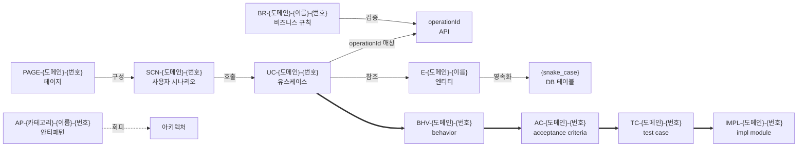

# ID 표준 (산출물 간 추적성)

> 7대 산출물 + ★ v2.0 chain 산출물 (★ v9.0 6-stage) ID 명명 규칙. ID 를 통해 산출물 간 교차 참조 가능. 단일 source-of-truth (★ 14차 retract pattern 차단).

★ ★ ★ **v2.0 갱신 (2026-05-06)**: chain 4단계 산출물 ID 추가 + UC-* 3 형식 충돌 통일 (DEC-2026-05-06-v2.0-i-strict-채택 정합 / sub-plan-2 §D1 결단).

> ★ ★ ★ ★ ★ **v11.0.0 paradigm 결단 의제 carry** (2026-05-26 / Phase 0 결단 문서화만 / 차기 세션 cascade) — Jira hierarchy 정합 entity matrix 본격 신설:
>
> | Jira | 본 방법론 ID | 정의 | 신설 시점 |
> |---|---|---|---|
> | Initiative | (외부 매핑만) | 대형 결단 단위 | (entity ❌) |
> | Epic | (외부 매핑만 + screen_id/route cross_link) | FE 화면 단위 | v11.0.0 |
> | Story | (외부 매핑만 + story_ref → BHV-*/AC-*) | 화면 내 사용자 시나리오 (BE+FE cross-cut anchor) | v11.0.0 |
> | Task (Story sibling) | **OP-{도메인}-{3자리 번호}** | 사용자 가시 없는 작업 (운영/인프라/마이그레이션) | ★ v11.0.0 신설 |
> | Sub-task | TASK-{도메인}-{3자리 번호} (기존 유지) | 개발 작업 단위 (1~3 AC 묶음 / layer 분기) | (기존 / 명명 정합 명시화) |
>
> SSOT: [`../decisions/DEC-2026-05-26-v11-paradigm-결단.md`](../decisions/DEC-2026-05-26-v11-paradigm-결단.md). Phase 1+ 본격 OP-* entity schema 신설 cascade (차기 세션 / Phase 1 안 본격 file path 확정).

---

## ID 체계



(굵은 화살표 ==> 는 ★ v2.0 chain forward link / 모든 link 는 backward 도 의무)

---

## ID 형식 표

### 기존 (analysis stage)

| 산출물 | ID 형식 | 예시 | schema/source |
|---|---|---|---|
| 엔티티 | `E-{도메인}-{이름}` | `E-ORDER-Order`, `E-USER-User` | domain.schema |
| **유스케이스** | **`UC-{도메인}-{3자리 번호}`** ★ | **`UC-ORDER-001`, `UC-USER-003`** ★ | domain.schema + formal-spec.schema (★ v2.0 통일) |
| 비즈니스 규칙 | `BR-{도메인}-{이름}-{번호}` | `BR-ORDER-CANCEL-001` | rules.schema |
| 안티패턴 | `AP-{카테고리}-{이름}-{번호}` | `AP-DB-N-PLUS-ONE-001` | antipatterns.schema |
| 페이지 | `PAGE-{도메인}-{번호}` | `PAGE-ORDER-001` | ui-spec.schema |
| 사용자 시나리오 | `SCN-{도메인}-{번호}` | `SCN-ORDER-001` | ui-spec.schema |
| Bounded Context | `BC-{도메인}` | `BC-ORDER`, `BC-USER` | architecture.schema |
| 정합성 불일치 | `DRIFT-{번호}` | `DRIFT-001` | finding system |
| Finding | `F-{번호}` | `F-003` (BE) / `F-FE-001` (FE) | finding.schema |
| API operationId | `{camelCase 동사+명사}` | `createOrder`, `getUsers` | openapi |
| DB 테이블 | `{snake_case}` | `orders`, `order_items` | db-schema.schema |

### ★ v2.0 chain 산출물 (sub-plan-2 신설 / ★ v9.0 6-stage / ★ v10.0.0 plan = task-plan TASK-*·ADR-*)

| 산출물 | ID 형식 | 예시 | schema |
|---|---|---|---|
| **Behavior** | `BHV-{도메인}-{3자리 번호}` | `BHV-ORDER-001` | behavior-spec.schema |
| **Acceptance Criteria** | `AC-{도메인}-{3자리 번호}` | `AC-ORDER-001` | acceptance-criteria.schema |
| **Test Case** | `TC-{도메인}-{3자리 번호}` | `TC-ORDER-001` | test-spec.schema |
| **Impl Module** | `IMPL-{도메인}-{3자리 번호}` | `IMPL-ORDER-001` | impl-spec.schema |

### ★ G3 운영 자산 ID (v3.2 신설)

| 산출물 | ID 형식 | 예시 | schema |
|---|---|---|---|
| **Scope slug** | `^[a-z0-9][a-z0-9-]{1,63}$` (kebab-case / ASCII / 2~64 chars / 파일시스템 호환) | `user-registration`, `payment-flow`, `admin-v2` | work-unit-manifest.schema |

★ scope 는 사용자가 작업 시작 시 자유 명명 (chain-driver init --scope <slug>). 자동 추출 ❌ (사용자 의도 분명).
★ 한국어 / 공백 / path traversal (`../`, `/`) 비허용 — 파일시스템 호환 + state-store `validateScopeSlug` 강제.
★ 한 사용자 프로젝트가 운영 누적 시 scope N 개 — 각 scope 가 chain 사이클 1회 또는 revisit 시 N회. `.aimd/<scope>/` 단위 격리.

★ planning-spec 의 use_cases 는 기존 UC-* 차용 (analysis stage UC-* 와 동일 namespace / backward link).
★ BR-INTENT-* prefix ❌ — rules.schema 의 BR-* 에 `intent` sub-object 확장 (Senior 권고 / B1 정합).

---

## 규칙 (★ v2.0 갱신)

1. **도메인**: 대문자 (ORDER, USER, PRODUCT 등). domain.json `aggregates[].name` 정합.
2. **번호**: 3자리 (001, 002, ...) — ★ ★ ★ v2.0 통일 / 이름 형식 (CANCEL, CREATE 등) 폐기.
3. **카테고리** (안티패턴): DB, ARCH, DOMAIN, API, FE, VALIDATION, CONFIG, SECURITY, PERFORMANCE
4. **이름**: BR-{도메인}-**{이름}**-{번호} 만 이름 형식 유지 (예: BR-ORDER-CANCEL-001 / BR 은 비즈니스 의미 명시 의무 / 산업 BR 표준 정합). **★ ★ v2.3.7 enforcement** — schema-level strict pattern `^BR-[A-Z0-9_-]+-[A-Z0-9_-]+-[0-9]+$` 도입 / `business-rules.schema.json` + `discovery-spec.schema.json` + `behavior-spec.schema.json` 모두 4토막+ 강제 / 3토막 (`BR-DOMAIN-001`) ❌ schema-validator fail. 5토막+ (`BR-ARTICLE-AUTHOR-EDIT-ONLY-001`) ✅ 자연 허용.
5. **고유성**: 같은 유형 내에서 ID 중복 금지.
6. **★ v2.0 chain link 의무**: BHV-* 가 ≥ 1 UC-* backward / AC-* 가 ≥ 1 BHV-* backward / TC-* 가 ≥ 1 AC-* backward / IMPL-* 가 ≥ 1 TC-* backward (chain-coverage-validator 강제 / sub-plan-3 신설).

---

## ★ v2.0 마이그레이션 (sub-plan-6 carry)

기존 PoC 산출물 (`UC-USER-SIGNUP` / `UC-ORDER-CREATE` 등 이름 형식) → **sub-plan-6 PoC #05 시점 일괄 migration carry**:
- 변환 규칙: `UC-{도메인}-{이름}` → `UC-{도메인}-{순차 번호}` + `name: "{이름}"` 필드 보존
- finding 시스템에 migration log 등재 (`F-MIG-UC-001` 등)
- analysis stage 산출물 4 PoC 모두 일괄 변환 (PoC #01 / #02 / #03 / #04)

## ★ ★ v2.3.7 BR 4토막 enforcement 마이그레이션 carry (★ 신규)

★ v2.3.7 (2026-05-13 / DEC-2026-05-13-BR-id-4-segment-enforcement) — `business-rules.schema.json` (v7.0.0 이전 명칭에서 rename) BR pattern 3토막 → 4토막+ strict 정합.

**영향 6 PoC** (★ 모두 3토막 표기 / schema-validator fail expected):

| PoC | 현재 ID 형식 | 재라벨 carry |
|---|---|---|
| **#11 (사내 EFI-WEB Billing)** | `BR-BILLING-005` | **C-rules-BR-id-relabel-PoC-11** (★ critical / 도메인 전문가 위임) |
| #06 (사내 EFI-WEB Exchange) | `BR-EXCHANGE-001` | C-rules-BR-id-relabel-5PoC |
| #07 (사내 EFI-WEB Capital) | `BR-CAPITAL-001` | C-rules-BR-id-relabel-5PoC |
| #08 (OSS jpetstore) | `BR-PETSTORE-001` | C-rules-BR-id-relabel-5PoC |
| #09 (OSS TypeORM raw SQL) | `BR-RW-001` | C-rules-BR-id-relabel-5PoC |
| #10 (OSS JPA + QueryDSL) | `BR-RAE-001` | C-rules-BR-id-relabel-5PoC |

**재라벨 규칙** (★ 사용자 결단 위임):
- 도메인 전문가가 description + source 분석 후 카테고리 결정
- 예: `BR-BILLING-005` → `BR-BILLING-{CHARGE|REFUND|...}-005` (★ 카테고리는 사내 결제 도메인 의미 정합)
- 메인 sub-agent 자동 추정 ❌ (★ F-015 한계 회피 의무)

**일시적 허용**:
- v2.3.7 release 시점 ~ 재라벨 sprint 완결 시점까지 6 PoC schema-validator fail 허용
- §8.1 strict 검증대 영향 검증 의무 (★ 신규 carry 항목에 명시)
- 재라벨 sprint 종결 후 → fail → pass 전환 확인 + carry resolved

---

## 교차 참조 예시 (★ v2.0)

```yaml
# Analysis stage (기존)
- id: BR-ORDER-CANCEL-001
  related_use_cases: [UC-ORDER-002]
  related_entities: [E-ORDER-Order]
  related_apis: [cancelOrder]
  intent:    # ★ v2.0 신규 (rules.schema 확장 / B1 Senior 권고)
    reasoning: "..."
    source_grounded_evidence: "src/order/OrderService.java:45-60"

# v2.0 chain (신규)
- id: BHV-ORDER-001
  use_case_refs: [UC-ORDER-002]    # backward
  br_refs: [BR-ORDER-CANCEL-001]
  acceptance_criteria_refs: [AC-ORDER-001, AC-ORDER-002]    # forward

- id: AC-ORDER-001
  bhv_ref: BHV-ORDER-001    # backward
  uc_ref: UC-ORDER-002
  test_case_refs: [TC-ORDER-001]    # forward
  severity: must    # MoSCoW
  verifiable: true   # ★ ≥ 1 TC-* forward link 의무 / B2 Senior 권고
  gherkin:
    given: ["주문이 PAID 상태"]
    when: "사용자가 취소 요청"
    then: ["주문 상태가 CANCELLED"]

- id: TC-ORDER-001
  ac_ref: AC-ORDER-001    # backward
  bhv_ref: BHV-ORDER-001
  type: integration
  framework: junit5
  source_file: src/test/java/order/OrderCancelTest.java
  impl_module_ref: IMPL-ORDER-001    # forward

- id: IMPL-ORDER-001
  tc_refs: [TC-ORDER-001, TC-ORDER-002]    # backward
  bhv_refs: [BHV-ORDER-001]
  framework: spring-boot-3
  source_files: [src/main/java/order/OrderCancelService.java]
  test_pass_evidence:    # ★ no-simulation 5종 물증 7 필드
    test_runner_version: "junit-jupiter-5.10.0"
    test_runner_stdout_path: ".aimd/output/runs/2026-05-06T12-00/stdout.log"
    invocation_timestamp: "2026-05-06T12:00:00Z"
    duration_ms: 4523
    pass_count: 12
    fail_count: 0
    skip_count: 0
    reproduction_command: ["./gradlew test --tests OrderCancelTest"]
    result_hash: "sha256:..."   # 정규화 (timestamp+duration 제외 / sorted test names)
```

---

## 검증

- `tools/drift-validator/` 에서 ID pattern 회귀 검증
- `tools/chain-coverage-validator/` (sub-plan-3 신설) 에서 chain link 의무 검증
- `schemas/{domain,rules,formal-spec,planning-spec,behavior-spec,acceptance-criteria,test-spec,impl-spec}.schema.json` 에서 pattern enforce

---

## ★ v8.6.0 Ticket Binding (외부 일감 시스템 연동)

★ DEC-2026-05-18-ticket-binding-policy 결단 / 자세한 정책 = `methodology-spec/ticket-policy.md` / **권고만 / validator 강제 X**.

### 매핑 단위

| Plugin 산출물 | Ticket 단위 | 시점 |
|---|---|---|
| Analysis 산출물 (inventory + architecture + sql-inventory + antipatterns) | Initiative (or 상위 Epic / label) | 분석 stage 종료 직후 |
| Domain | Epic | Initiative 분해 시점 |
| **UC-{도메인}-{번호}** | **★ Story** | **★ Chain 1 (planning-spec.json) green 시점** |
| Chain 1~4 stage | Sub-task (선택) | Story 생성 시 batch 4개 |
| BHV / AC / TC / IMPL | (별도 ticket X — Story 본문 link / sub-task acceptance) | — |

### UC ↔ Story 매핑 권장 형식

- **Story summary**: `[UC-{도메인}-{번호}] {use_case.name 또는 description 1줄}` (예: `[UC-CAR-007] 차량 비용 회계연도 prorate + cross-company billing`)
- **Story 본문**: `planning-spec.json` 의 use_case 본체 + source_grounded_evidence + acceptance_criteria_refs
- **Sub-task summary**: `chain{N}/{stage_name} — {UC ID}` (예: `chain3/test — UC-CAR-007`)
- **Traceability matrix**: `schemas/traceability-matrix.schema.json` matrix item 의 `ticket_ref` optional field 에 platform / id / url / epic_id / initiative_id / subtask_ids 기록

### BHV / AC / TC / IMPL 별 별도 ticket 금지 사유

★ 1 UC 당 N BHV × M AC × K TC × L IMPL = ticket 폭증 위험 + chain-coverage-validator 가 이미 backward link 의무 → ticket 시스템과 1:1 중복 = entropy. ID 는 Story description 또는 sub-task acceptance criteria 에 link 만.

### ★ v8.6.1+ R20 — status_history (MCP delegation 자동화)

★ Tier 2.5 (DEC-2026-05-18-r20-mcp-ticket-sync-channel) 활성 시 ticket 상태 전이 timeline 자동 기록:

```yaml
# traceability-matrix.json matrix item 예시
- use_case_id: UC-CAR-007
  status: green
  ticket_ref:
    platform: jira
    id: MIG-1234
    epic_id: MIG-CAR-100
    initiative_id: MIG-1
    subtask_ids:
      chain1_planning: MIG-1235
      chain2_spec: MIG-1236
      chain3_test: MIG-1237
      chain4_impl: MIG-1238
    status_history:    # ★ v8.6.1+ R20 신설 — ticket 상태 전이 timeline
      - transitioned_at: "2026-05-18T14:30:00+09:00"
        to_status: "To Do"
        mcp_tool: "mcp__wiki-jira-assistant__jira_create"
      - transitioned_at: "2026-05-18T15:00:00+09:00"
        from_status: "To Do"
        to_status: "In Progress"
        mcp_tool: "mcp__wiki-jira-assistant__jira_transition"
        evidence_ref: ".aimd/output/evidence/ticket-sync-spec-20260518T150000.json"
      - transitioned_at: "2026-05-18T16:30:00+09:00"
        from_status: "In Progress"
        to_status: "Done"
        mcp_tool: "mcp__wiki-jira-assistant__jira_transition"
```

★ MCP tool = `mcp__wiki-jira-assistant__*` only (v8.6.1 Tier 2.5 / v8.7.0+ multi-platform carry).

### Cross-link

- 정책 본문: `methodology-spec/ticket-policy.md` (§Tier 2.5 자동화 / §11 v9.0+ carry)
- 결단 record (Tier 1 정책): `decisions/DEC-2026-05-18-ticket-binding-policy.md`
- 결단 record (Tier 2.5 자동화): `decisions/DEC-2026-05-18-r20-mcp-ticket-sync-channel.md`
- Skill: `skills/ticket-sync/SKILL.md` (5 stage matrix + confirmation gate)
- Schema field: `schemas/traceability-matrix.schema.json` matrix.items.ticket_ref (+ status_history)
- Evidence schema: `schemas/ticket-sync-evidence.schema.json` (7-field MCP invocation)
- Charter R20: `methodology-spec/plugin-charter.md` §1+§2 (v8.6.1 신설)
