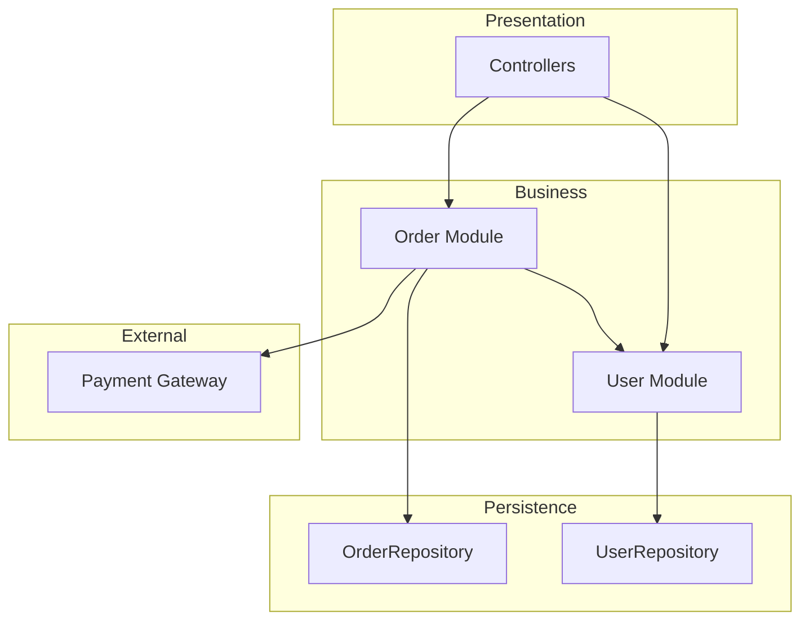

# architecture phase: arch (아키텍처)

> **명령어**: `/analyze-arch`

---

## 1. 목적

시스템의 **모듈 구성과 의존성 구조**를 추출한다. `db-schema` phase 의 DB 스키마와 연결하여 **모듈 ↔ 테이블 그룹 매핑**까지 도출.

**답하는 질문**:

- 모듈 경계는?
- 의존성 방향은? (순환 있나?)
- 어떤 아키텍처 패턴인가? (Layered/Hexagonal/Clean)
- 외부 시스템 통합점은?

---

## 2. 입력

| 입력                        | 출처                                           | 필수/선택 |
| --------------------------- | ---------------------------------------------- | --------- |
| 소스 코드                   | 분석 대상 레포                                 | 필수      |
| `discovery` phase inventory | `.ai-analysis/output/inventory/inventory.json` | 필수      |
| `db-schema` phase schema    | `.ai-analysis/output/db/schema.json`           | 권장      |

---

## 3. 처리

### 3.1 결정적 처리 흐름

| 단계 | 작업                                       | 도구                        |
| ---- | ------------------------------------------ | --------------------------- |
| S1   | AST 파싱                                   | Tree-sitter                 |
| S2   | import 그래프 생성                         | (결정적)                    |
| S3   | 순환 의존성 검출                           | Tarjan SCC                  |
| S4   | 외부 호출 지점 추출                        | HTTP 클라이언트 패턴 매칭   |
| S5   | LLM: 모듈 책임 추론 + 아키텍처 스타일 식별 | LLM                         |
| S6   | 모듈 ↔ 테이블 그룹 매핑                    | `db-schema` phase 결과 활용 |

### 3.2 순환 의존성 처리 — 탐지 + 분류 hybrid (ADR-006 정합)

탐지는 결정적 (Tarjan SCC), 분류는 도메인 의도 기반 hybrid.

**Step 1**: Tarjan SCC 알고리즘 (자동, 결정적) → 순환 컴포넌트 검출

**Step 2**: BC 분류 — 다음 3 필드로 산정:

- `bc_status`: same | different | undefined
  - `same` = 같은 Bounded Context 안 cross-aggregate (cascade 우회 등)
  - `different` = 다른 BC 간 양방향 (안티패턴 의심)
  - `undefined` = BC 미정의 (`business-logic` phase 진입 전 결정 필요)
- `bc_assignment_explicit`: 코드/문서에 BC 할당 명시 여부
- `documented_decision`: ADR 또는 design doc 에 결정 문서 존재 여부

**Step 3**: severity 자동 산정:

| bc_status | bc_assignment_explicit | severity | decision_required   |
| --------- | ---------------------- | -------- | ------------------- |
| same      | true                   | low      | false               |
| same      | false                  | low      | true (BC 명시 권고) |
| different | true                   | high     | false               |
| different | false                  | medium   | true                |
| undefined | \*                     | medium   | true (default)      |

**Step 4**: 도구 정책 분기:

- Spring Modulith verify() / ArchUnit `slices().beFreeOfCycles()` 활성:
  → 도메인 의도 무관 자동 high (빌드 차단)
- 위 도구 미활성 + ArchUnit FreezingArchRule 패턴:
  → 기존 cycle = baseline 수용, 신규 cycle 만 차단

**Step 5**: `decision_required=true` 시 `business-logic` phase 라우팅 (`phase_4_routing=true` + `decision_owner=domain_expert`).

**default 정책**: `bc_status=undefined` → severity=**medium**, decision_required=**true**
근거: ArchUnit FreezingArchRule (신규만 차단) 산업 표준. "domain-legitimate cycle" 자동 분류는 산업 도구 어디에도 없음 → "decision_required → interface inversion" 휴리스틱 권장.

### 3.3 산출 형식 (architecture.json)

`circular_dependencies[]` 항목당:

```yaml
circular_dependencies:
  - id: CIRCULAR-001
    modules: [domain.article, domain.user]
    detection:
      algorithm: tarjan_scc
    bc_status: undefined # same | different | undefined
    bc_assignment_explicit: false
    documented_decision: false
    severity: medium # 위 표 기반 자동 산정
    decision_required: true
    decision_owner: domain_expert
    decision_deadline: '`business-logic` phase 진입 전'
    phase_4_routing: true
    antipattern_id: AP-ARCH-006 # 발견 시
```

### 3.4 LLM 처리 영역

- 모듈 책임 기술 (이름과 내부 구조 기반)
- 아키텍처 패턴 후보 (Layered / Hexagonal / Clean / 기타)
- 레이어 위반 후보 식별 (Repository → Controller 호출 등)

### 3.5 모듈 ↔ DB 테이블 매핑

ORM 엔티티 → 모듈 (소속 패키지) → 테이블 (`db-schema` phase 결과) → 자동 매핑.

이 매핑이 **`business-logic` phase 도메인 추출의 Bounded Context 후보**가 됨.

---

## 4. 출력

### 4.1 파일 구성

```
.ai-analysis/output/architecture/
├── architecture.json                 # json 단독 SSOT (v12 ADR-011)
├── dependency-graph.json             # 의존성 그래프 raw
└── module-table-mapping.json         # 모듈 ↔ 테이블 그룹
```

### 4.2 architecture.json 핵심 필드

```yaml
meta:
  generated_at: ...
  inputs_used: [source_code, inventory, db_schema]
  confidence: 0.92

system_name: {시스템명}

architecture_style:
  primary: Layered
  secondary: null
  confidence: 0.75
  evidence:
    - "controller/service/repository 패턴 일관됨"
    - "domain/ 디렉토리 부재 → Anemic Model 의심"

modules:
  - id: MOD-ORDER
    name: "주문"
    path: src/main/java/com/example/order
    layer: business              # presentation/business/persistence/external
    responsibility: "주문 생성, 취소, 조회"
    related_tables: [orders, order_items]
    confidence: 0.9

  - id: MOD-USER
    name: "사용자"
    ...

dependencies:
  - from: MOD-ORDER
    to: MOD-USER
    type: direct
    count: 12      # import 수

circular_dependencies: []      # 순환 발견 시 채워짐

external_dependencies:
  - id: EXT-PAYMENT
    type: http
    target: "https://api.toss.im"
    used_by: [MOD-ORDER]
    confidence: 0.95
  - id: EXT-SMS
    type: http
    target: "AWS SNS"
    used_by: [MOD-USER]

layer_violations:
  - description: "OrderRepository 가 UserController 호출"
    file: "src/.../OrderRepository.java"
    line: 45
    severity: medium
    routed_to_antipattern: AP-ARCH-002
```

### 4.3 architecture 다이어그램 예시 (figure / 산출물 아님 / v12 ADR-011)



---

## 5. 승인 게이트

```
□ architecture.json schema 검증 통과
□ architecture.json 의존성 그래프 정합 (시각화는 view-time / v12 ADR-011)
□ 모든 모듈에 ID/책임 명시
□ 순환 의존성 = 0 또는 발견 시 안티패턴 등록
□ 모듈 ↔ 테이블 매핑 = 사용자 검토 (시니어 BE)
□ 아키텍처 스타일 후보 = 사용자 검증
□ 외부 의존성 위치 = `business-logic` phase 5.D 로 라우팅 준비
```

---

## 6. 신뢰도

| 영역               | 신뢰도    |
| ------------------ | --------- |
| 모듈 식별          | 1.0       |
| 의존성 그래프      | 1.0       |
| 순환 의존성 검출   | 1.0       |
| 외부 호출 지점     | 0.95      |
| 모듈 책임 기술     | 0.7 (LLM) |
| 아키텍처 스타일    | 0.7 (LLM) |
| 레이어 위반 판정   | 0.6 (LLM) |
| 모듈 ↔ 테이블 매핑 | 0.85      |

---

## 7. 다음 단계와의 연계

| 출력        | 전달 phase                                   |
| ----------- | -------------------------------------------- |
| 모듈 그룹   | `business-logic` phase 도메인 모델 (BC 후보) |
| 외부 의존성 | `business-logic` phase 5.D 외부 의존성 매핑  |
| 레이어 위반 | `quality` phase 안티패턴 등록                |

---

## 8. 흔한 함정

### 8.1 패키지 = 모듈 직역

- 증상: Java 패키지 100개를 모두 모듈로 취급
- 결과: 너무 세분화, 의미있는 그룹화 부재
- 대응: LLM 이 패키지 트리에서 의미있는 단위 추출

### 8.2 Big Ball of Mud

- 증상: 모든 모듈이 서로 의존
- 결과: 모듈 50개, 의존성 1000개
- 대응: 안티패턴 `AP-ARCH-001` 로 등록 + 재구현 우선순위로 분류

### 8.3 외부 의존성 누락

- 증상: HTTP 클라이언트가 wrapper 로 감싸져있어 감지 못 함
- 대응: LLM 보강 + `business-logic` phase 5.D 에서 재추출

### 8.4 generated 코드 의존성 포함

- 증상: protobuf/openapi-generator 로 만든 코드까지 의존성 분석
- 대응: `discovery` phase 에서 generated 디렉토리 표시 + 제외

---

## 9. 다음 단계

`business-logic` phase (`/analyze-business-logic`) 진입.

> ⚠️ `business-logic` phase 는 **4영역 병렬 처리**되는 가장 큰 단계. 입력으로 `discovery` / `db-schema` / `architecture` phase 모두 사용.
