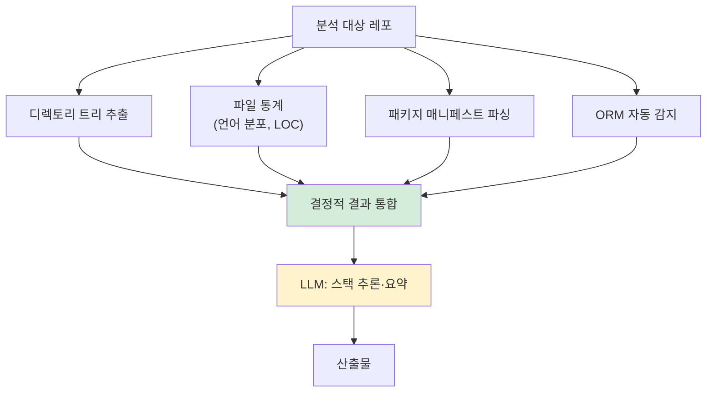

# Phase 1: init (인벤토리)

> 본 문서는 Phase 1 (`/analyze-init`)의 명세다.
> 분석 워크플로우의 **첫 자동화 단계**.

---

## 1. 목적

분석 대상 레포의 **구조·스택·규모**를 파악하여 후속 phase가 사용할 메타정보를 생성한다.

이 단계가 답하는 질문:
- 이 레포는 어떤 언어/프레임워크로 작성되었나?
- 디렉토리 구조는?
- ORM은 무엇을 사용하는가?
- 규모는 (LOC, 파일 수)?
- 어떤 입력이 추가로 들어왔나? (Phase 0 결과 manifest화)

---

## 2. 입력

| 입력 | 출처 | 필수/선택 |
|---|---|---|
| 분석 대상 레포 | git clone된 디렉토리 | 필수 |
| `.ai-analysis/inputs/` | Phase 0이 정돈 | 필수 |
| 패키지 매니페스트 | package.json, pom.xml, build.gradle, requirements.txt 등 | 자동 감지 |

---

## 3. 처리

### 3.1 결정적 처리 (LLM 없음)



### 3.2 ORM 자동 감지 패턴

| 언어/프레임워크 | 감지 단서 |
|---|---|
| Spring Data JPA | `@Entity`, `JpaRepository`, `pom.xml`의 `spring-data-jpa` |
| Hibernate | `@Entity`, `hibernate.cfg.xml` |
| MyBatis | `*.xml` mapper, `@Mapper` |
| jOOQ | `org.jooq` import, generated DSL classes |
| Prisma | `prisma/schema.prisma` |
| TypeORM | `@Entity` (TS), `typeorm` 의존성 |
| Sequelize | `sequelize` 의존성, model 정의 |
| SQLAlchemy | `from sqlalchemy import`, `Base = declarative_base()` |
| Django ORM | `models.Model` 상속 |

복수 ORM 감지 가능 (예: JPA + MyBatis 혼재).

### 3.3 LLM 보강 영역

- 스택 종합 요약 (예: "Spring Boot 3.x + JPA + React 18 + PostgreSQL")
- 아키텍처 패턴 후보 추론 (Layered, Hexagonal 등)
- 분석 권장 모듈 우선순위 (큰 모듈/핵심 도메인 추정)

---

## 4. 출력

### 4.1 파일 구성

```
.ai-analysis/output/inventory/
├── inventory.json                # AI용 (구조화)
├── tree.md                       # 디렉토리 트리
├── stack-detection.md            # 사람용 스택 보고서
├── stats.json                    # 파일/LOC 통계
└── _manifest.yml                 # Phase 0 입력 manifest
```

### 4.2 inventory.json 핵심 필드

```yaml
meta:
  generated_at: 2026-04-26T10:00:00Z
  source_commit_sha: abc1234
  inputs_used: [source_code, erd, orm_auto_detected]
  expected_confidence_average: 0.88

repo:
  name: {레포명}
  total_files: 1247
  total_loc: 87500
  primary_languages:
    - lang: typescript
      loc: 45000
      pct: 51.4
    - lang: java
      loc: 35000
      pct: 40.0

stack:
  backend:
    language: Java 17
    framework: Spring Boot 3.2.x
    orm: 
      - name: JPA/Hibernate
        confidence: 1.0
      - name: MyBatis
        confidence: 1.0
    db: PostgreSQL (추정 — pom.xml 의존성)
  frontend:
    language: TypeScript 5.x
    framework: React 18
    state: TanStack Query + Zustand
    ui_library_indicators: [tailwindcss, shadcn/ui]
  
architecture_style_candidates:
  - style: Layered
    confidence: 0.7
    evidence: ["controller/", "service/", "repository/" 패턴]

modules_for_priority_analysis:
  - path: src/main/java/com/example/order
    reason: "가장 큰 모듈, 핵심 도메인 후보"
    loc: 12000
```

---

## 5. 승인 게이트 기준

```
□ inventory.json schema 검증 통과
□ tree.md 가독성 OK
□ 스택 감지 결과 = 실제와 일치 (사용자 확인)
□ ORM 자동 감지 결과 = 실제와 일치
□ 분석 우선순위 모듈 = 사용자 의도와 일치
□ 입력 manifest = Phase 0 정돈과 정합
```

승인 후 Phase 2 진입.

---

## 6. 신뢰도

이 phase는 **결정적 처리가 95% 이상**이라 신뢰도 가장 높음.

| 영역 | 신뢰도 |
|---|---|
| 디렉토리 트리 | 1.0 |
| 파일 통계 | 1.0 |
| 패키지 매니페스트 파싱 | 1.0 |
| ORM 자동 감지 | 0.95 (혼재 케이스 일부 누락 가능) |
| 스택 종합 요약 | 0.9 (LLM) |
| 아키텍처 스타일 추론 | 0.7 (LLM) |
| 분석 우선순위 추천 | 0.7 (LLM) |

---

## 7. 흔한 함정

### 7.1 monorepo 미감지
- 증상: lerna, nx, pnpm workspace 등 monorepo를 단일 레포처럼 처리
- 결과: 모듈 분석이 평면화
- 대응: monorepo 감지 시 사용자에게 "어느 sub-repo부터?" 질문

### 7.2 generated 코드 포함
- 증상: `target/`, `build/`, `node_modules/`, `dist/` 등 자동 생성물까지 통계
- 결과: LOC 통계 왜곡, 분석 대상 폭증
- 대응: `.gitignore` 자동 적용 + 추가 제외 패턴 (`generated/`, `__generated__/`)

### 7.3 binary/asset 언어로 카운트
- 증상: 이미지/PDF 등이 "텍스트 파일"로 잘못 분류
- 대응: 언어 감지 라이브러리 (linguist 등) 사용

### 7.4 ORM 혼재 무시
- 증상: JPA + MyBatis 혼재인데 하나만 감지
- 결과: Phase 2.5에서 SQL 분석 누락
- 대응: 복수 ORM 감지 명시 + 각 사용 비율 표기

---

## 8. 다음 단계

Phase 2 (`/analyze-db`) 진입.

> 💡 v1.0과 다른 점: v1.0은 `init → arch → db` 순서였으나, **v1.1은 `init → db → arch`**. ERD가 있을 때 효율적이고, 없어도 ORM 자동 감지로 DB 구조부터 파악 가능 (research v1.1 Round 12).
