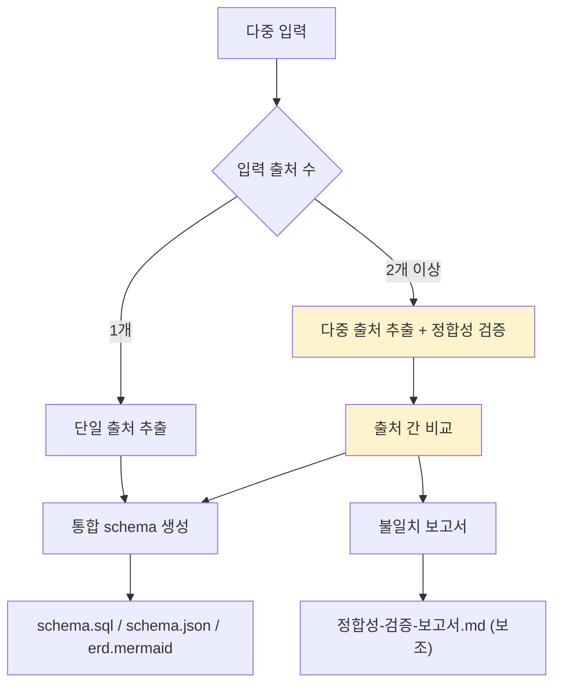
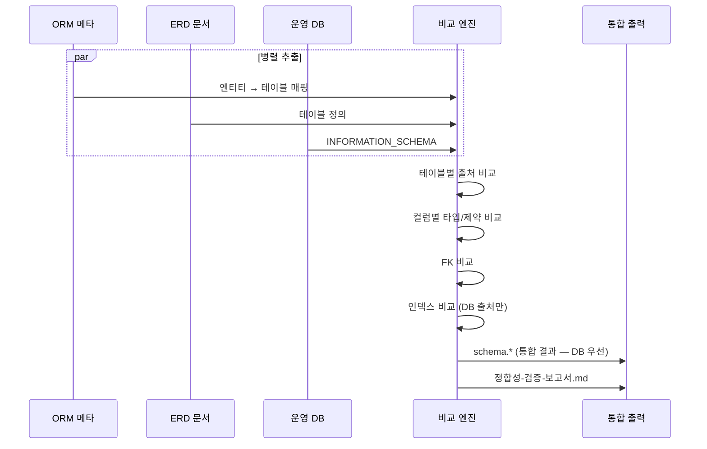
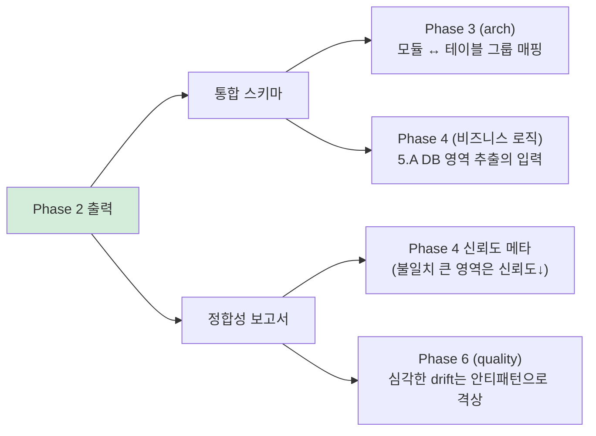

# Phase 2: db (DB + 출처 간 정합성 검증)

> 본 문서는 Phase 2 (`/analyze-db`)의 명세다.
> v1.1에서 **arch보다 앞으로** 이동 (research v1.1 Round 12 — ERD가 도메인 골격이 됨).
>
> 핵심 책임 두 가지:
> 1. **DB 스키마 추출** (다중 출처 통합)
> 2. **출처 간 정합성 검증** (구 "Drift Detection")

---

## 1. 목적

DB 영역의 **단일 통합 스키마**를 만들고, 출처 간 불일치를 검출하여 보고한다.

이 단계가 답하는 질문:
- 이 시스템의 데이터 구조는?
- 출처들이 일치하는가? (불일치 시 어디?)
- 도메인 추출의 골격이 될 테이블 그룹은?

---

## 2. 입력

| 입력 | 출처 | 신뢰도 기여 |
|---|---|---|
| ORM 메타정보 | 소스 코드 (자동 감지) | 70% |
| Migration 파일 | `db/migration/`, `prisma/migrations/` 등 | +15%p |
| ERD | `.ai-analysis/inputs/erd/` | +10%p (위와 합쳐서) |
| 운영 DB 메타 | `.ai-analysis/inputs/db-meta/` | +5%p |

소스만 있어도 동작 (70%), 모든 입력이면 100%.

---

## 3. 처리 — 두 흐름 병행



### 3.1 단일 출처 추출 (입력 1개)

ORM만 있는 경우:
- `@Entity`, `@Table` 어노테이션 → 테이블
- `@Column`, `@JoinColumn` → 컬럼/FK
- `@OneToMany`, `@ManyToOne` → 관계
- `@Embeddable` → 도메인 모델 입력 (Phase 4로 라우팅)

### 3.2 다중 출처 추출 + 정합성 검증



### 3.3 정합성 검증 비교 항목

| 항목 | 비교 대상 | 발견 시 |
|---|---|---|
| 테이블 존재 | ORM/ERD/DB | `column_only_in_X` 또는 `table_only_in_X` |
| 컬럼 존재 | ORM/ERD/DB | 동상 |
| 컬럼 타입 | ORM/ERD/DB | `type_mismatch` |
| NULL 허용 | ORM/ERD/DB | `nullable_mismatch` |
| FK | ORM/ERD/DB | `fk_mismatch` |
| 인덱스 | ERD/DB | `index_only_in_db` |
| 기본값 | ORM/ERD/DB | `default_mismatch` |

### 3.4 통합 우선순위

출처 간 불일치 시 어느 것을 신뢰할지:

```
운영 DB (실제 동작) > ORM (코드 의도) > ERD (문서)
```

이유:
- **운영 DB**: 실제로 데이터가 있는 곳 — 가장 정확
- **ORM**: 코드 변경 시 같이 변경됨 — 두 번째로 정확
- **ERD**: 자주 갱신 안 됨 — 가장 오래됨

단, 사용자가 별도 지정 가능 (예: ERD를 SoT로).

---

## 4. 출력

### 4.1 파일 구성

```
.ai-analysis/output/db/
├── schema.json                       # AI용
├── schema.sql                        # 통합 SQL (CREATE TABLE)
├── erd.mermaid                       # ERD (Mermaid)
├── 정합성-검증-보고서.md              # 다중 출처 시 (보조)
└── tables/                           # 테이블별 상세 (선택)
    ├── orders.md
    └── users.md
```

### 4.2 정합성-검증-보고서.md 형식

```yaml
title: "출처 간 정합성 검증 보고서"
analyzed_at: 2026-04-26
sources:
  orm: src/domain/**/*.java (47개 엔티티)
  erd: .ai-analysis/inputs/erd/erd-2024.dbml
  db: .ai-analysis/inputs/db-meta/information_schema.sql

summary:
  total_tables: 23
  drift_detected: 5 tables
  severity_breakdown:
    high: 1
    medium: 3
    low: 1

findings:
  - id: DRIFT-001
    severity: high
    type: column_only_in_db
    table: orders
    column: admin_memo
    description: "운영 DB에만 존재. ERD/ORM에 없음"
    risk: "재구현 시 컬럼 누락 → 데이터 손실"
    recommendation: "ERD/ORM에 추가 또는 운영 DB에서 제거 결정 필요"
    decision_required: true
  
  - id: DRIFT-002
    severity: medium
    type: type_mismatch
    table: orders
    column: total_amount
    erd_type: DECIMAL(10,2)
    orm_type: BigDecimal precision=12 scale=2
    db_type: NUMERIC(12,2)
    description: "ERD가 옛날 정보. ORM과 DB는 일치"
    recommendation: "ERD를 (12,2)로 갱신"
    decision_required: false
```

---

## 5. 승인 게이트 기준

```
□ schema.json schema 검증 통과
□ erd.mermaid 렌더링 검증
□ 모든 테이블에 PK 명시
□ FK 명시 또는 부재 사유 기록
□ 정합성 검증 보고서 사람 검토 (있는 경우)
□ severity=high 항목 모두 결정 완료
□ 통합 우선순위 정책 (DB>ORM>ERD) 확인 또는 사용자 변경
```

---

## 6. 신뢰도

| 영역 | 입력 조합 | 신뢰도 |
|---|---|---|
| 테이블/컬럼 식별 | 소스만 | 0.85 |
| 테이블/컬럼 식별 | + ERD | 0.95 |
| 테이블/컬럼 식별 | + 운영 DB | 1.0 |
| FK 관계 | 소스만 | 0.7 |
| FK 관계 | + ERD/DB | 0.95 |
| 인덱스 | + 운영 DB | 1.0 |
| 컬럼 의미 추론 | + ERD 코멘트 | 0.85 |

---

## 7. 다음 단계와의 연계

Phase 2의 결과는 **2가지 경로로** 후속 phase에 전달:



---

## 8. 흔한 함정

### 8.1 ERD를 무조건 SoT로
- 증상: 옛 ERD를 신뢰하여 운영 DB와 불일치 무시
- 결과: 재구현 시 컬럼 누락
- 대응: 통합 우선순위 정책 (DB > ORM > ERD)

### 8.2 deprecated 테이블 포함
- 증상: 코드에서 안 쓰는 테이블도 추출
- 대응: ORM 사용 추적 → 사용 흔적 없으면 안티패턴 (`AP-DB-UNUSED-XXX`)

### 8.3 ORM 우회 SQL 무시
- 증상: JPA + Native Query 혼재인데 ORM만 봄
- 결과: Phase 4 5.A에서 Native SQL 정책 누락
- 대응: ORM 자동 감지 시 Native Query 위치 함께 기록

### 8.4 정합성 검증 결과 묻어두기
- 증상: drift report 생성하고 사용자 검토 없이 진행
- 결과: 신뢰도 메타가 실상과 어긋남
- 대응: severity=high 항목은 **사용자 결정 필수** (decision_required=true)

---

## 9. 다음 단계

Phase 3 (`/analyze-arch`) 진입.
