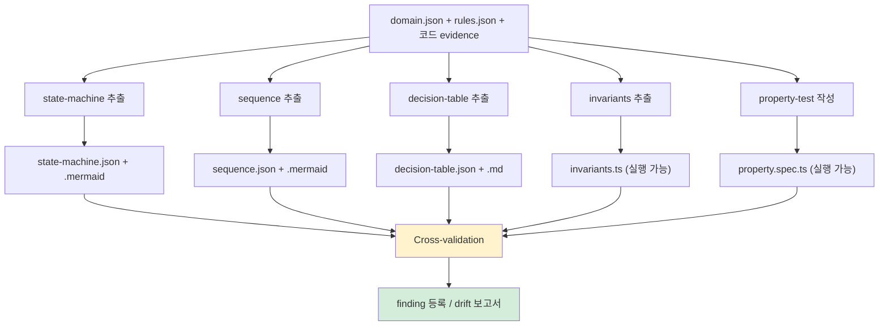

# Phase 4.5: formal-spec (형식 명세)

> 본 문서는 Phase 4.5 (`/analyze-formal-spec`) 의 명세다.
> v1.2.0 신설 (묶음 L). PoC #02 C-Sprint 1+1.5+2 누적 검증 결과 정식 산출물 격상.
> ADR-008 (이중 렌더링 사상) + ADR-009 (다이어그램 신뢰 모델) 사상적 정합.
>
> 핵심 책임 두 가지:
> 1. **자연어 빈약성 보완** — rules.json (L0) 의 자연어 한계를 형식 명세 (L1~L2) 로 보완
> 2. **AI 코드 생성 정확도 향상** — 60% (자연어 단독) → 90% (형식 명세) 입증 (PoC #02 F-074 단방향 정량)

---

## 1. 목적

Phase 4 (domain + rules) 의 자연어 명세에서 **암묵 가정 / 빈약 표현** 으로 인해 AI 코드 생성이 막히는 빈틈을 형식화로 보완한다.

이 단계가 답하는 질문:
- Aggregate Root 의 생애주기 (state) 는?
- Use Case 의 오케스트레이션 (sequence) 은?
- BR 의 의사결정 분기 (decision table) 은?
- 도메인 invariant 는 실행 가능한가?
- 자연어가 빈약한 영역 (예: 트리거 / 액션 / 거부 방식 / 검증 위치) 은 어디인가?

---

## 2. 입력

| 입력 | 출처 | 신뢰도 기여 |
|---|---|---|
| domain.json | Phase 4 산출물 | 60% |
| rules.json | Phase 4 산출물 | +20%p |
| 코드 evidence (Aggregate Root / Service) | 소스 코드 | +15%p |
| Cross-validation (Senior + Static tool) | sub-agent / 진짜 도구 | +5%p |

→ Phase 4 미완료 시 Phase 4.5 진입 차단. domain.json + rules.json 모두 의무.

---

## 3. 처리 — 5 산출물 동시 생성



### 3.1 State Machine — Aggregate Root 생애주기

각 Aggregate Root 의 상태/전이/이벤트/가드를 XState 호환 JSON + Mermaid stateDiagram-v2 로 산출.

**산출 의무**:
- `state-machines/<AggregateRoot>.json` (AI 눈)
- `state-machines/<AggregateRoot>.mermaid` (사람 눈)

**예시 (PoC #02)**:
- User-Account: anonymous → registered → authenticated → updated_profile
- User-Following: not_following → following / followed_by

### 3.2 Sequence — Use Case 오케스트레이션

각 핵심 UC 의 호출 흐름 (actor / message / sync / guard) 을 JSON + Mermaid sequenceDiagram 로 산출.

**산출 의무**:
- `sequence-diagrams/UC-<UseCase>.json`
- `sequence-diagrams/UC-<UseCase>.mermaid`

**예시 (PoC #02)**:
- UC-USER-SIGNUP: Controller → Service → Repository → JWT
- UC-USER-FOLLOW: Controller → RelationshipService → UserFollowJpaRepository

### 3.3 Decision Table — BR 의사결정

각 BR 의 조건/액션 매트릭스를 JSON + Markdown 표로 산출. 자연어 빈약성 보완 핵심 도구.

**산출 의무**:
- `decision-tables/BR-<RuleId>.json`
- `decision-tables/BR-<RuleId>.md`

**필수 섹션** (자연어 빈약성 9 항목 — F-074 패턴):
1. 트리거 (언제)
2. 조건 (입력)
3. 액션 (수행)
4. 기대 결과 (출력)
5. **거부 방식** (예외/리턴/throw — 자연어 누락 빈번)
6. **검증 위치** (Domain/Service/Adapter — 자연어 누락 빈번)
7. **HTTP status / 에러 코드** (API 영역)
8. **에러 메시지** (사용자 노출)
9. **현재 상태** (코드 부재/부분/완전)

### 3.4 Invariants — 도메인 불변식

Aggregate Root 의 invariant 를 TypeScript 로 산출 (실행 가능 명세).

**산출 의무**:
- `invariants/<AggregateRoot>.ts`

**구조**:
- 타입 정의 (ADT — sum type / product type)
- 생성자 검증 (input → invariant 만족 확인)
- 상태 전이 검증 (precondition → postcondition)

### 3.5 Property Test — 실행 가능 명세

invariants 가 모든 입력에 대해 성립함을 fast-check 등 property-based test 로 검증.

**산출 의무**:
- `property-tests/<AggregateRoot>.spec.ts`
- (옵션) Java 환경: `<AggregateRoot>PropertyTest.java` (jqwik)

---

## 4. Cross-validation 의무 (DEC-priority2-결단 H)

5 산출물 작성 후 **반드시** cross-validation 수행:

| 검증 주체 | 역할 | 시간 cap |
|---|---|---|
| Senior Engineer (sub-agent) | drift 검출 / 산출물 정합성 | 12분 |
| Static Analyzer (★ 진짜 도구) | 코드 ↔ 명세 정합 / 실제 위반 탐지 | 환경 의존 |

**Static Analyzer 정합 — DEC-static-tool-실행-의무화**:
- ❌ AI persona 시뮬레이션 절대 금지
- ✅ 진짜 외부 도구 실행 의무 (Semgrep / PMD / SpotBugs / Daikon / CodeQL)
- ✅ 환경 부재 시 사용자 위임 명시 + 신뢰도 -5%p 패널티
- ✅ Sprint 4 CI 통합 시 simulation_only: fail 자동 차단

**양쪽 발견 (double_hit) 시**:
- 정식 finding 등급 (★★)
- finding-system.schema.json `cross_validation.double_hit: true`

**단독 발견 시**:
- candidate finding 등급
- 추가 검증 후 promotion 결정

---

## 5. 출력 (5 산출물 — 이중 렌더링 정합)

```
output/formal-spec/
├── state-machines/
│   ├── <AggregateRoot>.json     # AI 눈 (XState)
│   └── <AggregateRoot>.mermaid  # 사람 눈 (stateDiagram-v2)
├── sequence-diagrams/
│   ├── UC-<UseCase>.json        # AI 눈
│   └── UC-<UseCase>.mermaid     # 사람 눈 (sequenceDiagram)
├── decision-tables/
│   ├── BR-<RuleId>.json         # AI 눈
│   └── BR-<RuleId>.md           # 사람 눈 (markdown 표)
├── invariants/
│   └── <AggregateRoot>.ts       # 실행 가능 (AI + 사람 공용)
├── property-tests/
│   └── <AggregateRoot>.spec.ts  # 실행 가능 (AI + 사람 공용)
└── _manifest.yml                # meta-confidence
```

ADR-008 (이중 렌더링 사상) 정합: 모든 영역에 AI 눈 + 사람 눈 동시 산출 의무.

---

## 6. 신뢰도 (ADR-009 정합)

| 단계 | raw confidence |
|---|---|
| 자연어 단독 (Phase 4 까지) | 60-70% |
| + Phase 4.5 5 산출물 작성 | 70-80% |
| + Cross-validation 의무 | 80-87% (시뮬 패널티 시) |
| + 진짜 static tool 실행 (Sprint 4 CI) | 90-95% |

**정직 표기 의무**:
- 시뮬레이션 사용 시 신뢰도 -5%p 패널티 + "진짜 도구 미실행" 명시
- 사용자 검증 미완 시 -3%p 추가 패널티

---

## 7. 종료 조건

- 5 산출물 모두 작성 (이중 렌더링 정합 100%)
- Cross-validation 완료 (drift 0 또는 finding 등록)
- _manifest.yml 신뢰도 정직 표기
- Phase 5-1 (api) 진입 가능 (병행 가능)

---

## 8. 자연어 빈약성 정량 (PoC #02 F-074 검증)

자연어 명세는 **44%** 만 표현 가능 (4 / 9 항목):
- 자연어 표현: 트리거 / 액션 / 기대 결과 / 현재 상태
- **자연어 누락 (형식화 필수)**: 거부 방식 / 검증 위치 / HTTP status / 에러 메시지 / unfollow 일관성

→ Phase 4.5 형식화 시 100% 표현. PoC #02 BR-USER-FOLLOW-NO-SELF-001 정량 입증.

---

## 9. 변경 이력

| 일자 | 버전 | 변경 |
|---|---|---|
| 2026-04-30 | v1.2.0 (예정) | 신설. PoC #02 C-Sprint 1+1.5+2 누적 검증 결과 정식 산출물 격상. |
